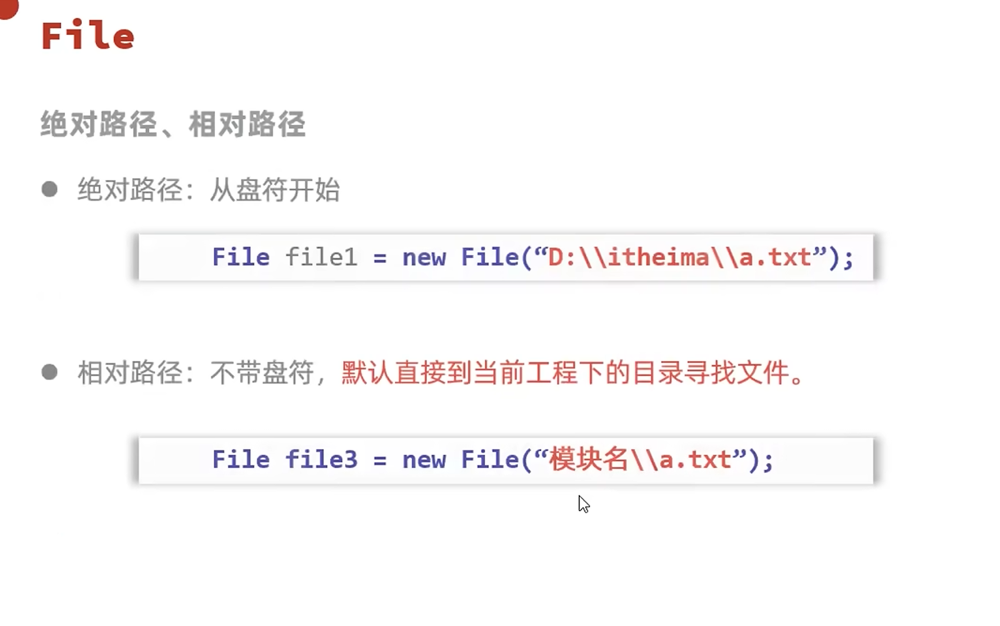
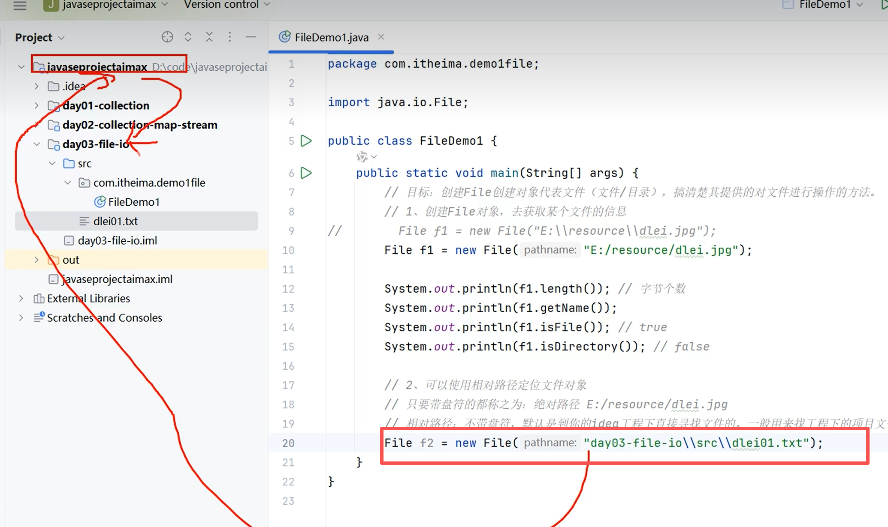

# File类

`java.io` 包下的类，用于代表当前操作系统的文件（文件或文件夹）。**只能对文件本身进行操作，不能读写文件里面存储的数据。** 读写数据需要 IO 流。

---

## 📌 创建 File 对象

---

## 🔧 常用方法

> `delete` 方法默认只能删除文件和空文件夹，删除后不会进入回收站。

---

## 📂 绝对路径 vs 相对路径

File 也分绝对路径和相对路径。

相对路径的具体写法：

---

## 📁 遍历文件夹

常用遍历文件夹的方法：

### listFiles() 注意事项

---

## 🔗 关联知识点
- [[API]] - File属于JDK提供的API
- [[String类]] - 文件路径是字符串
- [[异常]] - 文件操作可能抛出异常
- [[递归]] - 配合递归遍历多级文件夹