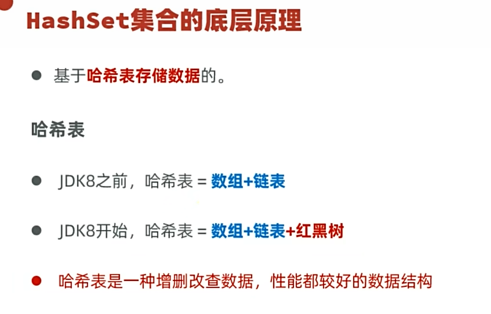
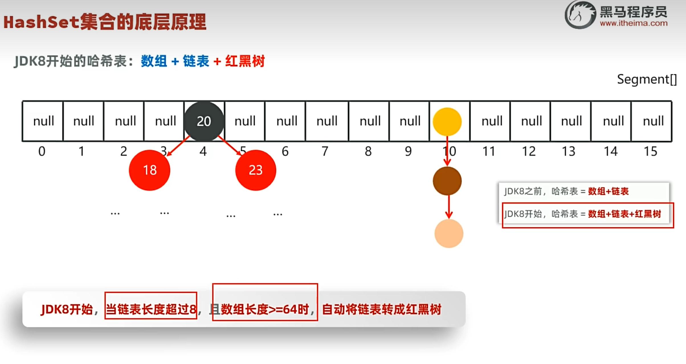

# HashSet

基于哈希表存储数据，[[Set集合]] 最常用的实现类。增删查改性能都比较好。

---

## 🎯 哈希值

哈希值是一个 int 类型的随机值，Java 的每个对象都有一个哈希值。可以近似理解为地址，但并不是地址。

- 不同对象的哈希值**大概率**不相等，但也有可能相等（哈希碰撞）

---

## 🔧 底层原理

HashSet 基于哈希表存储数据：

### 为什么无序？

存对象时，根据哈希值算出数组索引位置，然后存进去。要存的对象的哈希值是随机的，所以索引位置也是随机的，自然就无序。

### 为什么不可重复？

相同对象的哈希值相同，对应的索引位置也相同。底层会有一个相同判断：
- 如果相同 → 不理会（去重）
- 如果不同 → 在当前索引位置形成一个分支链表（这也解决了哈希碰撞的问题）

---

## 🌲 红黑树（JDK8+）

从 JDK8 开始，哈希表引入了红黑树（小的在左边，大的在右边），优化了查找性能。

---

## ⚠️ 自定义对象去重

如果需求是根据对象里的**内容**去重，直接使用 HashSet 无法去重（因为都是不同的对象，哈希值不同）。

解决方案：在对应的类里面（如 Student），**重写 `hashCode` 和 `equals` 方法**（快捷键 `alt+insert`），根据内容生成对象的哈希值。

---

## 🔗 关联知识点
- [[Set集合]] - HashSet属于Set体系
- [[LinkedHashSet]] - 有序版HashSet
- [[TreeSet]] - 基于红黑树，可排序
- [[方法重写]] - 重写hashCode和equals
- [[Object类]] - hashCode和equals来自Object
- [[迭代器]] - 遍历HashSet
- [[泛型]] - 限定存储类型