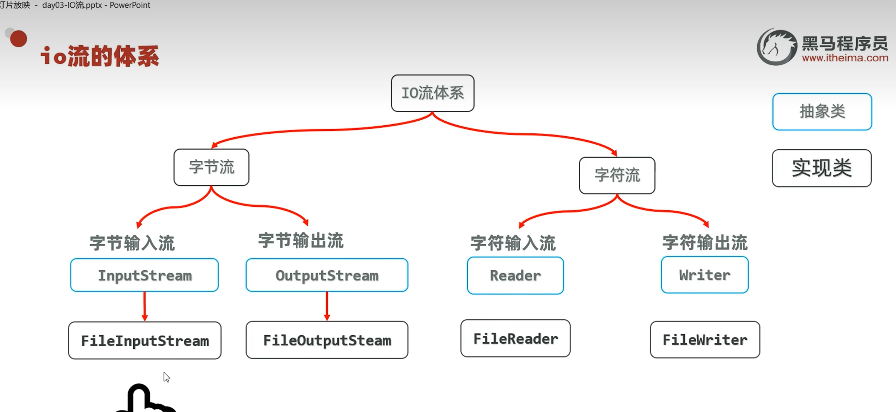
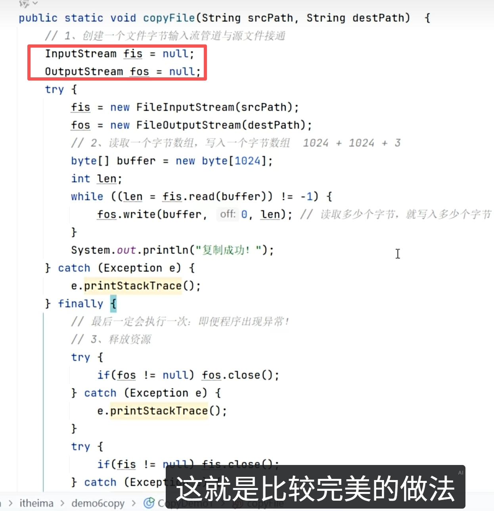
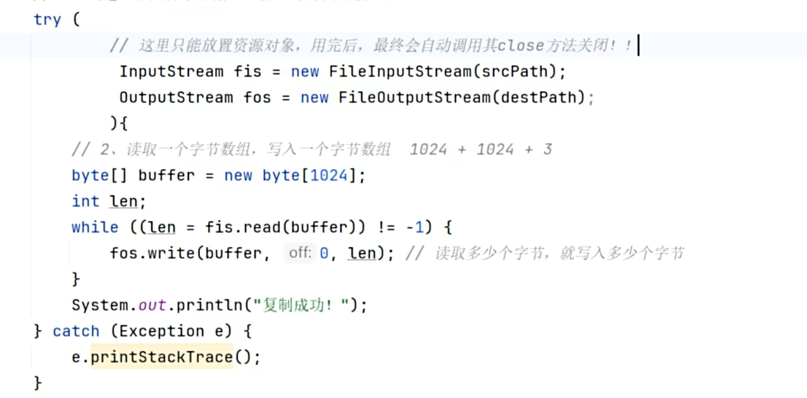
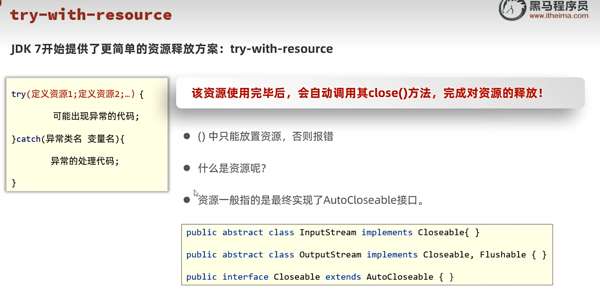

# IO流

I = Input（输入），负责把磁盘/网络里的数据读取到内存。O = Output（输出），负责把内存的数据写到磁盘/网络。因为程序运行在内存里，所以出/外是相对于内存而言的。

---

## 📊 分类

字节输入流：将磁盘/网络的数据，以一个一个字节的形式输入到内存。字符输入流是一个一个字符的形式。输出流以此类推。

---

## 📌 字节流 vs 字符流

| 类型 | 最小单位 | 适用场景 |
|------|---------|---------|
| **字节流** | 字节 | 数据转移（文件复制） |
| **字符流** | 字符 | 读取文本内容（避免汉字乱码） |

> 读取文本适合用字符流，不会出现乱码。字节流适合做数据的转移，比如文件复制。

---

## 🔌 资源释放

用完 IO 流之后，要用 `.close()` 关闭流，否则一直占用硬件资源。

### 方式1：try-catch-finally

专业的做法是放在 finally 代码区里。如果直接放在普通代码底部，可能代码中间抛异常，导致执行不到 close。

`finally` 代码区的特点：无论 try 是否抛异常，finally 都会执行。

fis 和 fos 对象要放在 try-catch-finally 外面，如果放在 try 里面，finally 就无法调用。

### 方式2：try-with-resources（推荐）

虽然上面那种方法比较完美，但太臃肿。在 try 后面加小括号，把资源放在里面，用完后会自动调用其 close 方法关闭。

资源：一般指的是最终实现了 `AutoCloseable` 接口的类。

---

## 🔗 关联知识点
- [[字节流]] - FileInputStream/FileOutputStream
- [[字符流]] - FileReader/FileWriter
- [[File类]] - 文件操作，IO流读写文件数据
- [[异常]] - 资源释放需要try-catch-finally
- [[字符集]] - 编码解码与IO流的关系