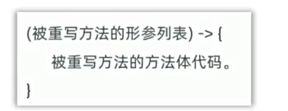
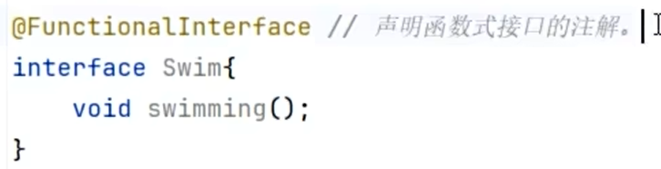
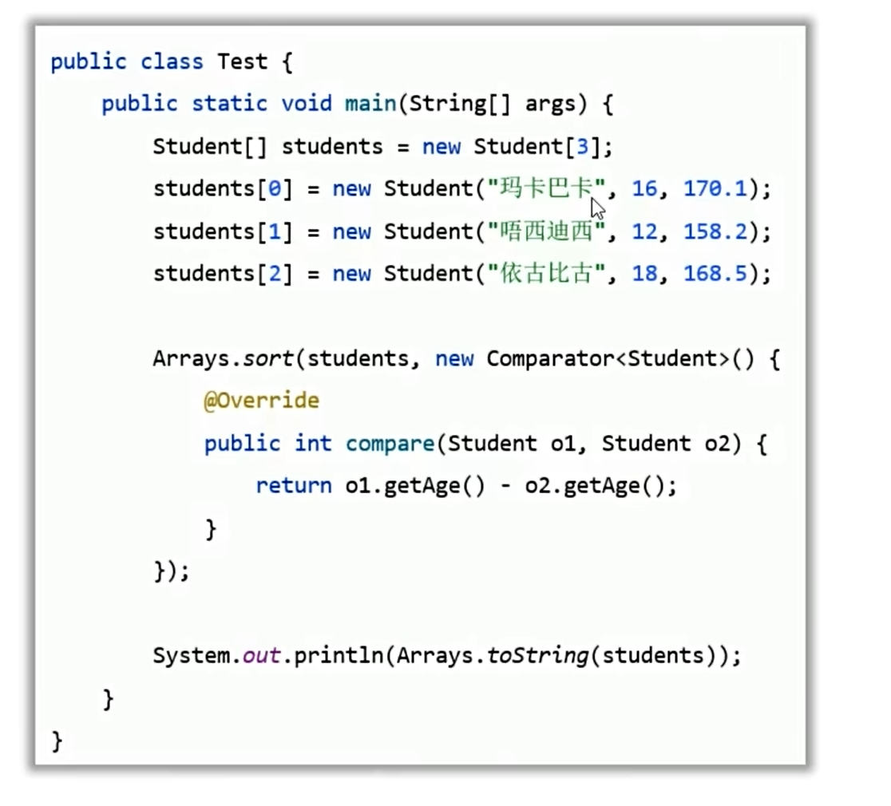
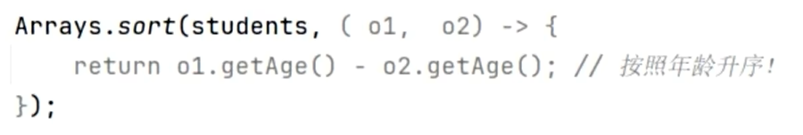
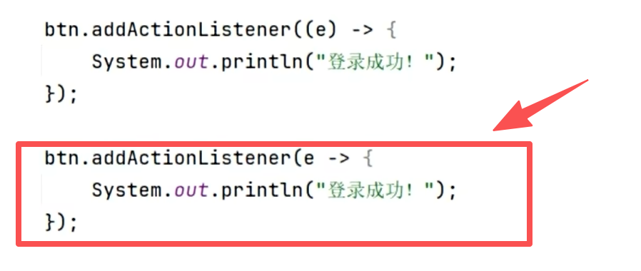

# Lambda表达式

函数式编程的Java实现，可以替代某些[[匿名内部类]]对象，让代码更简洁、可读性更好。

---

## 🎯 核心概念

函数式编程中的"函数"类似于数学中的函数（强调做什么），只要输入的数据一致，返回的结果也一致。

Java中的函数，指的是 **Lambda表达式**。格式如 `(x) -> 2x+1`

> 可以用Lambda函数替代某些匿名内部类对象，从而让程序代码更简洁，可读性更好。

---

## 📌 使用限制

**Lambda表达式只能替代函数式接口的匿名内部类！！！**

- 函数式接口：首先是[[接口]]，然后是有且仅有一个抽象方法的接口
- 可以加 `@FunctionalInterface` 来限定接口只能有一个抽象方法

> 如果有两个抽象方法，`@FunctionalInterface` 就会让代码报错。

---

## 📝 书写格式

Lambda的具体书写示例：

基本格式：`(参数) -> { 方法体 }`

---

## 🔢 Comparator 自定义排序

以 `compare` 方法配合Lambda实现自定义排序。核心规则：

| 返回值 | 含义 |
|--------|------|
| **负整数** | o1 < o2，o1 排在前面 |
| **0** | o1 = o2 |
| **正整数** | o1 > o2，o2 排在前面 |

`return o1.getAge() - o2.getAge();` → **按年龄升序排序**。降序则 `o2.getAge() - o1.getAge()`。

---

## ⚡ Lambda 逐步简化

### 第1步：基本Lambda写法

可使用Lambda表达式简化：

### 第2步：省略参数类型

参数类型全部可以省略不写：

### 第3步：省略大括号和return

如果只有一行代码，大括号可以不写，同时省略分号 `;`。如果是return语句，也必须去掉return：

### 第4步：单参数省略括号

只有一个参数时，参数类型省略的同时 `()` 也可以省略。多个参数不能省略 `()`：

---

## 🔗 方法引用

Lambda的进一步简化形式，用 `::` 直接引用已有方法。详见 [[方法引用]]。

三种形式：
- **静态方法引用**：`类名::静态方法`
- **实例方法引用**：`对象名::实例方法`
- **特定类方法引用**：`特定类::方法`

---

## 🔗 关联知识点
- [[匿名内部类]] - Lambda的前身，可以替代部分匿名内部类
- [[方法引用]] - Lambda的进一步简化形式
- [[接口]] - Lambda只能作用于函数式接口
- [[抽象类与抽象方法]] - 对比抽象方法
- [[内部类总览]] - 内部类体系
- [[API]] - Lambda属于JDK8+新特性
- Arrays.sort() - 配合Lambda/方法引用排序
