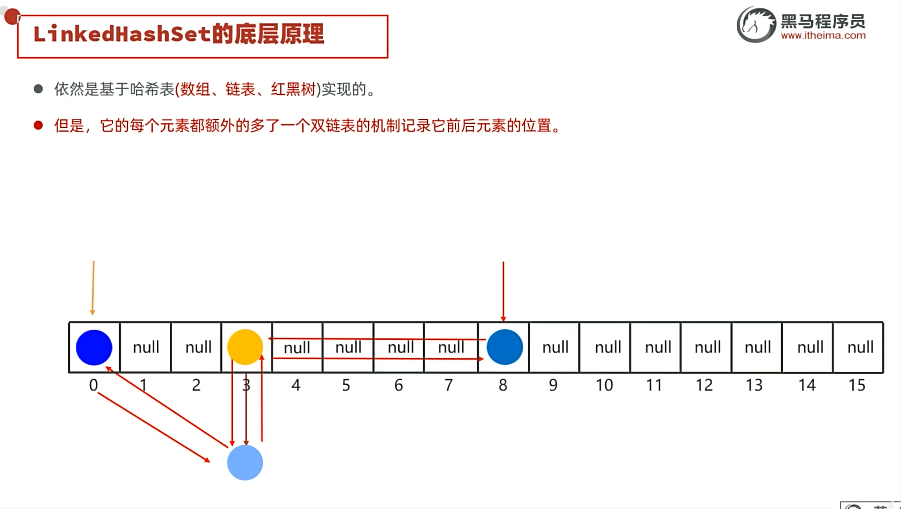

# LinkedHashSet

[[HashSet]] 的有序版本，依旧基于哈希表实现，但每个节点多了一个双链表，因此**有序**。

---

## 🎯 特点

- 基于哈希表 + 双链表
- 有序（保持插入顺序）
- 不可重复
- 更浪费内存（多了双链表）

---

## 🔗 关联知识点
- [[HashSet]] - 对比：无序 vs 有序
- [[Set集合]] - 属于Set体系
- [[TreeSet]] - 另一种有序Set（排序）
- [[LinkedList]] - 双链表结构
- [[迭代器]] - 遍历方式