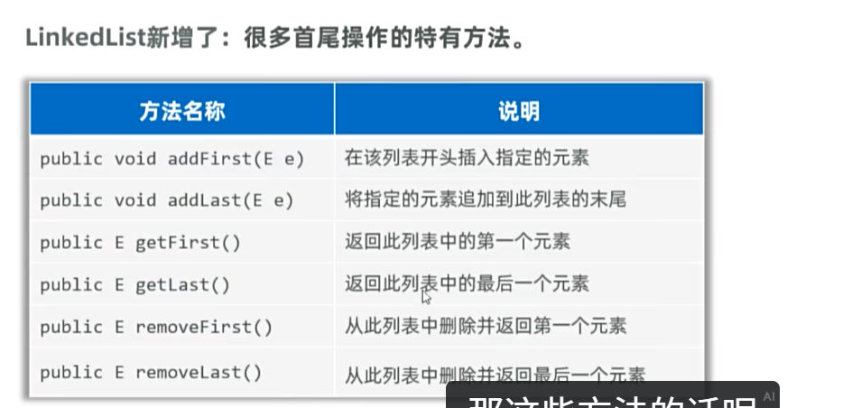

# LinkedList

[[集合框架|List]] 接口的实现类，与 [[ArrayList]] 功能完全一样，但底层数据结构不同，应用场景也不同。

---

## 🎯 底层数据结构

LinkedList 基于**双链表**实现，有双指针，对首尾元素进行增删查改的速度极快。

---

## 📊 ArrayList vs LinkedList

| 特性 | ArrayList | LinkedList |
|------|-----------|------------|
| **底层实现** | 数组 | 双链表 |
| **查询速度** | 快（通过索引直接定位） | 慢（从头开始查） |
| **增删效率** | 低（元素需要前移/后移） | 高（只需改指针指向） |
| **内存占用** | 较少 | 较多（需要存地址/指针） |
| **首尾操作** | 一般 | 极快（双指针） |

---

## 📌 特有方法

LinkedList 加了很多首尾操作的特有方法，因此还可以用来模拟**队列**或**栈**。

---

## 🔗 关联知识点
- [[ArrayList]] - 对比：数组实现 vs 链表实现
- [[集合框架]] - List接口的两种实现
- [[迭代器]] - 遍历LinkedList
- [[泛型]] - 限定存储类型
- [[包装类]] - 基本类型存储需要