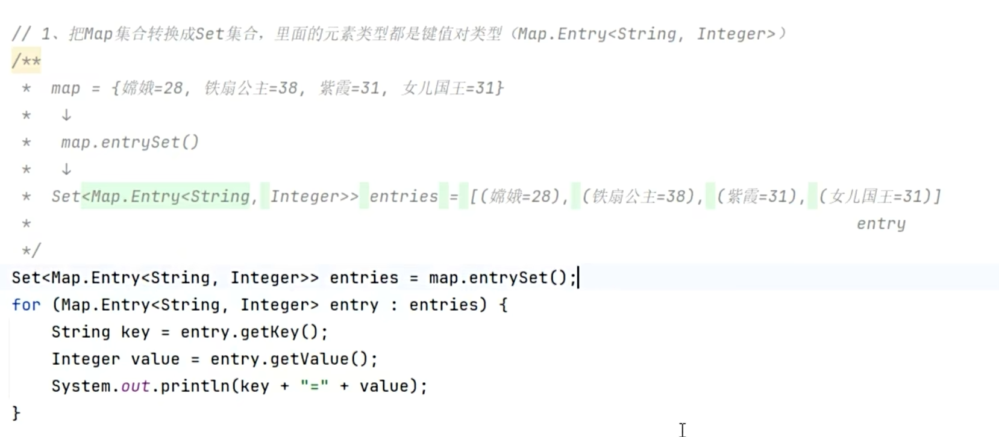
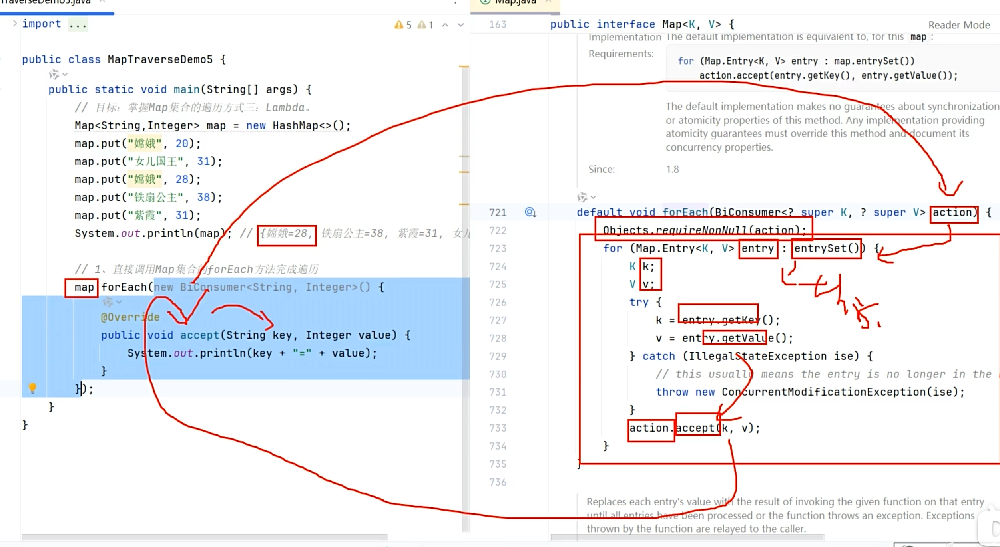
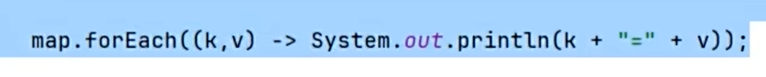

# Map集合

双列集合，也被称为键值对集合，与 [[集合框架|Collection]] 体系不同。需要存一一对应的数据时使用。

---

## 🎯 特点

- 双列集合（键值对）
- 键 (Key) 不可重复，值 (Value) 可重复
- 一个键对应一个值

> 应用场景：购物车，一个商品买了两件 → 商品名=2，是一一对应的数据。

---

## 📊 体系特点

- **HashMap** — 基于哈希表，无序，最常用
- **LinkedHashMap** — 基于哈希表+双链表，有序
- **TreeMap** — 基于红黑树，可排序（按Key）

---

## 📌 创建与基本使用

Map 的创建、基本使用语法、特点，在代码层面的体现：

---

## 🔧 常用方法

---

## 🔁 遍历方式

### 方式1：键找值

核心思想：把所有的键放到一个 Set 集合，然后再遍历这个 Set 集合，同时找值。

### 方式2：键值对

核心思想：把每一个键值对都单独看作一个对象，存到 Set 集合里，然后用增强for循环遍历。

在实操中，通过 Map 集合自带的 `entrySet()` 方法把键值对包装成对象。

### 方式3：Lambda遍历

通过 Map 自带的 `forEach` 方法，传入一个对象（匿名内部类重写 `accept` 方法）。其底层还是通过封装键值对对象的方式去遍历。

上面的写法还可以简化为：

---

## 💡 Map 与 Set 的底层关系

实际上，Set 系列集合的底层就是基于 Map 实现的，只是 Set 集合中的元素只要**键**数据，不要**值**数据而已。所以 Set 集合和 Map 集合的特点几乎一样。

---

## 🔗 关联知识点
- [[集合框架]] - Collection vs Map两大体系
- [[HashSet]] - HashMap的底层与HashSet类似
- [[TreeSet]] - TreeMap的底层与TreeSet类似
- [[泛型]] - Map<K,V>双泛型
- [[包装类]] - 基本类型存储需要
- [[迭代器]] - 遍历Map需要先获取keySet或entrySet