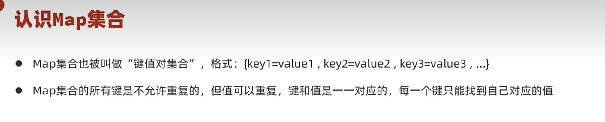

# Map集合

双列集合，也被称为键值对集合，与 [[集合框架|Collection]] 体系不同。需要存一一对应的数据时使用。

---

## 🎯 特点

- 双列集合（键值对）
- 键 (Key) 不可重复，值 (Value) 可重复
- 一个键对应一个值

> 应用场景：购物车，一个商品买了两件 → 商品名=2，是一一对应的数据。

---

## 📊 体系特点

- **HashMap** — 基于哈希表，无序，最常用
- **LinkedHashMap** — 基于哈希表+双链表，有序
- **TreeMap** — 基于红黑树，可排序（按Key）

---

## 📌 创建与基本使用

Map 的创建、基本使用语法、特点，在代码层面的体现：

---

## 🔧 常用方法

---

## 🔗 关联知识点
- [[集合框架]] - Collection vs Map两大体系
- [[HashSet]] - HashMap的底层与HashSet类似
- [[TreeSet]] - TreeMap的底层与TreeSet类似
- [[泛型]] - Map<K,V>双泛型
- [[包装类]] - 基本类型存储需要
- [[迭代器]] - 遍历Map需要先获取keySet或entrySet