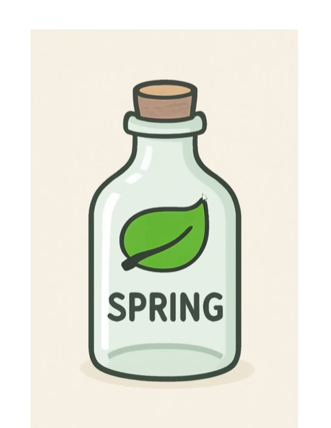

# SpringBoot

我们平常写代码时，调用别人写好的工具类，这些代码不用再从头写，这就是**框架的雏形**——把常用的东西封装起来方便复用。

Spring 就像是一个**小瓶子（容器）**，可以把对象放在这个 Spring 瓶子里进行管理，如图所示。

- SpringBoot 可以通过**注解**的方式在容器中创建类的对象。
- SpringBoot **内嵌了 Tomcat 服务器**，运行启动类时，Tomcat 服务器就启动成功了。
- 可以简单把 SpringBoot 理解成 **Spring 和 SpringMVC 的整合**。

---

## 🗺️ SpringBoot 本质：一个 Map

SpringBoot 说白了就是一个 **Map**：key 是 String，value 是 Object。

SpringBoot 启动时会扫描所有的类到这个抽象的 map 里面，**key 就是类名，value 就是这个类**。Spring 是**单例模式**，也就是说 value 是单例，key 是名字。

> 问题：SpringBoot 启动时怎么知道要把哪些类存到这个 map 里？——靠**注解**，比如 `@Component`。只要在类上加这个注解，就可以把类扫描到 map 里面去。

---

## 🏗️ 分层架构

| 层 | 职责 |
|---|---|
| **Entity** | 对数据库表的映射，数据库有几张表就映射出几个实体 |
| **Dao / Mapper** | 专门写与数据库交互的操作（增删改查），只负责数据存取，不处理业务逻辑 |
| **Service** | 放业务代码（业务判断、计算） |
| **Controller** | 给前端调用，接收请求返回响应 |

> Dao 只做数据库 CRUD，不写业务判断、计算，业务交给 Service。MyBatis 里的 Mapper 接口就是 Dao；Spring-Data-JPA 里的 Repository 本质也是 Dao 层。

**调用逻辑**：`前端 → Controller → Service → Dao → Entity ↔ 数据库表`

那 Controller 怎么知道要调用的 Service 类在哪里？其实 SpringBoot 启动时就已经把这些类都扫描到容器里了，用时只需根据名字（key）去找对应的 value（类）即可——这就是**注入**的概念：从容器里拿到类注入到 Controller 里面，注入也是通过**注解**实现的。

---

## 🔗 关联知识点
- [[框架]] - SpringBoot 是框架的典型代表
- [[接口]] - Dao/Service 层依赖接口设计
- [[枚举类]] - 注解在源码中的体现形式
- [[单例设计模式]] - Spring 容器中的对象默认是单例