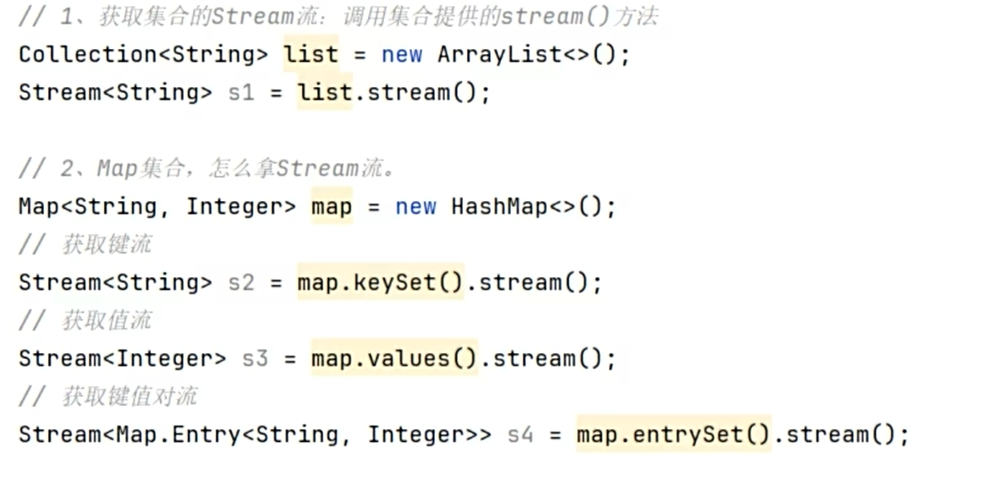
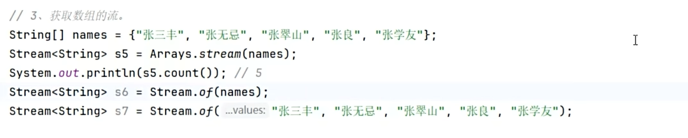
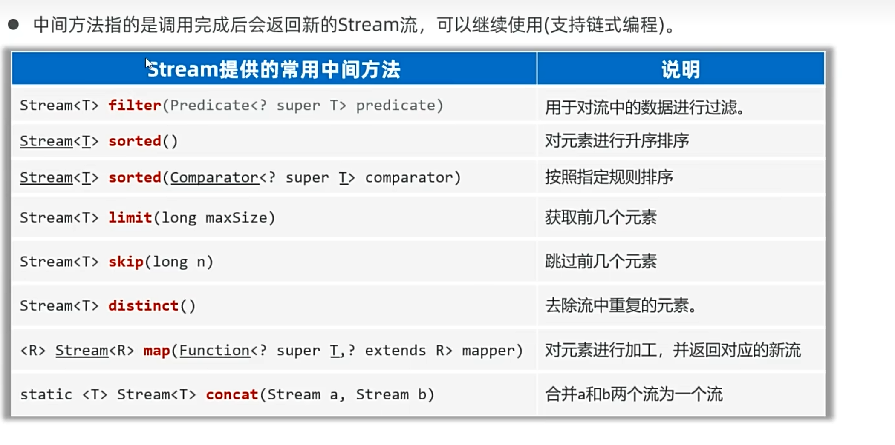
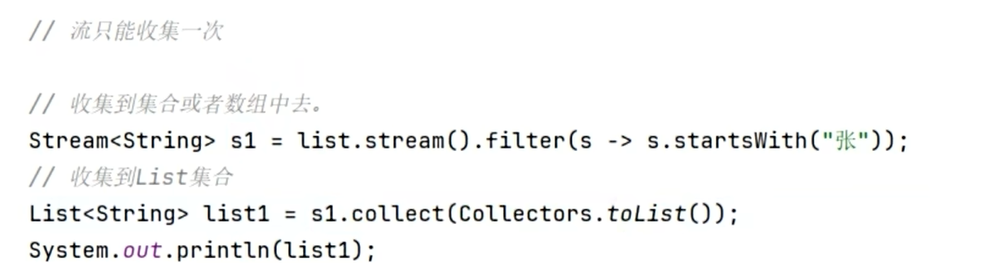

# Stream流

JDK8 引入的特性，用于对 [[集合框架|集合]] 或数组进行函数式操作，代码更简洁。可以把 Stream 流理解成一条流水线，集合的元素放在这条流水线上，流水线会有筛选和处理等功能。

---

## 🎯 对比传统遍历

Stream流写出来的代码更简洁：

---

## 📌 特点

---

## 🔧 使用步骤

### 获取 Stream 流

**Collection 集合与 Map 集合：**

**数组：**

> 可变参数也是获取 Stream 流的一种方式，详见 [[可变参数]]。

---

## 📌 常用方法

### 中间方法

调用完之后返回新的 Stream 流，可以继续使用，支持链式编程。

### 终结方法

调用完后不会返回新 Stream，没法继续使用了。

---

## 📦 收集 Stream 流

处理后的结果要转回集合或数组，称为收集 Stream 流。

收集写法如图所示，**流只能收集一次**。

---

## 🔗 关联知识点
- [[集合框架]] - Stream流常用于操作集合
- [[Map集合]] - 获取Map的Stream流
- [[Lambda表达式]] - Stream流的核心语法
- [[方法引用]] - Stream的方法引用简化
- [[可变参数]] - 获取Stream流的方式之一
- [[泛型]] - Stream操作中的类型安全