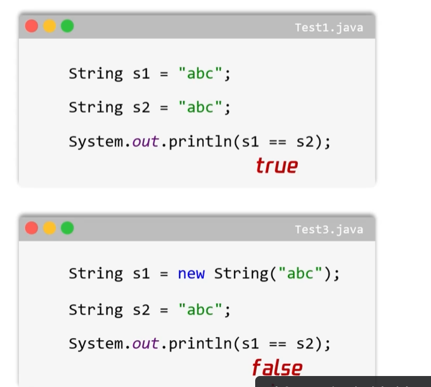
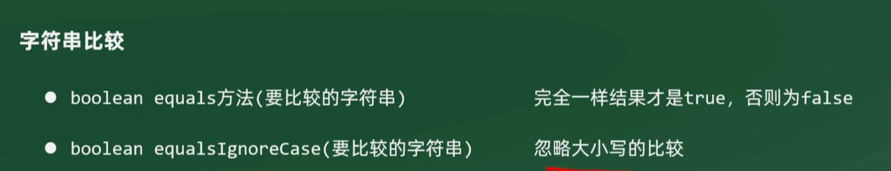
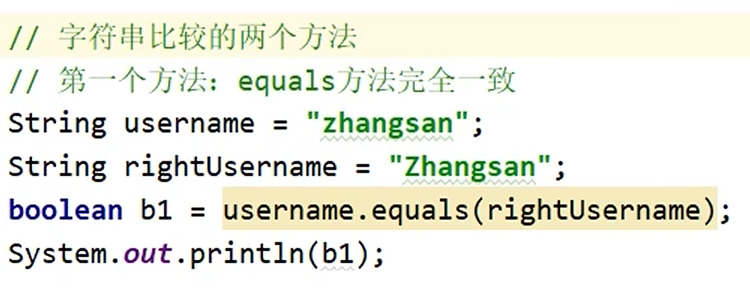
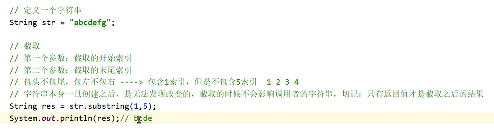
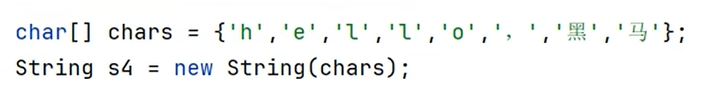

# String类

字符串类，Java中最常用的类之一，位于`java.lang`包下，不需要导包。

---

## 🎯 核心特点

1. **不可变性**：字符串的内容是不可变的，它的对象在创建后不能被更改
2. 字符串的拼接，实际上是生成了一个新的字符串
3. Java程序中的所有字符串文字（例如`"abc"`）都是String类的对象


---

## 📌 创建对象的两种方式

### 1. 直接赋值（推荐，更省内存）
```java
String name = "abc";
```
- 在堆内存的串池中，相同内容只会存在一份，直接复用
- `String s1 = "abc"; String s2 = "abc";` s1和s2指向同一个字符串对象

### 2. 通过构造方法创建
```java
String s1 = new String();  // 创建空字符串
String s2 = new String("abc");
```
- 直接在堆里开辟空间，**不会复用**串池中的对象，消耗更多内存

---

## ⚖️ 字符串比较

### == 比较
`==` 比较的是变量里面记录的内容：
- 基本数据类型：比较真实数据值
- [[数据类型|引用数据类型]]：比较地址值

因为String是引用数据类型，`==`比较的是地址，不是内容：



### equals 比较内容
如果要比较字符串里面的**内容**是否相同，使用方法比较：





---

## 🔧 常用方法

### charAt()
根据索引获取字符串里的具体字符：


### length()
获取字符串的长度：`s1.length()`

### substring()
截取字符串，返回新字符串：
- 包左不包右
- 必须用变量接收返回值或直接打印，因为截取出来是新的字符串



### replace()
替换字符串里的指定内容：
- 只有返回值才是替换之后的结果


---

## 🔧 修改字符串的技巧
字符串本身是不可变的，如果想要修改里面的内容：
1. 转成字符数组 `toCharArray()`
2. 修改字符数组
3. 用字符数组创建一个新字符串


### 字符数组转字符串

```java
char[] chars = {'a', 'b', 'c'};
String s = new String(chars);
```



---

## 💾 内存中的创建方式对比

直接赋值和new创建，在内存中的体现不同：


---

## 🔗 关联知识点
- [[数据类型]] - String是引用数据类型
- [[StringBuilder]] - 可变字符串容器，高效拼接
- [[构造方法]] - new String()创建对象
- [[面向对象基础]] - 类与对象
- [[API]] - JDK提供的类
