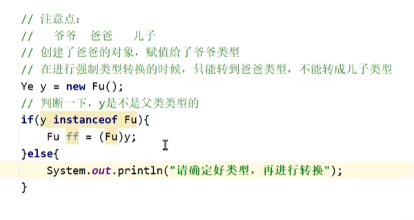

# instanceof关键字

[[多态]]中用于类型判断的关键字，在强制类型转换前使用以避免类型转换异常。

---

## 🎯 作用
在强制转换之前，可以用instanceof关键字判断对象的实际类型。

```java
if (y instanceof Fu) {
    // y是Fu类型，可以安全转换
}
```

> 意思是"判断y是不是Fu类型的"



---

## 🔗 关联知识点
- [[多态]] - 强制类型转换前的安全检查
- [[类型转换]] - instanceof是强转的前提
