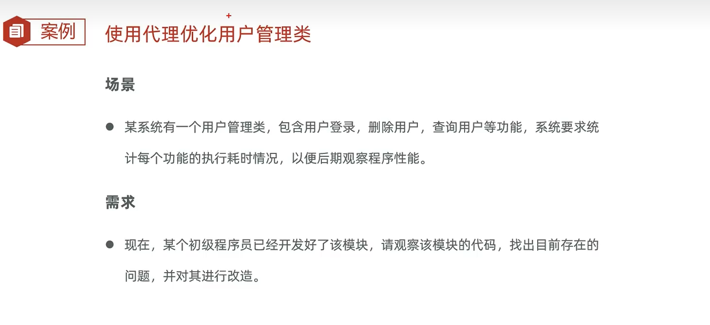
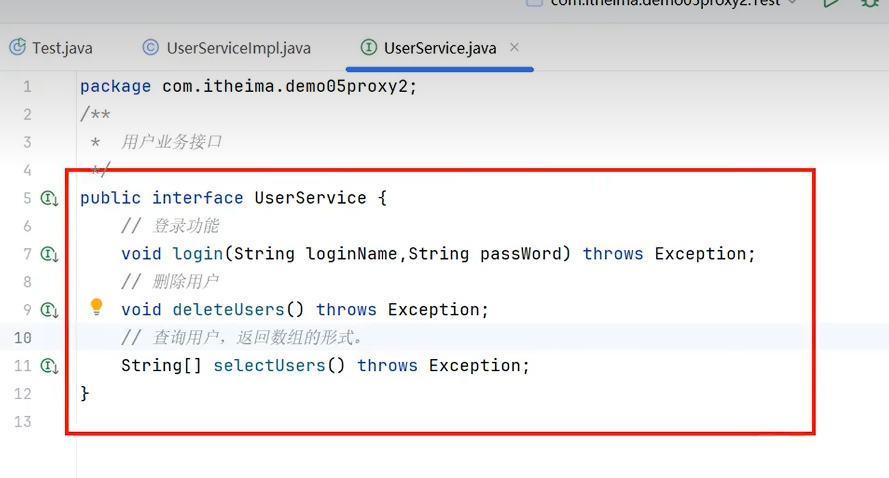
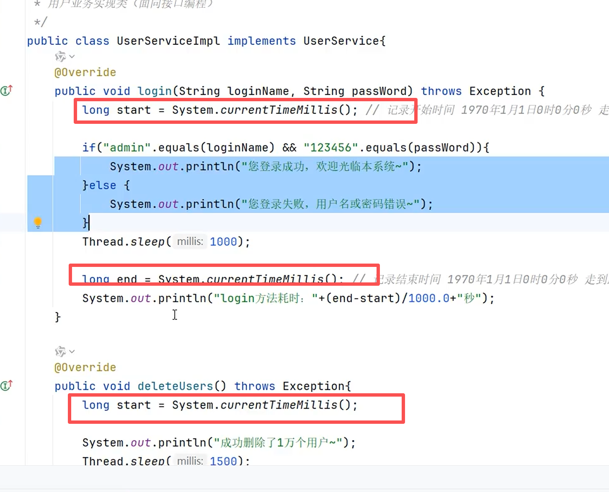
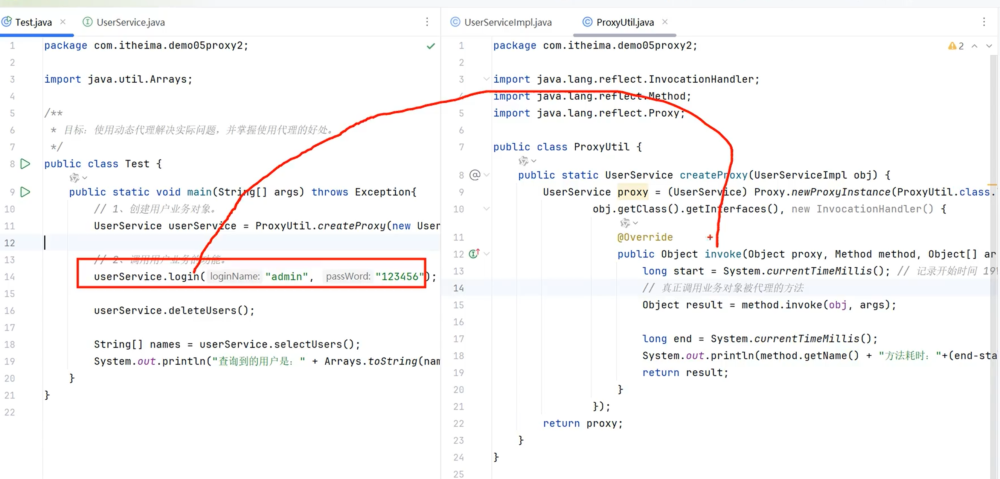

# 代理

代理是一种**设计思想**。这里用"明星和经纪人"的例子来理解：找明星唱歌跳舞之前，要先找明星的**唯一经纪人**，先由经纪人（也就是代理）去完成一些事前工作，然后再让明星去做唱歌和跳舞。

> 关键点：对象有什么方法想被代理，代理就一定要有对应的方法。那代理如何知道该有哪些方法？——通过**接口去限制**：定义一个接口，代理和对象都实现这个接口。

***

## 如何创建代理对象

明星类好创建（正常 new 就行），可针对明星的"唯一代理对象"怎么创建？Java 提供了一个 API（`Proxy` 类）：

创建代理对象的代码比较多且容易高度重复，一般放到一个**单独的工具类**里。示例代码：

> 参数一用当前工具类的**类加载器**，参数二用指定对象所实现的**接口**（前两个参数可以直接背），参数三简单理解就是**代理要做的事的业务逻辑**。

***

## 代理怎么用

直接在 `main` 里创建代理对象，然后调用方法即可——调用代理的方法，会去调用之前的 `invoke` 方法。

***

## invoke 方法的写法与参数含义

上面创建代理对象时，`invoke` 方法还没写出来，它到底怎么写、参数是什么含义？

> 参数二获得的方法其实是通过**反射**获得的，所以后面调用真对象的方法时，是通过反射的 `invoke` 去调用的。

***

## 代理的应用场景

代理到底有什么用？通过一个"统计方法耗时"的案例来理解：

可以看到统计用时的代码存在大量重复，此时就可以通过**代理**来减少重复代码：

***

## 引入泛型使代理通用

还可以引入**泛型**，让代理变得通用：

***

## 总结

代理可以**减少重复代码**，还可以**赋予对象更多强大的功能**。

***

## 🔗 关联知识点

- \[\[接口]] - 代理通过接口限制并统一方法

- \[\[反射]] - `Proxy.newProxyInstance` 底层依赖反射动态生成代理类

- \[\[单例设计模式]] - 明星的"唯一经纪人"类似单例思想

- \[\[注解]] - 框架中常结合代理与注解做增强

