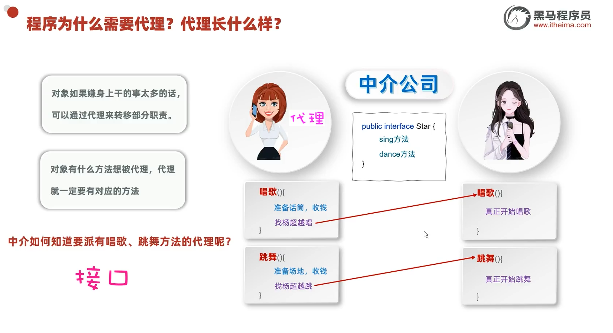
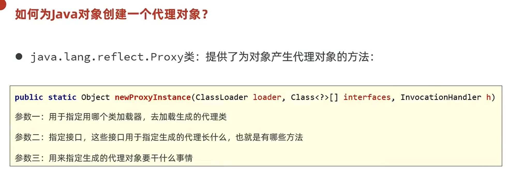

# 代理

代理是一种**设计思想**。这里用"明星和经纪人"的例子来理解：找明星唱歌跳舞之前，要先找明星的**唯一经纪人**，先由经纪人（也就是代理）去完成一些事前工作，然后再让明星去做唱歌和跳舞。

> 关键点：对象有什么方法想被代理，代理就一定要有对应的方法。那代理如何知道该有哪些方法？——通过**接口去限制**：定义一个接口，代理和对象都实现这个接口。

---

## 如何创建代理对象

明星类好创建（正常 new 就行），可针对明星的"唯一代理对象"怎么创建？Java 提供了一个 API（`Proxy` 类）：

创建代理对象的代码比较多且容易高度重复，一般放到一个**单独的工具类**里。示例代码：

---

## 🔗 关联知识点
- [[接口]] - 代理通过接口限制并统一方法
- [[反射]] - `Proxy.newProxyInstance` 底层依赖反射动态生成代理类
- [[单例设计模式]] - 明星的"唯一经纪人"类似单例思想
- [[注解]] - 框架中常结合代理与注解做增强