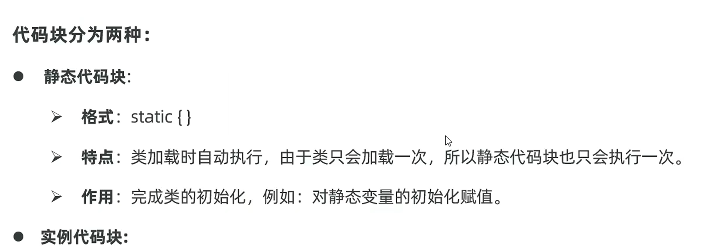
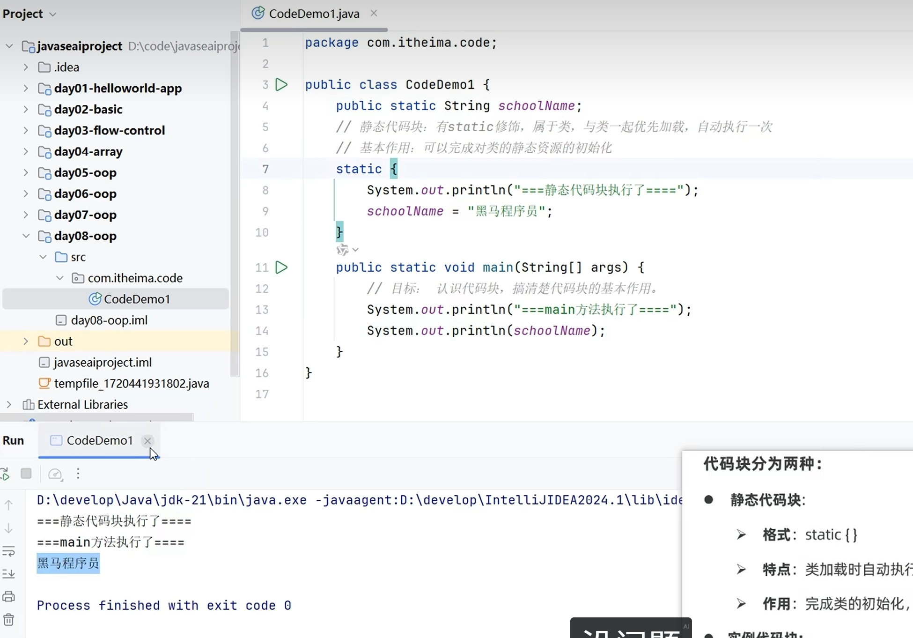

# 代码块

Java中的代码块分为静态代码块、实例代码块（构造代码块）等，用于在特定时机执行初始化逻辑。

---

## 📌 静态代码块
用`static`修饰的代码块，随着类的加载而执行，**只执行一次**。

知识点和用法：

特点：
- 用[[static关键字]]修饰
- 属于类，不属于对象
- 随类加载而加载，优先于对象存在
- 类加载时执行，只执行一次
- 可以通过类名调用，也可以通过对象调用

---

## 📌 实例代码块（构造代码块）
写在类成员位置的代码块（没有static修饰），每次创建对象时都会执行，**在构造方法之前执行**。

知识点和用法：

特点：
- 没有static修饰
- 每次创建对象都会执行
- 在[[构造方法]]之前执行
- 用于抽取构造方法中的重复代码

---

## 🔄 执行顺序
1. 静态代码块（类加载时，只一次）
2. 实例代码块（每次创建对象，构造方法前）
3. 构造方法（每次创建对象）

---

## 🔗 关联知识点
- [[static关键字]] - 静态代码块
- [[构造方法]] - 实例代码块在构造方法前执行
- [[面向对象基础]] - 类的成员
- [[main方法]] - 静态方法
