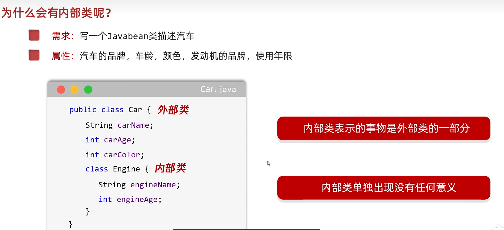

# 内部类总览

写在一个类里面的类就叫做内部类，包括[[成员内部类]]、[[局部内部类]]、[[匿名内部类]]。

---

## 🎯 使用场景
一个类表示的事物是另一个类的**一部分**，且单独存在没有意义的时候，就作为内部类写在另一个类的内部，此时另一个类就叫做外部类。



---

## 📊 内部类分类

```
内部类
├── 成员内部类（成员位置）
│   ├── 普通成员内部类
│   └── 静态内部类（static修饰）
├── 局部内部类（方法内）
└── 匿名内部类（最常用，快速实现接口/抽象类）
        ↓
   Lambda表达式（更简洁的替代）
```

---

## 🔗 关联知识点
- [[成员内部类]] - 写在成员位置
- [[静态内部类]] - static修饰的成员内部类
- [[局部内部类]] - 方法内定义
- [[匿名内部类]] - 接口/抽象类快速实现
- [[Lambda表达式]] - 函数式接口的简洁替代方案
- [[面向对象基础]] - 类的定义
- [[接口]] - 匿名内部类最常实现接口
