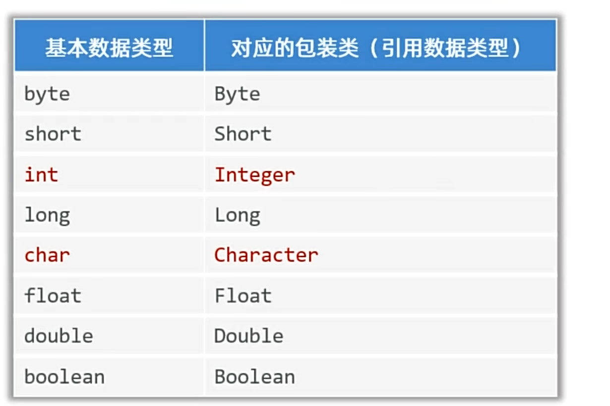
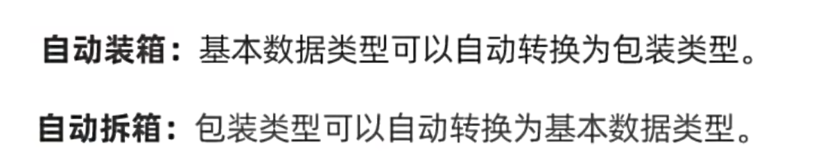
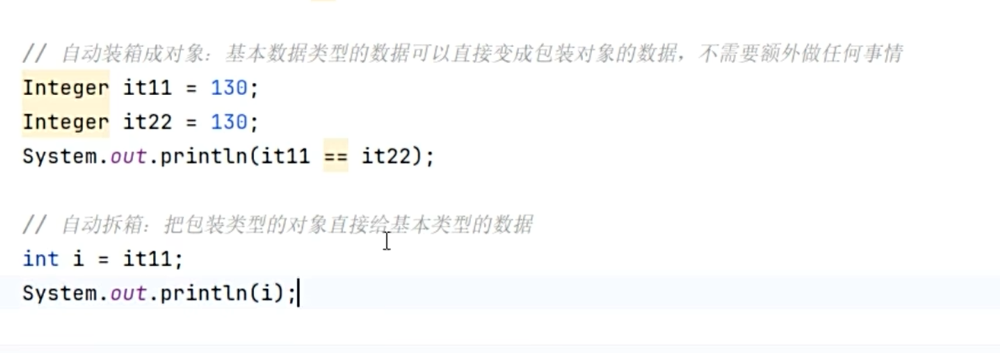
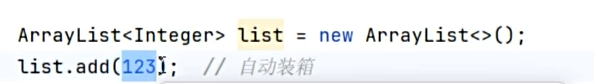
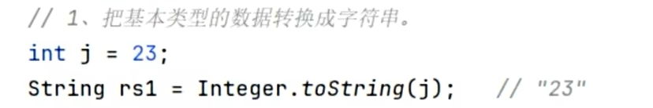

# 包装类

将基本数据类型包装成对象类型，使 [[泛型]] 也能接收基本数据。泛型擦除后类型恢复为 Object，而 Object 无法指向基本数据，所以需要包装类。

---

## 🎯 为什么需要包装类

[[泛型]]不支持基本数据类型，只能支持对象类型（引用数据类型）。如果非得让泛型接基本数据类型，就要把基本数据类型包装成对象类型。



---

## 📌 基本语法

手动装箱：


---

## ⚡ 自动装箱与自动拆箱

Java 中支持自动装箱和自动拆箱，简化代码：



### 语法示例



### 配合泛型使用

```java
ArrayList<Integer> list = new ArrayList<>();
list.add(123);  // 123实际上是对象形式放进list，是自动装箱实现的
```



---

## 🔧 额外功能：类型转换

包装类还具备额外的功能：

### 基本类型 → 字符串



### 字符串 → 基本数据类型


---

## 🔗 关联知识点
- [[泛型]] - 泛型不支持基本类型，需要包装类配合
- [[数据类型]] - 基本数据类型与包装类的对应关系
- [[集合框架]] - 集合中存储基本类型时需要包装类
- [[String类]] - 包装类可与String互相转换
- [[API]] - 包装类属于JDK提供的API