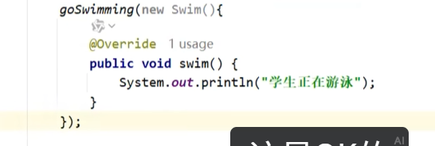

# 匿名内部类

[[内部类总览|内部类]]中最常用的一种，可以快速实现[[接口]]或继承[[抽象类与抽象方法|抽象类]]，省略单独定义类。

---

## 🎯 背景
如果参数是接口，传过去的应该是实现这个接口的类的对象。

但是上面这种写法，还要单独写一个student类去实现swim接口里的抽象方法，结果只用了一次，太浪费了。于是匿名内部类出现了。

---

## 📌 本质
红线里的就是匿名内部类本身：
- 实现的是swim接口里的抽象方法，没有名字
- 匿名内部类不仅仅可以用于实现接口，还可以用于继承类，实现类里的抽象方法
- 前面的是类，就是继承；前面的是接口，就是实现
- `new` 关键字作用的是后面这个没有名字的Java类，创建了它的对象

---

## ⚡ 更简洁的写法
直接写在方法参数里：

---

## 🔗 关联知识点
- [[内部类总览]] - 内部类分类
- [[接口]] - 匿名内部类最常实现接口
- [[抽象类与抽象方法]] - 也可以继承抽象类
- [[方法重写]] - 必须重写抽象方法
- [[多态]] - 接口/抽象类引用接收匿名对象
- [[局部内部类]] - 匿名内部类是局部的一种特殊形式
