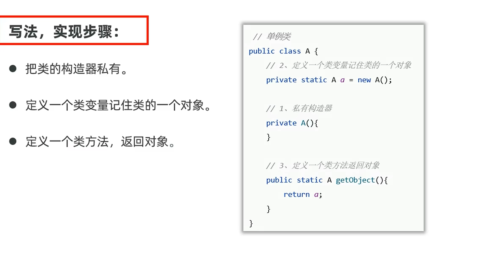

# 单例设计模式

设计模式的一种，确保一个类只能创建一个对象。

---

## 🎯 目的
确保一个类**只能创建一个对象**。例如：电脑的任务管理器，无论启动多少次任务管理器，都只能有这一个对象。

---

## 📌 两种实现方式

### 1. 饿汉式单例
在获取类的对象时，对象**已经创建好了**（类加载时就创建）。

特点：
- 线程安全
- 以空间换时间（类加载就创建，可能浪费内存）

### 2. 懒汉式单例
用对象时，才开始创建对象（延迟加载）。

特点：
- 第一次使用才创建，更省内存
- 第一次使用时速度稍慢
- 基础写法线程不安全，需要加锁处理

### 对比
> 懒汉式比饿汉式更省内存，但缺点是懒汉式第一次用对象时速度更慢。

---

## 🔗 关联知识点
- [[构造方法]] - 单例需要私有化构造方法
- [[private关键字]] - 构造方法私有化
- [[static关键字]] - 单例对象用static修饰
- [[面向对象基础]] - 设计模式
- [[枚举类]] - 枚举天然是单例
