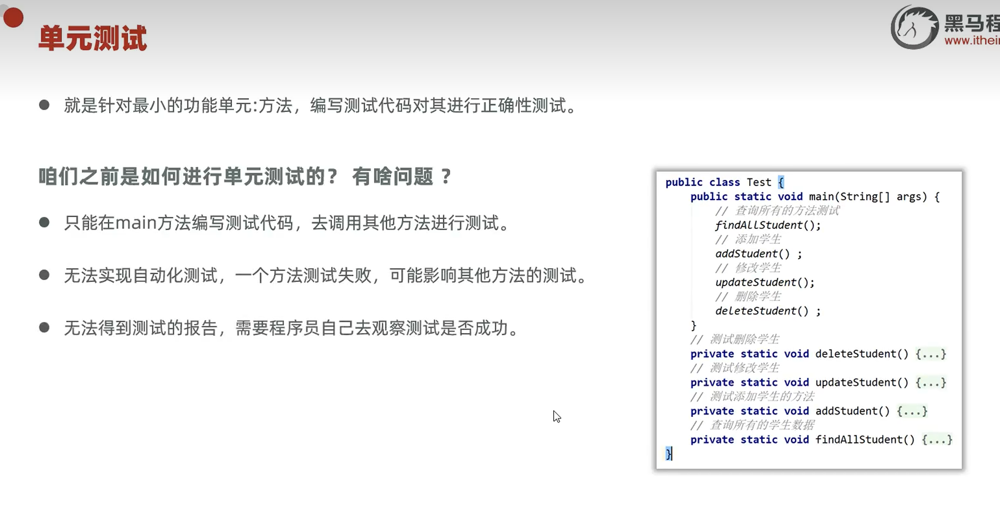
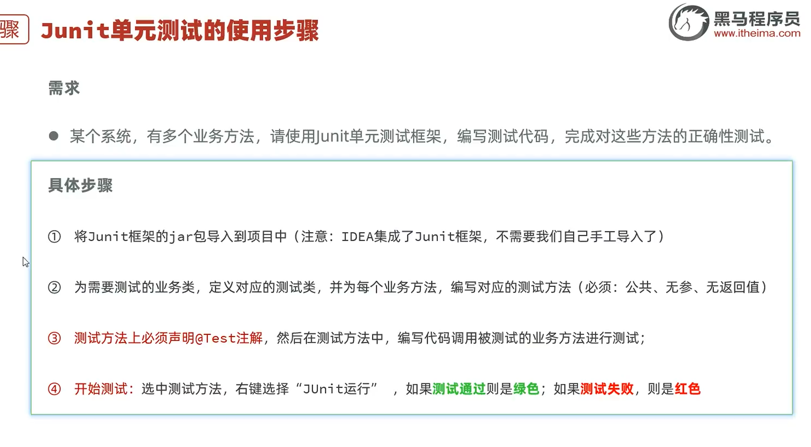

# 单元测试

针对最小的功能单元——**方法**，编写测试代码对其进行正确性测试。

在以前，我们的单元测试是在 `main` 方法里做的，有诸多不便，如图所示。

现在可以用 **JUnit** 单元测试框架来替代，其相关内容如图所示。

---

## 🧩 JUnit 使用步骤

如图所示。

---

## 💻 示例代码

JUnit 的示例代码如图所示。

以上代码还不够完整，还应该加**断言**，比方说提前断言某个测试结果应该是 6。请注意，下面代码的 `println` 可以忽视。

---

## 🔗 关联知识点
- [[异常]] - 测试失败时抛出的异常处理
- [[main方法]] - 早期在 main 中做单元测试的弊端