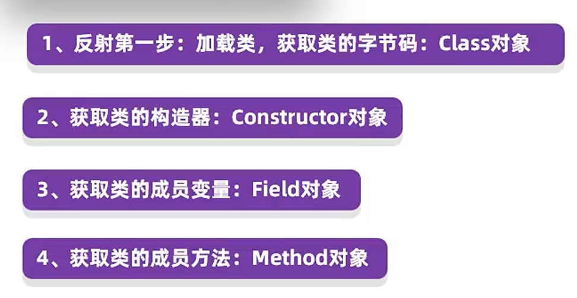
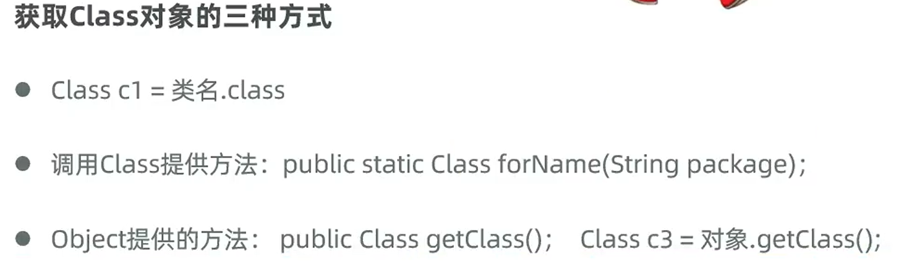
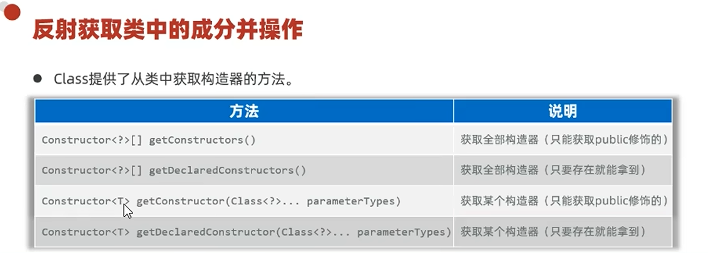
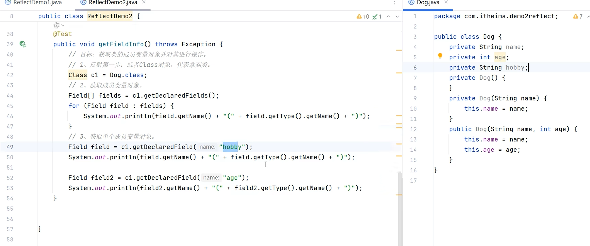
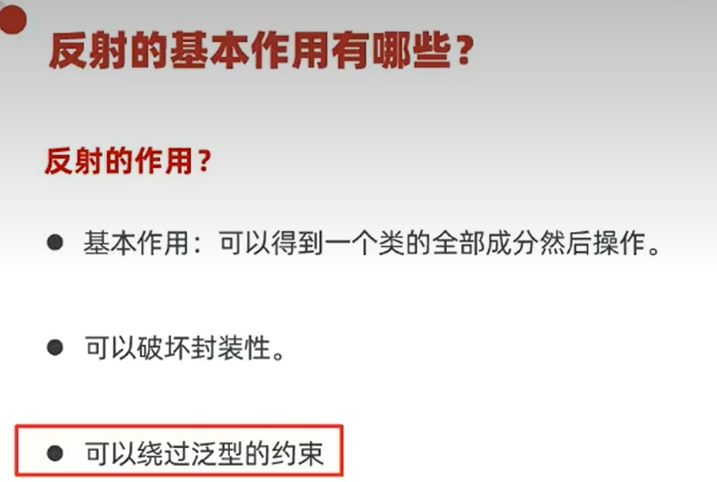

# 反射

反射的专业概念就是**加载类**，并允许以编程的方式**解剖类中的各种成分**（成员变量、方法、构造器等）。

"加载类"就是把类加载到程序中去。如图所示，我们写 `s1.` 的时候，会显示这个类里的全部信息，其实这就是通过反射解剖出来的。

---

## 📌 反射的操作步骤

先加载类对象 → 获取构造器对象 → 获取成员变量对象 → 获取方法对象。

**万物皆对象**，其实类的字节码 `class` 本身也是对象。

---

## 1️⃣ 获取 Class 对象的三种方式

1. `Class.forName("全类名")` —— 用于读取配置文件、加载数据库驱动，最灵活
2. `类名.class` —— 多用于参数传递
3. `对象.getClass()` —— 已有对象实例时使用

获取 Class 对象的三种示例代码：

> 同一个类的 Class 对象是**同一个对象**，无论用哪种方式获取结果都一样。

---

## 2️⃣ 获取构造器对象

获取了 Class 类之后，接下来就是获取其中的内容。获取构造器对象的常用方法：

获取构造器对象的示例代码：

### 构造器有什么用：创建对象 + 暴力反射

获取了构造器可以用来**创建对象**，而且可以**暴力反射**，强行突破 `private` 的限制。

> 附带知识点：`System.out.println(obj)` 底层会自动调用 `obj.toString()`。
> - 若类**重写了 toString()**：输出对象内部属性信息（执行我们自己写的方法）。
> - 若**没有重写**：调用 `Object` 原生的 `toString()`，输出 `类名@十六进制哈希地址`，看不到字段。

---

## 3️⃣ 获取成员变量对象

通过 Class 获取成员变量对象的常用方法：

示例代码：

获取成员变量后用于**取值或赋值**，但在取值/赋值之前还需要一个对象——因为**成员变量最终都是存在于对象之中的**。

---

## 4️⃣ 获取成员方法对象

通过 Class 获取成员方法对象的常用方法：

示例代码：

获取成员方法对象后用于**调用**，调用前同样需要一个类对象。

---

## 💡 反射的本质小结

反射是**先获取一个类里面的内容作为单独的内容对象**（构造器对象、成员变量对象、方法对象），这些内容对象**先于类对象而存在**；要使用它们时，再需要一个具体的类对象去承接。

由此突破了"以前必须先有对象才能获取其内容"的限制，可以**绕过对象，直接获得一个类里面的内容**，等需要用时再 new 一个具体的类对象。

---

## 🎯 反射的基本作用

1. **破坏封装性** —— 暴力突破 `private` 限制，获取/修改私有成员。
2. **绕过泛型的约束** —— 反射可绕过编译期的泛型类型检查。

---

## 🔗 关联知识点
- [[SpringBoot]] - 注解扫描类的过程依赖反射
- [[JDBC与MyBatis]] - `Class.forName` 常用于加载数据库驱动
- [[面向对象基础]] - 反射解剖类的成员变量、方法、构造器
- [[构造方法]] - 反射可获取并调用构造器对象