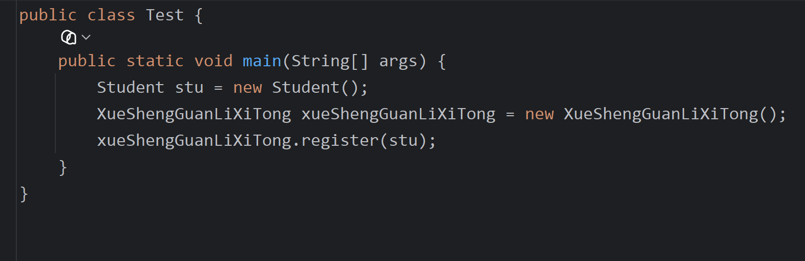
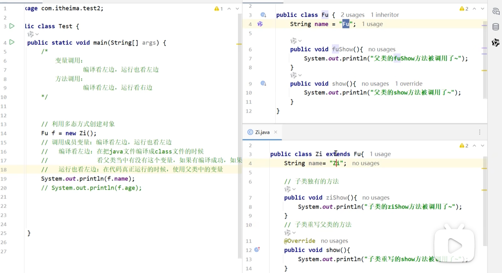
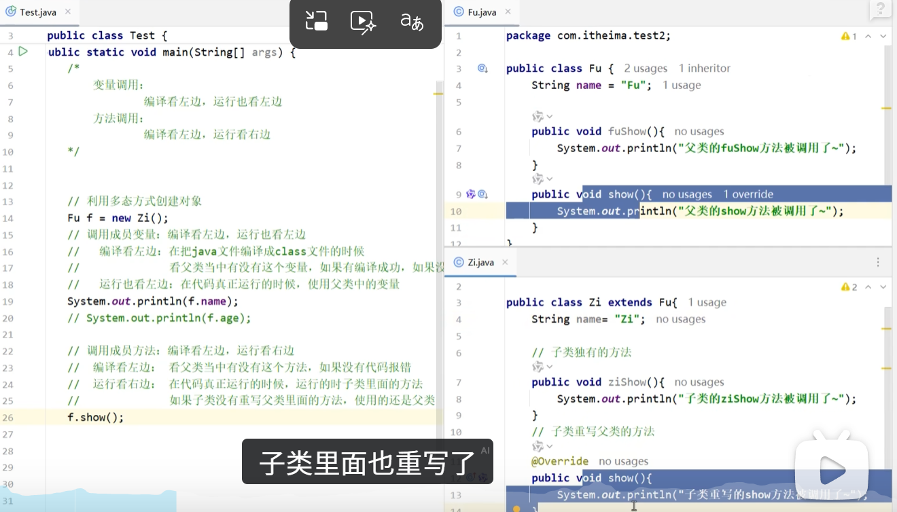
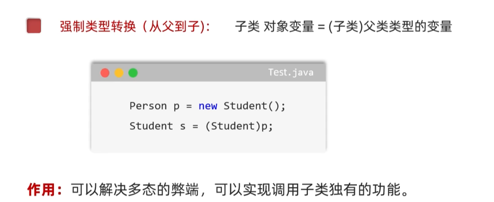

# 多态

[[面向对象基础]]三大特性之三，指事物的多种形态，建立在[[继承]]和[[方法重写]]基础上。

---

## 🎯 表现形式
在Java中，多态的表现形式是：
```java
Fu fu = new Zi();
```
简单来说，就是子类的对象可以赋给父类的类型。

应用场景比如注册：





---

## 📌 成员访问规则（核心考点）

### 变量调用：编译看左边，运行也看左边
```java
Fu fu = new Zi();
System.out.println(fu.num); // 输出Fu的num
```

这个图输出的是Fu，因为是变量调用，所以都看父类：



### 方法调用：编译看左边，运行看右边
这个是方法调用，输出的是子类的方法（[[方法重写]]的体现）：



---

## ⚠️ 弊端与解决
多态的弊端：**无法调用子类的特有方法**，因为编译看左边。

### 解决方法：强制类型转换
可以强制类型转换，弥补这个弊端。但需要注意：**只能强转为自己的类型**。



### instanceof 关键字
在强制转换之前，可以用 `instanceof` 关键字判断类型。
> 图中意思是"判断y是不是Fu类型的"


---

## 🔗 关联知识点
- [[面向对象基础]] - 三大特性
- [[继承]] - 多态的前提
- [[方法重写]] - 运行看右边的本质
- [[封装]] - 数据隐藏
- [[类型转换]] - 强转解决弊端
- [[instanceof关键字]] - 类型判断
- [[构造方法]] - 对象创建
