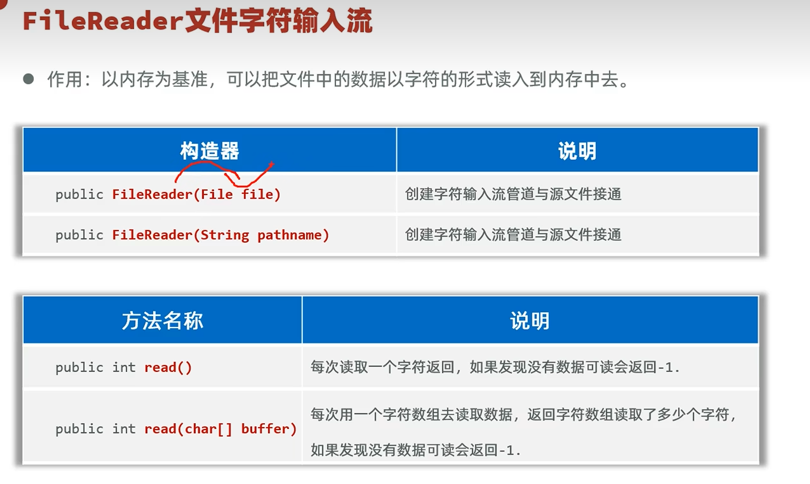
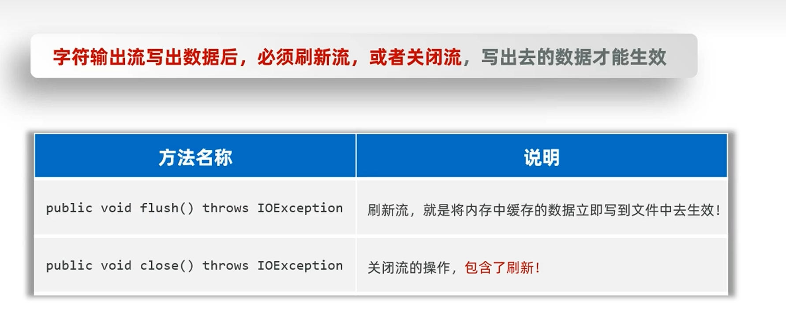

# 字符流

[[IO流]] 的一种，以字符为单位进行读写。适合读取文本内容，不会出现汉字乱码。

---

## 📌 FileReader（字符输入流）

把磁盘/网络里的数据，以一个一个字符的形式读取到内存中，最小单位是字符。

### 构造方法与常用方法

---

## 📌 FileWriter（字符输出流）

### 构造器与常用方法

---

## ⚠️ 刷新与关闭

字符输出流写了数据之后，必须 `flush()` 刷新流或者 `close()` 关闭流才能生效。

原因：输出流为了效率，一开始是输出到**内存缓冲区**的，还没有直接输出到磁盘。要刷新或关闭流才会把缓冲区数据正式输出到磁盘。

---

## 🔗 关联知识点
- [[IO流]] - 字符流属于IO流体系
- [[字节流]] - 对比：字节 vs 字符
- [[File类]] - 文件路径
- [[字符集]] - 字符流与字符编码
- [[异常]] - 资源释放