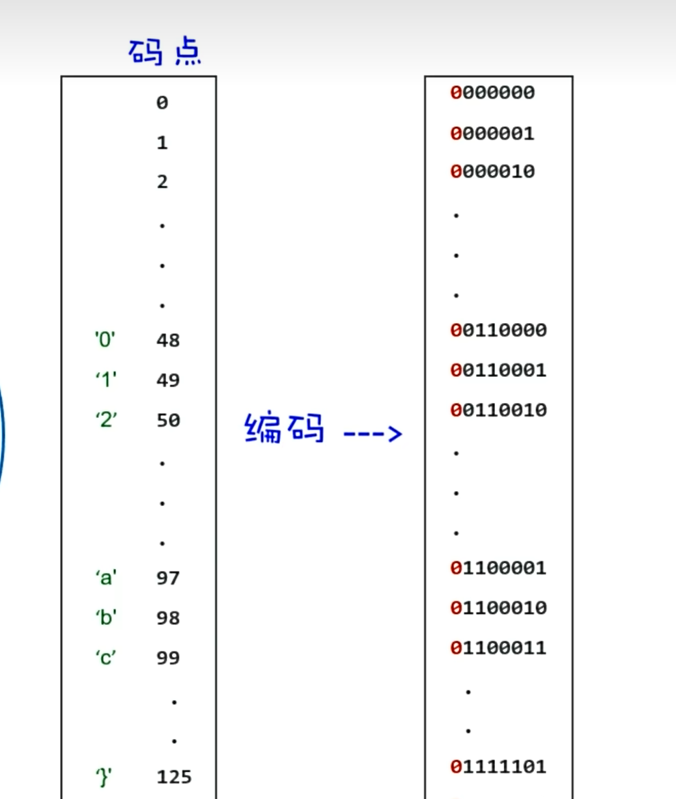
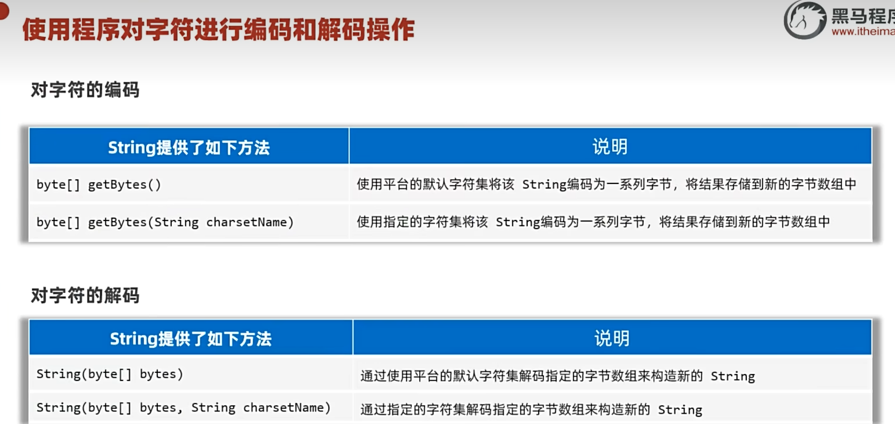

# 字符集

计算机存字符的方式：先人为规定，把字符跟特定数字建立连接，然后把特定数字转成二进制存入计算机。

---

## 📌 ASCII（美国）

美国用的字符集，字符比较少，一个字符对应一个字节就够了，且开头都是 0。

---

## 📌 GBK（中国）

一个中文字符编码成两个字节的形式存储。

---

## 📌 UTF-8（世界通用）

Unicode 字符集的编码方案，可变长编码（1~4个字节），兼容 ASCII。

---

## 📊 三种字符集对比

---

## 🔧 编码与解码

编码：字符 → 字节；解码：字节 → 字符。

### 方法

### 示例代码

---

## 🔗 关联知识点
- [[String类]] - 字符串与字节的转换
- [[API]] - JDK提供的编码解码API
- [[数据类型]] - byte类型