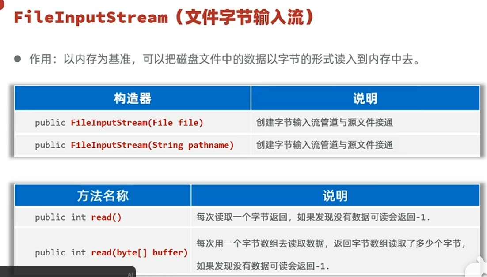
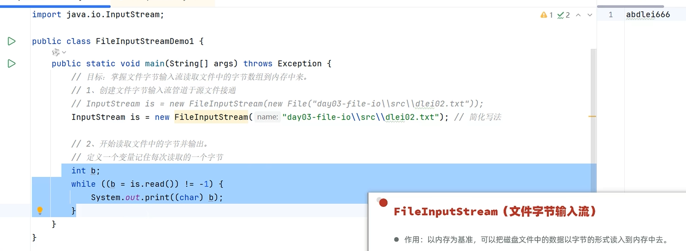
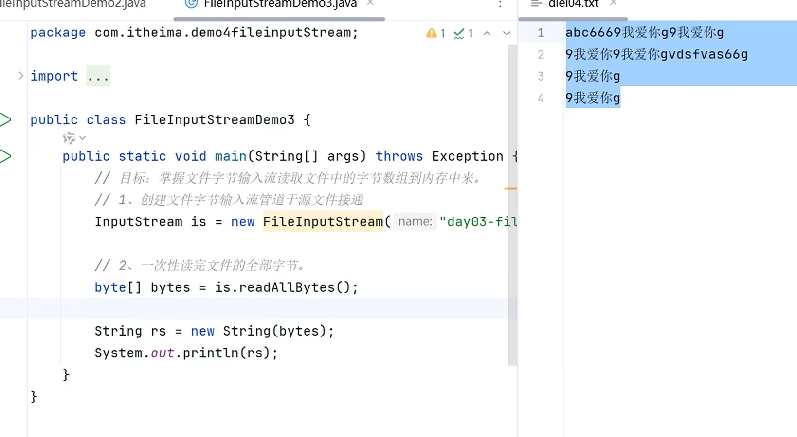
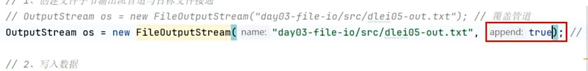

# 字节流

[[IO流]] 的一种，以字节为单位进行读写。适合做数据的转移，如文件复制。

---

## 📌 FileInputStream（字节输入流）

### 常用方法

### 示例代码

每次读取一个字节，会导致汉字乱码（因为汉字不止一个字节）：

### 字节数组读取

一次性读取多个字节，提升效率，但依旧不能解决汉字乱码（存在截断汉字字节的可能性）：

### readAllBytes() 一次性读取

可以避免乱码，但如果文件很大，容易内存溢出：

---

## 📌 FileOutputStream（字节输出流）

### 构造器与常用方法

> 直接写单个文字会乱码，因为 write 是写一个字节出去，而汉字不止一个字节，应该写一个字节数组。

### 追加模式

直接建管道会覆盖原来的数据，在构造器后面加 `true` 才表示追加。

---

## 🔗 关联知识点
- [[IO流]] - 字节流属于IO流体系
- [[字符流]] - 对比：字节 vs 字符
- [[File类]] - 文件路径
- [[字符集]] - 汉字乱码的根本原因
- [[异常]] - 资源释放