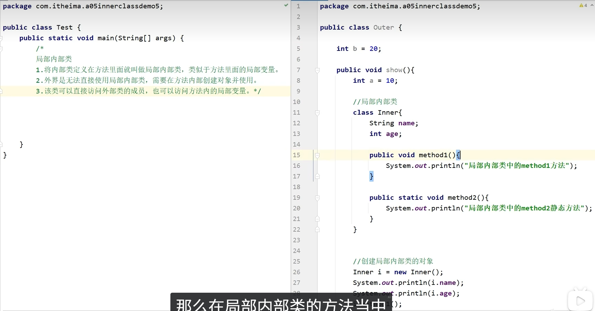

# 局部内部类

[[内部类总览|内部类]]的一种，定义在方法内部。

---

## 📌 特点
局部内部类定义在方法内部，调用其实都是在所在方法里完成的。
main方法里直接调用所在方法即可。

---

## 🔗 关联知识点
- [[内部类总览]] - 内部类分类
- [[成员内部类]] - 成员位置的内部类
- [[匿名内部类]] - 更简洁的局部写法
- [[面向对象基础]] - 方法内定义
