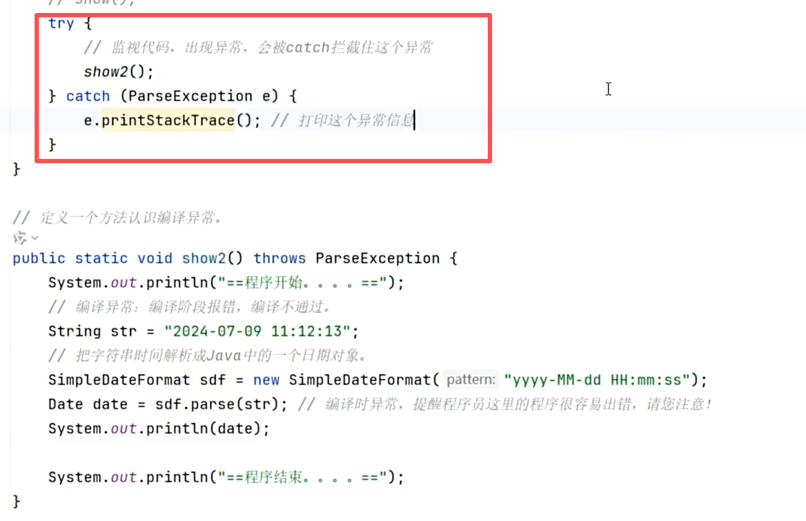
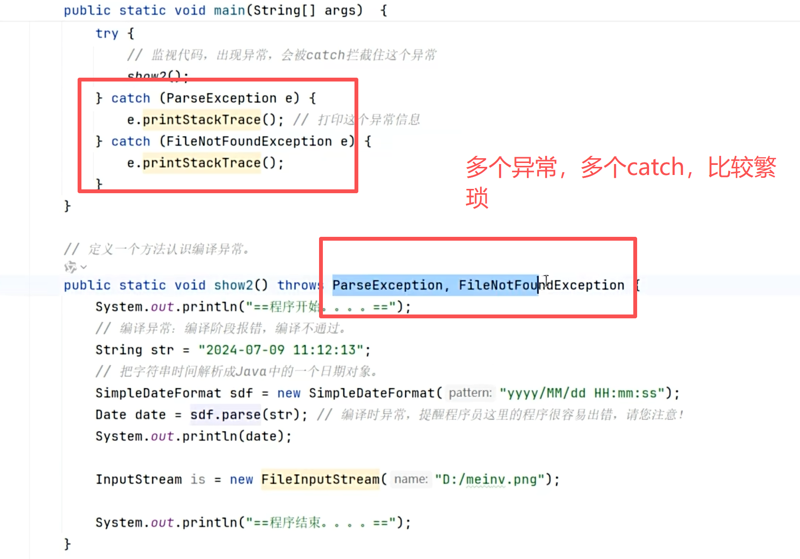
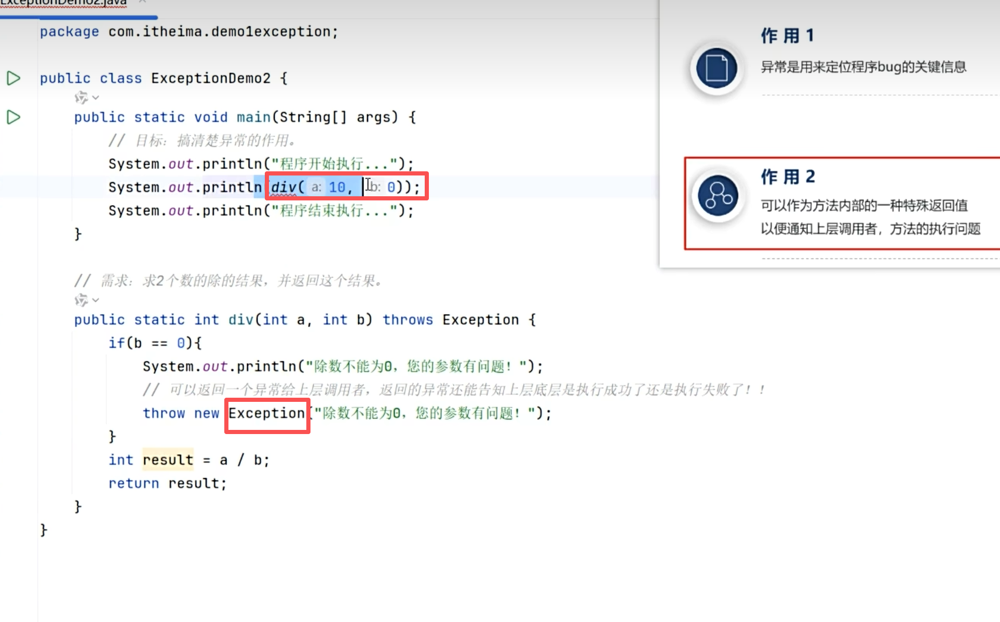
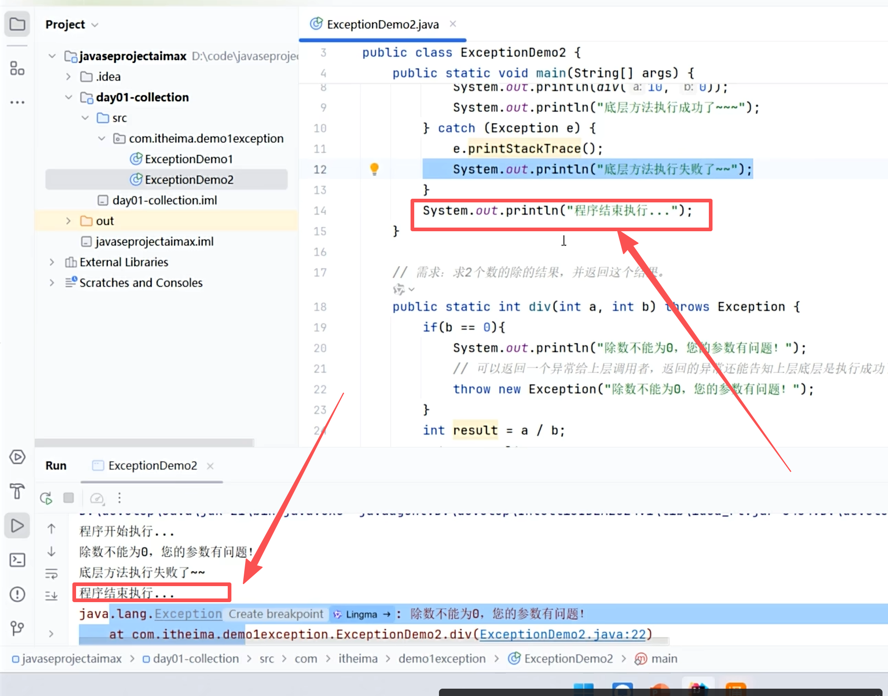

# 异常

程序可能出现的错误，Java为每种常见问题都定义了对应的异常对象。掌握异常处理是写出健壮程序的关键。

---

## 🎯 异常继承体系

Java已对常见问题做了归类，每一种问题都有一个异常对象去代表。

- **运行时异常**（RuntimeException）：编译阶段不会出现错误提示（写代码时不报错），只有运行时才会暴露，并停止整个程序
- **编译时异常**：编译阶段就强制要求处理

---

## 🔧 两种处理方案

编译时异常的基本处理涉及两种方案：

| 方案 | 说明 |
|------|------|
| **抛出（throws）** | 在本方法里不处理，层层往上抛给调用者 |
| **捕获（try-catch）** | 在当前方法直接处理这个异常 |

---

## 📌 try-catch 捕获

`try` 监视代码，如果出现异常就拦截，交给 `catch` 处理。快捷键：`alt + 回车`。

### 向上抛出技巧

可以抛给更高层，写一个catch就可以了：

---

## 🎯 异常的两大作用

### 1. 定位bug的关键信息
### 2. 作为特殊的返回值，通知上层调用者

在 `div` 方法里如果检测到除数为0，就把异常 `throw` 回去，告诉调用者：

> 可以抛编译时异常，更强烈，在编译时就强制要求处理。

---

## 💡 try-catch 保证程序继续运行

try-catch可以保证程序即使出现异常也能继续运行。`e.printStackTrace()` 是交给另一个线程执行，执行得慢一点，所以会在后面才打印出来，实际的代码运行顺序没有问题。

---

## 🔗 关联知识点
- [[继承]] - 异常的继承体系（Throwable → Exception → RuntimeException）
- [[多态]] - 异常对象以多态形式被catch接收
- [[方法重写]] - 重写方法时异常声明的限制
- [[Object类]] - Throwable继承自Object