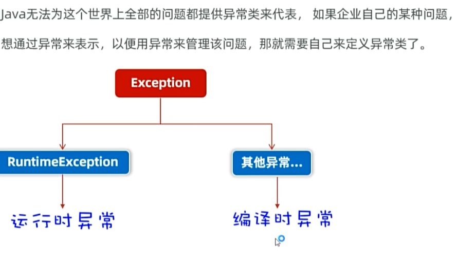
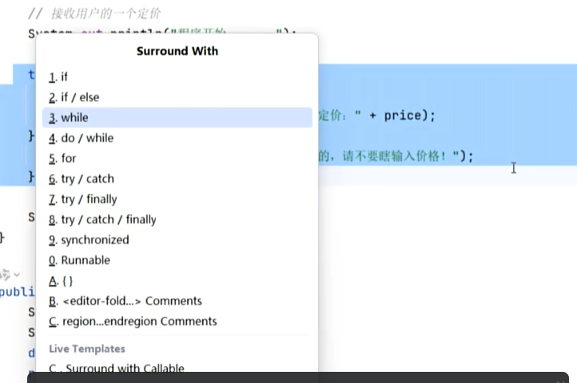

# 异常

程序可能出现的错误，Java为每种常见问题都定义了对应的异常对象。掌握异常处理是写出健壮程序的关键。

---

## 🎯 异常继承体系

Java已对常见问题做了归类，每一种问题都有一个异常对象去代表。

- **运行时异常**（RuntimeException）：编译阶段不会出现错误提示（写代码时不报错），只有运行时才会暴露，并停止整个程序
- **编译时异常**：编译阶段就强制要求处理

---

## 🔧 两种处理方案

编译时异常的基本处理涉及两种方案：

| 方案 | 说明 |
|------|------|
| **抛出（throws）** | 在本方法里不处理，层层往上抛给调用者 |
| **捕获（try-catch）** | 在当前方法直接处理这个异常 |

---

## 📌 try-catch 捕获

`try` 监视代码，如果出现异常就拦截，交给 `catch` 处理。快捷键：`alt + 回车`。

### 向上抛出技巧

可以抛给更高层，写一个catch就可以了：

---

## 🎯 异常的两大作用

### 1. 定位bug的关键信息
### 2. 作为特殊的返回值，通知上层调用者

在 `div` 方法里如果检测到除数为0，就把异常 `throw` 回去，告诉调用者：

> 可以抛编译时异常，更强烈，在编译时就强制要求处理。

---

## 💡 try-catch 保证程序继续运行

try-catch可以保证程序即使出现异常也能继续运行。`e.printStackTrace()` 是交给另一个线程执行，执行得慢一点，所以会在后面才打印出来，实际的代码运行顺序没有问题。

---

## 🛠 自定义异常

Java不可能归类世界上的所有异常。如果遇到特定异常（一般是业务需要，比如未满18岁），就需要自定义异常类。

自定义异常类需要继承已有异常：
- 继承 `RuntimeException` → 属于运行时异常
- 继承 `Exception` → 属于编译时异常

### 自定义异常的写法

一定要继承，然后重写构造器：

### 自定义异常的用法

---

## 🎯 异常的处理方式（catch里）

1. 先把异常信息记录进日志，处理成合适的格式给用户看
2. 可以尝试直接处理，比如加个死循环：

> 快捷键 `ctrl+alt+t` 可以自动生成 try-catch 等代码块。

---

## 🧵 线程与异常

- 主线程抛出未捕获异常 → JVM 收到异常，打印堆栈，**终止整个程序**
- 普通子线程抛出未捕获异常 → **只终止该异常线程**，其他线程继续运行，JVM 进程不会退出
- 如果异常被 `try-catch` 成功捕获，就不会继续向上抛出，程序继续执行
- 但如果 catch 块内部再次抛出异常，异常会继续向外传递，依然可能导致线程终止

---

## 🔗 关联知识点
- [[继承]] - 异常的继承体系（Throwable → Exception → RuntimeException）
- [[多态]] - 异常对象以多态形式被catch接收
- [[方法重写]] - 重写方法时异常声明的限制
- [[包装类]] - catch里处理异常的方式
- [[Object类]] - Throwable继承自Object