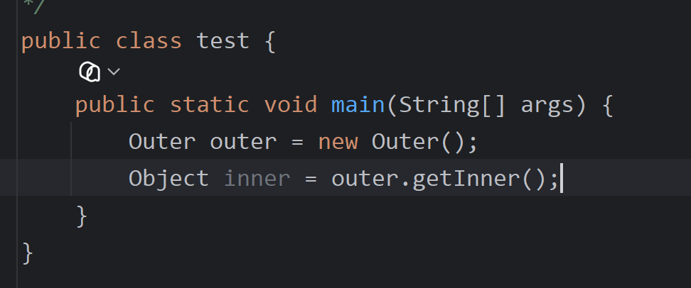
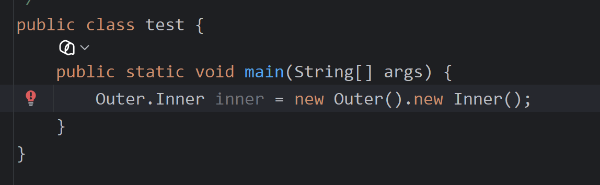

# 成员内部类

[[内部类总览|内部类]]的一种，写在成员位置，属于外部类的成员。

---

## 🎯 地位
成员内部类写在成员位置，属于外部类的**成员**，和成员（属性）是同等地位的。

---

## 📌 可使用的修饰符
成员内部类可以被一些修饰符所修饰：
- [[private关键字|private]]
- 默认（包访问权限）
- protected
- public
- [[static关键字|static]]（即[[静态内部类]]）

> 在成员内部类里面，JDK16之前是不能定义静态变量的，JDK16之后才能定义静态变量。

---

## 🔒 private修饰的成员内部类
如果成员内部类是用private修饰的，想获取这个内部类的对象，可以在外部类编写方法，对外提供内部类的对象。

> 值得注意的是，这里的 `Object inner = outer.getInner();` 其实是[[多态]]的写法，因为所有类默认继承[[Object类]]。




---

## 🔓 非private修饰的成员内部类
如果成员内部类不是private修饰的，可以直接创建：
```java
外部类名.内部类名 对象名 = 外部类对象.内部类对象
```



### 简化写法
如果只是new一个对象然后输出里面的属性，也可以省个变量：
```java
new Outer().name;
```


---

## 🔗 获取外部类成员变量
成员内部类如何获取外部类的成员变量？格式：`外部类名.this.成员变量`


---

## 🔗 关联知识点
- [[内部类总览]] - 内部类分类
- [[静态内部类]] - static修饰的成员内部类
- [[private关键字]] - 内部类隐藏
- [[static关键字]] - 静态内部类
- [[this关键字]] - 外部类名.this获取外部对象
- [[多态]] - Object接收内部类对象
- [[Object类]] - 所有类的父类
- [[面向对象基础]] - 成员概念
