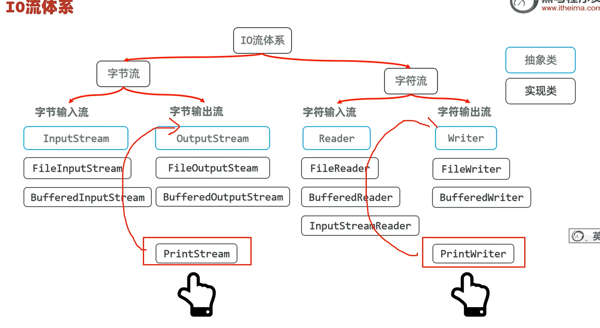
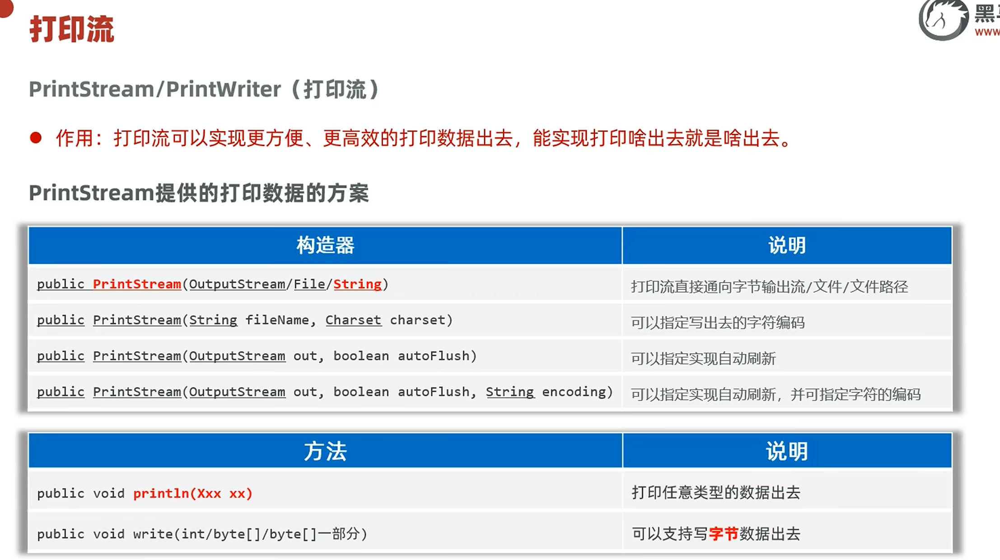
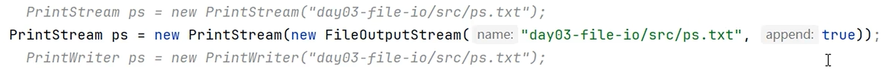

# 打印流

最大的作用就是打印啥出去就是啥出去。比方说原来可能出现打印 97 却出现 a 的情况，但打印流不会有这种情况。

---

## 📊 继承体系

---

## 📌 构造器与常用方法

---

## 📌 示范代码

---

## 📌 追加模式

上述的定义方式不可以追加。如果想要追加，可以包装一个低级管道，在低级管道里附带 `true` 参数。

---

## 🔗 关联知识点
- [[IO流]] - 打印流属于IO流体系
- [[字节流]] - 打印流包装字节流
- [[字符流]] - 打印流的字符版本
- [[异常]] - 资源释放