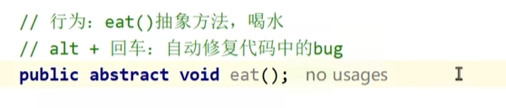

# 抽象类与抽象方法

abstract关键字修饰，用于抽象共同方法，[[接口]]的设计基础。

---

## 🎯 概念

### 抽象方法
将共性的行为（方法）抽取到父类之后。因为每一个子类的方法体是不一样的，所以在父类中不能确定具体的方法体，该方法就可以定义为抽象方法。

### 抽象类
如果一个类中存在抽象方法，那么该类就必须声明为抽象类。

---

## 📌 示例
比如说猫吃鱼，狗吃骨头，共同行为是"吃"，向上抽取到Animal类：
```java
public abstract void eat();
```
同时，Animal类要用abstract关键字修饰：
```java
public abstract class Animal{}
```

子类如果要继承抽象类，必须重写**所有抽象方法**。

> 选中红色波浪线，`alt + enter` 可以修复bug，比如给方法加上abstract关键字修饰。



---

## 🔒 核心特点

1. **抽象类不能实例化**
   > 如果可以创建抽象类的对象，用对象调用一个没有方法体的抽象方法，没有任何意义。

2. **抽象类中不一定有抽象方法**
   > 这是为了不让外界创建本类的对象。比如抽象父类有非常多抽象方法，而子类又用不到那么多，可以定义一个父中间类，继承并重写为空方法，自己修饰为抽象类，子类只需要重写需要的方法。

3. **有抽象方法的类一定是抽象类**

4. **抽象类中可以有[[构造方法]]**，目的是给成员变量赋值

5. **抽象类的子类**：要么重写抽象类中的所有抽象方法，要么子类也是抽象类

---

## 💡 抽象方法的意义
统一标准，方便协作，避免**屎山代码**的形成。

---

## 🔗 与接口的关系
- [[接口]]和抽象类功能类似，也是统一标准
- 接口是独立于[[继承]]体系以外的规则
- 不要滥用接口，如果能在父类做到抽象方法，就不要定义接口

---

## 🔗 关联知识点
- [[继承]] - 抽象类用于继承体系
- [[方法重写]] - 子类必须重写抽象方法
- [[接口]] - 更纯粹的抽象
- [[构造方法]] - 抽象类有构造方法
- [[final关键字]] - final和abstract互斥（不能同时用）
- [[多态]] - 抽象类引用指向子类对象
- [[Object类]] - 抽象类也继承Object
