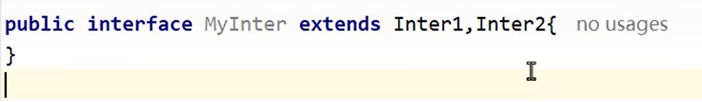
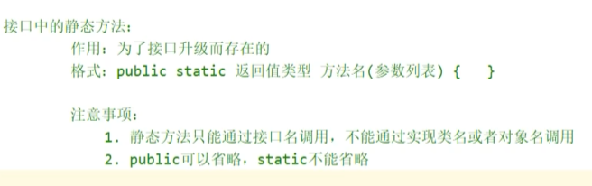

# 接口

interface关键字定义，是独立于[[继承]]体系以外的规则，与[[抽象类与抽象方法]]类似但更纯粹。

---

## 🎯 核心概念
接口就是一个**规则**，是独立于继承体系以外的规则，其功能和抽象方法类似，也是统一标准。

如果一个类 `implements` 了某个接口，那必须要重写里面的方法。

---

## 📌 定义与实现
接口用 `interface` 关键字来定义。

接口和类之间是**实现关系**，通过 `implements` 关键字表示：

---

## 🔒 核心特点

1. **接口不能被实例化**
2. 接口的子类（实现类）：要么重写接口中所有抽象方法，要么是抽象类
3. **一个类可以实现多个接口**，也可以在继承一个类的同时实现多个接口
   > 可以把接口理解为"干爹"，可以有无数个干爹；[[继承]]只能有一个亲爹
4. 继承的类要写在接口前面，否则会报错
5. 如果重写时出现重复的抽象方法，只要重写一次即可

---

## 📋 接口成员特点

| 成员类型 | 规则 | 默认修饰符 |
|---------|------|-----------|
| 成员变量 | 只能是常量，创建时必须赋值 | `public static final` |
| 构造方法 | 没有构造方法 | - |
| 成员方法 | JDK8前只能是抽象方法 | `public abstract` |

如果要实现多个接口，通过逗号隔开。

---

## 🔗 接口之间的继承
接口之间也可以继承（多继承）。如果实现类要实现子接口，需要重写所有父接口+子接口的全部抽象方法。

---

## 🆕 JDK8+ 新特性

### default 默认方法
用default修饰的默认方法，是接口契约的一部分。
> 通俗来说：我（接口）提供一个通用默认实现，你（实现类）能用就直接用，不能用就重写，保证你不改代码也能跑通。常用在版本迭代中。

### static 静态方法
静态方法的设计初衷：把和接口强绑定的工具逻辑收拢到接口内，淘汰独立工具类。
> 接口里的静态方法无法被实现类重写或继承。

### private 私有方法
接口中的私有方法是为了抽取default方法中的重复代码。用private修饰禁止外界调用，只服务于当前接口。

---

## 💡 设计原则
不要滥用接口，如果能在父类做到抽象方法，就不要定义接口去限制。

> 接口是为了给出父类不方便给出的限制——不同继承体系、毫无父子关系的类有相似行为时，用接口统一限制，不需要继承关系。

一般来说，顶层类如Person，要用abstract修饰（见[[抽象类与抽象方法]]），目的是不让外界创建其对象。

---

## 🔗 关联知识点
- [[抽象类与抽象方法]] - 对比接口
- [[继承]] - 类与接口的区别
- [[方法重写]] - 实现类必须重写抽象方法
- [[多态]] - 接口引用指向实现类对象
- [[匿名内部类]] - 快速实现接口
- [[Lambda表达式]] - 函数式接口的简洁实现
- [[构造方法]] - 接口没有构造
- [[static关键字]] - 接口静态方法
- [[private关键字]] - 接口私有方法
- [[final关键字]] - 接口变量是final常量
