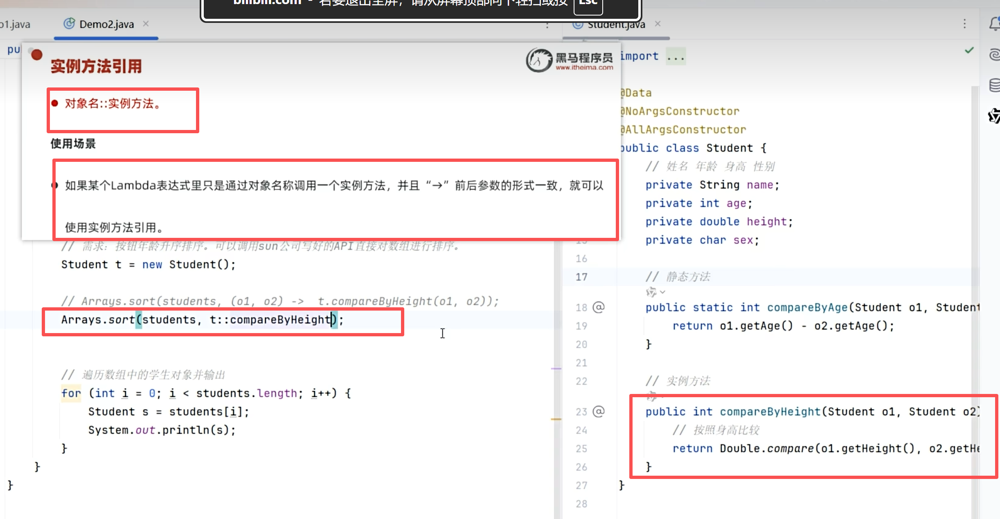

# 方法引用

[[Lambda表达式]]的进一步简化形式，用 `::` 操作符直接引用已有方法，让代码更精炼。

---

## 🎯 三种形式

### 1. 静态方法引用：`类名::静态方法`

把排序逻辑作为静态方法写进类本身，然后在Lambda表达式里调用这个方法，再用静态方法引用进一步简化。

### 2. 实例方法引用：`对象名::实例方法`

在 `Arrays.sort(students, t::compareByHeight)` 里：
- `students` — 要排序的目标
- `t::compareByHeight` — 排序规则

### 3. 特定类方法引用：`特定类::方法`

### 4. 构造器引用：`类名::new`

使用场景：如果某个Lambda表达式里只是在创建对象，并且前后参数情况一致，就可以使用构造器引用。

例如：`CarFactory` 是接口，有一个抽象方法。在main方法里，通过匿名内部类实现接口并创建对象，由接口类型 `cf` 接住（多态）。然后可通过Lambda表达式简写，最终通过构造器引用 `Car::new` 进一步简写。

> `Car::new` 相当于重写接口里的方法，形成对象，以多态的形式赋给接口类型的引用。

---

## 📌 配套方法

`Arrays.sort()` — 对数组进行排序，常配合方法引用使用。

---

## 🔗 关联知识点
- [[Lambda表达式]] - 方法引用是Lambda的进一步简化
- [[匿名内部类]] - Lambda与方法引用的原始替代目标
- [[接口]] - 函数式接口是所有简化的基础
- [[多态]] - 构造器引用中接口引用接收对象
- [[static关键字]] - 静态方法引用的基础
- [[内部类总览]] - 内部类是Lambda的前身
