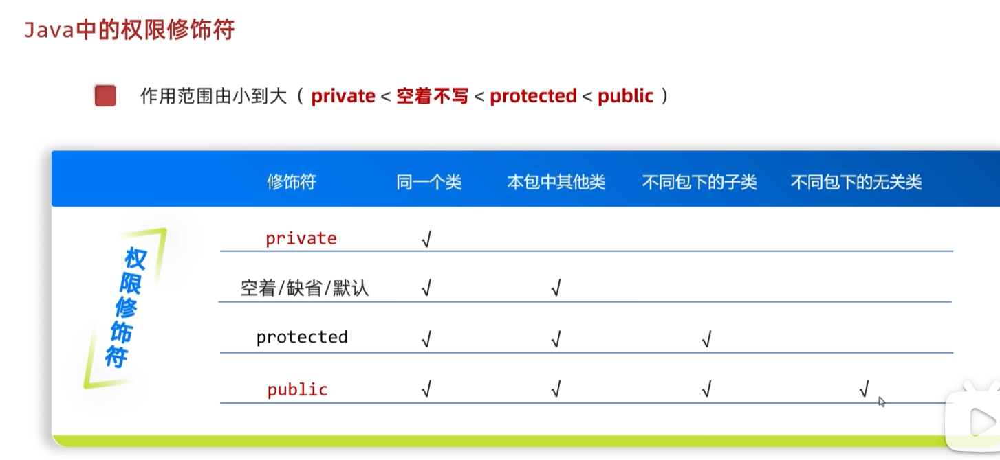

# 方法重写

Override，子类对父类方法的重新实现，是[[多态]]的基础。

---

## 🎯 适用场景
如果父类的方法，已经满足不了子类的需求，就需要在子类对父类的方法进行重写。

---

## 📌 重写规则
1. 使用注解 `@Override` 进行重写
2. 注解和注释有点类似，只不过注释是给人看的，**注解是给虚拟机看的**
3. ⚠️ 重写的方法，声明方式要和父类的方法的**完全一致**
4. 如果子类要调用父类的方法，可以用[[super关键字]]

---

## ⚡ 快捷键
使用 `alt + insert` 快捷键可快速重写方法。

---

## 🚫 不能重写的方法
[[private关键字|private]]私有方法、[[static关键字|static]]静态方法、[[final关键字|final]]最终方法不能被重写。

---

## 🔧 底层原理
- [[虚方法表]]：虚方法是可以被继承的，方法重写就是替换虚方法表里的地址值
- 需要区分[[#继承vs调用|继承和调用的区别]]：调用只是用一下，继承才是自己的

---

## 🔄 重写 vs 重载
| 特性 | 重写(Override) | 重载(Overload) |
|------|---------------|---------------|
| 发生位置 | 父子类之间 | 同一个类中 |
| 方法签名 | 完全一致 | 参数列表不同 |
| 关系 | 运行时多态 | 编译时多态 |

---

## 🔗 关联知识点
- [[继承]] - 重写发生在继承关系中
- [[多态]] - 运行看右边就是重写体现
- [[super关键字]] - 调用父类原方法
- [[虚方法表]] - 重写的底层实现
- [[final关键字]] - final方法不能重写
- [[static关键字]] - static方法不能重写
- [[private关键字]] - private方法不能重写
- [[抽象类与抽象方法]] - 必须重写抽象方法
- [[接口]] - 必须重写接口抽象方法
