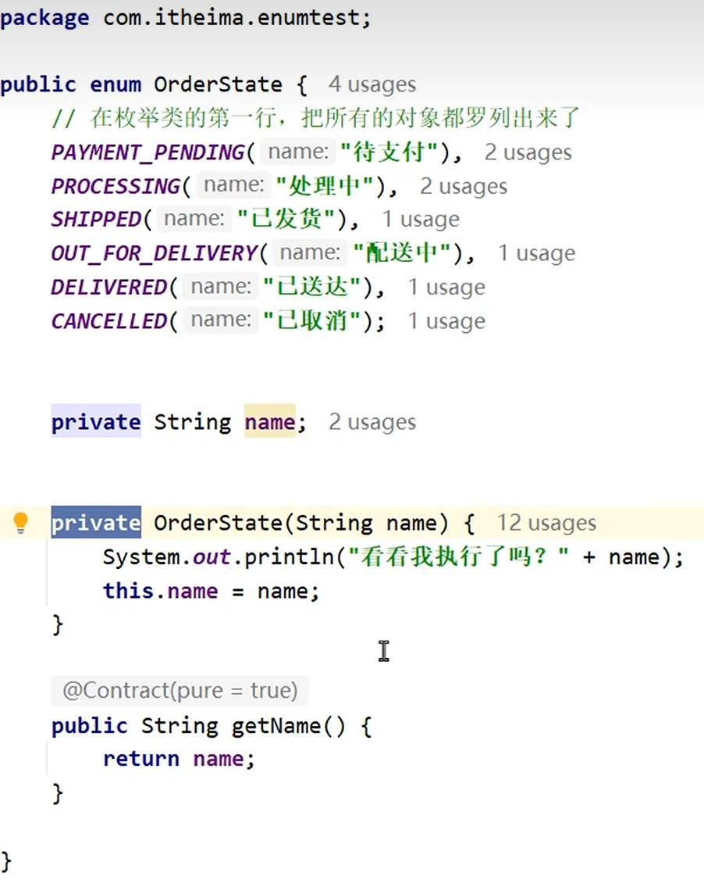

# 枚举类

特殊的[[数据类型|引用数据类型]]，用于限制类的对象个数。

---

## 🎯 目的
枚举类的目的是**限制类的对象个数**，一般在枚举类里提前创建所有需要用到的对象。

---

## 📌 语法规则
1. 枚举类不用 `class` 修饰，用 `enum` 修饰
2. 枚举类的第一行必须是**枚举项**，枚举项之间用逗号隔开，分号结尾
3. 枚举类的[[构造方法]]必须用 `private` 修饰，禁止外界再创建对象
4. 枚举项在底层上，其实是用 `public static final` 修饰的（见[[static关键字]]、[[final关键字]]），是最终常量
5. 每一个枚举项，其实都是该枚举类的对象
6. 编译器会默认给枚举类加 `values()` 和 `valueOf()` 方法：
   - `values()`：获取本类中的所有枚举项
   - `valueOf()`：获取一个指定的枚举项
7. 枚举类的构造方法其实可以不写private，编译器会默认加上

---

## 🔗 关联知识点
- [[数据类型]] - 引用数据类型之一
- [[private关键字]] - 构造方法私有化
- [[static关键字]] - 枚举项是static的
- [[final关键字]] - 枚举项是final常量
- [[构造方法]] - 私有构造
