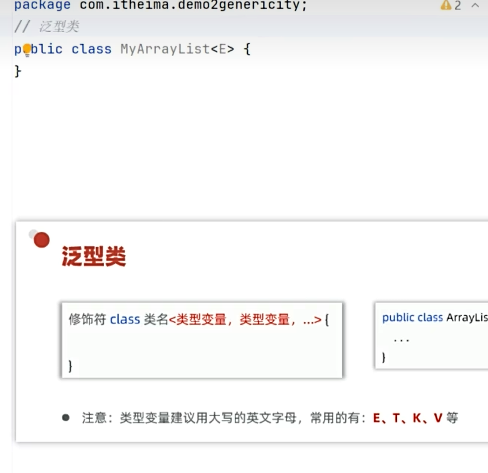
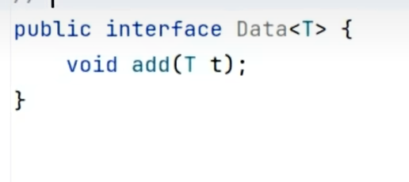
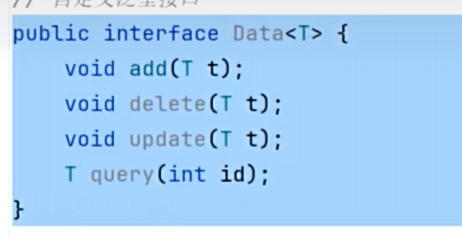
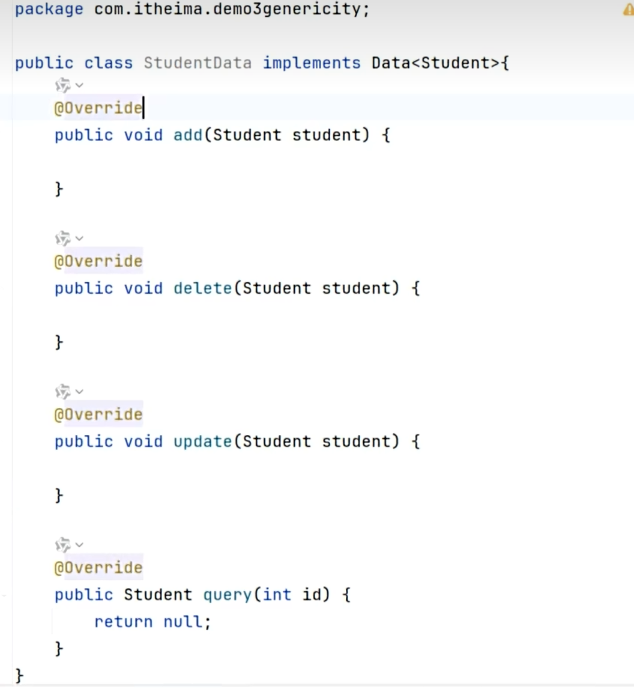
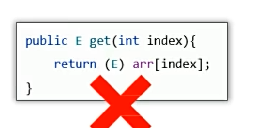
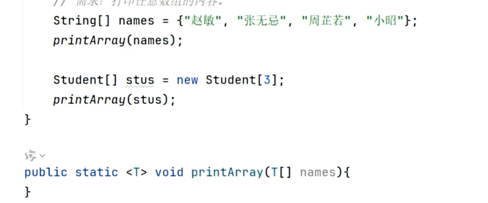
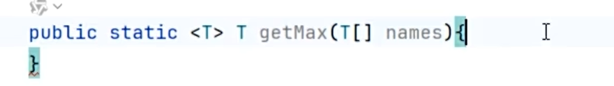

# 泛型

JDK5引入的特性，用于在编译期限定操作的数据类型，提供类型安全。

---

## 🎯 定义与作用

泛型最常见的作用就是约束所能操作的数据类型，在编译阶段就约束好（写代码的阶段）。

**泛型的本质**：把具体的数据类型作为参数传给类型变量。

比方说如果 `E` 接了个 `String`，那这个类里面的所有 `E` 都会变成 `String`，这样就实现了约束的作用。


好处：
1. 编译期检查类型安全
2. 避免强制类型转换
3. 代码更清晰，知道存什么类型

---

## 📌 集合中使用（最常见）

```java
ArrayList<String> list = new ArrayList<>();
// 此时list就只能存储String类型
```
> 小细节：JDK7+ 后面的泛型String可以省略，但尖括号要保留（菱形语法）。


### 不使用泛型的问题

```java
ArrayList arrayList = new ArrayList(); // 可以存任意类型
```
只能用[[Object类]]接收，存在[[多态#弊端|多态弊端]]，需要强转，容易出错。


### 尖括号限定的意义

如果不加限定，就什么都能存，可能不安全。


---

## 📌 ETKV 命名约定

泛型类的类型变量一般用大写英文字母，这是 Java 官方约定俗成的命名习惯。**只是约定别名，不是关键字，换别的字母也能跑。**

| 字母 | 全称 | 含义 |
|------|------|------|
| **E** | Element | 元素，多用于集合，代表集合里存放的元素类型，如 `List<E>` |
| **T** | Type | 类型，通用的任意类型，普通泛型类最常用，`Class<T>` |
| **K** | Key | 键，代表 Map 里的键，`Map<K,V>` |
| **V** | Value | 值，代表 Map 里的值，`Map<K,V>` |



---

## 📌 泛型类

泛型类里的泛型方法写法可以参照下图：


---

## 📌 泛型接口

比方说一个接口有一个抽象方法要增加数据，可能增加老师类型，也可能增加学生类型，此时用泛型就很方便，一个接口就可以了。

> 泛型是某种不确定的抽象数据类型，地位等价于 `void`、`int`、`String` 等。





### 实现泛型接口

在 `implements` 时就要指定类型，如 `Data<Student>`：



---

## 📌 泛型方法

### 真正的泛型方法

定义方式如图所示：


### 这不是泛型方法

只是用泛型类里的类型变量，不是泛型方法：



### 泛型方法的作用

提高方法的复用性，一个打印方法，可以打印字符串数组，也可以打印Student类型的数组，用泛型去接参：



### 返回值也是泛型

主要用于有返回值类型的方法：



---

## 🔍 通配符 `?`

需求：开发一个飞车游戏，有很多厂家的车，共同行为都是比赛，`go` 方法要接很多厂家的车，不能写死单一厂家。此时用通配符 `?` 表示，就可以接多种厂家的车了。

> 通配符是在**使用**泛型的时候用的，ETKV 是**定义**时使用。


### 泛型的上下限

通配符的缺陷：`go` 方法原本是给车用的，但 Dog 不是车，也可以用这个方法。此时需要泛型的上下限来限制：


---

## 🗑 泛型擦除

泛型工作在编译阶段，编译后泛型就没用了，所有泛型在编译后都会被擦除，所有类型会恢复成 Object 类型。

> 简单来说：里面的 `E` 都会变成 `Object`，而 Object 是对象类型，无法直接指向一个基本数据。

因此：**泛型不支持基本数据类型，只能支持对象类型（引用数据类型）**。


> 如果非得让泛型接基本数据类型，就要用 [[包装类]]。

---

## 🔗 关联知识点
- [[集合框架]] - 泛型最常用于集合
- [[ArrayList]] - 泛型在ArrayList中的使用
- [[包装类]] - 泛型不支持基本类型，需要包装类
- [[多态]] - 无泛型时用Object接收
- [[Object类]] - 所有类型的父类、泛型擦除后的类型
- [[类型转换]] - 无泛型时需要强转
- [[数据类型]] - 泛型限定引用类型