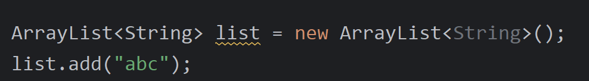

# 泛型

JDK5引入的特性，用于在编译期限定容器中元素的数据类型，提供类型安全。

---

## 🎯 作用
用泛型`<>`去限定集合中存储的数据类型，避免类型转换异常。

好处：
1. 编译期检查类型安全
2. 避免强制类型转换
3. 代码更清晰，知道集合存什么类型

---

## 📌 使用场景

### 集合中使用（最常见）
```java
ArrayList<String> list = new ArrayList<>();
// 此时list就只能存储String类型
```
> 小细节：JDK7+ 后面的泛型String可以省略，但尖括号要保留（菱形语法）。



### 不使用泛型的问题
```java
ArrayList arrayList = new ArrayList(); // 可以存任意类型
```
只能用[[Object类]]接收，存在[[多态#弊端|多态弊端]]，需要强转，容易出错。


---

## 📌 其他使用场景
- 泛型类
- 泛型方法
- 泛型接口

---

## 🔗 关联知识点
- [[集合框架]] - 泛型最常用于集合
- [[ArrayList]] - 泛型在ArrayList中的使用
- [[多态]] - 无泛型时用Object接收
- [[Object类]] - 所有类型的父类
- [[类型转换]] - 无泛型时需要强转
- [[数据类型]] - 泛型限定引用类型
