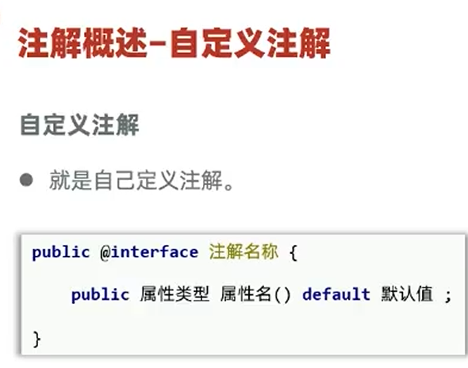
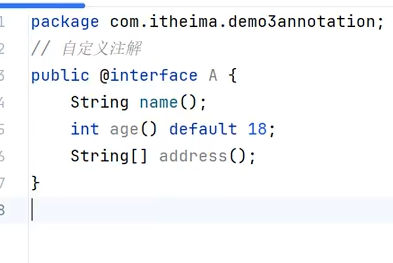
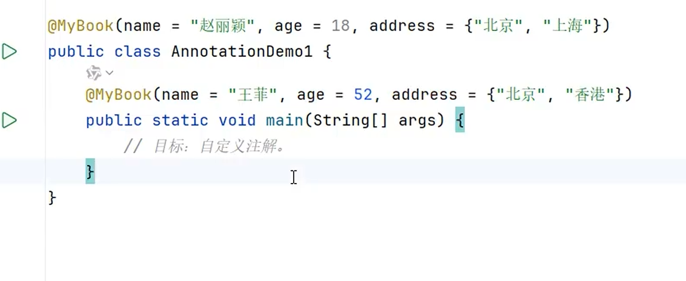
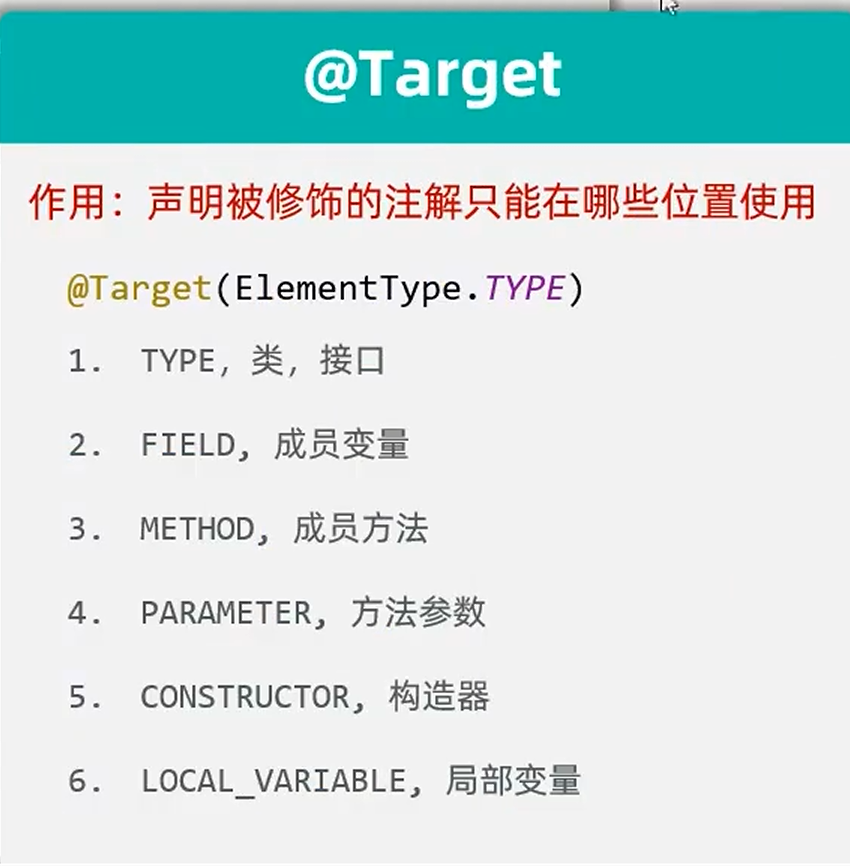
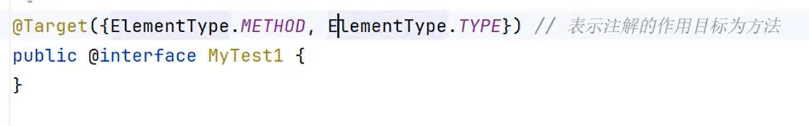
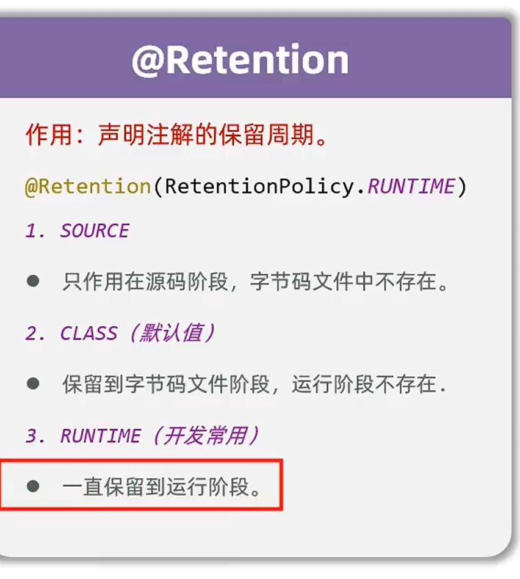
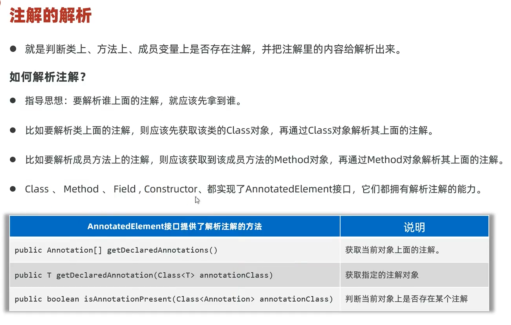
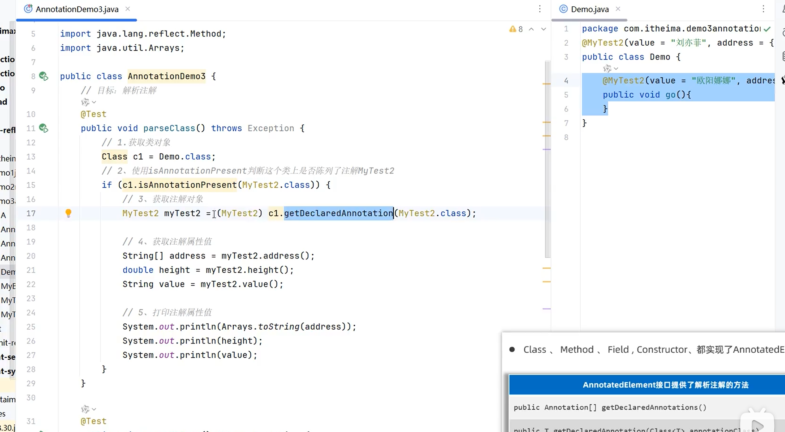
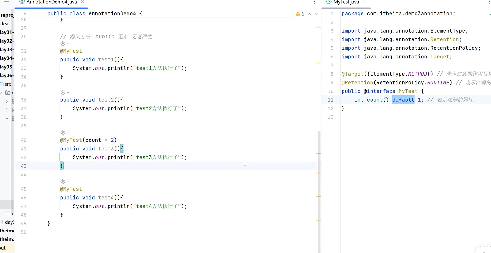

# 注解

## 什么是注解

注解的定义：注解类似一种**标记/说明**，用来写在类、方法、成员变量等上面，告诉程序或工具一些**额外信息**。

---

## 自定义注解

自定义注解的格式（关键字 `@interface`）：

示例代码——`public` 可以省略，注解里面的属性默认是**方法**（所以要加括号）：

使用注解时直接"注上"即可：

---

## 特殊属性名 value

自定义注解中有一个特殊属性名 **`value`**：如果注解里只有 `value` 这一个属性，或者其它属性都有默认值时，使用该注解就**不用写 value 名称**。

示例代码：

---

## 注解的原理

注解本质上是一个**接口**（继承了 `Annotation` 接口），使用注解本质上是**整了一个实现类对象**。

---

## 元注解

元注解可以理解为"**套娃**"——用来注解其它注解的注解，和"元认知"有点类似。

### @Target（作用位置）

经典元注解 `@Target` 用于限定被修饰的注解能用在哪里：

- `.TYPE` —— 只能在类、接口位置使用
- `.FIELD` —— 只能在成员变量处使用

若想让注解既能注解方法，又能注解类和接口（不注解其它位置），可这样写（`@Target` 是数组，写多个元素用 `{}` 括起来）：

### @Retention（保留周期）

元注解 `@Retention` 用于控制注解的保留周期：

- 这个机制可借助**泛型**理解：泛型只存在于编译时，运行时是不存在的。
- 若自定义注解时不加 `@Retention`，默认保留周期为 `RetentionPolicy.CLASS`。

---

## 🔍 注解的解析

所谓"解析"，就是**判断类或方法上是否写了注解**，如果有，就把注解里的内容解析出来。

- 解析**类上的注解**：获取 Class 对象，再调用 Class 对象的相应方法。
- 解析**方法上的注解**：获取方法对象，再调用方法对象的相应方法。
- 获取 Class 对象、方法对象，都属于**反射**的内容。

示例代码——获取到的注解本身就是一个对象，称为**注解对象**：

---

## 🎯 注解最重要的作用：特殊标记

注解最重要的作用是对程序做**特殊标记**，方便别人做针对性处理。通过一个**模拟 Junit 框架**的例子可以深入理解：

使用注解模拟一个简易版 Junit 框架的示例代码：

---

## 💡 注解成员的属性到底有什么用

注解里的成员属性，主要用来**控制行为**。一个例子：通过属性 `count` 控制方法**执行次数**——在注解解析时获取 `count`，再用它控制方法调用次数即可。

---

## 🔗 关联知识点
- [[反射]] - 注解的底层实现依赖反射读取注解信息
- [[泛型]] - @Retention 的保留周期可类比泛型的编译期/运行期
- [[SpringBoot]] - SpringBoot 大量使用注解标记类与组件
- [[接口]] - 注解本质是一个接口