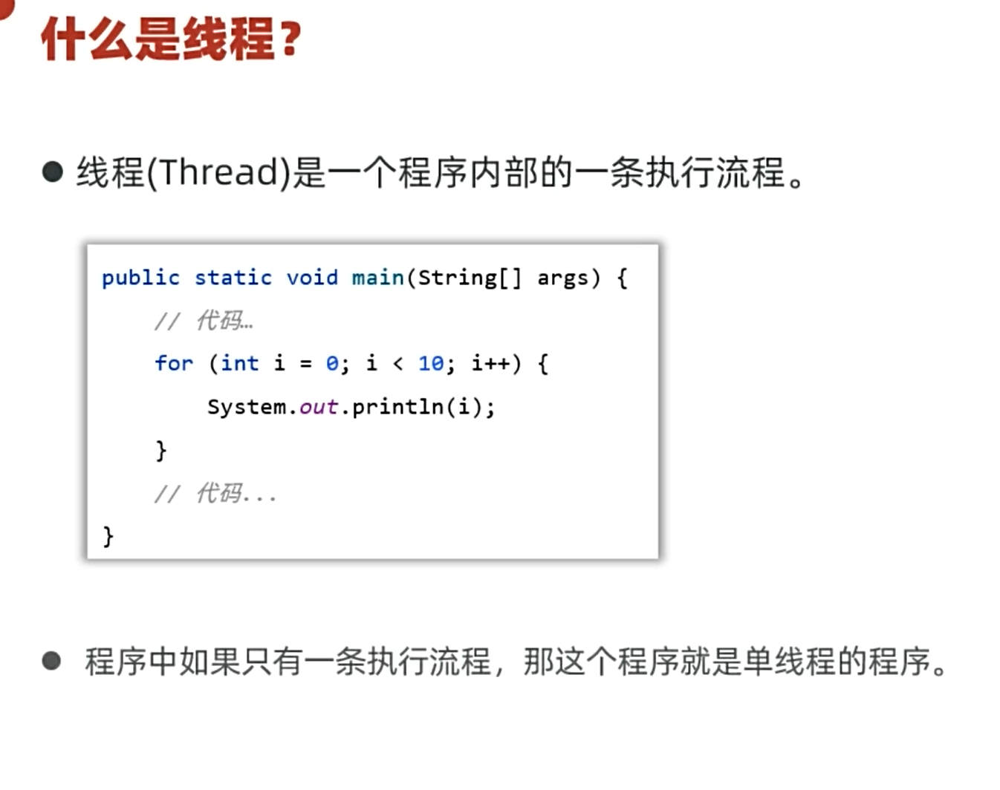
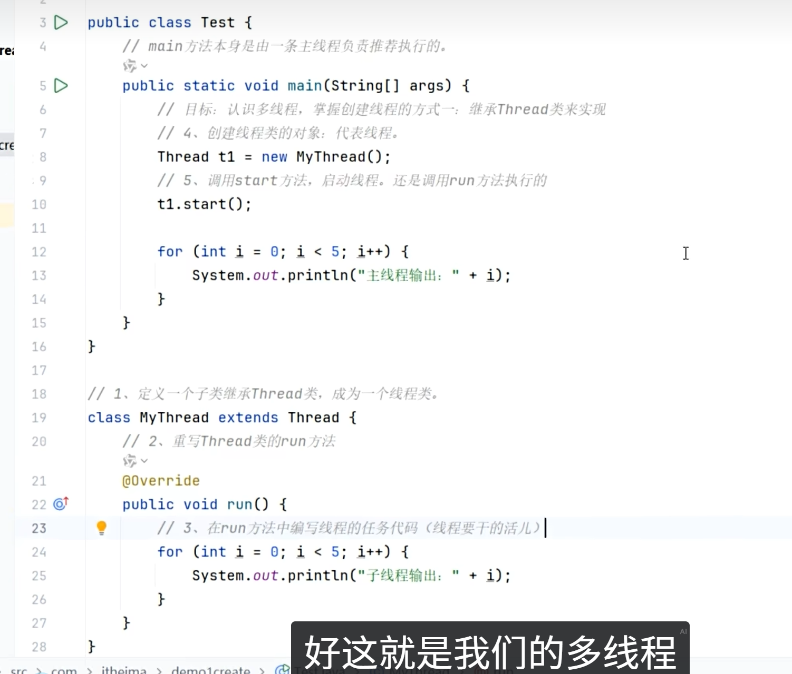
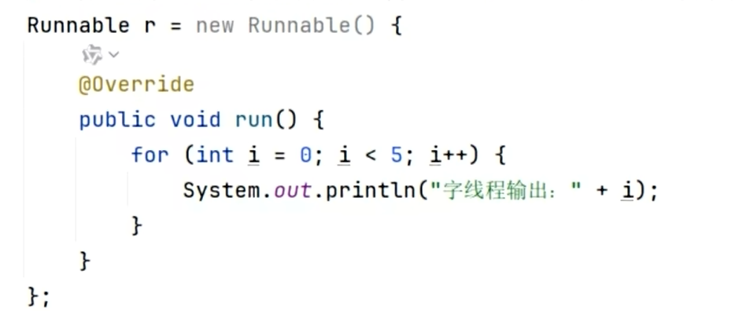
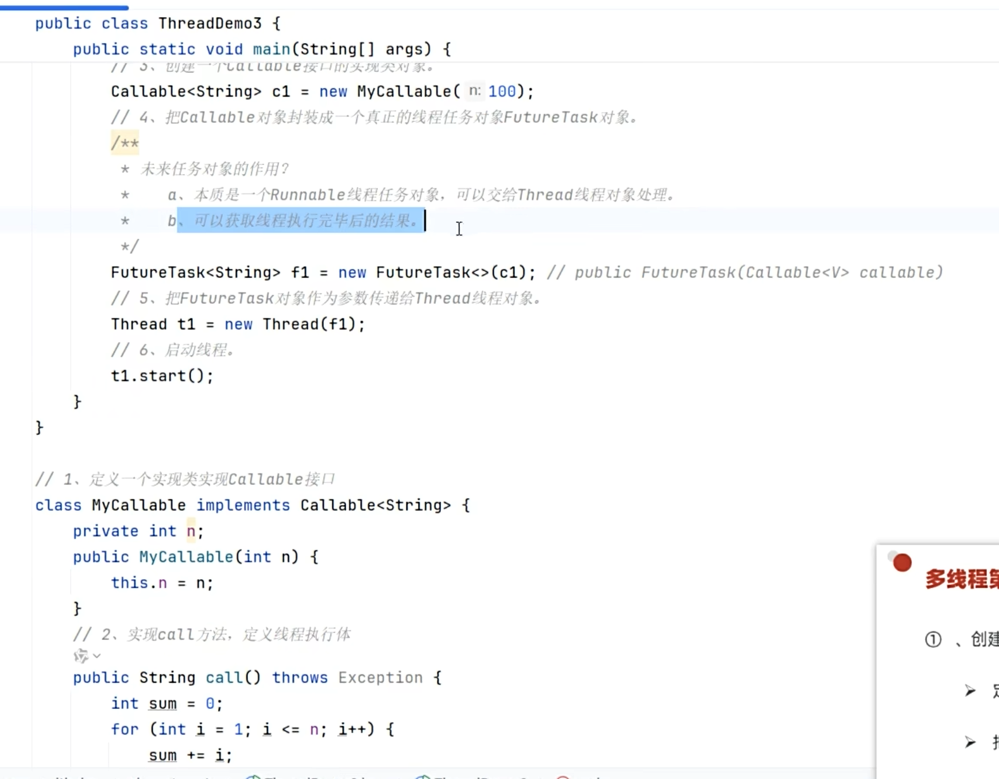
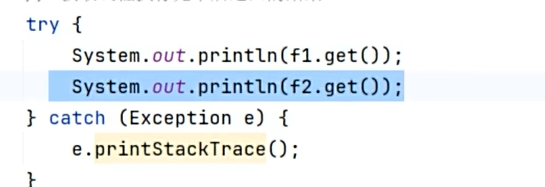
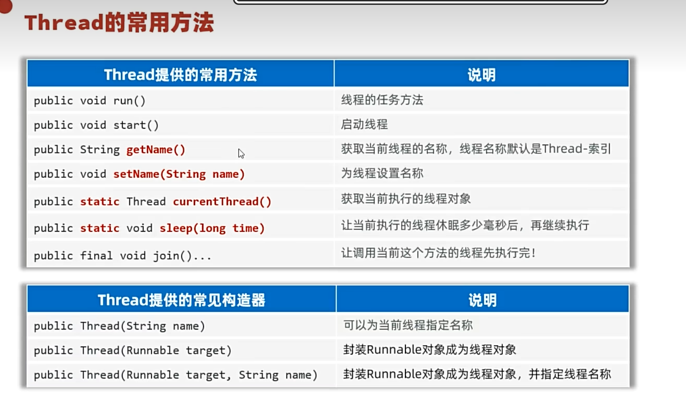

# 线程

线程指的是一个程序内部的一条执行流程。如果程序中只有一条执行流程，那这个程序就是单线程程序，如前面学的 main。

---

## 🎯 单线程程序

只有一个执行流程的程序，示例代码和运行结果如图所示。

---

## 🎯 多线程的定义与作用

多线程指的是一个程序内部有多条执行流程，其定义和作用如图所示。

---

## 📌 创建方式一：继承 Thread 类

1. 定义子类继承 `Thread`，使其成为一个线程类
2. 重写 `run` 方法，里面写子线程要执行的任务
3. 主线程里创建线程类的对象以代表线程（万物皆对象），调用 `start` 方法即可开始执行子线程 `run` 里的内容

- **优点**：编码简单
- **缺点**：线程类已继承 Thread，无法再继承其他类，不利于功能扩展

> ⚠️ 必须用 `start()` 启动线程。直接让对象调用 `run()` 相当于普通的单线程，只有 `start()` 能启动新线程并执行。另外，主线程的任务尽量不要放在启动子线程之前，因为主线程按顺序执行，执行到 `t1.start()` 才会启动新线程，否则本质上又变成单线程。

---

## 📌 创建方式二：实现 Runnable 接口

1. 定义线程任务类实现 `Runnable` 接口，重写 `run` 方法，里面放线程任务
2. 主线程创建线程任务类对象，交给 `Thread` 类处理，由 Thread 对象启动线程

- **优点**：能继承其他类、实现其他接口，扩展性更强
- **缺点**：要额外创建一个对象，更消耗内存

### 匿名内部类实现

因为是接口，还可以用匿名内部类去实现，不需要单独定义一个类。这是简化的写法，并不是新技术。

### 匿名内部类直接作为参数

更简化的写法：匿名内部类直接作为参数给 Thread，然后使用 `start` 方法。

### 进一步简化

上面的写法还可以简化为如图所示。

---

## 📌 创建方式三：实现 Callable 接口

前两种创建方式的线程都不允许返回结果，也就是说 `run` 必须是 void 类型。想让线程跑完之后返回数据，就需要第三种线程创建方式：实现 `Callable` 接口。实现思路如图所示。

> ⚠️ 分清线程类对象与线程任务类对象：
> - **线程类对象**（Thread 对象）相当于"工人"，可以直接 `start` 创建线程
> - **线程任务类对象**（Runnable 对象）相当于"任务清单"，只提供要做什么，不能直接 `start` 创建线程
>
> 上图的 `Callable` 不是 Runnable 的子接口，所以不能直接传给 Thread 去 `start` 创建线程。

> 💡 题外话：方法可以接参数，类想接参数，可以提供构造器的方式，或者是泛型的方式。

### 示意代码

第三种用 Callable 的线程创建方式示意代码如图所示（这里还没教怎么拿结果）。

### 取结果

取结果的示例代码如图所示。最好分开 try-catch，因为如果 try 里的第一条异常了，第二条就不执行。不用担心线程还没执行完：如果线程真的没执行完，CPU 会将其挂起让出资源，等线程执行完了再回来执行取结果的代码。

---

## 🛠 Thread 常用方法

Thread 的常用方法如图所示。

---

## 🔗 关联知识点
- [[异常]] - 线程与异常处理的关系
- [[匿名内部类]] - 匿名内部类简化线程创建
- [[接口]] - Runnable / Callable 都是接口
- [[main方法]] - 主线程的执行入口
