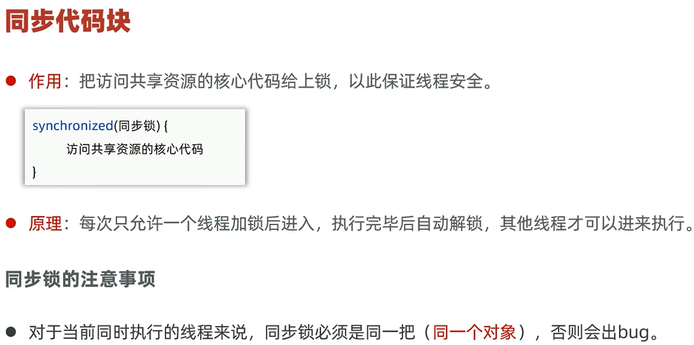
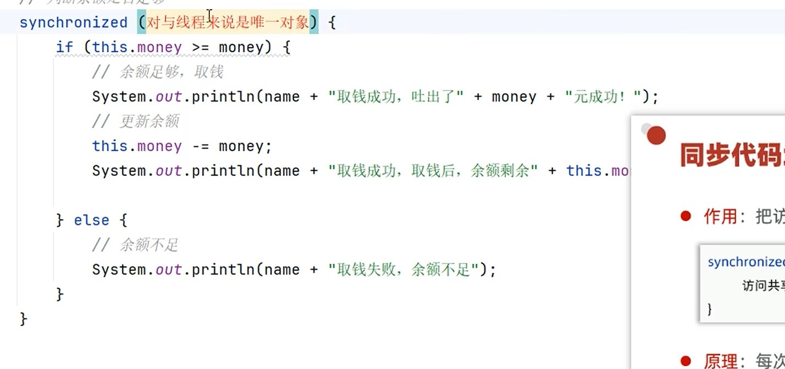
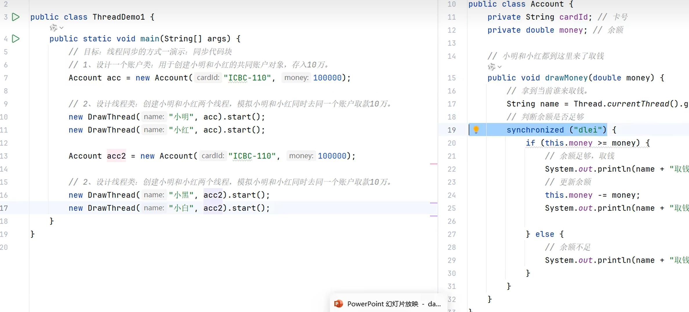
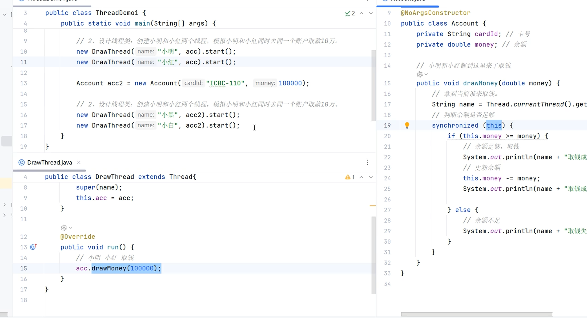

# 线程同步

线程安全问题，指的是多个线程在同时操作同一个共享资源时，可能会出现业务安全问题。最经典的就是同账户银行取钱问题。

---

## 🎯 线程安全问题

同账户银行取钱问题的示例代码和运行结果如图所示。

### 出现条件

线程安全问题的出现条件如图所示。

---

## 🎯 线程同步

线程同步就是解决线程安全问题的一个方案，核心思想是访问共享资源的时候要排队（依旧是多线程，其余的就同时跑）。

经典的线程同步方案就是**加锁**：每次只允许一个线程加锁，加锁后才能进入访问，访问完毕后自动解锁，然后其他线程才能再加锁进来。

---

## 📌 方式一：同步代码块

其思想就是上锁，给核心代码上锁，具体思路如图所示。

### 示范代码

先选中要上锁的代码，使用 `ctrl + alt + t`，选择 `synchronized`。注意，括号里是用一个对象去表示锁，这个表示锁的对象对于线程来说必须是唯一的，比如说直接放一个字符串对象进去。

> ⚠️ 上面这种锁法其实不合理：锁的范围太大，如果别的账户进来取钱，也会被阻挡（acc2 账户进去取钱也会被限制）。

### 建议使用共享资源作为锁对象

用 `this` 来当锁就很合适：`this` 指向当前对象，也就是当前账户。不管有多少个线程同时使用这个账户的取钱方法，这个账户（也就是对象）都是唯一的，也就是一把锁，刚好可以锁住。而其他账户调用其他账户的取钱方法，和这个都不冲突，自然不影响其他账户取钱。

总结：
- **实例方法**：建议使用 `this` 作为锁对象
- **静态方法**：建议用字节码（`类名.class`）对象作为锁对象，用一个 .class 文件就能锁住所有调用该代码的线程

---

## 🔗 关联知识点
- [[线程]] - 线程安全问题的前提是多线程操作共享资源
- [[this关键字]] - 实例方法用 this 作为锁对象
- [[static关键字]] - 静态方法用字节码对象作为锁
