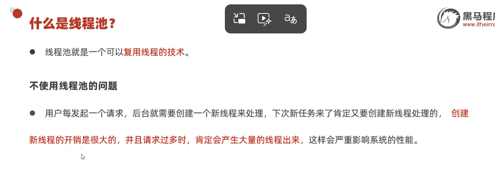
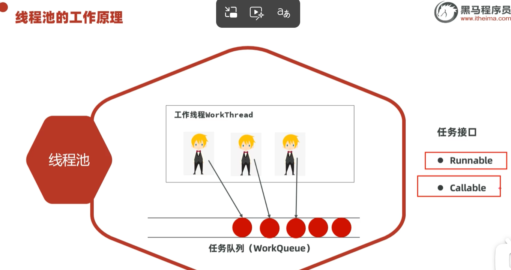
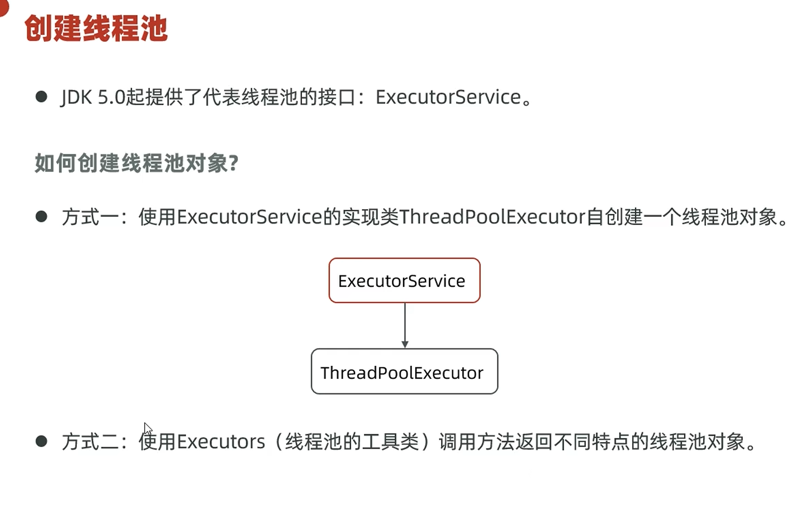
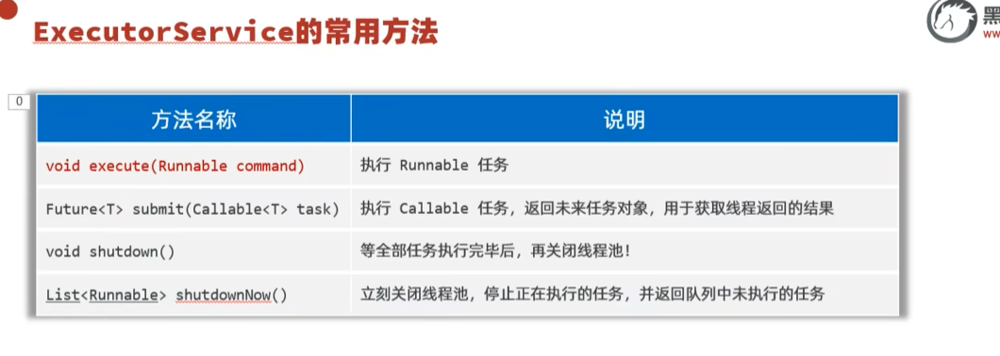
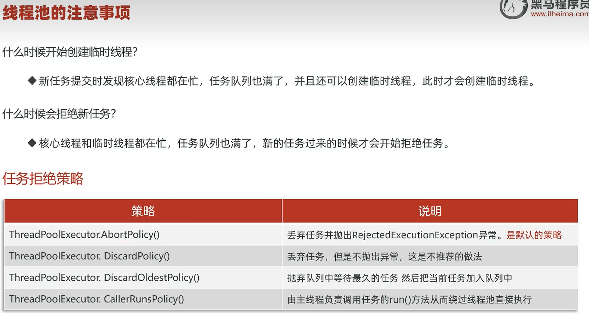
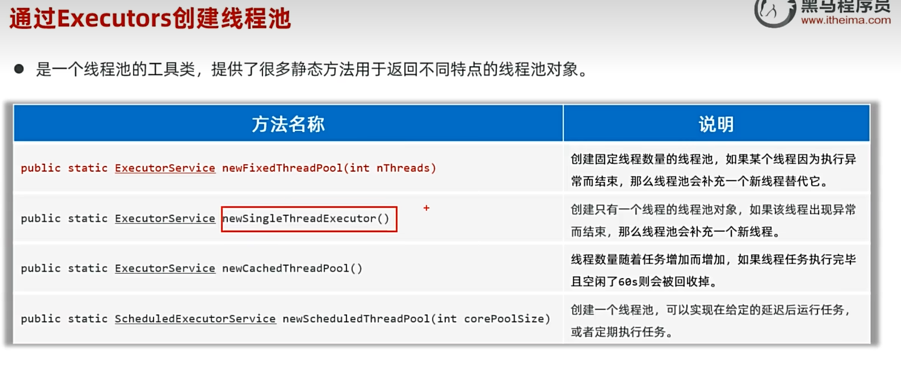

# 线程池

一个可以复用的线程技术，简单来说就是线程重复利用。

---

## 🎯 为什么需要线程池

一个并发网站，如果有一亿个并发请求，而线程无法重复利用，那就是一亿个线程、一亿个对象，非常容易崩。这个时候，线程重复利用就很重要。

---

## 🔧 工作原理

把任务放到**任务队列**里排队，然后等线程空出来就处理对应的任务。

> ⚠️ 任务队列只能装 Runnable 和 Callable 任务。
>
> 💡 结合线程创建的内容补充一个认知：**Thread 才是线程**，Runnable 和 Callable 这些都是任务，是交给线程的任务。

---

## 📌 创建线程池的两种方式

---

## 📌 ThreadPoolExecutor 创建线程池

### 构造器与参数说明

这里举的是 KTV 的例子，员工就是线程。正式员工加上临时工就是最大员工数量。参数4是参数3的单位。

### 示例代码

---

## 🔧 ExecutorService 常用方法

### execute 用法

---

## ⚠️ 注意事项

---

## 🚨 非核心临时线程（救急线程）

当任务队列满了，核心线程都在忙，此时有新任务进来，会创建**非核心临时线程（救急线程），直接执行这个新来的任务**，不是拿队列里的旧任务。

---

## 📊 Runnable vs Callable

| 特性 | Runnable | Callable\<V\> |
|------|----------|---------------|
| 方法 | `void run()` | `V call() throws Exception` |
| 返回值 | **无返回值 void** | **有返回值 V** |
| 异常 | run 不能抛出受检异常，只能内部 try-catch | call **允许抛出 Exception 受检异常** |
| 包 | `java.lang.Runnable` | `java.util.concurrent.Callable` |

> 题外话：Runnable 任务可以直接交给 Thread 线程执行，而 Callable 任务需要通过 `FutureTask` 包装一下才能交给 Thread 线程执行，FutureTask 是 Runnable 的实现类。

---

## 📌 submit 执行 Callable 任务

线程池如果要执行 Callable 任务，需要用 `submit(Callable)`，其底层也是帮我们 new 了 `FutureTask`。

示例代码：这里用 f1 去接，是多态的写法，submit 底层其实帮我们 new 了 FutureTask。

---

## 📌 Executors 创建线程池

还可以通过 `Executors` 去创建线程池，其常用方法如图所示。

通过 Executors 创建线程池并执行 Callable 任务的示例代码。其实这个静态方法的底层还是用前面的 ThreadPoolExecutor 七参数去创建线程池。

---

## 🔗 关联知识点
- [[线程]] - 线程池复用线程技术，Thread/Runnable/Callable是交给线程池的任务
- [[线程同步]] - 线程池与多线程安全
- [[多态]] - submit返回FutureTask多态接收
- [[泛型]] - 线程池任务类型