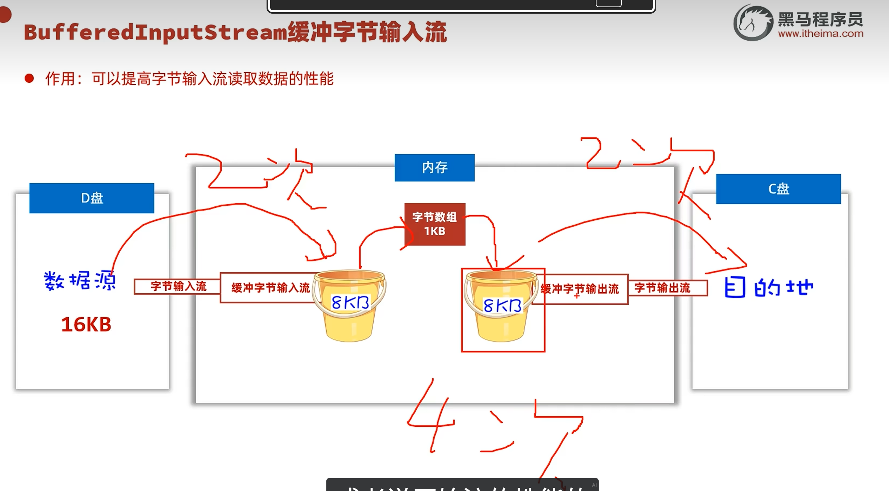
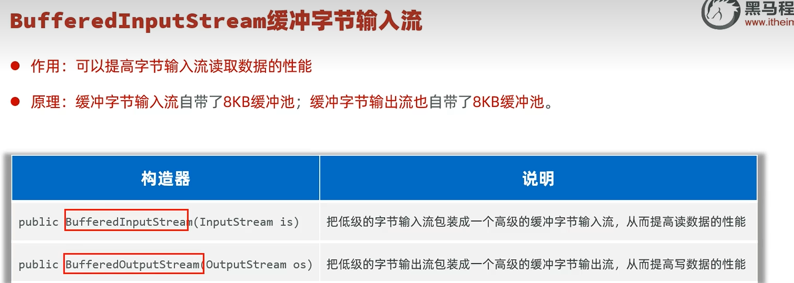

# 缓冲流

类似于缓存，可以加快原始流处理数据的速度，是[[IO流]]体系中的高级流。

---

## 📊 缓冲流体系

---

## 🎯 原理

缓冲流类似于缓存，可以加快原始流处理数据的速度。

---

## 📌 用法：包装原始流

缓冲流的用法是包装原始流，其构造方法如图所示：

包装原始流的示意代码：

---

## 📌 缓冲字符输入流

构造器和独特方法：这个独特方法可以按行读取字符。

## 📌 缓冲字符输出流

构造器和独特方法：这个独特方法可以换行。

换行的用法：

---

## ⚠️ 注意

缓冲流不一定全情况都快。如果原始流的数组开得大一点，也能达到缓冲流的效果。但不是开得越大越好，到后面提升幅度会减小，而且有爆满的风险。

---

## 🔗 关联知识点
- [[IO流]] - 缓冲流属于IO流体系
- [[字节流]] - 缓冲字节流包装字节流
- [[字符流]] - 缓冲字符流包装字符流
- [[转换流]] - 解决编码不一致问题