# 网络编程

计算机之间通过网络进行通信的编程技术。在 `java.net.*` 这个包里提供了很多网络编程的类及其方法。

---

## 🎯 概念

网络编程的概念如图所示。

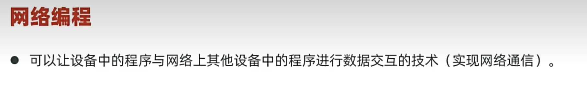

---

## 📊 基本通信架构

基本的通信架构如图所示。

### CS 架构

Client-Server（客户端-服务器）架构。

### BS 架构

Browser-Server（浏览器-服务器）架构。

> 无论 CS 架构还是 BS 架构，都依赖网络编程技术（也就是上面的这些通信箭头是如何实现的），在 `java.net.*` 包里提供了很多网络编程的类及其方法。

---

## 📡 网络通信三要素

**IP地址 + 端口号 + 通信协议** 是网络通信的三要素。

网络通信三要素如图所示。

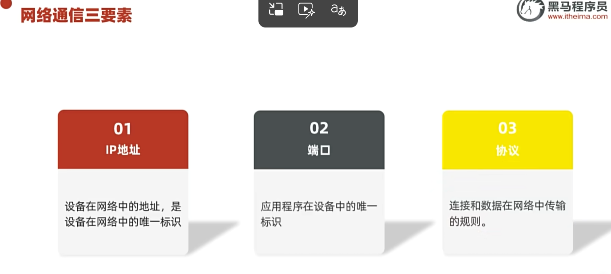

比方说要给对方发一条短信：先确定 IP 地址，然后确定程序的端口号，然后也需要传输协议，制定一些传输规则。

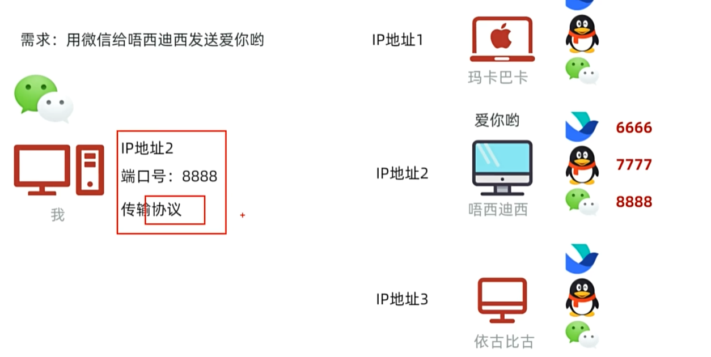

---

## 🌐 IP 地址

### IPv4

IP 地址的详细内容如图所示，IPv4 是 4 字节、32 位，一个字节是八位。值得注意的是，IPv4 地址是不够用的，才 42 亿个，全球不止 42 亿个设备。

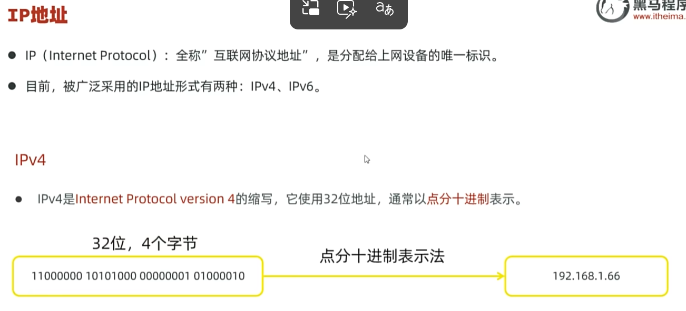

### IPv6

IPv6 的详细内容如图所示，IPv6 是 16 个字节、128 位。

### IP 域名与 DNS

IP 域名的相关内容如图所示。通过 DNS 域名解析，可以把 IP 域名解析成真实的 IP 地址。IP 域名的最大特点就是易于人类记忆。

DNS 域名解析的方式如图所示，是通过访问 DNS 服务器来获取真实域名的。如果 DNS 服务器里没有对应的 IP 映射，DNS 服务器会去到运营商那里找（比如电信或者联通）。

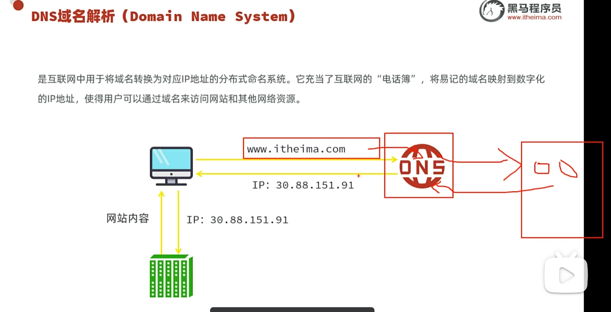

### 公网 IP 与内网 IP

公网 IP 和内网 IP 的相关知识如图所示。不同的局域网的内网 IP 可能相同，所以引入内网 IP 还可以节省 IP，让公网获得更多 IP。

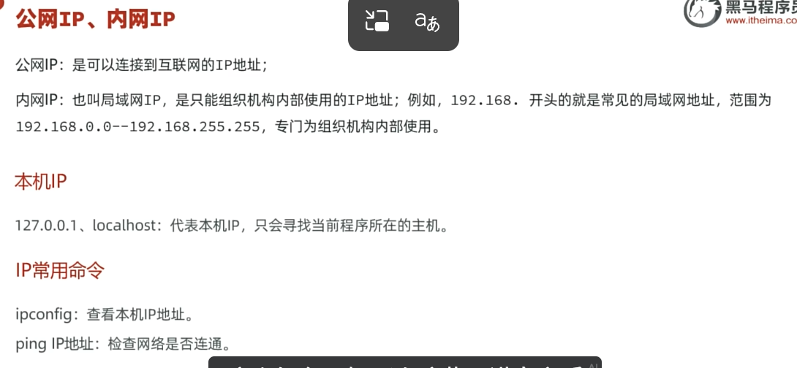

### InetAddress 类

Java 里也是用对象去表示 IP 的，使用 `InetAddress` 类就可以代表 IP 地址。其常用方法如图所示。

获取 IP 的示例代码如下二图所示，万物皆对象。

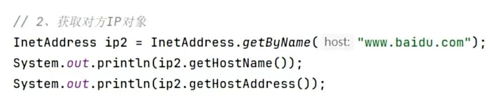

---

## 🔌 端口号

端口是正在运行的应用程序的唯一标识，分为**周知端口、注册端口、动态端口**。端口的相关知识如图所示。

---

## 📜 通信协议

通信协议，指定的是一套规则，默认大家都要去遵守。如图所示。

网络互联的参考模型如图所示，传输层常见的是 **UDP** 和 **TCP**。

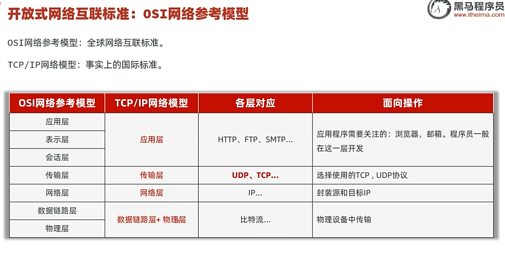

### UDP 协议

UDP 协议是无连接、不可靠的，只管扔，不管到不到。UDP 适用于需要通信效率高、不用管可靠性的场景，比如说**直播**。

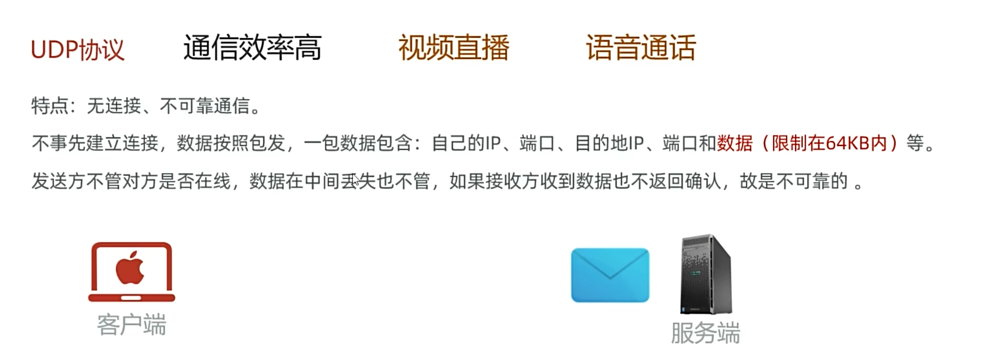

### TCP 协议

TCP 协议的相关知识如图所示。

**三次握手**才能确立可靠连接。如图所示，客户端先向服务端发出连接请求，然后服务端返回一个响应；此时从客户端的视角看过去，就知道服务端可以接受请求并且可以返回响应，但从服务端的视角看过去，只能确定客户端能发送请求，还不确定客户端是否收到了自己的信息，所以这个时候就需要客户端再次发出确认信息给服务端。服务端收到信息之后，就知道客户端既能发也能收，彼此都放心。

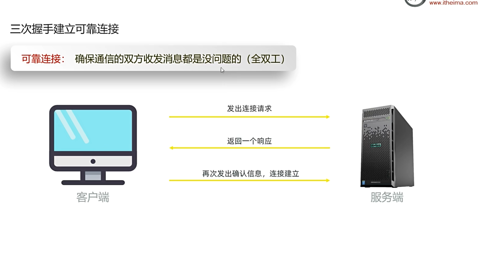

**四次挥手**断开连接。如图所示，客户端先说自己不发了，服务端先确认收到；此时服务端可能还有没发完的数据，要等全部发完，服务端才会说自己也不发了；最后客户端回复确认后，还要等一小段时间再彻底关闭，防止最后一条确认丢了导致服务端关不掉，同时也避免旧连接的残留数据干扰新连接。

TCP 协议适用于通信效率相对不高、需要高可靠的场景，比如说**支付**。

---

## 💻 UDP 通信编程（DatagramSocket）

在编码上怎么用 UDP 通信呢？Java 提供了一个 `java.net.DatagramSocket` 类，只要使用这个类，默认就是 UDP 通信。

UDP 通信的常用代码如图所示。

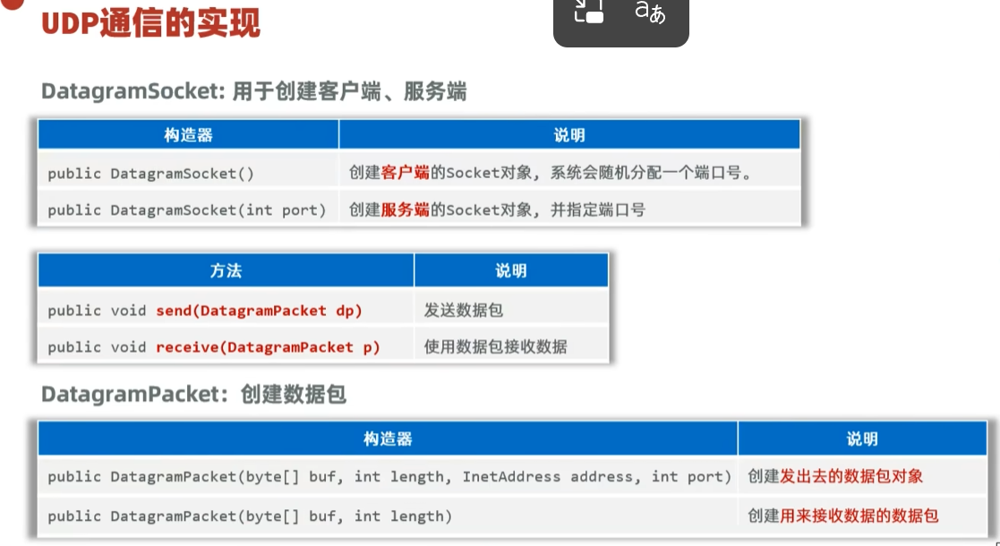

在正式学习编码之前，先认识一个**抛韭菜**的模型如图所示：只抛韭菜，韭菜是数据，盘子是不会抛的。

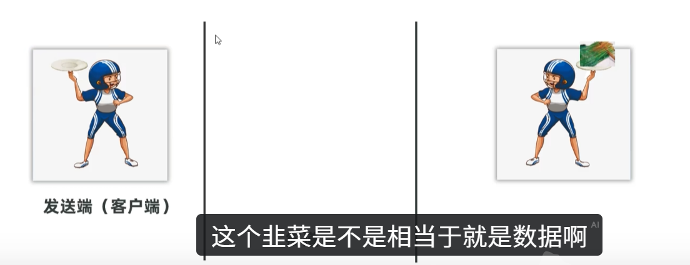

通过 `DatagramSocket` 实现 UDP 协议**发送数据**的代码如图所示，图中的 `socket` 相当于是发消息的人，`bytes` 是数据（韭菜），`packet` 是盘子，用于封装数据（韭菜），然后 `socket.send(packet)` 让 socket 这个人把 packet 盘子里的韭菜扔出去。

通过 `DatagramSocket` 实现 UDP 协议**接收数据**的代码如图所示。

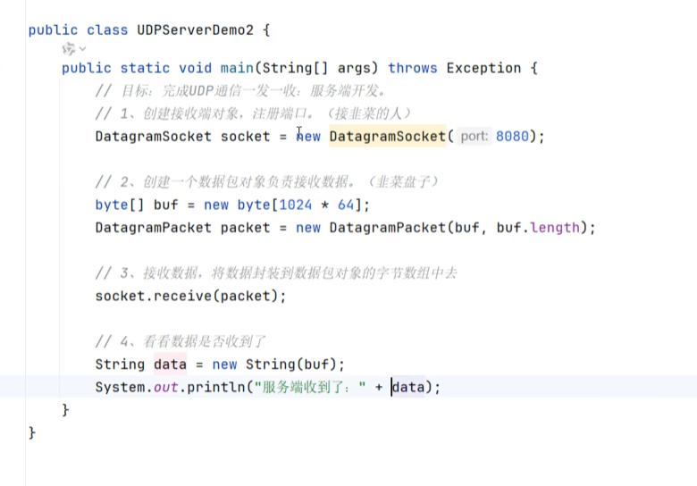

这个"盘子"，也就是**数据包 `DatagramPacket`**，也有一些特有方法，便于实现我们的目的，可以获取当前收到的数据长度、对方 IP 对象和程序端口，其用法如图所示。

> 上面这是 UDP 一发一收的写法。需要注意的是，用完管道之后要用 `.close()` 关闭，比如在上面的代码后面加上 `socket.close()`。

### 端口分配要点

- **发送端**不用指定端口，由系统自己分配就行了，因为它是负责发的，端口没什么用；
- **接收端**就要指定端口（比如上面指定了 8080 端口），这是为了发送端能指定端口、指定发给谁。

### UDP 多发多收

UDP 多发多收的核心思想是**用死循环包住核心代码**。

发送端实现多发的示例代码如图所示。

接收端实现多收的示例代码如图所示。

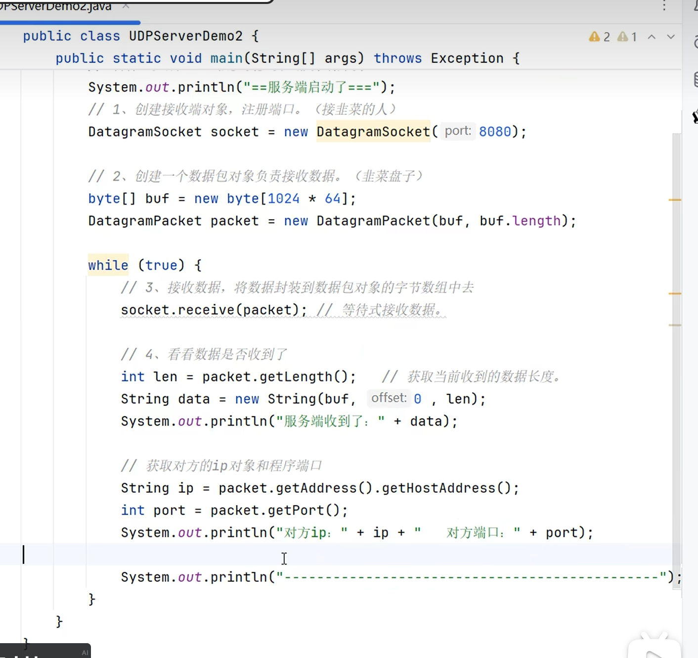

---

## 🔗 关联知识点
- [[进程与线程]] - 网络编程常配合多线程
- [[线程]] - 服务器处理多客户端需要多线程
- [[IO流]] - 网络通信本质是数据流的传输
- [[异常]] - 网络通信中的 Socket 异常处理