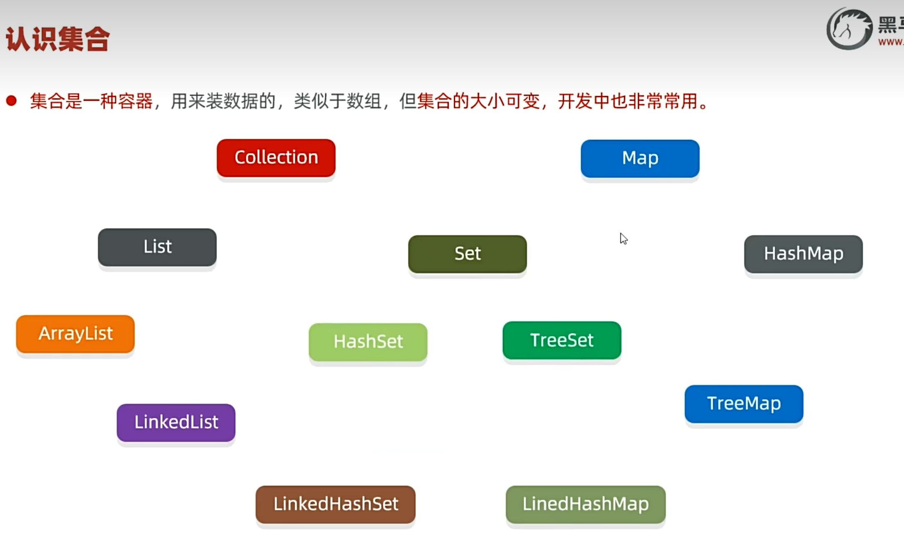
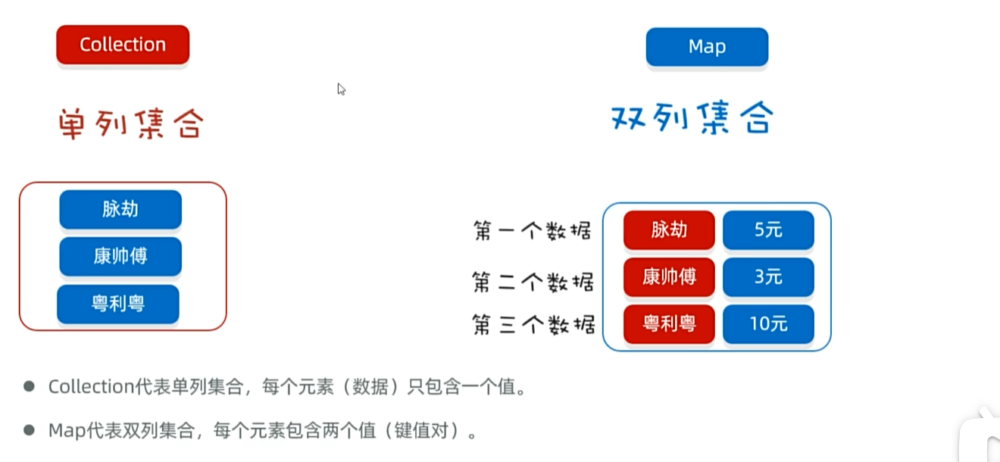
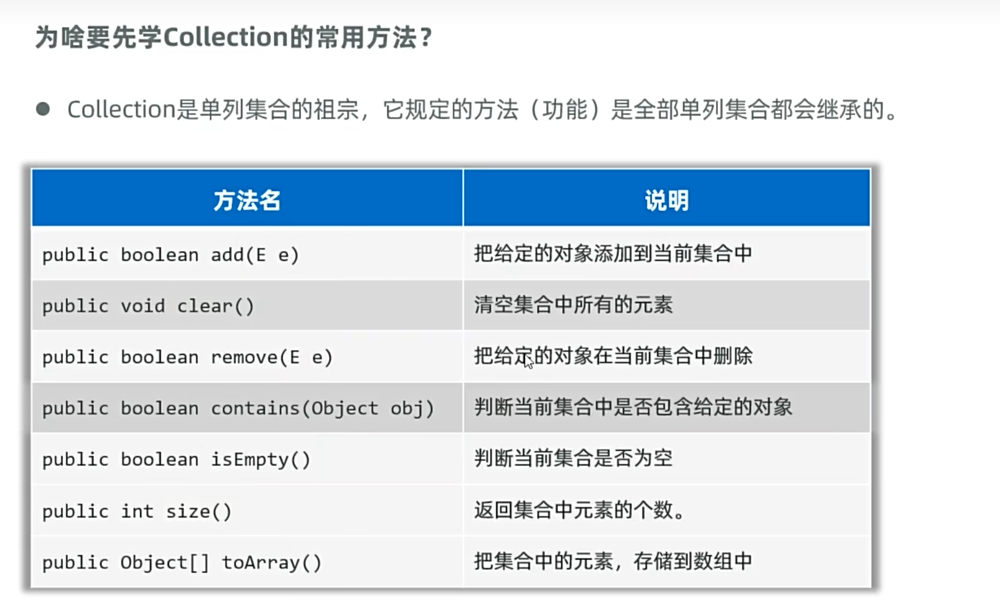
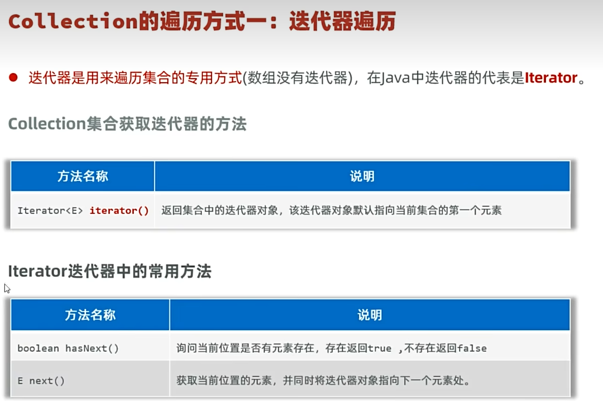
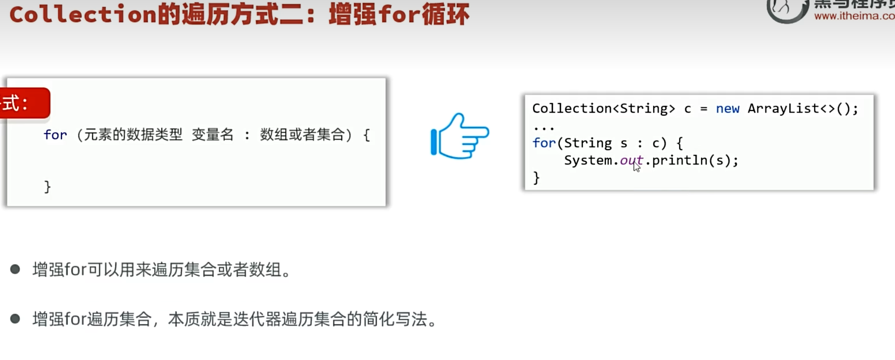
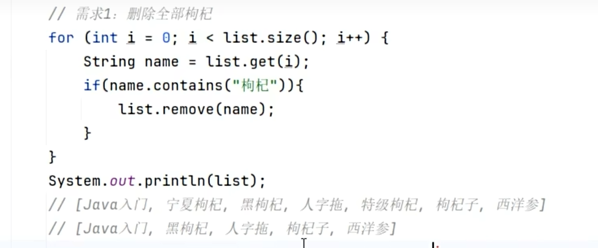
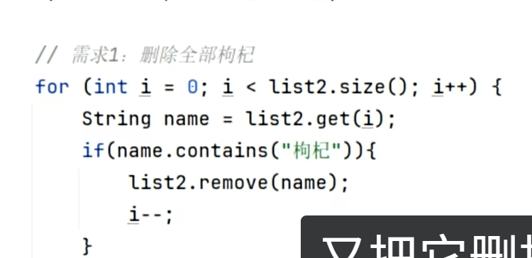
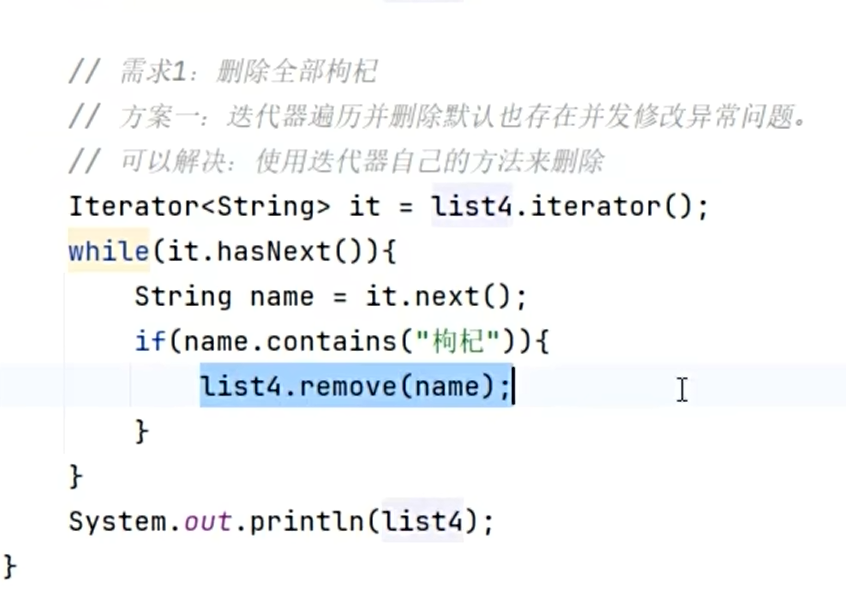
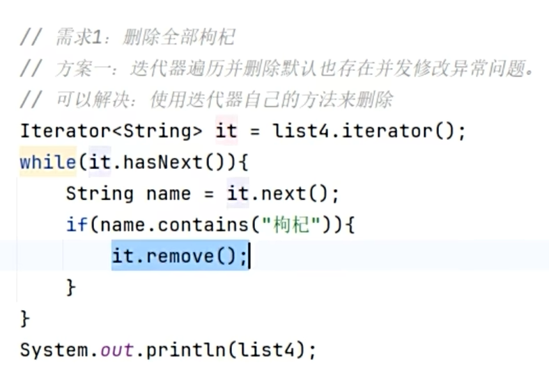
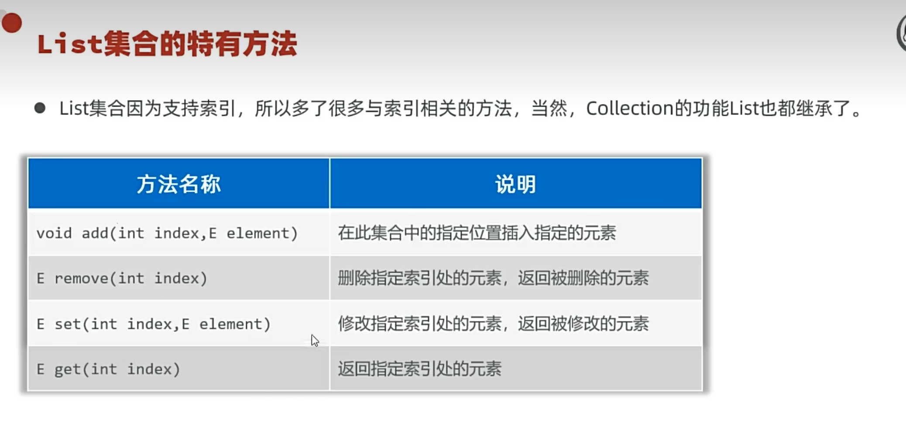

# 集合框架

集合是一种容器，用来装数据的，类似于数组，但集合的**大小可变**，开发中非常常用。比如说 [[ArrayList]] 就是一种集合。

---

## 🎯 集合 vs 数组

| 特性 | 数组 | 集合 |
|------|------|------|
| 长度 | 固定 | 可变 |
| 存储类型 | 基本类型 + 引用类型 | 只能引用类型（基本类型自动装箱为 [[包装类]]） |

---

## 📊 集合分类

集合大概可以归为两类：**Collection** 和 **Map**。

---

## 📌 Collection 家族

顶层一般是接口，底层是实现类。

| 分类 | 特点 |
|------|------|
| **List** | 有序（插入顺序）、有索引（编号）、元素可重复 |
| **Set** | 无序、无索引、元素唯一 |

> "有序"指的是插入顺序，比如先插张三，那先查出来就是张三。索引指的就是编号，可以类比数组。

---

## 🔧 Collection 常用方法

不用完全掌握，了解即可，需要用到可通过自然语言让AI写。

---

## 🔁 遍历集合

### 1. 迭代器

迭代器是一个对象，用于遍历Collection集合。**只能用于遍历集合，不能遍历数组。**

迭代器的获得与使用：起始位置就是首位，`.next()` 获得当前位置元素后迭代器后移，`.hasNext()` 询问当前位置是否有元素。

> 迭代器的优势：支持遍历不带索引的集合（如 [[Set集合]]）。详见 [[迭代器]]。

### 2. 增强for循环

可以遍历集合或者数组：

### 3. Lambda表达式遍历

本质是增强for循环 + 匿名内部类，重写了一个方法：

---

## ⚠️ 并发修改异常

遍历集合的同时又存在增删集合元素的行为时，可能出现业务异常。

**经典问题**：删除集合里所有带"枸杞"的元素，结果删不干净。因为 i 走到宁夏枸杞时删除，然后黑枸杞补上来，但 i 接着往下走了，黑枸杞就被略过了。

### 解决方案

1. **删除后 `i--`**（最简单）：

2. **倒着遍历删除**（前提是集合支持索引，可以类比数组）

3. **使用迭代器本身的删除方法**：直接操作集合本体会触发并发修改异常，使用迭代器本身方法删除就不会：

> 增强for和Lambda都无法解决：增强for基于迭代器实现，但无法拿到迭代器对象本身，只能越过迭代器直接操作集合，触发并发修改异常。Lambda基于增强for，同样无法解决。

---

## 📌 List 特有方法

---

## 📌 常用实现类
- [[ArrayList]] - List接口实现，基于数组，查询快增删慢
- [[LinkedList]] - List接口实现，基于双链表，增删快查询慢，支持首尾操作
- [[Set集合]] - 无序、无索引、元素唯一

---

## 🔗 关联知识点
- [[ArrayList]] - 基于数组的List实现
- [[LinkedList]] - 基于双链表的List实现
- [[Set集合]] - 无序无索引唯一
- [[迭代器]] - 遍历Collection集合的工具
- [[泛型]] - 限定集合存储类型
- [[包装类]] - 集合存储基本类型时需要
- [[Lambda表达式]] - 遍历集合的简洁写法
- [[多态]] - 接口引用指向实现类
- [[API]] - 集合属于JDK提供的API