Java面向对象的数据安全问题：成员变量要用private去私有化，最终的效果是不能通过对象直接使用变量，需要通过get和set方法去使用变量，需要注意的是，get和set方法要用public去公开，这样才能让对象去使用。

this关键字和就近原则：常出现在get和set方法里，比如this.age指向的就是对象本身的变量，而age往往是方法里的变量。如果不用this，直接输出age，则是就近原则，哪个近就输出哪个。

构造方法：构造方法的作用是在创建对象的时候直接初始化成员变量，构造方法由虚拟机调用，由public修饰，对象无法直接调用。如果不定义构造方法，则系统默认是只定义无参构造。如果需要初始化成员变量，则需要自行定义有参的构造方法，然后写逻辑。需要注意的是，如果自行定义了有参的构造方法，系统就不会帮定义无参构造方法了，还需要自己去定义，否则直接new对象而不赋值，就会报错。

使用alt + insert快捷键可以快速创建构造方法或者get/set方法。

static关键字修饰的是共享的变量，只需要赋值一次就可以了，一个类下的所有对象，static变量都是一样的，如果有一个对象修改了static变量，那么别的对象的static变量也会跟着变。使用static变量，一般直接通过类名来使用，如Student.teacher，当然，也可以用对象直接使用，但这是不推荐的，是不符合约定的。

静态变量不属于对象，属于类，随着类的加载而加载，优先于对象而存在。

工具类要用private去修饰构造方法，不允许外部创建该类的对象，然后，其工具方法要用static去修饰，以供外部直接用类名调用

静态方法，只能调用静态变量或者静态方法，不能直接调用非静态的变量或者方法。

非静态的方法，可以访问静态的变量或者方法，也可以访问非静态的变量或者方法。

静态方法里没有this关键字。

这三个是因为静态方法是优于对象而加载的，非静态的东西，需要有对象才被加载。

值得注意的是，main方法本身也是一个静态方法，上面三个原则是适用的。

基本数据类型：byte、short、int、long、float、double、char、boolean，变量直接存储真实数据值；
除以上 8 种基本类型外，其余全部为引用数据类型（类、接口、数组、枚举、包装类、String 等）；
引用类型变量存储的是指向堆中对象的引用（底层本质是内存地址，Java 语法层面统一称引用）。

final修饰的变量，是常量，在创建时要直接赋值，之后不允许赋值。被final修饰的变量一般用大写字母。

如果final修饰的是引用数据类型，比如说final Student stu = new Student();因为stu里记录的是对象的内存地址，不可改变的是stu里记录的内存地址，但是stu里的属性值，是可以发生改变的。

简单来说，就是final修饰哪个变量，该变量所记录的内容就无法改变。

枚举类的目的是限制类的对象个数，一般在枚举类里提前创建所有需要用到的对象。枚举类不用class修饰，用enum修饰。枚举类的第一行必须是枚举项，枚举项之用逗号隔开，分号结尾。枚举类的构造方法必须用private修饰，禁止外界再创建对象。枚举项在底层上，其实是用public static final修饰的，是最终常量。每一个枚举项，其实都是该枚举类的对象。编译器会默认给枚举类加values()和valueOf()方法，其作用分别是获取本类中的所有枚举项、获取一个指定的枚举项。枚举类的构造方法其实可以不写private，编译器会默认加上的。

继承的目的是把重复出现的代码提取到父类，减少代码的冗余。格式为public class 子类 extends 父类{}。父类的东西，子类都可以使用，同时，子类可以衍生出更多强大的功能。

在设计复杂继承结构的时候，从下往上画，不断地抽取共性内容往上。但在编写代码的时候，要从上往下编写。

Java只支持单继承，不支持多继承，但可以支持多层继承，这和现实里的父子关系是一样的，儿子不能有多个爸爸，但是可以有爷爷→爸爸→儿子的链条。然后这就延伸出了直接父类和间接父类的概念。

在Java中，有一个顶级父类Object，每一个类都直接或者间接继承该类。

在继承关系中，就近原则也是适用的。如果想要越过就近原则，可以用this或者super，需要注意的是，super最多只能到父类，爷爷类是无法获取的。

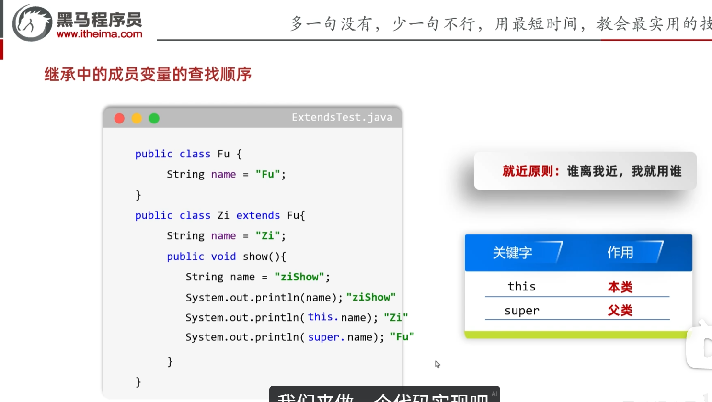

如果子类要调用父类的方法，可以用super

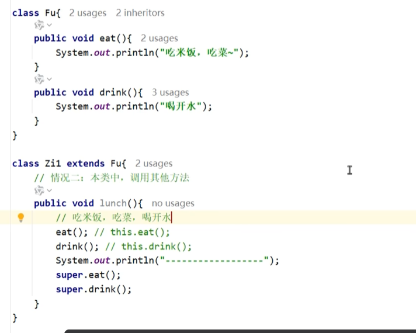

如果父类的方法，已经满足不了子类的需求，就需要在子类对父类的方法进行重写。使用注解@Override进行重写。注解和注释有点类似，只不过注释是给人看的，注解是给虚拟机看的。需要注意的是，重写的方法，声明方式要和父类的方法的完全一致。使用alt + insert快捷键可快速重写方法。

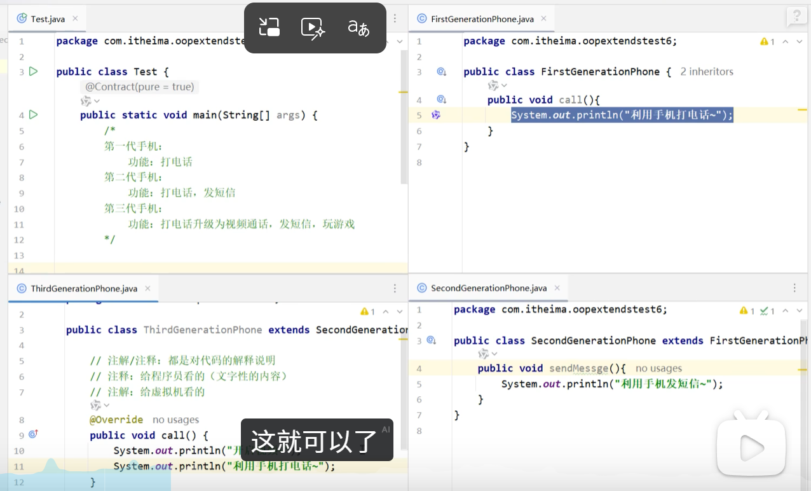

final修饰的类为最终类，不能被继承，里面的方法也不能被重写。

private私有方法、static静态方法、final最终方法不能被重写

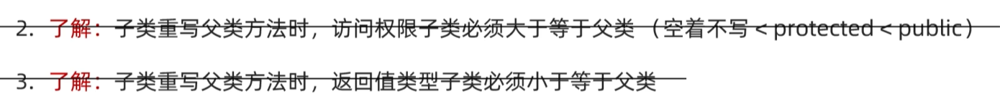

继承中构造方法的访问特点如图所示。子类不能继承父类的构造方法，但可以通过super调用，这句话是最关键的。

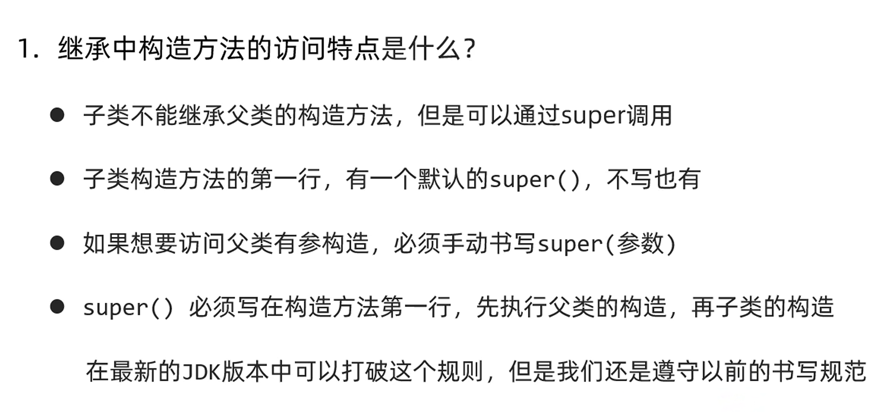

this关键字在内存的角度：表示的是当前方法的调用者的地址值。

this ()是调用本类的其他构造方法，一般用在空参构造里，调用有参构造，然后达成属性初始赋值的目的。

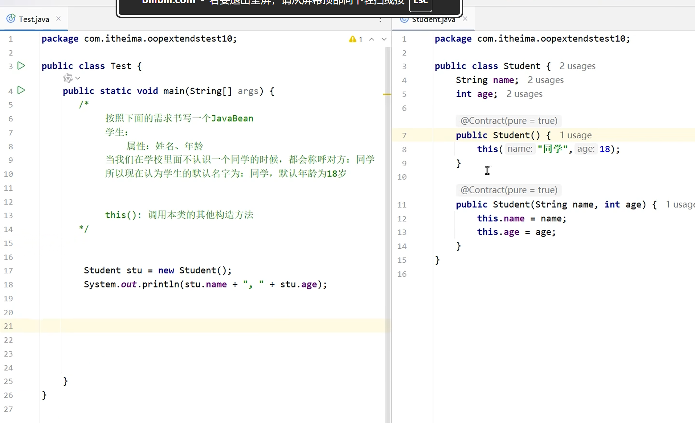

如果子类中有多个构造方法的时候，不能用this()互相调用，一定要预留一个调用父类的构造方法。

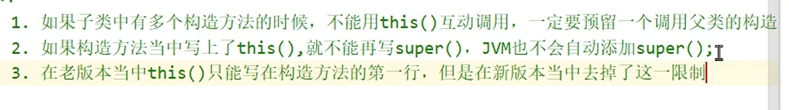

get和set方法是可以继承父类的，父类有的，子类可以不用写了。

需要区分继承和调用的区别。调用只是用一下，继承才是自己的。

final、static、private修饰的方法是不能被继承的，注意，我说的是方法。

虚方法是可以被继承的，是通过虚方法表的方式去继承。（虚方法指的是没用final、static、private修饰的方法）。

方法重写，是替换虚方法表里的地址值。

多态，指的就是事物的多种形态，在Java中，多态的表现形式是Fu fu = new Zi()简单来说，就是子类的对象可以赋给父类的类型。有一个应用场景就是注册，如图所示。

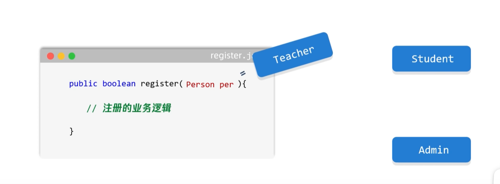

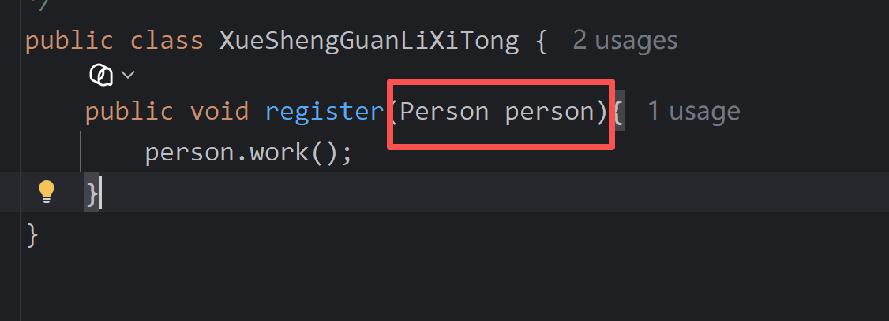

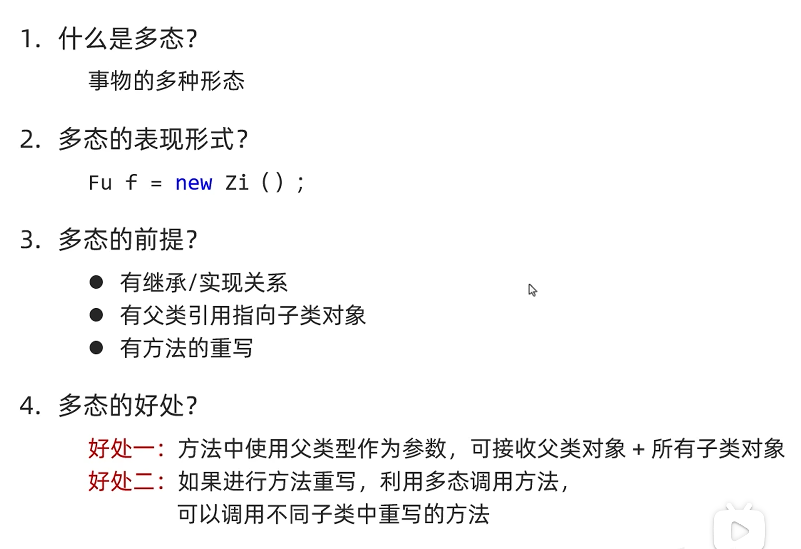

在多态继承里，变量调用：编译看左边，运行也看左边。方法调用：编译看左边，运行看右边。

这个图，输出的是Fu，因为是变量调用，所以都看父的

这个是方法调用，输出的是子类的方法。

从这里也可以明白，多态的弊端就是无法调用子类的特有方法，因为编译看左边。但是可以强制类型转换，这样就可以弥补这个弊端了。但需要注意的是，只能强转为自己的类型。

在强制转换之前，可以用instanceof关键字判断一下，图中的意思是"判断y是不是Fu类型的"

构造方法无法继承，但是可以调用，一般来说，重复代码不用写，调用父类的构造就可以了。如图所示。

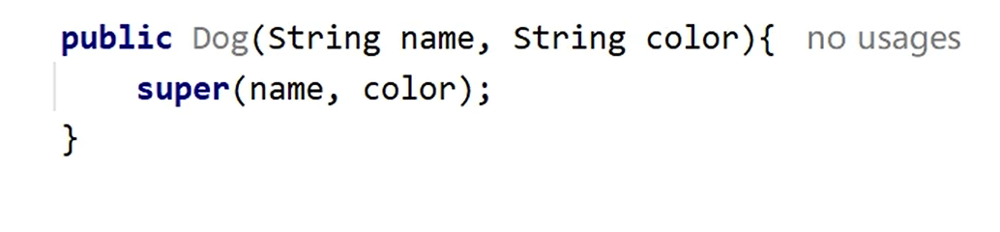

抽象类和抽象方法，一般用于抽象共同方法。 

抽象方法：将共性的行为(方法)抽取到父类之后。因为每一个子类的方法体是不一样，所以，在父类中不能确定具体的方法体。该方法就可以定义为抽象方法。

抽象类：如果一个类中存在抽象方法，那么该类就必须声明为抽象类。

比如说猫吃鱼，狗吃骨头，共同行为是吃，向上抽取到animal类，就是public abstract void eat();同时，animal类要用abstrac关键字修饰，如public abstract class animal{}。

子类如果要继承抽象类，必须重写所有抽象方法。

选中红色波浪线，alt + enter可以修复bug，比如说给方法加上abstract关键字修饰。

抽象类不能实例化。如果可以创建抽象类的对象的话，用对象调用一个没有方法体的抽象方法，没有任何意义。

抽象类中不一定有抽象方法，这是为了不让外界创建本类的对象，举个例子，如果抽象父类有非常多个抽象方法，而子类又用不到那么多抽象方法，不想重写那么多，这个时候可以定义一个父中间类，继承父类的所有抽象方法并重写为非抽象的空方法，然后把自己本身修饰为抽象父中间类，这个时候，外界就无法创建抽象父中间类的对象了，这个时候，子类可以继承抽象父中间类，只需要拿其中需要用到的非抽象空方法出来重写就可以了。
有抽象方法的类一定是抽象类。

抽象类中可以是有构造方法，其目的是给成员变量赋值。

抽象类的子类，要么重写抽象类中的所有抽象方法，要么子类也是抽象类。

抽象方法的意义在于统一标准，方便协作，避免屎山代码的形成。

接口就是一个规则，而且是独立于继承体系以外的规则，其功能和抽象方法类似，也是统一标准。如果一个类implements了某个接口，那必须要重写里面的方法。

接口用interface关键字来定义。

接口和类之间的是实现关系，通过implements关键字表示，如图所示

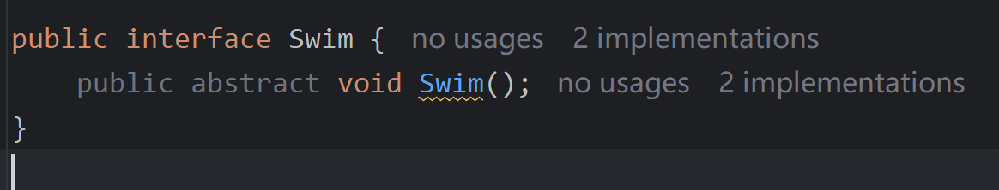

接口是不能被实例化的。

接口的子类(实现类)，要么重写接口中所有的抽象方法，要么实现类是一个抽象类。

一个类可以实现多个接口，也可以在继承一个类的同时，实现多个接口（可以把接口理解为干爹，可以有无数个干爹）。

接口的一些特点：

成员变量只能是常量，默认修饰符是public static final（需要注意的是，常量在创建的时候一定要赋值）。

接口是没有构造方法的。

接口的成员方法只能是抽象方法。默认修饰符是public abstract。

如果要实现多个接口，可以通过逗号隔开。

继承的类要在接口前面，否则会报错。

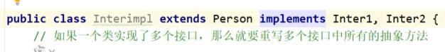

如果在重写的时候出现了重复的抽象方法，此时我们只要重写一次就可以了，比如说接口1和接口2都有aaa()的抽象方法，实现类只需要重写一次aaa()就可以了。

接口之间也可以继承，如图所示。这个时候，如果有实现类要实现接口MyInter，也要重写全部的抽象方法（Inter1和Inter2和MyInter里的抽象方法）。

不要滥用接口，如果能在父类做到抽象方法，就不要定义接口去限制。这是一个设计问题，力求最简洁的设计。所以，我们很自然而然地可以明白，接口是为了给出父类不方便给出的限制，比如说不同继承体系、毫无父子关系的类，他们有可能也会有相似的行为，这个时候，就可以用接口去统一限制，不需要继承关系。

一般来说，我们的顶层类，如Person，要用abstract去修饰，目的是不让外界创建其对象。

在接口中，用default修饰的默认方法，是接口契约的一部分，通俗来说，就是我（接口）提供一个通用默认实现，你（实现类）能用就直接用，不能用就重写，但保证你不改代码也能跑通。常用在版本迭代中。注意事项如图所示。

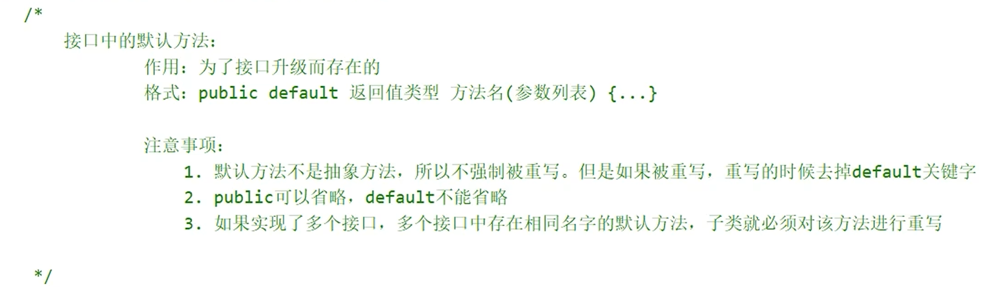

静态方法的设计初衷：把和接口强绑定的工具逻辑收拢到接口内，淘汰独立工具类。接口里的静态方法无法被实现类重写或继承。相关注意事项如图所示。

接口中的私有方法是为了抽取default方法中的重复代码而出现的。比方说接口A里有两个default方法，里面有重复的代码，就可以在当前接口写一个私有方法，把重复的部分抽取出来，然后回到default去调用。用private修饰的目的是禁止外界调用，让该方法只服务于当前接口。相关注意事项如图所示。

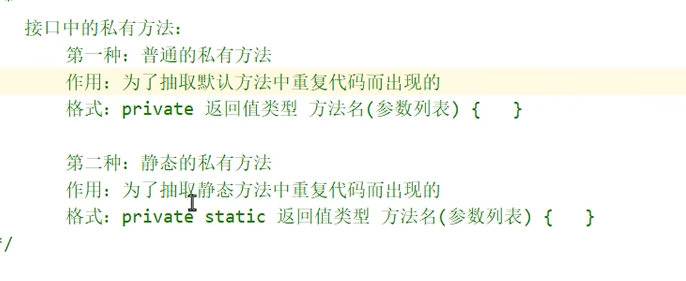

什么是内部类：写在一个类里面的类就叫做内部类。

什么时候用内部类：一个类表示的事物是另一个类的一部分，且单独存在没有意义的时候，就作为内部类写在另一个类的内部，此时，另一个类就叫做外部类，如图所示。

成员内部类写在成员位置，属于外部类的成员，和成员（属性）是同等地位的。成员内部类可以被一些修饰符所修饰，比如private、默认、protected、public、static等。在成员内部类里面，JDK16之前是不能定义静态变量的，JDK16之后才能定义静态变量。

如果成员内部类是用private修饰的，想获取这个内部类的对象，可以在外部类编写方法，对外提供内部类的对象。如图所示。值得注意的是，这里的Object inner = outer.getInner();其实是多态的写法，因为所有类的默认继承Object类。

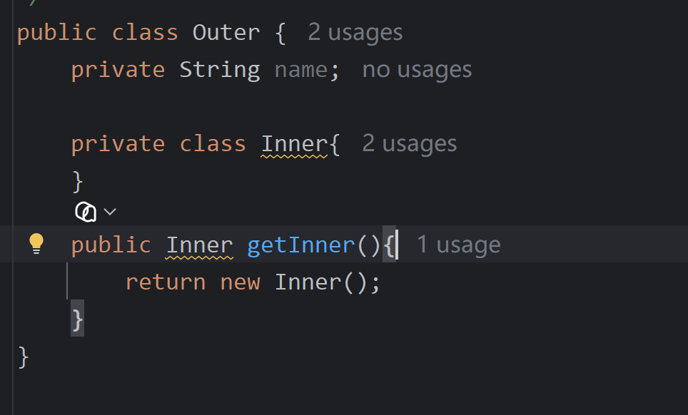

如果成员内部类不是private修饰的，可以直接创建，创建格式为：外部类名.内部类名 对象名 =外部类对象.内部类对象。具体如图所示：

如果只是new一个对象然后输出里面的属性，也可以省个变量，比如说这里的Outer类，直接new Outer().name就可以了。

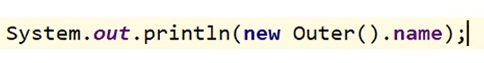

成员内部类如何获取外部类的成员变量？如图所示。

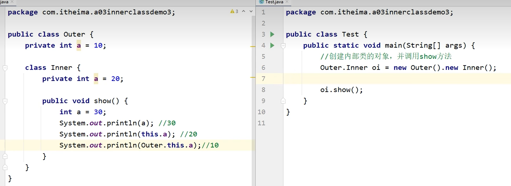

静态的想要调用非静态的，不能直接调用，要通过对象去调用。

如果想调用静态内部类里的非静态的方法，需要通过对象去调用。如果想调用静态内部类里的静态方法，直接调用即可。如图所示。

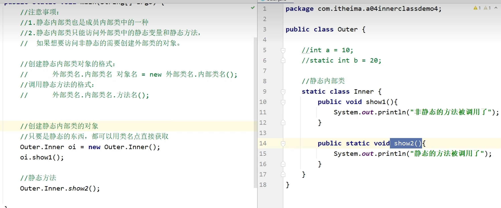

关于局部内部类，如图所示。调用其实都是在show方法里完成的。main方法里直接调用show就可以了，截图没体现出来调用show，知道就可以了。

如果参数是接口，那传过去的，应该是实现这个接口的类的对象。如图所示。

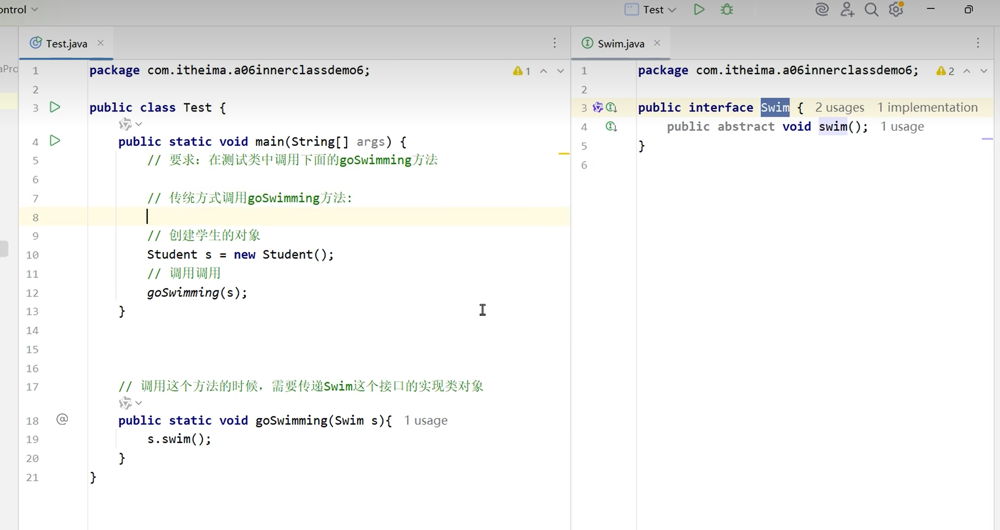

但是上面这种写法，还要单独写一个student类去实现swim接口里的抽象方法，结果只用了一次，太浪费了。于是，匿名内部类出现了。如图所示。红线里的就是匿名内部类本身，实现的是swim接口里的抽象方法，没有名字。（当然，匿名内部类不仅仅可以用于实现接口，还可以用于继承类，然后实现类里的抽象方法。前面的是类，就是继承，前面的是接口，就是实现）new关键字作用的是后面这个合格没有名字的java类，创建了他的对象。

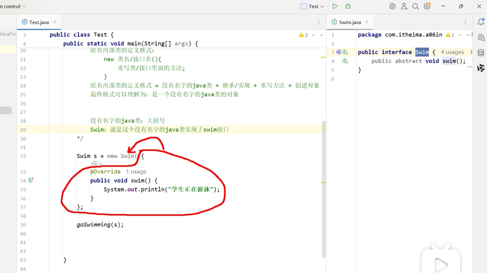

当然，还有更简洁的调用方法。如图所示。直接写在goSwimming函数的参数里。

在Java中，API就是JDK提供的各种功能的Java类，是类，要通过new对象来使用。JDK提供了很多API，需要使用时查文档即可。

如果使用的是本包中的类，就不需要导包。如果使用的是java.lang包下的类，也不需要导包（是核心，比如说String就是java.lang包下的，我们使用String时并不需要导包）。其余都要导包。

字符串的内容是不可变的，它的对象在创建后不能被更改。字符串的拼接，实际上是生成了一个新的字符串。

图示情况其实是创建了一个新的字符串，然后把新的字符串赋值给了变量name。

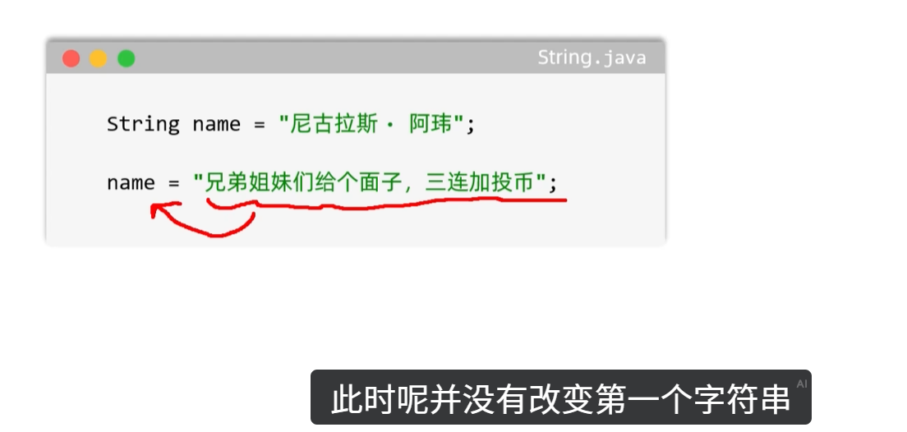

Java程序中的所有字符串文字（例如"abc"）都是String类的对象。

创建String类的对象有两种方式，第一种是直接赋值，如String name = "abc"。另一种是通过构造方法来创建，比如说String s1 = new String();就是创建一个空的字符串对象。

直接赋值创建String的对象其实是更省内存的。比方说String s1 = "abc";String s2 = "abc"，在堆内存的串池中，其实只有一个"abc"，是直接复用的。s1和s2都是指向同一个字符串。而new是直接在堆里开辟空间，是不会复用的，所以会消耗更多的内存空间。

==号比较的是变量里面记录的内容。因为String是引用数据类型，里面存的是地址，所以才会出现下图的情况。

如果要比较字符串里面的内容是否相同，可以使用现有的方法去比较。值得注意的是，这两个方法也是有区别的。如下二图所示。

charAt()是String类里自带的一个方法，用于根据索引获取字符串里的具体字符。如下图所示。

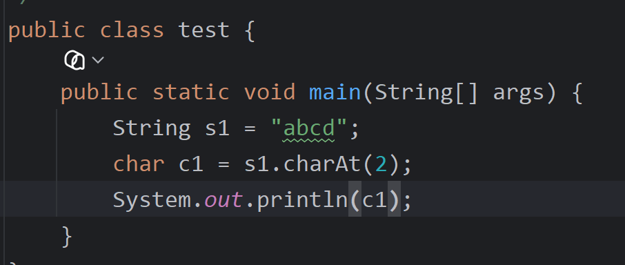

在上图，使用s1.length()可以获取到s1的字符串s1的长度。

substring可用于截取字符串，但必须传给一个string变量，或者直接打印，因为substring截出来的，其实相当于是新的字符串。还要注意，该方法是包左不包右。

使用replace可以替换字符串里的指定内容。需要注意的是，只有返回值才是截取之后的结果。

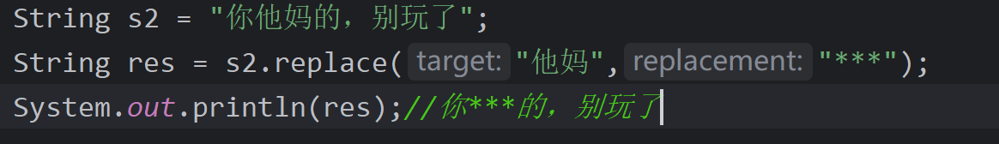

StringBuilder是字符串的一个工具类，可以让我们拼接字符串的时候效率更高。StringBuilder是一个容器，并不是字符串。每次拼接都把新的字符串加到容器里边去，在容器里完成拼接，不会浪费内存。

关于StringBuilder的用法如图所示。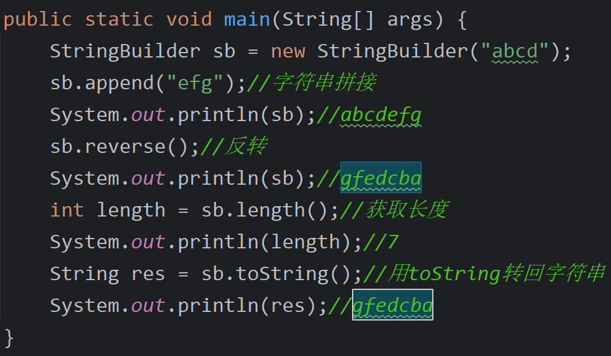

字符串本身是不可变的，如果想要修改里面的内容，可以转成字符数组，做出变化之后，再用这个字符数组创建一个字符串。具体操作如图所示。

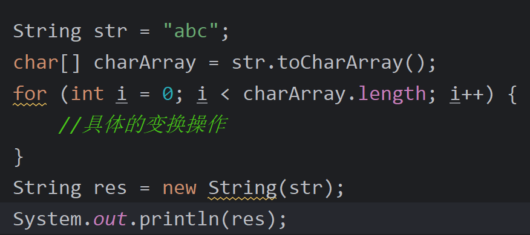

定义一个长度为len的数组arr：int[] arr = new int[len]；（里面的数据会初始化为0）。

集合是一种长度可变的容器。可以形象理解为链表。

ArrayList arrayList = new ArrayList();这种写法，可以接受任意类型，但接的时候，你就不知道怎么接，不知道具体的索引下是什么内容，只能拿Object去接，用多态的方式去接，但这是很不好的，毕竟多态有弊端。

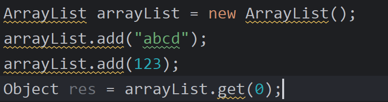

可以用泛型<>去限定集合中存储的数据类型，如图所示，此时，list集合就只能存储String类型。有个小细节，后面的泛型String可以去掉，但尖括号要保留，你看，string都变成灰色了。

单例设计模式：确保一个类只能创建一个对象。比如说电脑的任务管理器可以看作是一个对象，无论启动多少次任务管理器，都只能有这一个对象。

饿汉式单例：在获取类的对象时，对象已经创建好了。写法如图所示。

懒汉式单例：用对象时，才开始创建对象。写法如图所示。

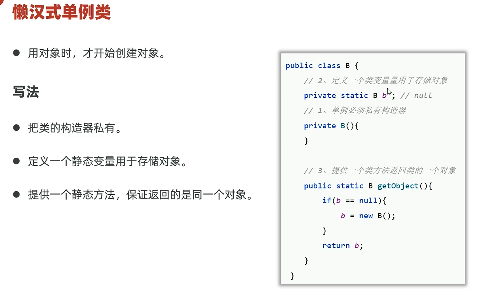

懒汉式比饿汉式更省内存，但缺点是懒汉式第一次用对象时速度更慢。

枚举类，图片的左边等价于右边。

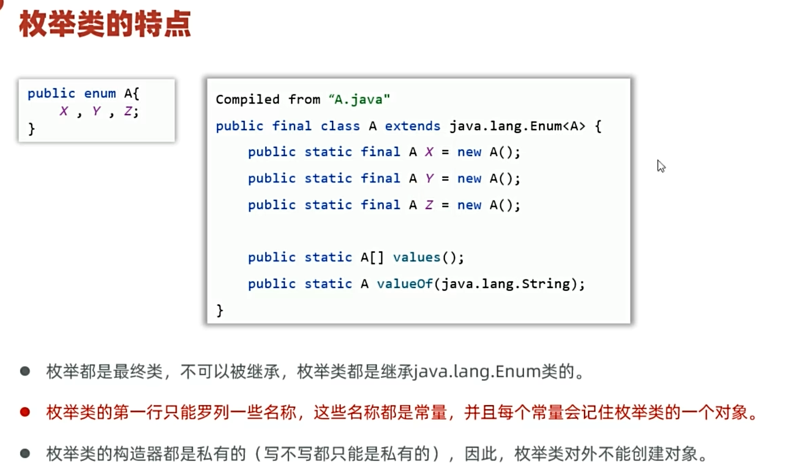

枚举类也可以作为全局常量使用。

可以使用Java自带的方法快速返回数组里的内容并查看。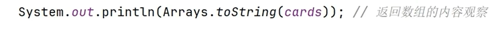

静态代码块，知识点和用法如下二图所示。

实例代码块的知识点和用法如图所示：

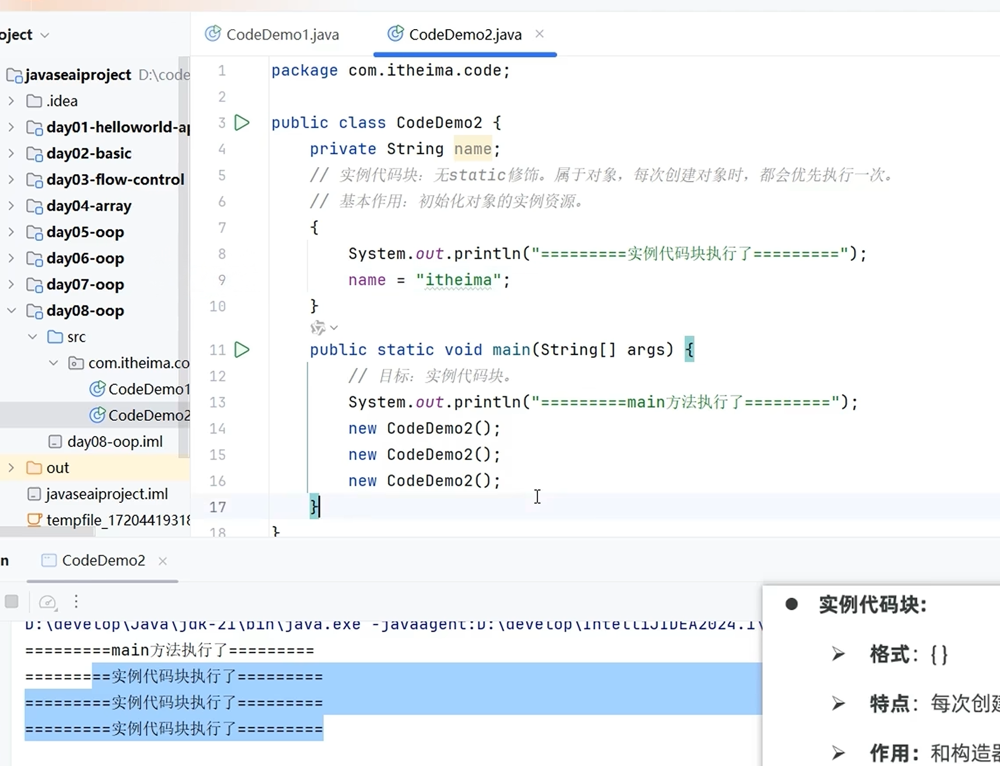

用static修饰的静态资源属于类，而不属于对象，随类的加载而加载，可以通过类调用，也可以通过对象调用。

内部类可以获取到外部类的的对象，语法如图所示。

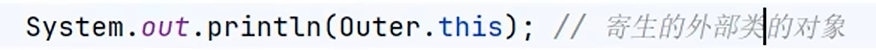

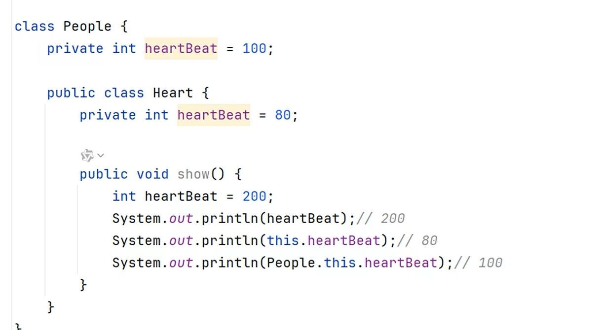

匿名内部类还有一个好处：如果需要实现一次抽象类，但只用一次，这个时候就没有必要单独创一个类文件出来了，直接用匿名内部类就可以了。如图所示。

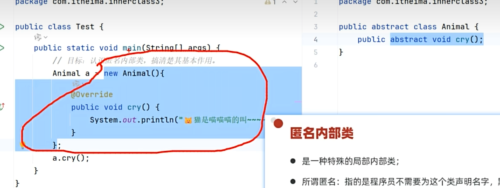

匿名内部类可以简化成一行，如图所示

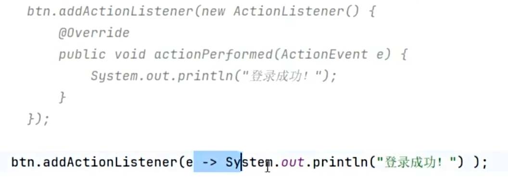
