Java面向对象的数据安全问题：成员变量要用private去私有化，最终的效果是不能通过对象直接使用变量，需要通过get和set方法去使用变量，需要注意的是，get和set方法要用public去公开，这样才能让对象去使用。

this关键字和就近原则：常出现在get和set方法里，比如this.age指向的就是对象本身的变量，而age往往是方法里的变量。如果不用this，直接输出age，则是就近原则，哪个近就输出哪个。

构造方法：构造方法的作用是在创建对象的时候直接初始化成员变量，构造方法由虚拟机调用，由public修饰，对象无法直接调用。如果不定义构造方法，则系统默认是只定义无参构造。如果需要初始化成员变量，则需要自行定义有参的构造方法，然后写逻辑。需要注意的是，如果自行定义了有参的构造方法，系统就不会帮定义无参构造方法了，还需要自己去定义，否则直接new对象而不赋值，就会报错。

使用alt + insert快捷键可以快速创建构造方法或者get/set方法。

static关键字修饰的是共享的变量，只需要赋值一次就可以了，一个类下的所有对象，static变量都是一样的，如果有一个对象修改了static变量，那么别的对象的static变量也会跟着变。使用static变量，一般直接通过类名来使用，如Student.teacher，当然，也可以用对象直接使用，但这是不推荐的，是不符合约定的。

静态变量不属于对象，属于类，随着类的加载而加载，优先于对象而存在。

工具类要用private去修饰构造方法，不允许外部创建该类的对象，然后，其工具方法要用static去修饰，以供外部直接用类名调用

静态方法，只能调用静态变量或者静态方法，不能直接调用非静态的变量或者方法。

非静态的方法，可以访问静态的变量或者方法，也可以访问非静态的变量或者方法。

静态方法里没有this关键字。

这三个是因为静态方法是优于对象而加载的，非静态的东西，需要有对象才被加载。

值得注意的是，main方法本身也是一个静态方法，上面三个原则是适用的。

基本数据类型：byte、short、int、long、float、double、char、boolean，变量直接存储真实数据值；
除以上 8 种基本类型外，其余全部为引用数据类型（类、接口、数组、枚举、包装类、String 等）；
引用类型变量存储的是指向堆中对象的引用（底层本质是内存地址，Java 语法层面统一称引用）。

final修饰的变量，是常量，在创建时要直接赋值，之后不允许赋值。被final修饰的变量一般用大写字母。

如果final修饰的是引用数据类型，比如说final Student stu = new Student();因为stu里记录的是对象的内存地址，不可改变的是stu里记录的内存地址，但是stu里的属性值，是可以发生改变的。

简单来说，就是final修饰哪个变量，该变量所记录的内容就无法改变。

枚举类的目的是限制类的对象个数，一般在枚举类里提前创建所有需要用到的对象。枚举类不用class修饰，用enum修饰。枚举类的第一行必须是枚举项，枚举项之用逗号隔开，分号结尾。枚举类的构造方法必须用private修饰，禁止外界再创建对象。枚举项在底层上，其实是用public static final修饰的，是最终常量。每一个枚举项，其实都是该枚举类的对象。编译器会默认给枚举类加values()和valueOf()方法，其作用分别是获取本类中的所有枚举项、获取一个指定的枚举项。枚举类的构造方法其实可以不写private，编译器会默认加上的。

继承的目的是把重复出现的代码提取到父类，减少代码的冗余。格式为public class 子类 extends 父类{}。父类的东西，子类都可以使用，同时，子类可以衍生出更多强大的功能。

在设计复杂继承结构的时候，从下往上画，不断地抽取共性内容往上。但在编写代码的时候，要从上往下编写。

Java只支持单继承，不支持多继承，但可以支持多层继承，这和现实里的父子关系是一样的，儿子不能有多个爸爸，但是可以有爷爷→爸爸→儿子的链条。然后这就延伸出了直接父类和间接父类的概念。

在Java中，有一个顶级父类Object，每一个类都直接或者间接继承该类。

在继承关系中，就近原则也是适用的。如果想要越过就近原则，可以用this或者super，需要注意的是，super最多只能到父类，爷爷类是无法获取的。


如果子类要调用父类的方法，可以用super


如果父类的方法，已经满足不了子类的需求，就需要在子类对父类的方法进行重写。使用注解@Override进行重写。注解和注释有点类似，只不过注释是给人看的，注解是给虚拟机看的。需要注意的是，重写的方法，声明方式要和父类的方法的完全一致。使用alt + insert快捷键可快速重写方法。


final修饰的类为最终类，不能被继承，里面的方法也不能被重写。

private私有方法、static静态方法、final最终方法不能被重写


继承中构造方法的访问特点如图所示。子类不能继承父类的构造方法，但可以通过super调用，这句话是最关键的。


this关键字在内存的角度：表示的是当前方法的调用者的地址值。

this ()是调用本类的其他构造方法，一般用在空参构造里，调用有参构造，然后达成属性初始赋值的目的。


如果子类中有多个构造方法的时候，不能用this()互相调用，一定要预留一个调用父类的构造方法。


get和set方法是可以继承父类的，父类有的，子类可以不用写了。

需要区分继承和调用的区别。调用只是用一下，继承才是自己的。

final、static、private修饰的方法是不能被继承的，注意，我说的是方法。

虚方法是可以被继承的，是通过虚方法表的方式去继承。（虚方法指的是没用final、static、private修饰的方法）。

方法重写，是替换虚方法表里的地址值。


多态，指的就是事物的多种形态，在Java中，多态的表现形式是Fu fu = new Zi()简单来说，就是子类的对象可以赋给父类的类型。有一个应用场景就是注册，如图所示。


在多态继承里，变量调用：编译看左边，运行也看左边。方法调用：编译看左边，运行看右边。

这个图，输出的是Fu，因为是变量调用，所以都看父的


这个是方法调用，输出的是子类的方法。


从这里也可以明白，多态的弊端就是无法调用子类的特有方法，因为编译看左边。但是可以强制类型转换，这样就可以弥补这个弊端了。但需要注意的是，只能强转为自己的类型。


在强制转换之前，可以用instanceof关键字判断一下，图中的意思是"判断y是不是Fu类型的"


构造方法无法继承，但是可以调用，一般来说，重复代码不用写，调用父类的构造就可以了。如图所示。


抽象类和抽象方法，一般用于抽象共同方法。 

抽象方法：将共性的行为(方法)抽取到父类之后。因为每一个子类的方法体是不一样，所以，在父类中不能确定具体的方法体。该方法就可以定义为抽象方法。

抽象类：如果一个类中存在抽象方法，那么该类就必须声明为抽象类。

比如说猫吃鱼，狗吃骨头，共同行为是吃，向上抽取到animal类，就是public abstract void eat();同时，animal类要用abstrac关键字修饰，如public abstract class animal{}。

子类如果要继承抽象类，必须重写所有抽象方法。

选中红色波浪线，alt + enter可以修复bug，比如说给方法加上abstract关键字修饰。


抽象类不能实例化。如果可以创建抽象类的对象的话，用对象调用一个没有方法体的抽象方法，没有任何意义。

抽象类中不一定有抽象方法，这是为了不让外界创建本类的对象，举个例子，如果抽象父类有非常多个抽象方法，而子类又用不到那么多抽象方法，不想重写那么多，这个时候可以定义一个父中间类，继承父类的所有抽象方法并重写为非抽象的空方法，然后把自己本身修饰为抽象父中间类，这个时候，外界就无法创建抽象父中间类的对象了，这个时候，子类可以继承抽象父中间类，只需要拿其中需要用到的非抽象空方法出来重写就可以了。
有抽象方法的类一定是抽象类。

抽象类中可以是有构造方法，其目的是给成员变量赋值。

抽象类的子类，要么重写抽象类中的所有抽象方法，要么子类也是抽象类。

抽象方法的意义在于统一标准，方便协作，避免屎山代码的形成。

接口就是一个规则，而且是独立于继承体系以外的规则，其功能和抽象方法类似，也是统一标准。如果一个类implements了某个接口，那必须要重写里面的方法。

接口用interface关键字来定义。

接口和类之间的是实现关系，通过implements关键字表示，如图所示


接口是不能被实例化的。

接口的子类(实现类)，要么重写接口中所有的抽象方法，要么实现类是一个抽象类。

一个类可以实现多个接口，也可以在继承一个类的同时，实现多个接口（可以把接口理解为干爹，可以有无数个干爹）。

接口的一些特点：

成员变量只能是常量，默认修饰符是public static final（需要注意的是，常量在创建的时候一定要赋值）。

接口是没有构造方法的。

接口的成员方法只能是抽象方法。默认修饰符是public abstract。

如果要实现多个接口，可以通过逗号隔开。

继承的类要在接口前面，否则会报错。


如果在重写的时候出现了重复的抽象方法，此时我们只要重写一次就可以了，比如说接口1和接口2都有aaa()的抽象方法，实现类只需要重写一次aaa()就可以了。

接口之间也可以继承，如图所示。这个时候，如果有实现类要实现接口MyInter，也要重写全部的抽象方法（Inter1和Inter2和MyInter里的抽象方法）。


不要滥用接口，如果能在父类做到抽象方法，就不要定义接口去限制。这是一个设计问题，力求最简洁的设计。所以，我们很自然而然地可以明白，接口是为了给出父类不方便给出的限制，比如说不同继承体系、毫无父子关系的类，他们有可能也会有相似的行为，这个时候，就可以用接口去统一限制，不需要继承关系。

一般来说，我们的顶层类，如Person，要用abstract去修饰，目的是不让外界创建其对象。

在接口中，用default修饰的默认方法，是接口契约的一部分，通俗来说，就是我（接口）提供一个通用默认实现，你（实现类）能用就直接用，不能用就重写，但保证你不改代码也能跑通。常用在版本迭代中。注意事项如图所示。


静态方法的设计初衷：把和接口强绑定的工具逻辑收拢到接口内，淘汰独立工具类。接口里的静态方法无法被实现类重写或继承。相关注意事项如图所示。


接口中的私有方法是为了抽取default方法中的重复代码而出现的。比方说接口A里有两个default方法，里面有重复的代码，就可以在当前接口写一个私有方法，把重复的部分抽取出来，然后回到default去调用。用private修饰的目的是禁止外界调用，让该方法只服务于当前接口。相关注意事项如图所示。


什么是内部类：写在一个类里面的类就叫做内部类。

什么时候用内部类：一个类表示的事物是另一个类的一部分，且单独存在没有意义的时候，就作为内部类写在另一个类的内部，此时，另一个类就叫做外部类，如图所示。


成员内部类写在成员位置，属于外部类的成员，和成员（属性）是同等地位的。成员内部类可以被一些修饰符所修饰，比如private、默认、protected、public、static等。在成员内部类里面，JDK16之前是不能定义静态变量的，JDK16之后才能定义静态变量。

如果成员内部类是用private修饰的，想获取这个内部类的对象，可以在外部类编写方法，对外提供内部类的对象。如图所示。值得注意的是，这里的Object inner = outer.getInner();其实是多态的写法，因为所有类的默认继承Object类。


如果成员内部类不是private修饰的，可以直接创建，创建格式为：外部类名.内部类名 对象名 =外部类对象.内部类对象。具体如图所示：


如果只是new一个对象然后输出里面的属性，也可以省个变量，比如说这里的Outer类，直接new Outer().name就可以了。


成员内部类如何获取外部类的成员变量？如图所示。


静态的想要调用非静态的，不能直接调用，要通过对象去调用。

如果想调用静态内部类里的非静态的方法，需要通过对象去调用。如果想调用静态内部类里的静态方法，直接调用即可。如图所示。


关于局部内部类，如图所示。调用其实都是在show方法里完成的。main方法里直接调用show就可以了，截图没体现出来调用show，知道就可以了。


如果参数是接口，那传过去的，应该是实现这个接口的类的对象。如图所示。


但是上面这种写法，还要单独写一个student类去实现swim接口里的抽象方法，结果只用了一次，太浪费了。于是，匿名内部类出现了。如图所示。红线里的就是匿名内部类本身，实现的是swim接口里的抽象方法，没有名字。（当然，匿名内部类不仅仅可以用于实现接口，还可以用于继承类，然后实现类里的抽象方法。前面的是类，就是继承，前面的是接口，就是实现）new关键字作用的是后面这个合格没有名字的java类，创建了他的对象。


当然，还有更简洁的调用方法。如图所示。直接写在goSwimming函数的参数里。


在Java中，API就是JDK提供的各种功能的Java类，是类，要通过new对象来使用。JDK提供了很多API，需要使用时查文档即可。

如果使用的是本包中的类，就不需要导包。如果使用的是java.lang包下的类，也不需要导包（是核心，比如说String就是java.lang包下的，我们使用String时并不需要导包）。其余都要导包。

字符串的内容是不可变的，它的对象在创建后不能被更改。字符串的拼接，实际上是生成了一个新的字符串。

图示情况其实是创建了一个新的字符串，然后把新的字符串赋值给了变量name。


Java程序中的所有字符串文字（例如"abc"）都是String类的对象。

创建String类的对象有两种方式，第一种是直接赋值，如String name = "abc"。另一种是通过构造方法来创建，比如说String s1 = new String();就是创建一个空的字符串对象。

直接赋值创建String的对象其实是更省内存的。比方说String s1 = "abc";String s2 = "abc"，在堆内存的串池中，其实只有一个"abc"，是直接复用的。s1和s2都是指向同一个字符串。而new是直接在堆里开辟空间，是不会复用的，所以会消耗更多的内存空间。

==号比较的是变量里面记录的内容。因为String是引用数据类型，里面存的是地址，所以才会出现下图的情况。


如果要比较字符串里面的内容是否相同，可以使用现有的方法去比较。值得注意的是，这两个方法也是有区别的。如下二图所示。


charAt()是String类里自带的一个方法，用于根据索引获取字符串里的具体字符。如下图所示。


在上图，使用s1.length()可以获取到s1的字符串s1的长度。

substring可用于截取字符串，但必须传给一个string变量，或者直接打印，因为substring截出来的，其实相当于是新的字符串。还要注意，该方法是包左不包右。


使用replace可以替换字符串里的指定内容。需要注意的是，只有返回值才是截取之后的结果。


StringBuilder是字符串的一个工具类，可以让我们拼接字符串的时候效率更高。StringBuilder是一个容器，并不是字符串。每次拼接都把新的字符串加到容器里边去，在容器里完成拼接，不会浪费内存。

关于StringBuilder的用法如图所示。

字符串本身是不可变的，如果想要修改里面的内容，可以转成字符数组，做出变化之后，再用这个字符数组创建一个字符串。具体操作如图所示。


定义一个长度为len的数组arr：int[] arr = new int[len]；（里面的数据会初始化为0）。

集合是一种长度可变的容器。可以形象理解为链表。

ArrayList arrayList = new ArrayList();这种写法，可以接受任意类型，但接的时候，你就不知道怎么接，不知道具体的索引下是什么内容，只能拿Object去接，用多态的方式去接，但这是很不好的，毕竟多态有弊端。


可以用泛型<>去限定集合中存储的数据类型，如图所示，此时，list集合就只能存储String类型。有个小细节，后面的泛型String可以去掉，但尖括号要保留，你看，string都变成灰色了。


单例设计模式：确保一个类只能创建一个对象。比如说电脑的任务管理器可以看作是一个对象，无论启动多少次任务管理器，都只能有这一个对象。

饿汉式单例：在获取类的对象时，对象已经创建好了。写法如图所示。


懒汉式单例：用对象时，才开始创建对象。写法如图所示。


懒汉式比饿汉式更省内存，但缺点是懒汉式第一次用对象时速度更慢。

枚举类，图片的左边等价于右边。


枚举类也可以作为全局常量使用。

可以使用Java自带的方法快速返回数组里的内容并查看。

静态代码块，知识点和用法如下二图所示。


实例代码块的知识点和用法如图所示：


用static修饰的静态资源属于类，而不属于对象，随类的加载而加载，可以通过类调用，也可以通过对象调用。

内部类可以获取到外部类的的对象，语法如图所示。


匿名内部类还有一个好处：如果需要实现一次抽象类，但只用一次，这个时候就没有必要单独创一个类文件出来了，直接用匿名内部类就可以了。如图所示。


匿名内部类可以简化成一行，如图所示


函数式编程，此处的函数，类似于数学中的函数(强调做什么)，只要输入的数据一致返回的结果也是一致的。Java中的函数，指的是Lambda表达式。格式如(x) -> 2x+1

可以用Lambda函数替代某些匿名内部类对象，从而让程序代码更简洁，可读性更好。格式如图所示。

注意：Lambda表达式只能替代函数式接口的匿名内部类！！！（函数式接口：首先是接口，然后是有且仅有一个抽象方法的接口）可以加@FunctionalInterface来限定接口只能有一个抽象方法。如图所示。如果有两个抽象方法，@FunctionalInterface就会让代码报错。


Lambda的具体书写如下图所示。其实是实现上图那个接口的。

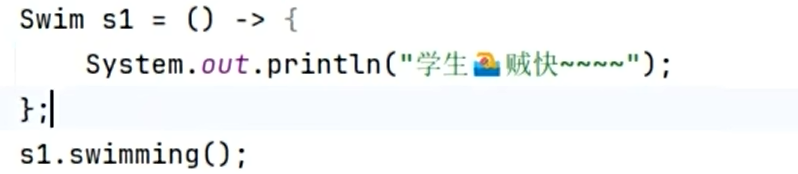

### Comparator自定义sort排序，核心规则如下所示，详细代码如下图所示。

### 1. 返回值的核心规则

`compare` 方法的返回值决定了两个对象的排序顺序：

- 返回**负整数**：认为 `o1` 小于 `o2`，排序后 `o1` 排在 `o2` 前面
- 返回 **0**：认为 `o1` 与 `o2` 相等
- 返回**正整数**：认为 `o1` 大于 `o2`，排序后 `o1` 排在 `o2` 后面

### 2. 代码逻辑解读

`return o1.getAge() - o2.getAge();`

- 当 o1 年龄 < o2 年龄时，结果为负数 → o1 排在前面
- 最终效果：**按年龄从小到大（升序）排序**
- 如果想要降序，反过来写即可：`o2.getAge() - o1.getAge()`


可使用Lambda表达式简化为如图所示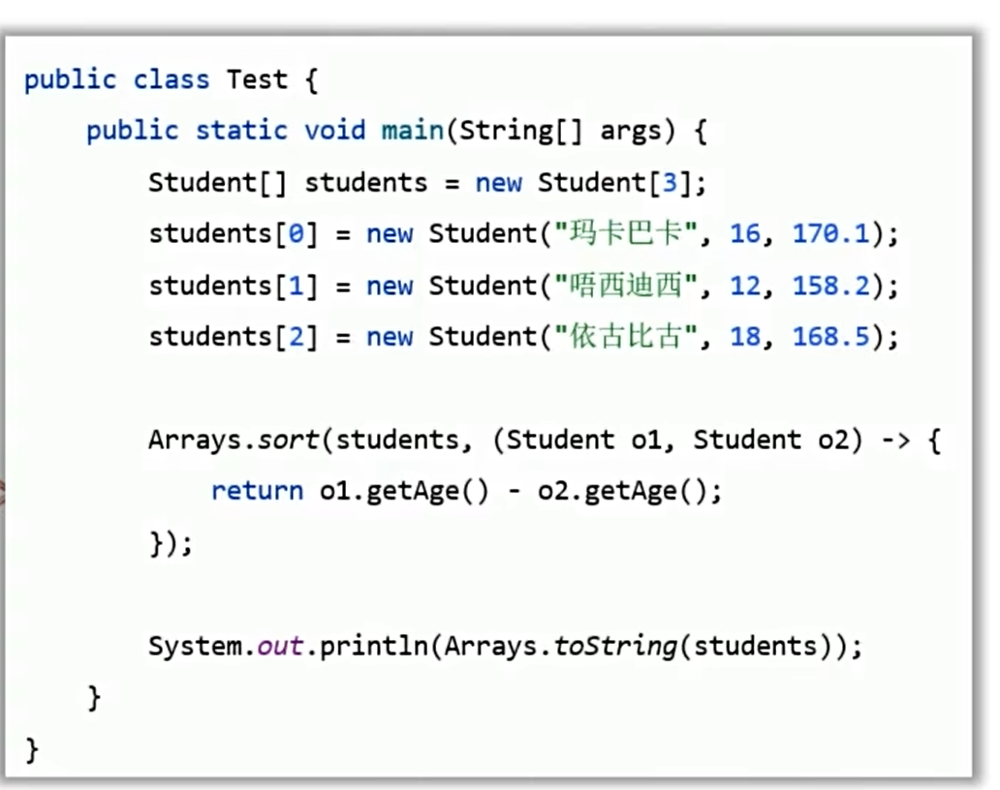

其实还能继续简写，参数类型全部可以省略不写。如下图所示。


其实还能继续简写，如果Lambda表达式中只有一行代码，大括号可以不写，同时要省略分号";"如果这行代码是return语句，也必须去掉return。

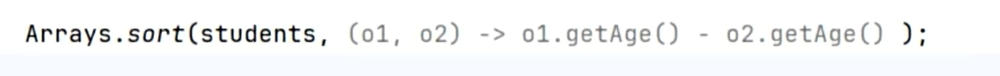

其实还可以进一步简化，把逻辑作为静态方法写进类本身，然后在Lambda表达式里调用这个方法，然后使用静态方法引用进一步简化。类名::静态方法。 

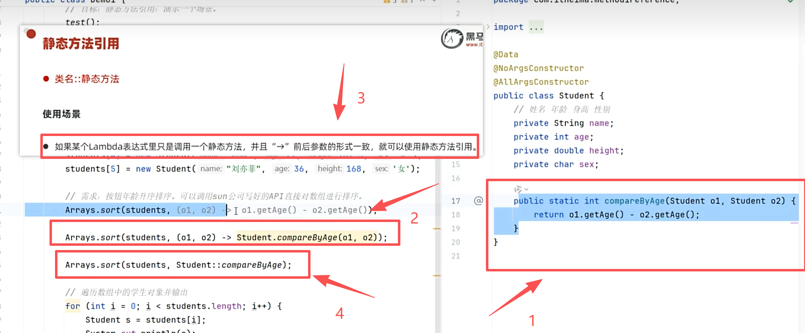

如果只有一个参数，参数类型省略的同时“()”也可以省略，但多个参数不能省略“()”


实例方法引用如图所示。在Arrays.sort(students, t::compareByHeight);里，students表示交给sort帮忙排序的目标，t::compareByHeight表示规则。对象名::实例方法。


Arrays.sort()可以对数组进行排序。

特定类的方法引用，简写方式如图所示。特定类的名称::方法。

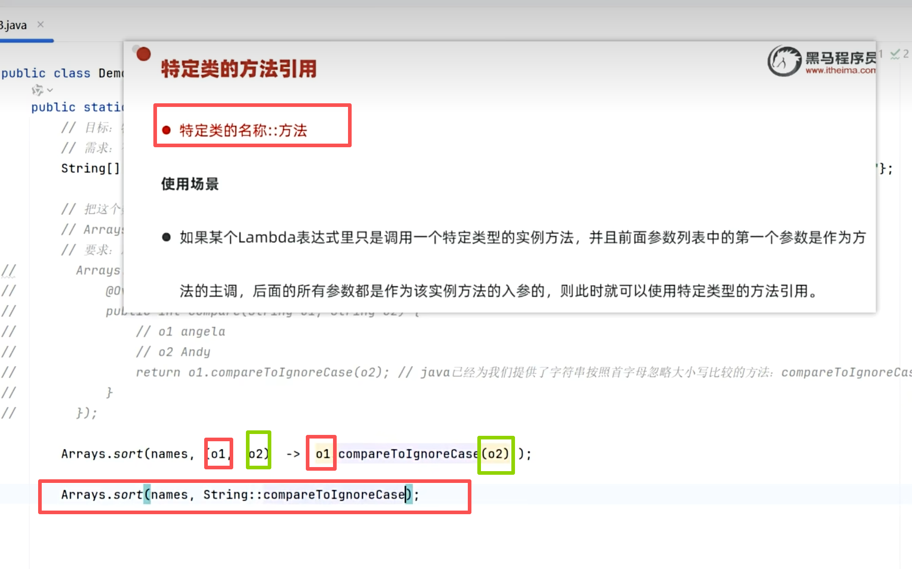

构造器引用的使用场景是：如果某个Lambda表达式里只是在创建对象，并且“”前后参数情况一致，就可以使用构造器引用。格式是：类名::new。如图所示。下面有一个Car类，只有一行属性，没有截出来。CarFactory是接口，用来约定创建汽车类的，只有一个抽象方法。在main方法里，可以通过匿名内部类的方式实现这个接口的同时创建对象（不用单独创建一个类出来继承接口然后重写，直接用匿名内部类即可），然后由接口类型cf去接住这个对象（此时相当于多态）。然后通过cf去调用匿名内部类已经实现出来的方法，把汽车对象给new出来。这个时候，匿名内部类可以通过Lambda表达式简写，如图所示。然后还可以通过构造器引用进一步简写。此时，后面的Car::new其实相当于重写接口里的方法，然后形成对象，以多态的形式赋给接口类型的cf。

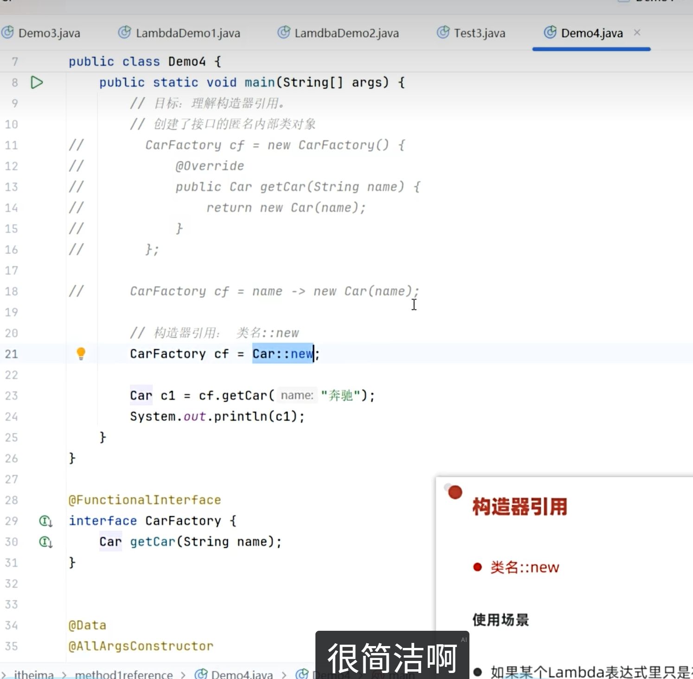

可以把字符数组转成字符串，方式如图所示。


关于字符串的创建方式，直接创建和new创建，在内存的体现上也有不同，具体不同如图所示。

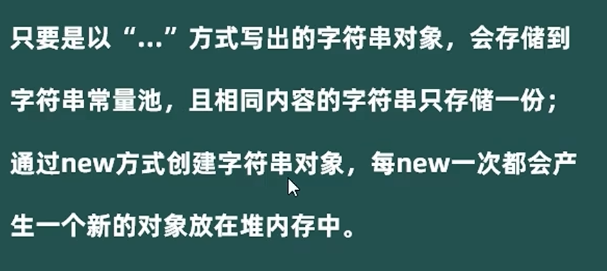

图中的尖括号里的String其实是做一个限定，限定list只能存String类型的数据。如果不加String，就什么都能存，可能不安全。

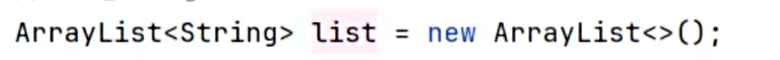

异常就是代表程序可能出现的问题。比如说10/0就会出现除零错误。

Java已经将常见的问题做了归类，每一种问题都有一个异常的对象去代表。其继承体系及其解释如图所示。运行时异常在编译阶段不会出现错误提示（可粗略理解为写代码的时候），只有在运行到时才会出现错误，并停止整个程序。

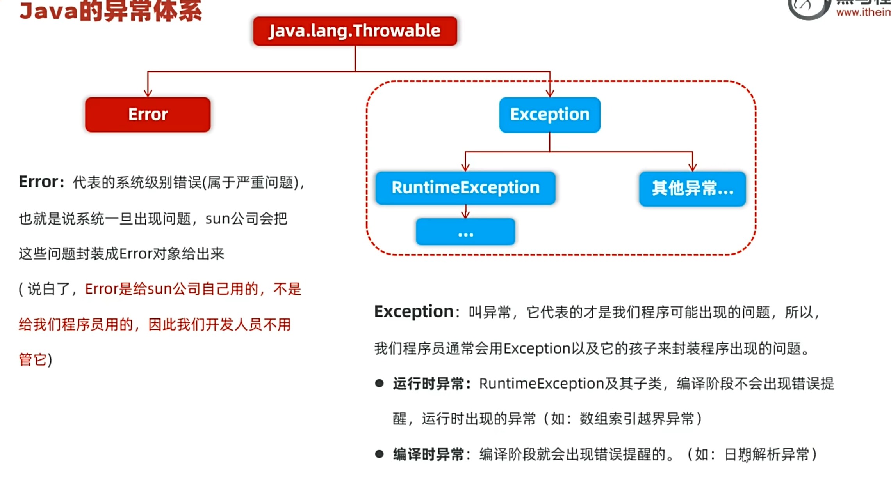

编译时异常的基本处理涉及到两种方案，一种是抛出，一种是捕获。抛出是在本方法里不处理，层层往上，抛给调用者。捕获是在当前方法直接处理这个异常。

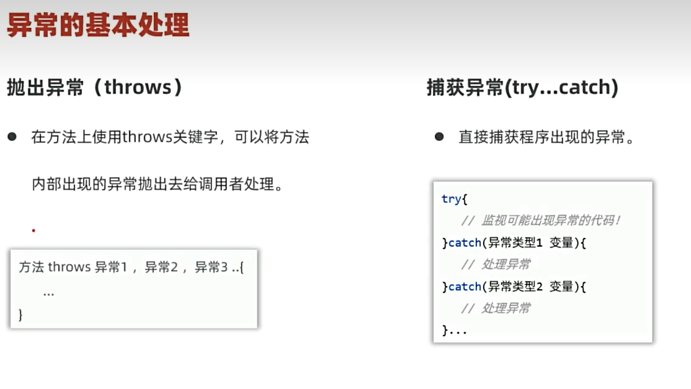

重点讲捕获。try是监视代码，如果出现异常，就会拦截，然后交给catch处理，在catch里写处理逻辑。写这个代码的快捷键是alt+回车。如图所示。


关于异常抛出，其实也有技巧，可以抛给更高层，写一个catch就可以了。如图所示。


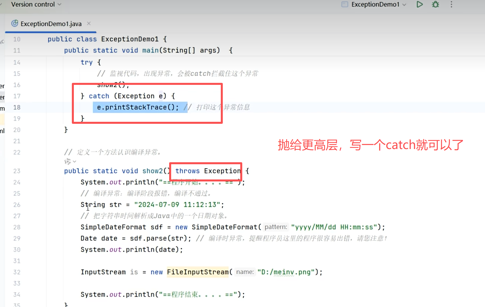

异常的作用是1、定位bug的关键信息。2、作为一种特殊的返回值，以便通知上层调用者。如图所示，在div方法里如果检测到除数为0，就把异常throw回去，告诉调用者。

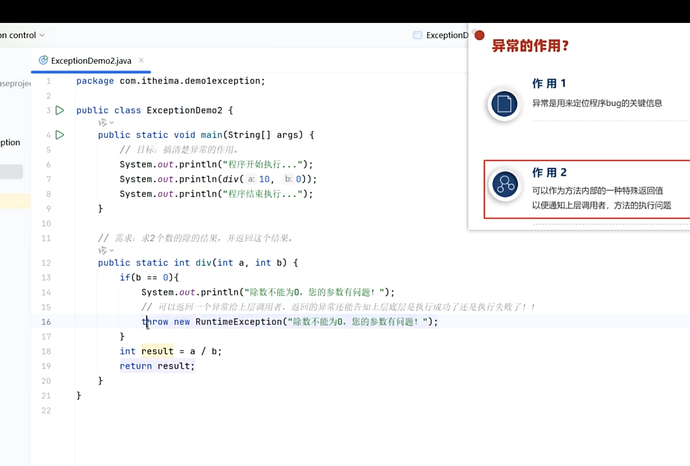

上面这种方式，可以抛编译时异常，更强烈，在编译时就强制要求处理。


值得注意的是，try-catch可以保证程序继续运行，如图所示，异常后面的“程序结束执行”还是运行到了。补充一下，异常信息是在后面才打印出来，看似不符合代码逻辑，实际上是因为e.printStackTrace是交给另一个程序执行，这个程序执行得慢一点，所以会在后边才打印出来，实际的代码运行顺序是没有问题的。


自定义异常：Java不可能归类世界上的所有异常。如果遇到特定异常（一般是业务需要，比如未满18岁），想通过异常来表示，就需要自定义异常类。自定义的异常类也需要继承已有异常，比如说继承RuntimeException就属于运行时异常，继承Exception就属于编译时异常。


自定义异常的写法    如图所示。特别注意，一定要继承，然后重写构造器。

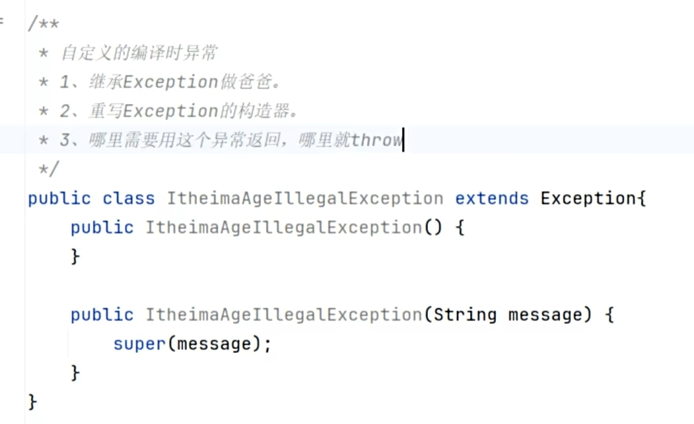

自定义异常的用法如图所示。

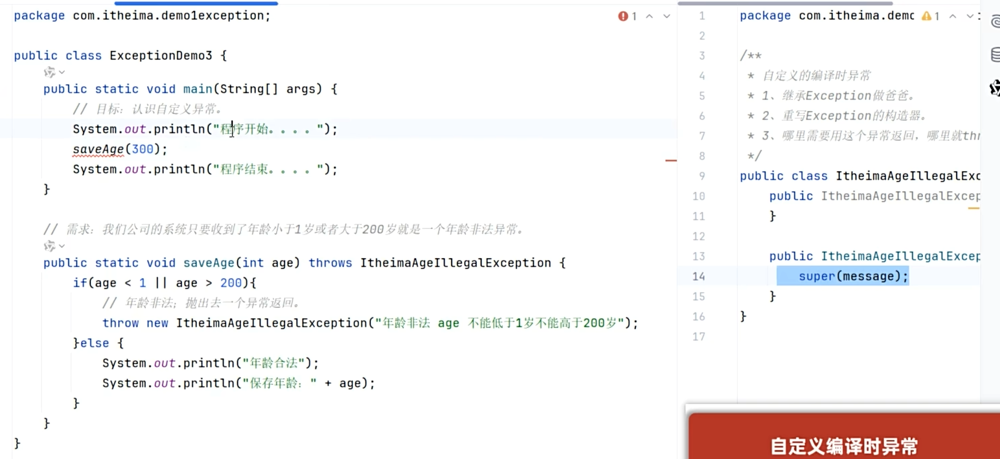

异常的处理方式（一般在catch里处理）：1、先把异常信息记录进日志，然后处理成合适的格式给用户看。2、可以尝试直接处理，比如说加个死循环，如图所示。

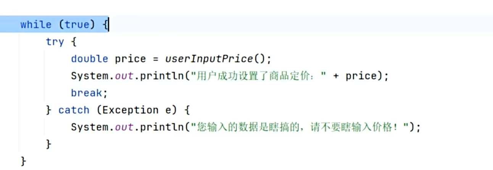

ctrl+alt+t快捷键可以自动生成一些代码如图所示。

当代码出现异常，如果没有 try‑catch 捕获，异常会沿方法调用栈向上抛出。

- 如果是主线程抛出未捕获异常：JVM 收到异常，打印堆栈，终止整个程序。
- 如果是普通子线程抛出未捕获异常：**只会终止该异常线程，其他线程继续运行，JVM 进程不会退出**。

如果异常被`try‑catch`成功捕获，就不会继续向上抛出，执行完 catch 逻辑后，程序继续向后执行；

⚠️ 但如果 catch 块内部再次抛出异常，异常会继续向外传递，依然可能导致线程终止。

泛型的定义及其作用如图所示（最常见的作用就是约束所能操作的数据类型，在编译阶段就约束好了，也就是写代码的阶段）。比方说如果E接了个String，那这个类里面的所有E都会变成String，这样就实现了约束的作用。所以泛型的本质：把具体的数据类型作为参数传给类型变量。

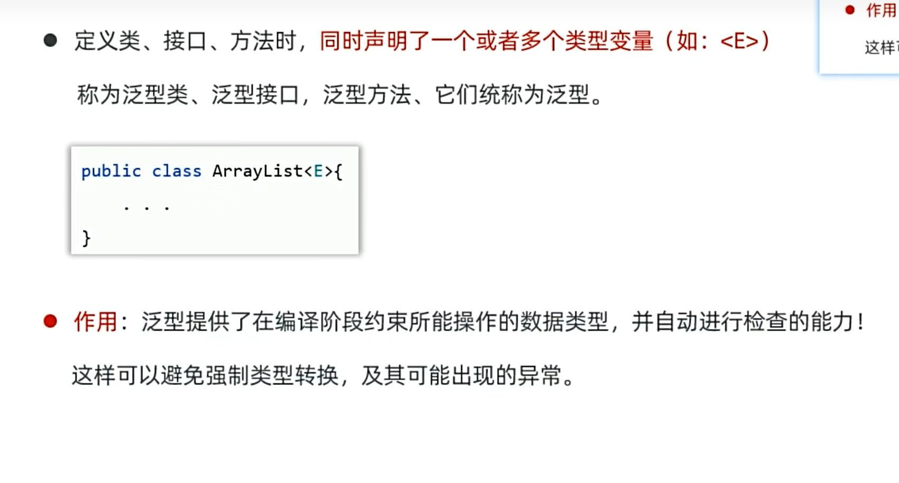

泛型类里的泛型方法写法可以参照下图。

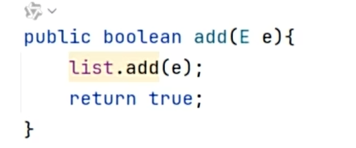

泛型类的类型变量一般用大写英文字母ETKV表示，这是 Java 官方约定俗成的命名习惯，只是**约定别名，不是关键字，换别的字母也能跑**。

| 字母    | 全称      | 含义                                |
| ----- | ------- | --------------------------------- |
| **E** | Element | 元素，多用于集合，代表集合里存放的元素类型，比如`List<E>` |
| **T** | Type    | 类型，通用的任意类型，普通泛型类最常用，`Class<T>`    |
| **K** | Key     | 键，代表 Map 里的**键**，`Map<K,V>`       |
| **V** | Value   | 值，代表 Map 里的**值**，`Map<K,V>`       |


泛型接口的定义方式如图所示。比方说一个接口有一个抽象方法要增加数据，可能增加老师类型的数据，也可能增加学生类型的数据，此时，用泛型就很方便，一个接口就可以了。


由下图，我们还可以进一步加深对泛型的理解：某种不确定的抽象的数据类型，地位等价于void、int、String等。


针对自定义泛型接口，如果要实现这个接口，在implements时就要指定类型，如Data <Student>，具体写法如下图所示。


泛型方法的定义方式如图所示

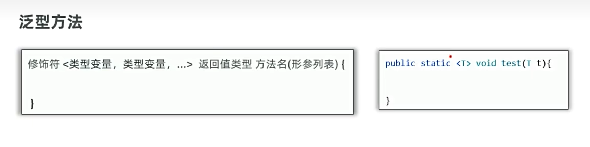

需要注意的是，下图的不是泛型方法，只是用泛型类里的类型变量


泛型方法的作用之一就是提高方法的复用性，如图所示，一个打印方法，可以打印字符串数组，也可以打印Student类型的数组，用泛型去接参。


泛型方法还有一种写法（返回值类型也写成泛型），主要是用于有返回值类型的方法，也可以用泛型，具体如图所示


通配符的定义及其使用方法如图所示。这里的需求是开发一个飞车游戏，有很多厂家的车，然后他们的共同行为都是比赛，所以有一个go方法，这个go方法要接很多厂家的车，不能写死单一厂家，这个时候，就可以用通配符去表示，就可以接很多种厂家的车了。需要注意的是，通配符是在使用泛型的时候用的，前面熟悉的ETKV是定义时使用的，不是使用。

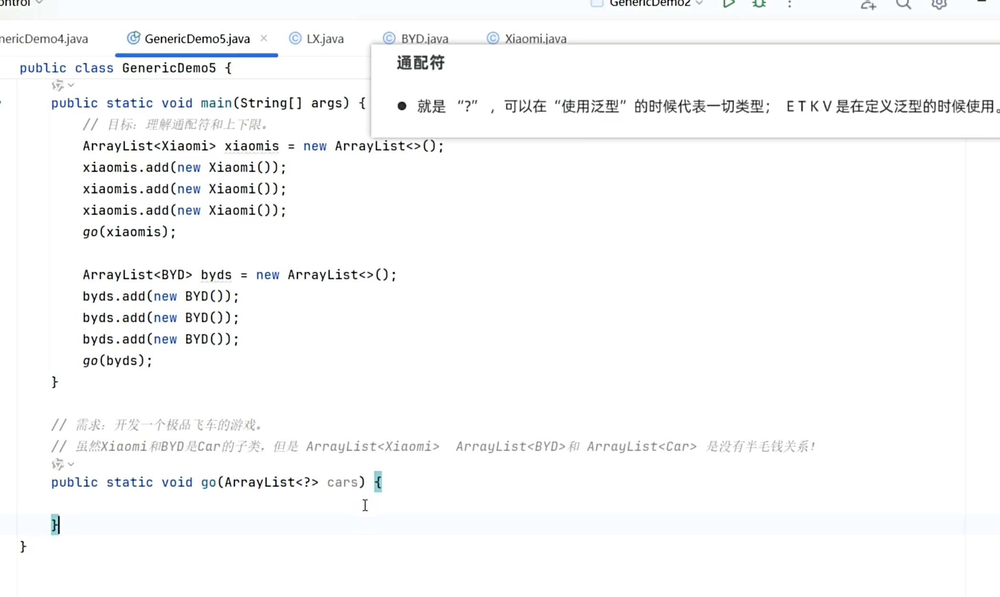

但是通配符也有缺陷，比方说这个go方法，原本是给车用的，但Dog不是车，也可以用这个方法，这是不合理的，这个时候，就出现了“泛型的上下限”，具体使用方式如图所示。

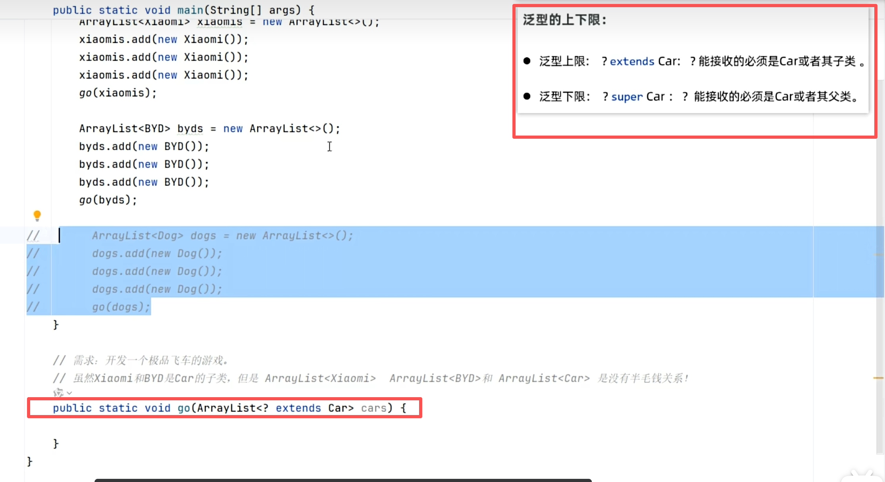

值得注意的是，泛型不支持基本数据类型，只能支持对象类型(引用数据类型)如图所示。这是因为泛型擦除。泛型擦除指的是泛型工作在编译阶段，等编译后泛型就没用了，所有泛型在编译后都会被擦除，所有类型会恢复成Object类型（简单来说，就是里面的E都会变成Object），而Object是对象类型，无法直接指向一个基本数据。

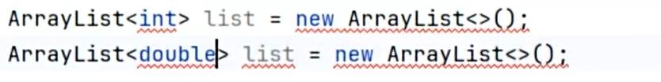

但如果我们非得让泛型也接基本数据类型，这个时候就要把基本数据类型包装成对象的类型，这个概念就叫做包装类，如下图所示。


包装类的语法如下图所示。

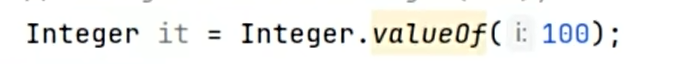

但上面这种语法吗，太麻烦了，Java中有自动装箱和自动拆箱，如下图所示


自动装拆箱的语法如下图所示。


这个时候，就可以用包装类去做泛型了，就可以接基本数据了，但需要注意，下图的123实际上是以对象的形式放进list，是自动装箱实现的。


包装类还具备一些额外的功能，如把基本类型的数据转换成字符串，把字符串转成基本数据类型。如下二图所示。


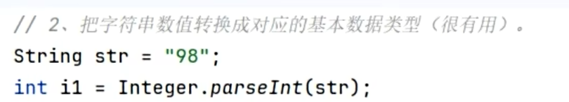

集合是一种容器，用来装数据的，类似于数组，但集合的大小可变，开发中也非常常用。比如说ArrayList就是一种集合。

集合大概可以归为两类：Collection、Map，其性质如图所示。


Collection家族有其特点，顶层一般是接口，底层是实现类。具体细则如图所示。图中的“有序”指的是插入顺序，比如说先插张三，那先查出来就是张三。这里的索引，指的就是编号，可以类比数组。

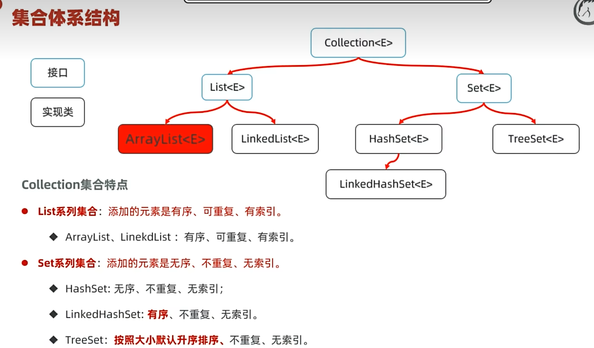

Collection的常用方法如图所示，不用完全掌握，了解即可，需要用到可通过自然语言让AI写。


迭代器的定义及其常用方法如图所示。值得注意的是，迭代器其实也是一个对象，用于遍历Collection集合。迭代器只能用于遍历集合，不能用来遍历数组。


迭代器的获得及其使用方式如图所示。值得注意的是，迭代器的起始位置就是首位，.next的意思是获得当前位置的元素，然后迭代器向后移。hasNext的意思是问问当前位置有没有元素。这里的得到迭代器，是通过具体的集合（如names），去获得专属的迭代器对象，然后赋给一个合适的变量。

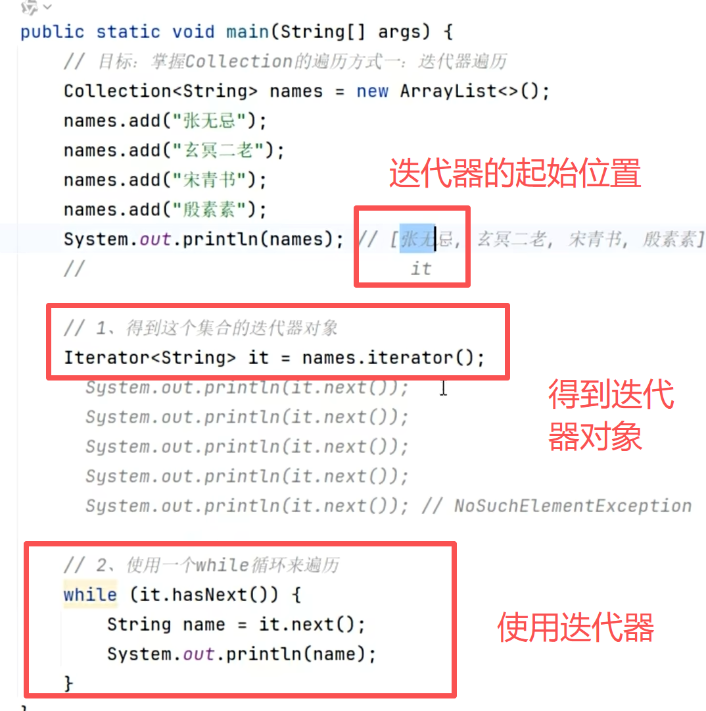

增强for循环可以遍历集合或者数组。其定义及其语法如图所示。


也可以用Lambda表达式去遍历集合，值得注意的是，其内部依旧是增强for循环。这里的Lambda表达式，实际上是个匿名内部类，然后重写了一个方法。

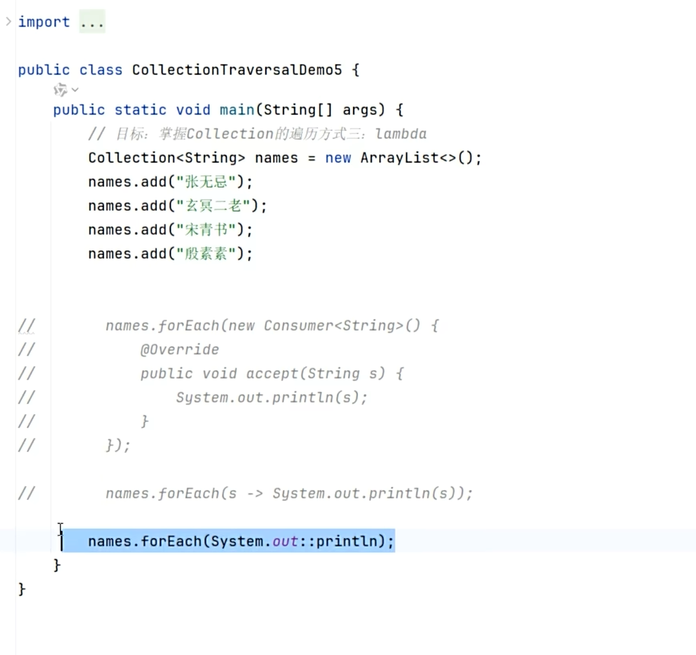

遍历集合的同时又存在增删集合元素的行为时可能出现业务异常，这种现象被称之为并发修改异常问题。比如图中这个需求，删除集合里所有带枸杞的元素，结果删不干净。这是因为，i走到宁夏枸杞的时候，检测到有枸杞，删除，然后黑枸杞补上来，但i接着往下走了，这个时候，黑枸杞就略过了，就没删干净。

上面这种情况，最简单的解决办法就是删掉之后i--


也可以倒着遍历去删除，这样子就不会出现这种问题了，但前提是该集合支持索引（这里的索引可以类比数组）。

上面这种情况，如果使用迭代器遍历，直接越过迭代器，直接操作集合本身，会触发并发修改异常问题。这个时候，不越过迭代器，使用迭代器本身方法去删除，就不会出现这种并发修改异常问题。


上面这种情况，增强for和Lambda都无法解决该问题，因为增强for是基于迭代器实现的，但增强for又无法拿到迭代器对象本身，只能越过迭代器直接去删除元素，这个时候就会出现并发修改异常问题，而Lambda就好理解了，因为他是基于增强for去实现的，所以也无法解决该问题。

迭代器的优势是支持遍历不带索引的集合。

List集合的特有方法如图所示。


ArrayList和LinkedList在功能上是完全一样的，但其底层实现采用的数据结构不一样，应用场景也不同。其底层采用的数据结构如图所示。


ArrayList的优点是根据索引查询数据速度快，但增删数据效率低，可能要把后面的很多数据往前移。因为其底层是通过数组来实现的，优缺点与数组类似。

而LinkedList数组的优点就是增删数据效率高，但查询速度慢，无论查询哪个数据，都要从头开始查，而且比较占内存（因为要存地址）。因为其底层是通过链表来实现的，其优缺点与数组类似。

更准确来说，LinkedList是基于双链表去实现的，有双指针，对首尾元素进行增删查改的速度是极快的。因此LinkedList加了很多首位操作的特有方法。因此，LinkedList还可以用来模拟队列或者栈。


Set集合的特点如图所示。尤其要关注这里的无序指的是什么。而这里的排序，指的是默认从小到大排序。

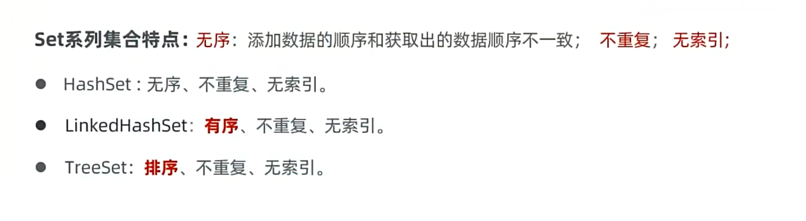

哈希值：一个int类型的随机值，Java的每个对象都有一个哈希值，可以将哈希值近似理解为地址，但其实不是地址，只是近似理解。

不同对象的哈希值大概率不相等，但也有可能相等（哈希碰撞）

HashSet是基于哈希表存储数据的。其底层原理如图所示。增删查改的性能都比较好


HashSet的无序，是因为存对象时，根据哈希值算出数组索引位置，然后存进去，而要存的对象的哈希值是随机的，所以索引位置也是随机的，自然就无序。而不可重复，是因为相同对象的哈希值是相同的，对应的索引位置也相同，然后底层会有一个相同判断，如果相同，就不理会，如果不同，就会在当前索引位置形成一个分支链表（这也解决了哈希碰撞的问题）。

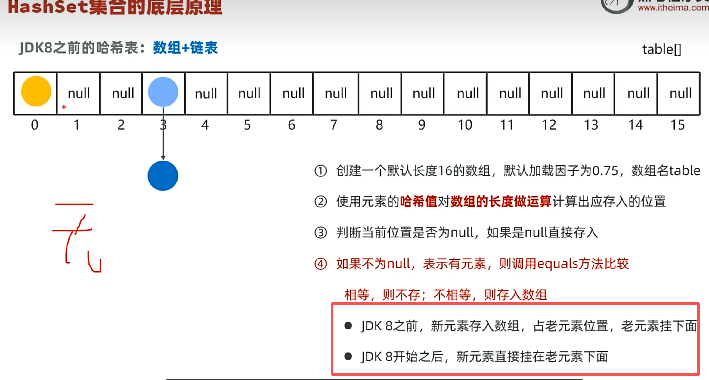

从JDK8开始，哈希表引入了红黑树（小的在左边，大的在右边）。


值得注意的是，下图的左边，需求是根据对象里的内容，基于HashSet进行去重，但因为都是不同的对象，直接使用HashSet是无法去重的。这个时候，就要去到对应的类里面（这里是Student），重写hashCode和equals方法（alt+insert）。根据内容去生成对象的哈希值。

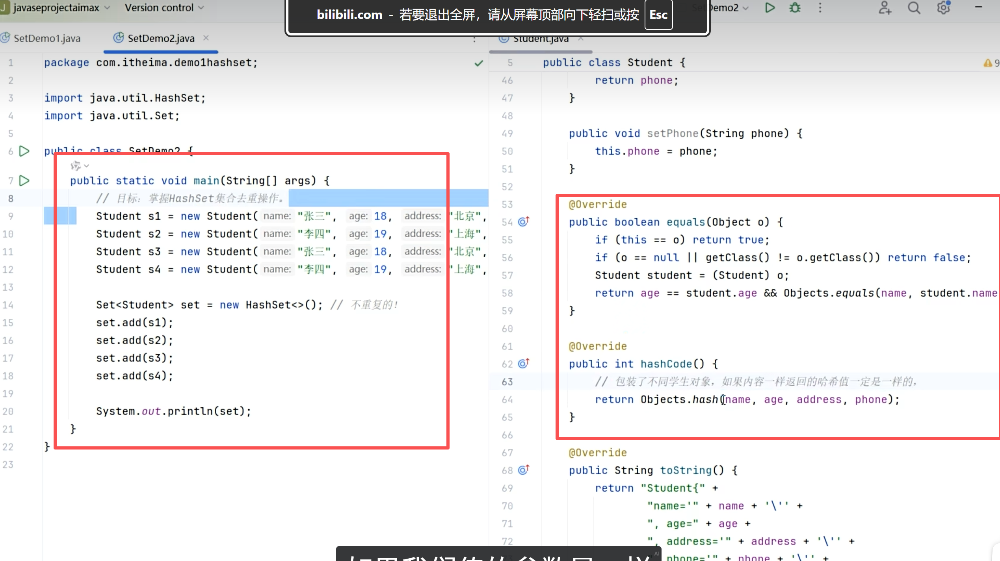

linkedHashSet是有序的，其依旧是基于哈希表实现，但是它的每一个都多了一个双链表，因此有序，具体如图所示。但是也更浪费内存。


TreeSet集合是基于红黑树实现的，故而可排序。其特点如图所示。

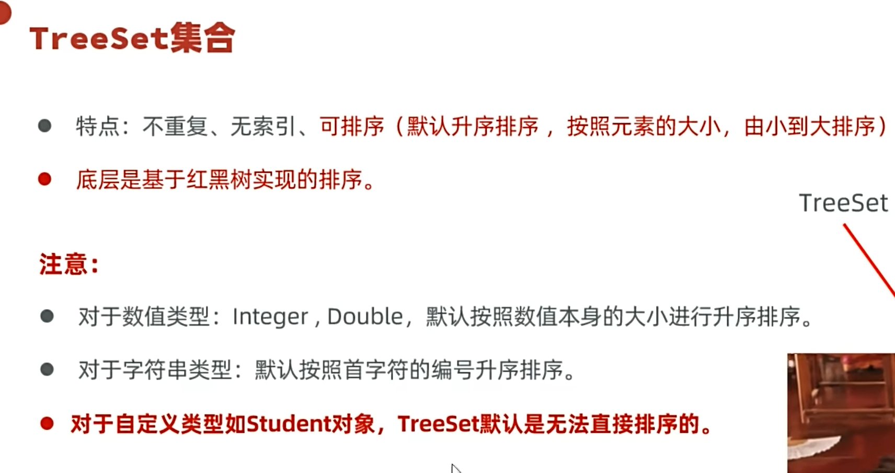

如果TreeSet存的是自定义的对象，还要指定排序规则（重写），否则会报错，重写语法如图所示（在要比较的类里重写）

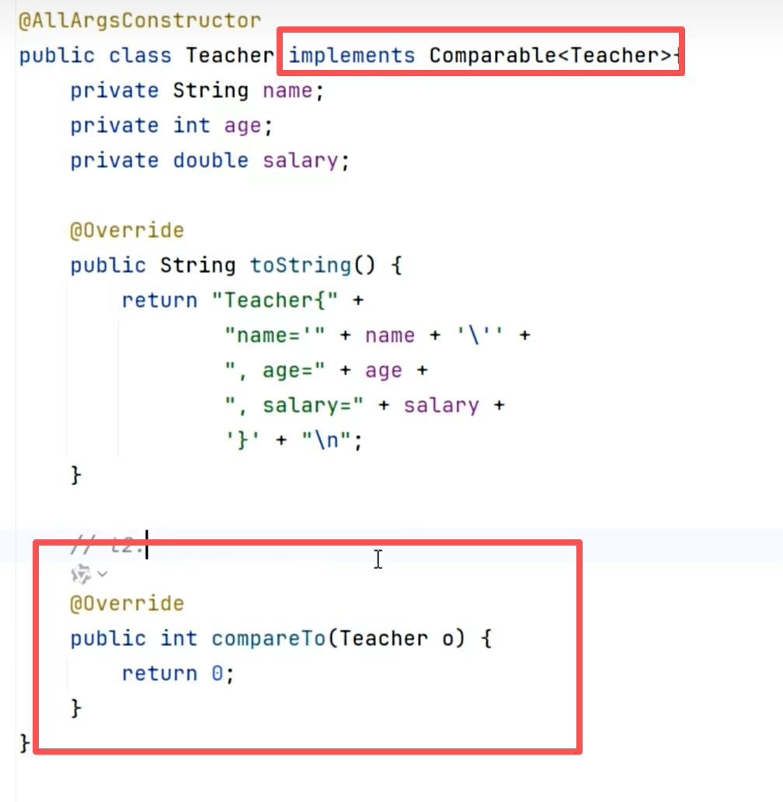

重写规则如图所示，是拿第二个对象的compareTo方法与第一个对象比。

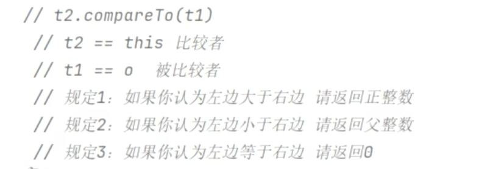

但要注意了，这种自定义规则，确实能排序自定义对象了，但也会影响TreeSet存数据的流程，因为存数据时需要判断是否相等，然后去重，也要用到这里面的方法，如果两个不同对象的指定值相同（排序逻辑里提到的制定值），可能会不存（Set集合的特性，相同的就不存了）

当然，也不一定要在类里面重写比较规则，可以利用TreeSet自带的Comparator比较器，然后实现比较器里的比较方法。

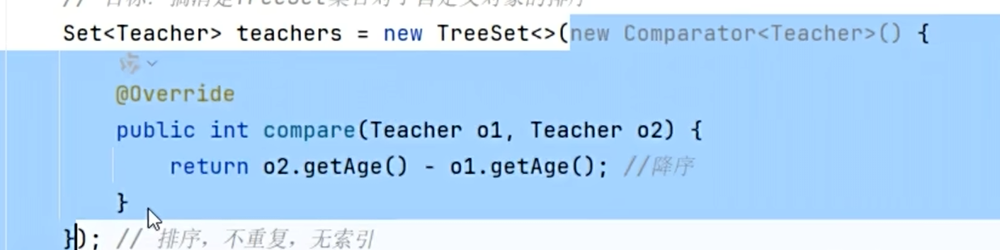

这些单列集合的使用场景如图所示。

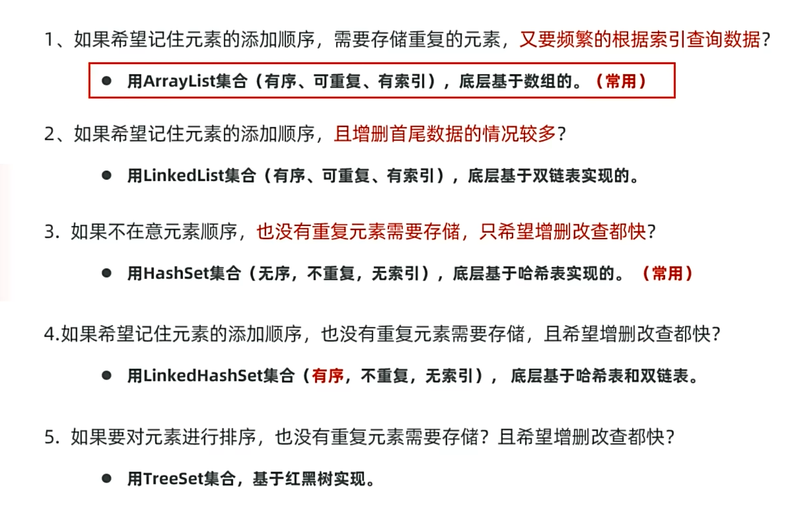

Map集合是双列集合，也被成为键值对集合，其特性如图所示。


需要存一一对应的数据的时候，就可以用Map集合来做。比方说购物车，一个商品，买了两件，这个时候，就是商品1=2，是一一对应的数据。

Map集合的体系特点如图所示

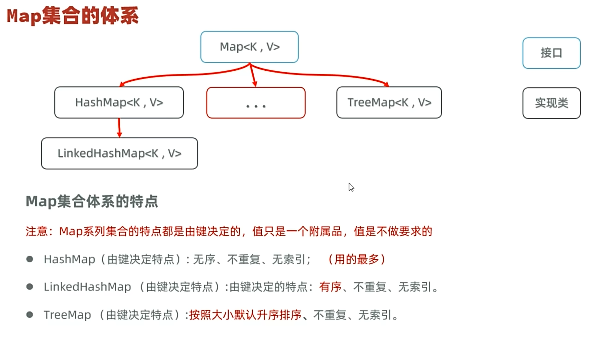

Map的创建、基本使用语法、特点，在代码层面的体现，如图所示。

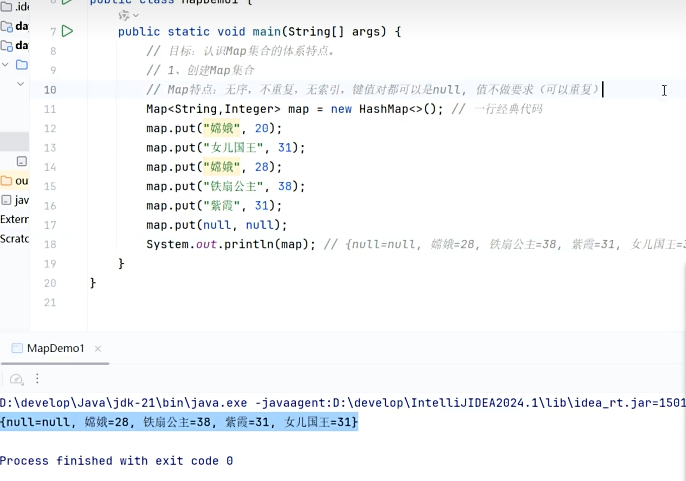

Map集合的常用方法如图所示

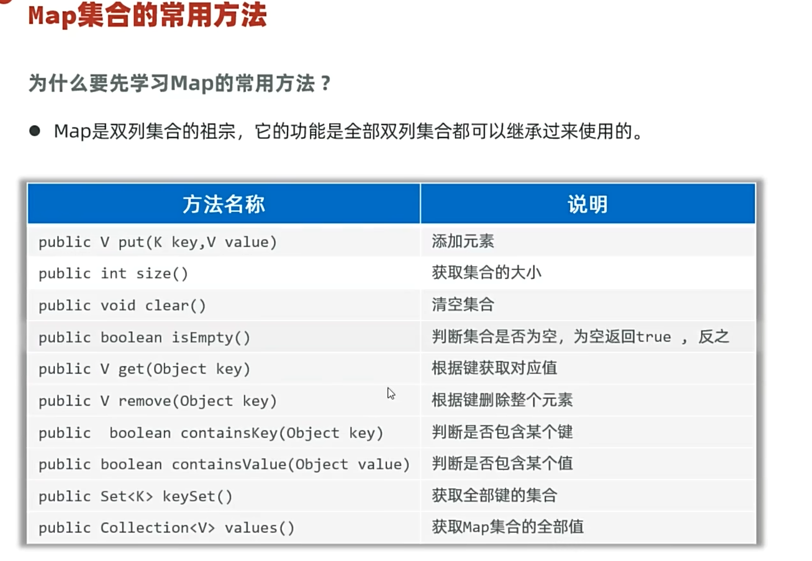

键找值的Map集合遍历方式：核心思想是把所有的键放到一个set集合，然后再遍历这个set集合，同时找值。具体写法如图所示。

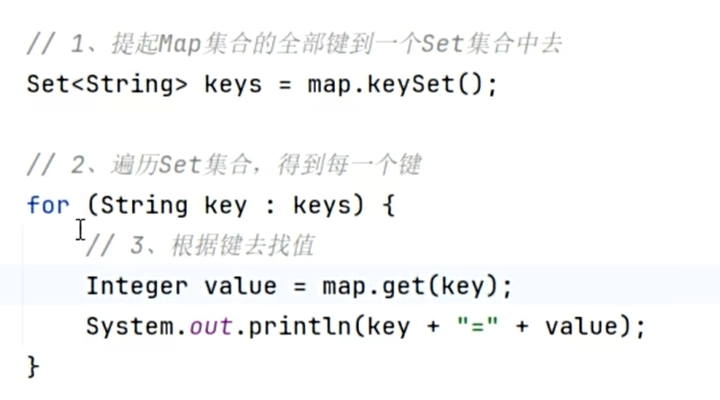

键值对的Map集合遍历方式：核心思想是把每一个键值对都单独看作一个对象，然后存到Set集合里，然后这些对象对应的类，就是其类型，这个时候就可以用增强for循环去遍历。在实操中，把键值对包装成对象这一操作，我们是通过Map集合自带的entrySet()方法实现的。具体的写法如图所示。

还可以用Lambda的方式去遍历Map集合，但是要用到Map自带的一个forEach方法，需要传一个对象进去，这个对象要重写accept方法，可以通过匿名内部类的方式写出来，具体如图所示。右边的是forEach的源码，可以看到，其底层还是通过封装键值对对象的方式去遍历的。


上面的左边的写法还可以简化为下图这样。


实际上：原来学的Set系列集合的底层就是基于Map实现的，只是Set集合中的元素只要键数据，不要值数据而已。所以Set集合和Map集合的特点几乎一样。

Stream流的用法如下图所示，可以看到，在图示需求里，对比于传统的遍历方法，Stream流写出来的代码更简洁。可以把Stream流理解成一条流水线，然后集合的元素可以防在这条流水线上，这条流水线会有一些功能，比如说对元素进行筛选和处理。

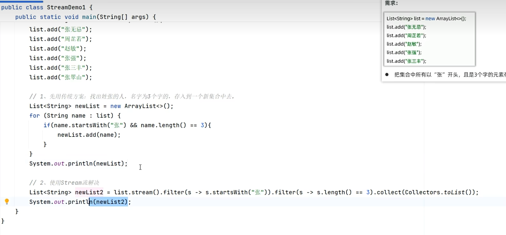

Stream的特点如图所示。

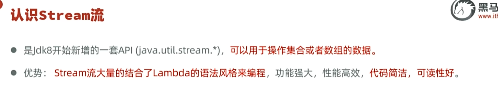

Stream的使用步骤如图所示。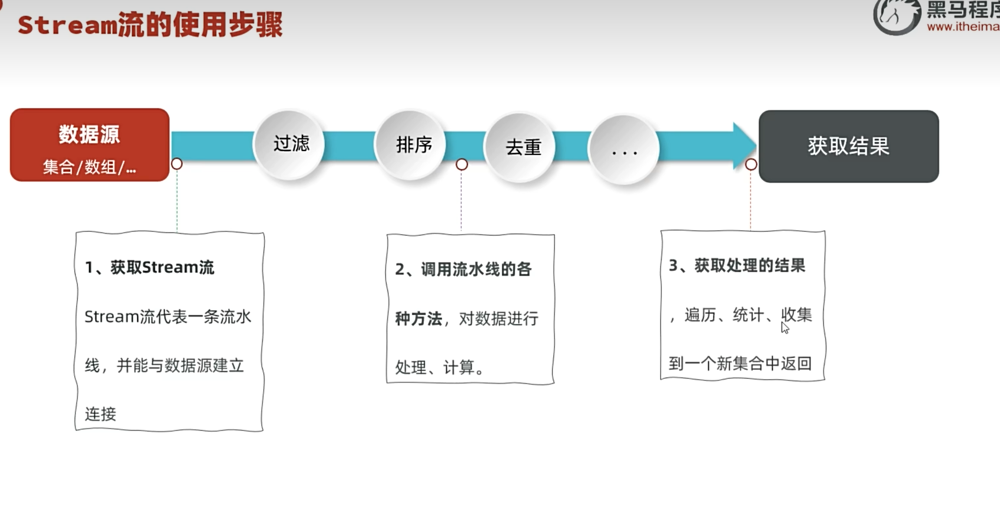

Collecting集合与Map集合获取Stream流的代码如下图所示


数组获取Stream流的代码如下图所示


可变参数是 Java 5 引入的语法特性，允许一个方法**接收 0 个、1 个或多个同类型的实参**，本质是对数组的语法糖封装。

#### 1. 语法格式

```
修饰符 返回值类型 方法名(参数类型... 参数名) {
    // 方法内部按数组方式使用该参数
}
```

示例：写一个支持任意数量整数求和的方法

```
public static int sum(int... numbers) {
    int total = 0;
    // 可变参数在方法内就是数组，直接遍历即可
    for (int num : numbers) {
        total += num;
    }
    return total;
}

// 调用方式非常灵活
public static void main(String[] args) {
    sum();              // 传0个参数，numbers是长度为0的空数组
    sum(10);            // 传1个参数
    sum(1, 2, 3, 4);    // 传多个参数
    sum(new int[]{1,2,3}); // 直接传数组也完全兼容
}
```

#### 2. 核心本质

编译器在编译阶段，会把可变参数自动转换成**对应类型的数组**。也就是说 `int... numbers` 和 `int[] numbers` 在字节码层面几乎没有区别，只是可变参数允许调用时更简洁地写多个值。

#### 3. 硬性规则

- 一个方法**只能有一个**可变参数

- 可变参数必须放在方法参数列表的**最后一位**，否则编译报错
  
  - 错误：`public void test(String... strs, int num)`
  - 正确：`public void test(int num, String... strs)`

- 方法重载时，会优先匹配固定参数的方法，匹配不到才会走可变参数方法

#### 4. 常见误区

调用时不传任何参数，可变参数是**长度为 0 的空数组**，不是 `null`，直接遍历不会触发空指针异常。

Stream流常用的中间方法如图所示。中间方法指的是调用完之后，会返回新的Stream流，可以继续使用，支持链式编程。


Stream流常用的终结方法如图所示。总结方法指的是调用完后，不会返回新Stream了，没法继续使用了。

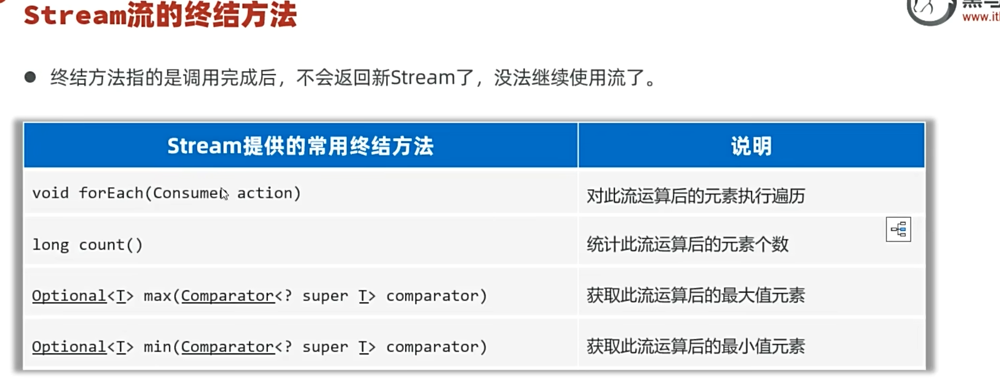

Stream流处理后的结果，要转回到集合或者数组，这称为收集Stream流，其常用方法如图所示。

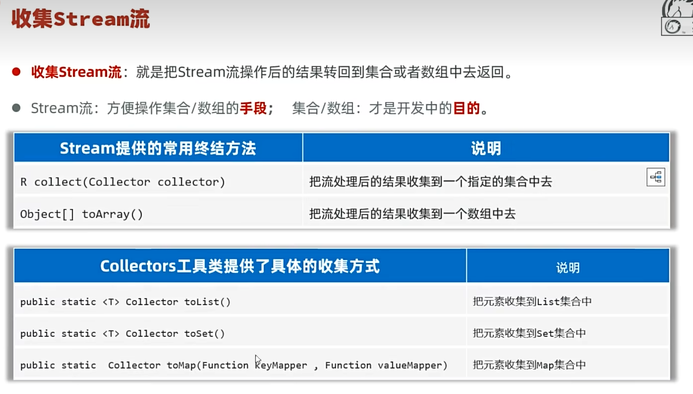

收集Stream流的写法如图所示。而且流只能收集一次。


File是java.io.包下的类，File类的对象，用于代表当前操作系统的文件(可以是文件、或文件夹)。注意:File类只能对文件本身进行操作，不能读写文件里面存储的数据。读写数据需要的是IO流。

File类的对象可以代表文件/文件夹，可以调用其提供的方法对对象文件进行操作，创建File类的对象的方法如图所示。

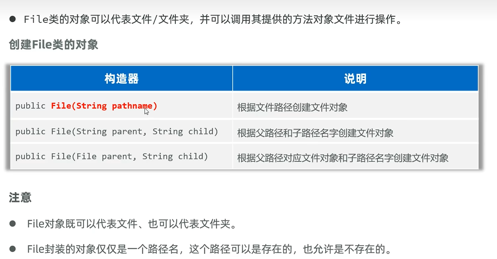

File常用的方法如图所示。

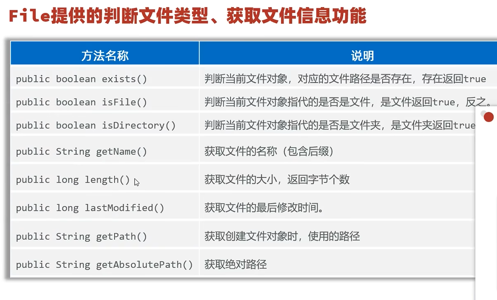

File也分绝对路径和相对路径。具体如图所示


相对路径的具体写法如图所示。


注意，File的delete方法默认只能删除文件和空文件夹，删除后不会进入回收站。

File常用的遍历文件夹的方法如图所示。

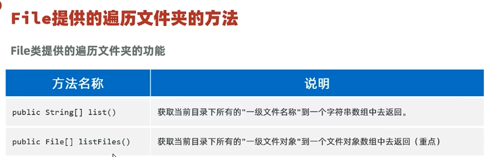

使用listFiles()方法时的注意事项如图所示。

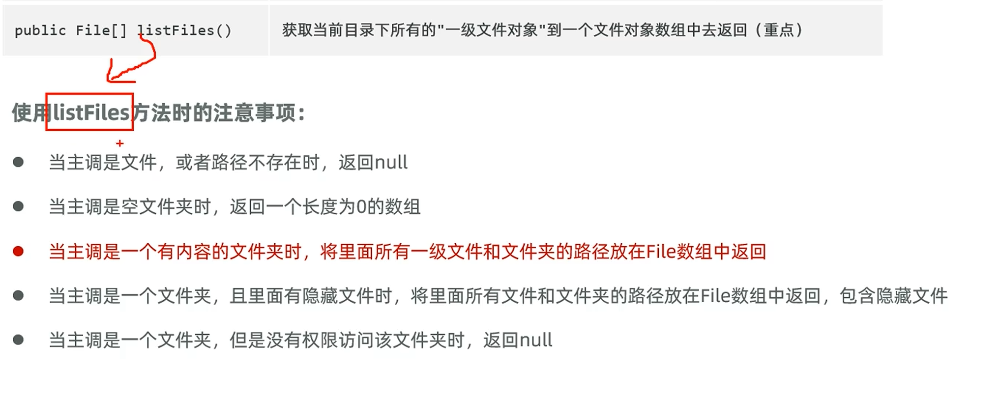

递归的定义如图所示。如果控制不好，递归可能出现死循环，导致栈内存溢出（因为方法是在栈里运行的）。


递归算法的三要素如图所示


计算机存字符的方式：先人为规定，把字符跟特定数字建立连接，然后把特定数字转成二进制，然后存进计算机里。图示是ASCII，是美国用的，因为美国的字符比较少，所以一个字符对应一个字节就够用了，且开头都是0。


中国常用的字符集是GBK，一个中文字符编码成两个字节的形式存储。细节如图所示。

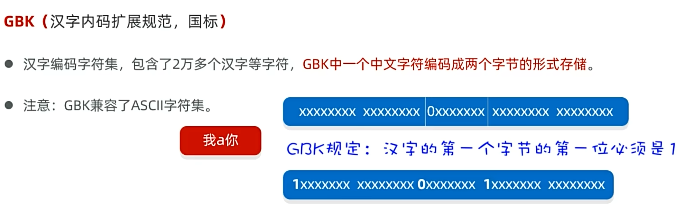

但上面两种字符集，不通用，然后现在有一套世界通用的字符集UTF-8，细节如图所示

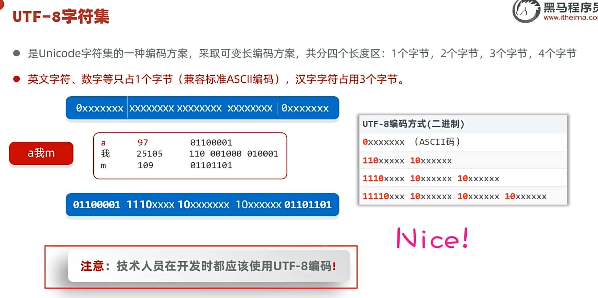

三种字符集对比如图所示。

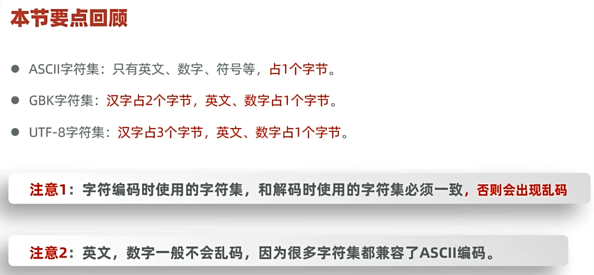

对字符进行编码和解码用到的方法如图所示。


编码和解码的示例代码如图所示。

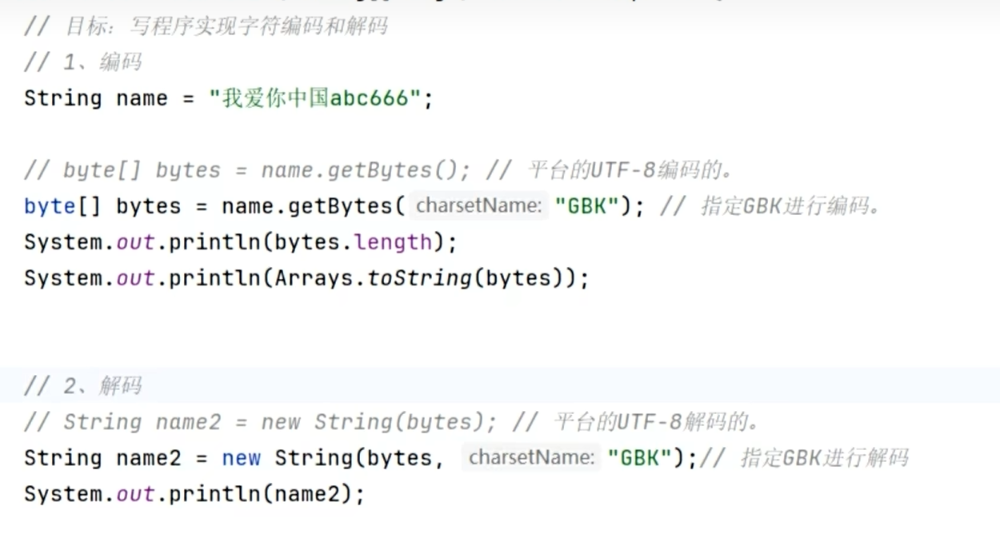

IO流的I是input，负责把磁盘/网络里的数据读取到内存。O是output，负责把内存的数据写道磁盘/网络。因为我们的程序是运行在内存里的，所以出/外是相对于内存而言的。

IO流的分类如图所示。字节输入流指的是，将磁盘/网络的数据，以一个一个字节的形式输入到内存，字符输入流是一个一个字符的形式。其他的以此类推。


FileInputStream的常用方法如图所示。


字节输入流示例代码如图所示。但是这种代码有缺陷，每次读取一个字节，会导致汉字乱码，因为汉字不止一个字节。


可以用字节数组，一次性读取多个字节，示例代码如图所示，可提升效率，但这种方式依旧不能解决汉字乱码的问题，因为存在截断汉字字节的可能性，这是一个数学问题。

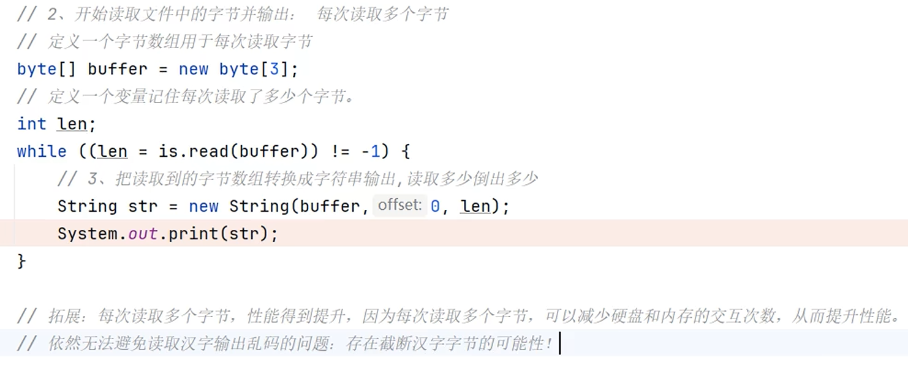

其实可以用readAllBytes()方法一次性读取全部字节到一个字节数组中返回，这样就可以避免乱码的问题，但如果文件很大，就需要定义一个非常大的字节数组，这个时候，就很容易内存溢出。示例代码如图所示。


综上所述，读取文本适合用字符流，这样就不会出现乱码的情况，字节流适合做数据的转移，比如文件复制。

文件字节输出流的构造器及其常用方法如图所示。

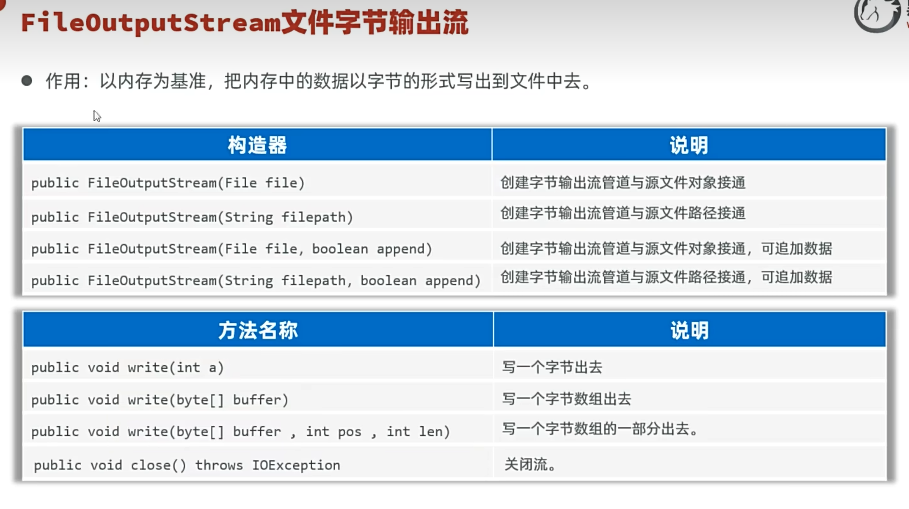

直接写单个文字会乱码，因为write是写一个字节出去，而汉字不止一个字节，应该写一个字节数组出去。

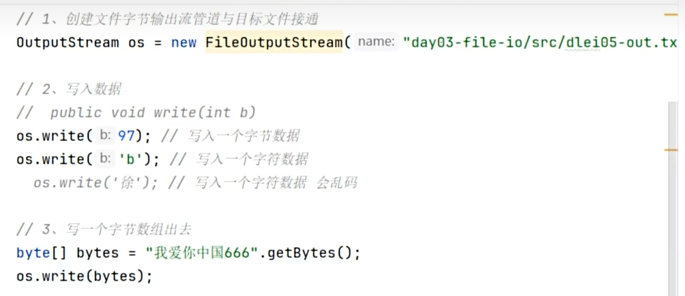

注意，直接建管道会覆盖原来的数据，只有在后面加个true才能表示追加。


用完IO流之后，要用.close()关闭流，不然就会一直占用硬件资源。

关闭流，专业的做法是放在try-catch-finally的finally代码区里，如果直接放在普通代码的底部，可能代码中间抛异常，就导致执行不到close。finally代码区的特定如图所示。

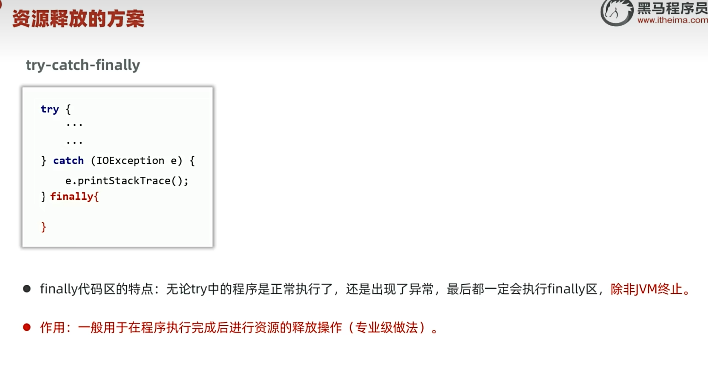

图示代码就是比较完美的释放资源的做法，fis和fos对象要放在try-catch-finally外面，如果放在try里面，finally就无法调用fis和fos，因为此时fis和fos是局部对象。


虽然上面那种缩放资源的方法比较完美，但是太臃肿了，于是我们可以使用下图的释放资源的方法，在try后面加一个小括号，把资源放在里面，用完后，会自动调用其close方法将其关闭。


资源的定义如图所示，资源一般指的是最终实现了AutoCloseable接口。


FileReader文件字符输入流指的是把磁盘/网络里的数据，以一个一个字符的形式读取到内存中去，最小单位是字符。

FileReader的构造方法及其常用方法如图所示。


FileWriter的构造器及其常用方法如图所示。

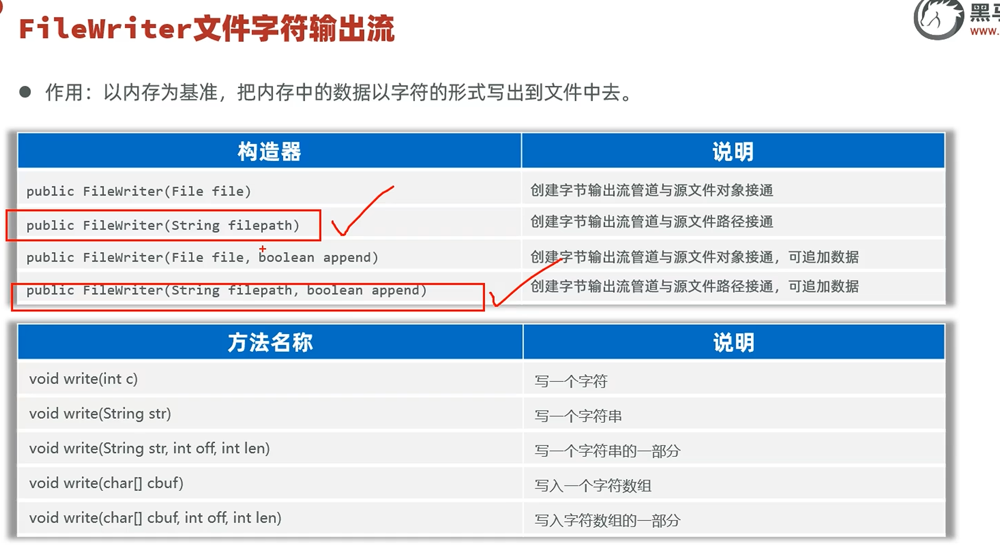

字符输出流写了数据之后，必须刷新流或者关闭流才能生效。如图所示。这是因为输出流为了效率，一开始是输出到内存缓冲区的，还没有直接输出到磁盘，要刷新或者关闭流才会把内存缓冲区的数据正式输出到磁盘。刷新用的是.flush()方法。


缓冲流的体系如图所示。

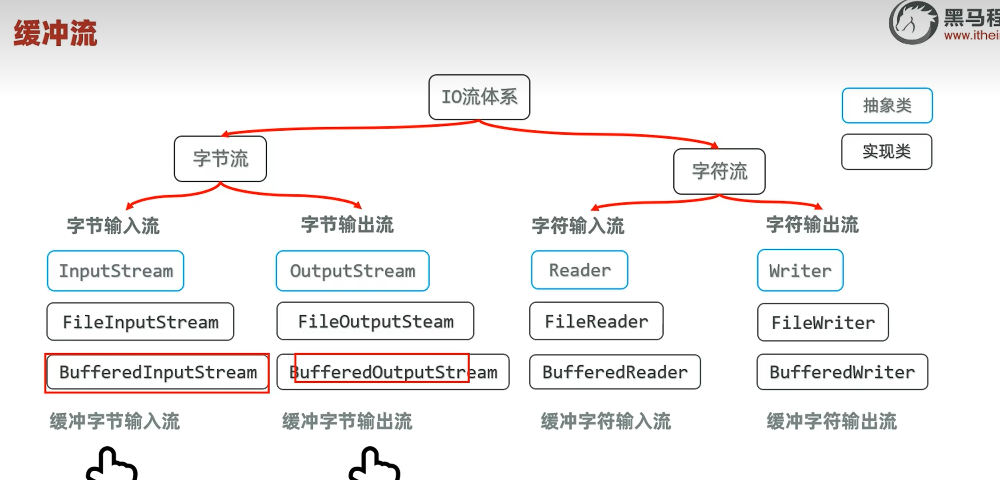

缓冲流类似于缓存，可以加快原始流处理数据的速度。其示意如图所示。


缓冲流的用法是包装原始流，其构造方法如图所示。


包装原始流的示意代码如图所示。

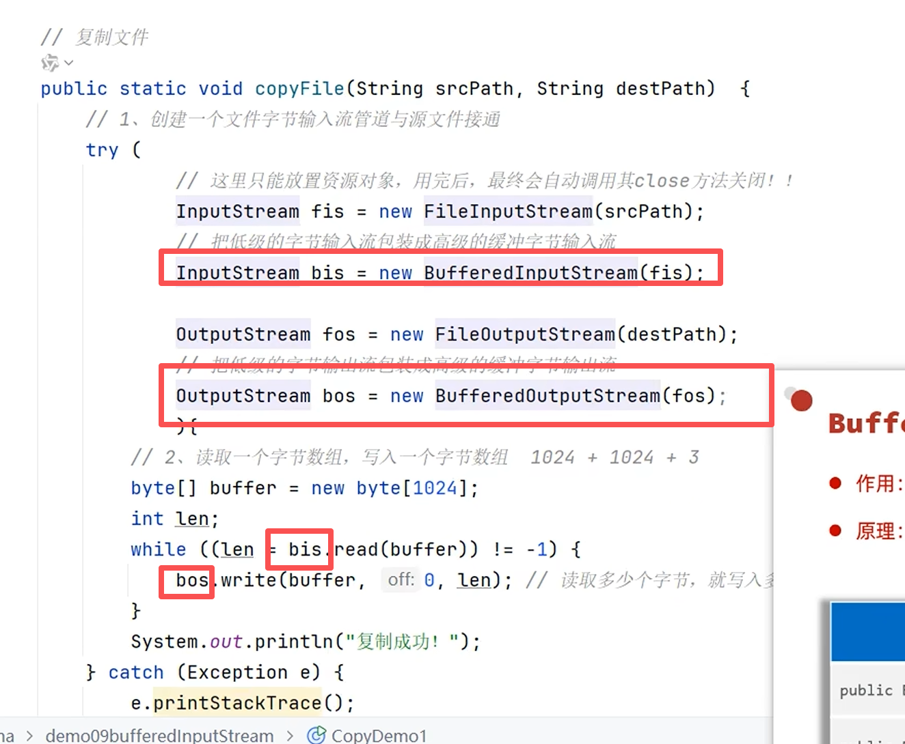

缓冲字符输入流的构造器和独特方法如图所示。这个独特方法可以按行读取字符。

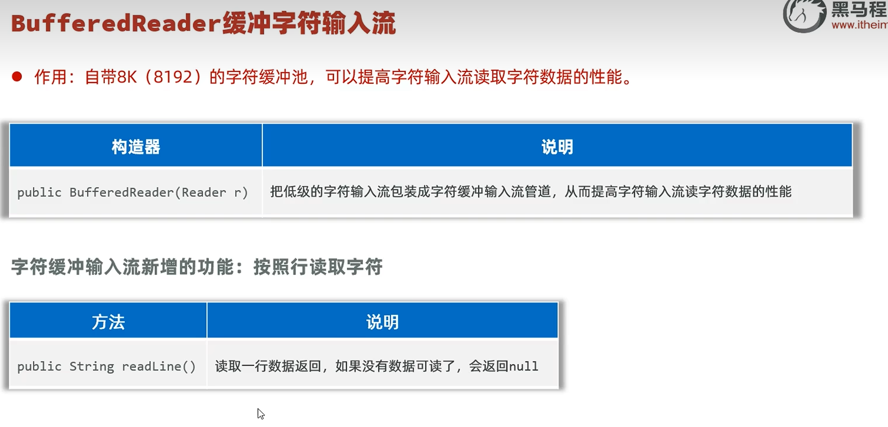

缓冲字符输出流的构造器和独特方法如图所示。这个独特方法可以换行。

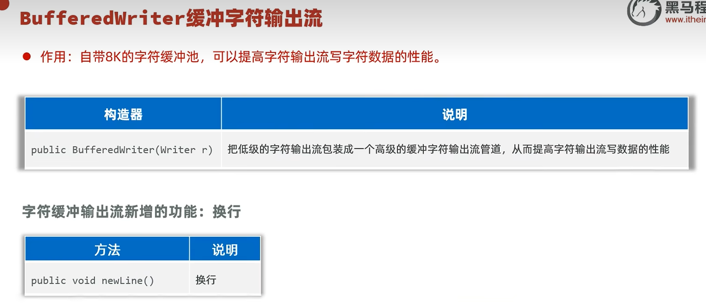

换行的用法如图所示。

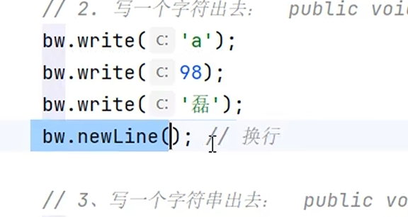

但缓冲流也不一定全情况都快，如果原始流的数组开得大一点，也是能达到缓冲流的效果的。但不是开得越大越好，到后面，提升幅度会减小，而且有爆满的风险。

单纯的字符输入流并不是百分百能解决汉字乱码的问题，如果代码的编码方式（如UTF-8）和文件的编码方式（如GBK）不一样，还是会乱码，因为字符输入流是默认用代码的编码方式去解码。这个时候，就可以用字符输入转换流，先获取文件的原始字节流，然后再按照指定字符编码转成字符输入流（这里的指定字符编码，是文件的字符编码。）

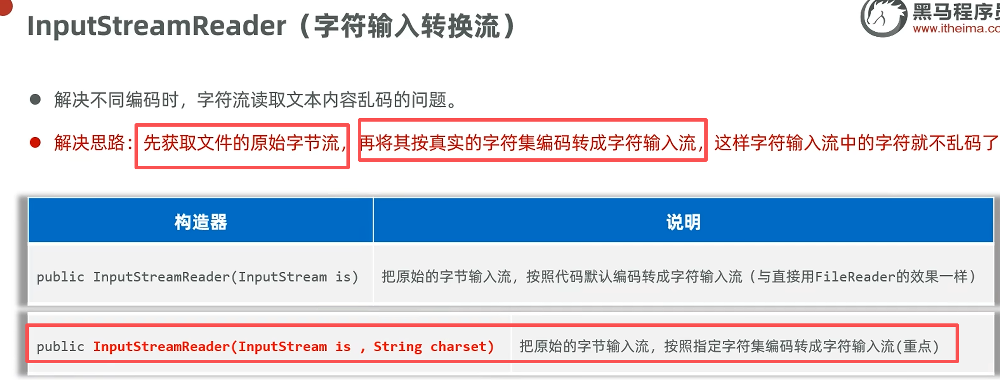

字符输入转换流的示意代码如图所示。

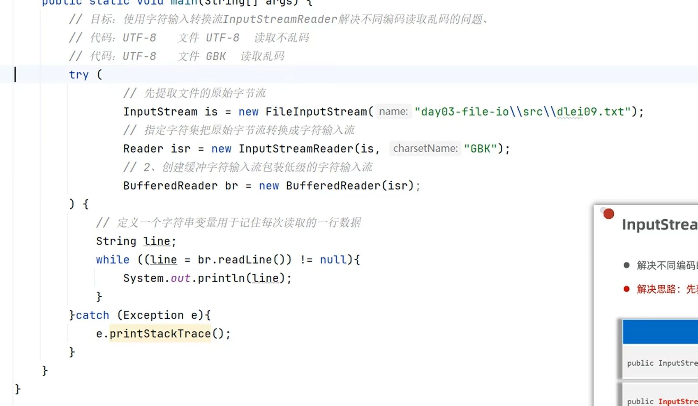

接下来认识打印流，打印流的继承体系如图所示。


打印流最大的作用就是打印啥出去就是啥出去，比方说原来可能出现打印97却出现a的情况，但打印流就不会有这种情况。其构造器及其常用方法如图所示。


打印流的示范代码如图所示。

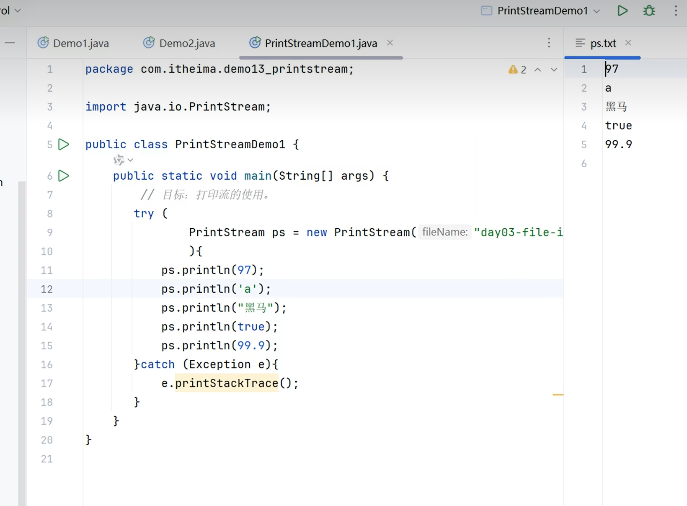

但是上述的定义方式是不可以追加的，如果想要追加，可以包装一个低级管道，在低级管道里附带true参数。


特殊数据流的继承体系如图所示。

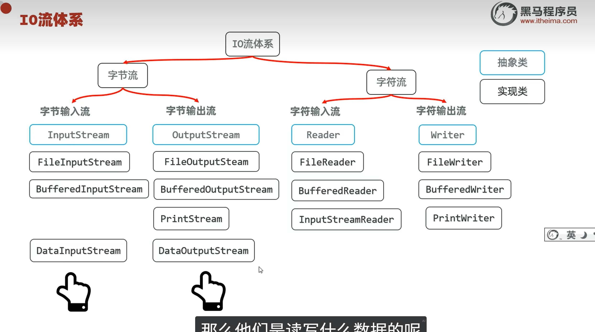

特殊数据流是用来把数据和类型一起写出去的。之前的流，把数据写到磁盘，数据会全部变成字符串，比如写整型97出去，到磁盘就变成了字符串97。而特殊数据流就是用来解决该问题的。其构造器和常用方法如图所示。但是写出之后，看起来会是乱码，但实际上不是乱码，因为其包含了数据类型。不是给人看的，是给机器用的。要注意，发的顺序是什么，读的顺序就必须是什么，不然会乱。常用于通信。

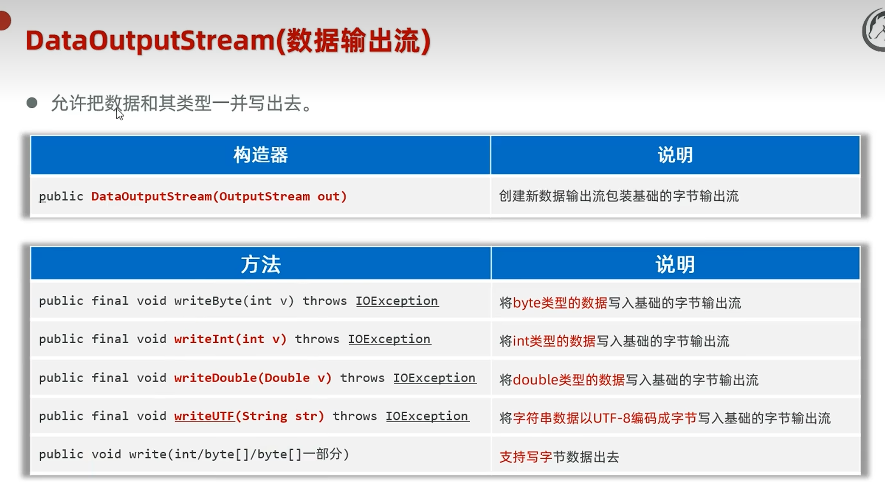

关于框架的定义和具体体现形式如图所示


导入框架的步骤如图所示。

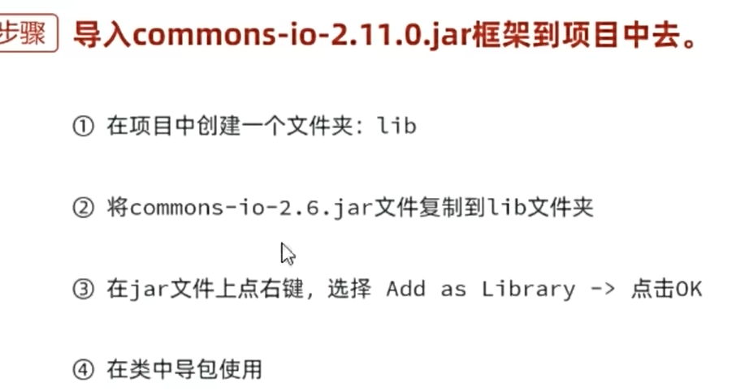

导入的结果如图所示

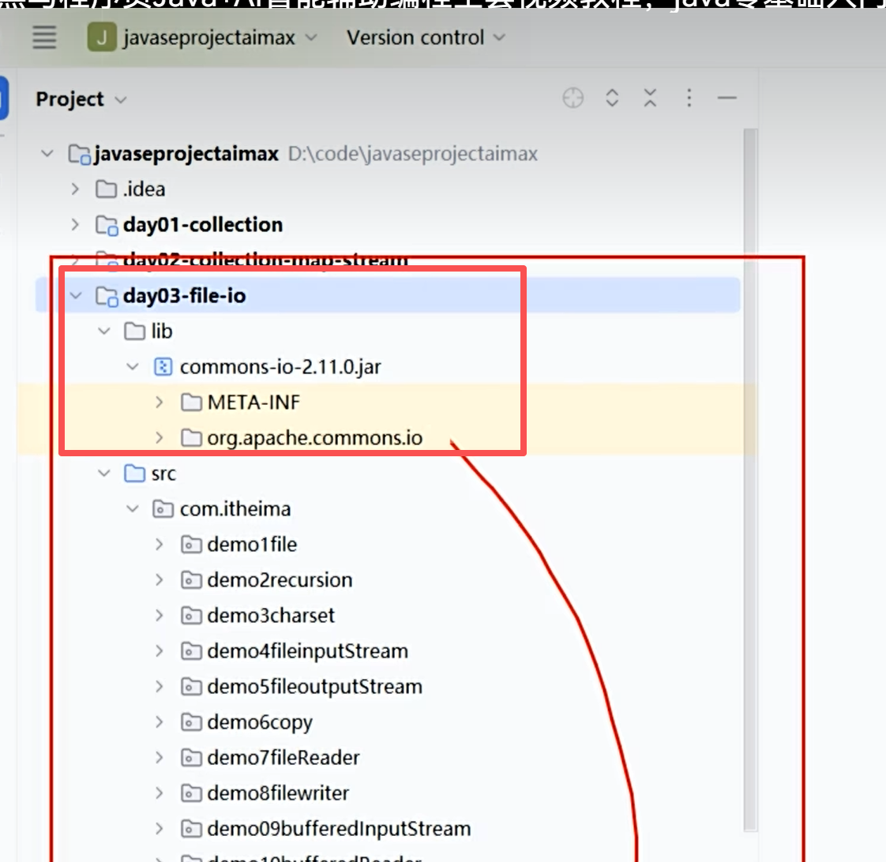

线程指的是一个程序内部的一条执行流程，如果程序中只有一条执行流程，那这个程序就是单线程程序，如前面学的main，如下图所示。


多线程的定义和作用如图所示


多线程的创建方式一的代码如图所示。先定义一个子类继承Thread类，使其成为一个线程类，然后重写run方法，这个run方法里面写的就是子线程要执行的任务。然后在主线程里创建线程类的对象以代表线程（万物皆对象），然后调用start方法即可开始执行子线程run里的内容。


方式一的创建线程方式，优点是编码简单，缺点是线程类已继承Thread类，无法继承其他类，不利于功能的扩展。

需要注意，方式一创建线程的方法，必须用start去启动线程，如果直接让对象调用run方法，这个时候，其实就相当于是普通的单线程了，只有start方法能启动新线程并执行。然后主线程的任务尽量不要放在启动子线程之前，因为主线程会按顺序执行，执行到t1.start才会启动新线程，这个时候，其实本质上又是普通的单线程了。

方式二创建线程的方式的示例代码如图所示。先定义一个线程任务类去实现Runnable接口，然后重写run方法，run方法里面放线程任务。然后回到主线程创建线程任务类的对象，然后把对象交给Thread类去处理，由Thread对象去启动线程。其优点就是能继承其他类了，而且可以实现其他接口，扩展性更强，缺点就是要额外创建一个对象，更消耗内存。

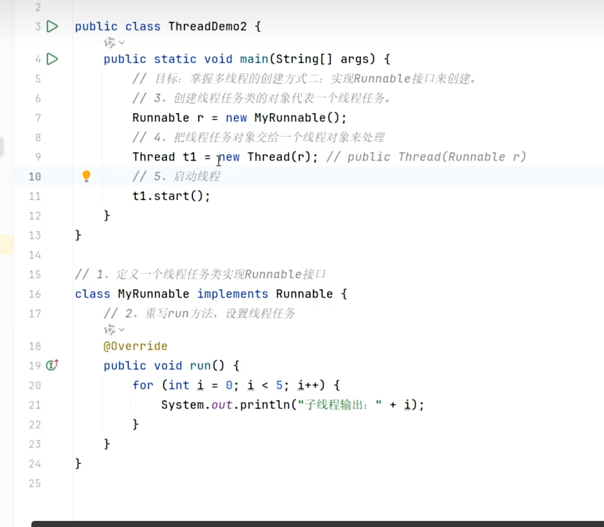

上面的内容，因为是接口，还可以用匿名内部类去实现，不需要单独定义一个类，当然，这是简化的写法，并不是新技术。代码示范如图所示。


还有一种更简化的写法，匿名内部类直接作为参数给Thread，然后使用start方法，示例代码如图所示。

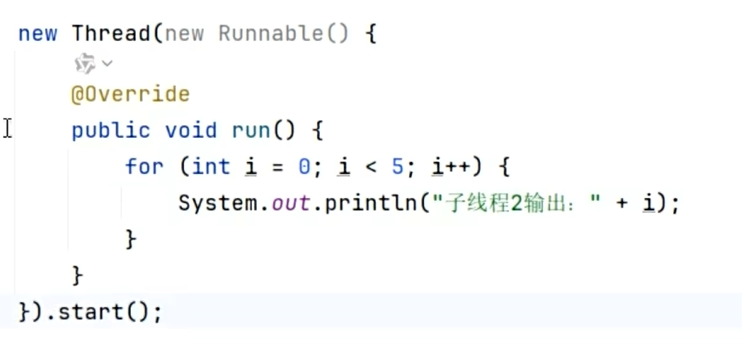

上面那种写法也可以简化为如图所示

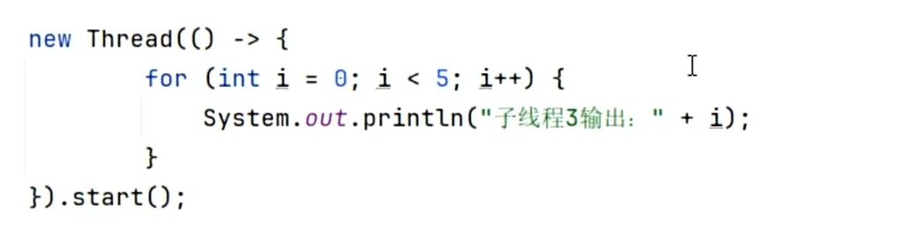

前两种线程的创建方式，其线程都不允许返回结果，也就是说，run必须是void类型。如果想要让线程跑完之后返回数据，这个时候就需要第三种线程创建方式：实现callable接口。实现思路如图所示。

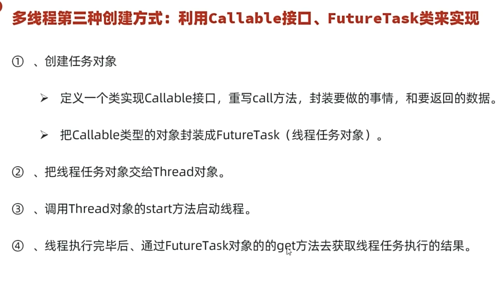

需要注意的是，这里要分清线程类对象、线程任务类对象，线程类对象就是Thread对象，相当于是工人，可以直接start创建线程，而线程任务类对象是Runnable的对象，相当于是任务清单，只提供要做什么，不能直接start创建线程。而上图的Callable不是Runnable的子接口，所以不能直接传给Thread去stat创建线程。

题外话：我们知道，方法是可以接参数的，如果类也想接参数，可以提供构造器的方式，或者是泛型的方式。

第三种，用Callable的线程创建方式，示意代码如图所示。当然，这里还没教怎么拿结果，想知道怎么拿结果请接着看下去。


取结果的示例代码如图所示。当然，这里最好分开try-catch，因为如果try里的第一条异常了，第二条就不执行了。这里不用担心线程还没执行完的情况，如果线程真的没执行完，CPU会将其挂起，让出资源，等线程执行完了，再回来执行取代码


Thread的常用方法如图所示。


哪个线程调用这个代码，这个代码就拿到哪个线程，这样就可以输出当前线程的名字，比方说在main线程调用这段代码，会输出main

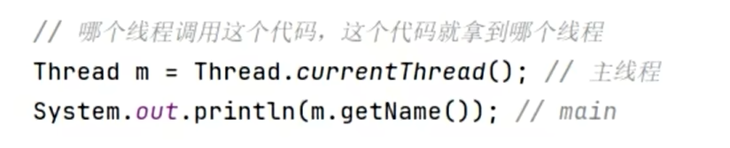

线程有默认名字，如果要自定义线程名字，要在线程启动之前就自定义。有两种方式，一种是通过构造器，一种是通过setName方法，如果要使用构造器，那类里一定要提供有参构造器，适用父类的构造器。

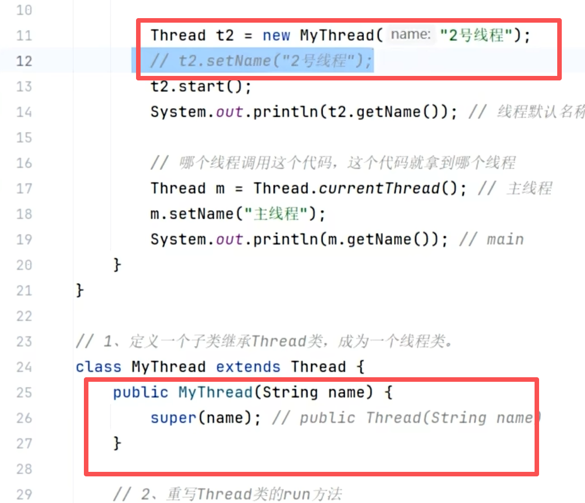

第二种线程创建方式，可以在包装的时候，就给出线程名字。

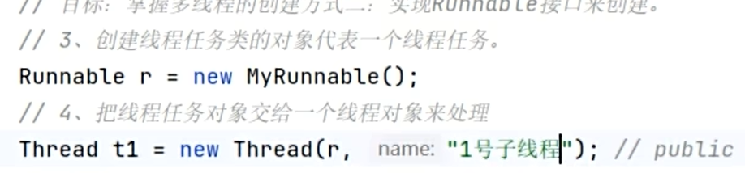

在某些情况，可能需要线程插队，这个时候可以用join方法，示例代码如图所示。在这里，主线程在跑到join方法的时候，会强行停下来，让子线程执行完再接着跑。

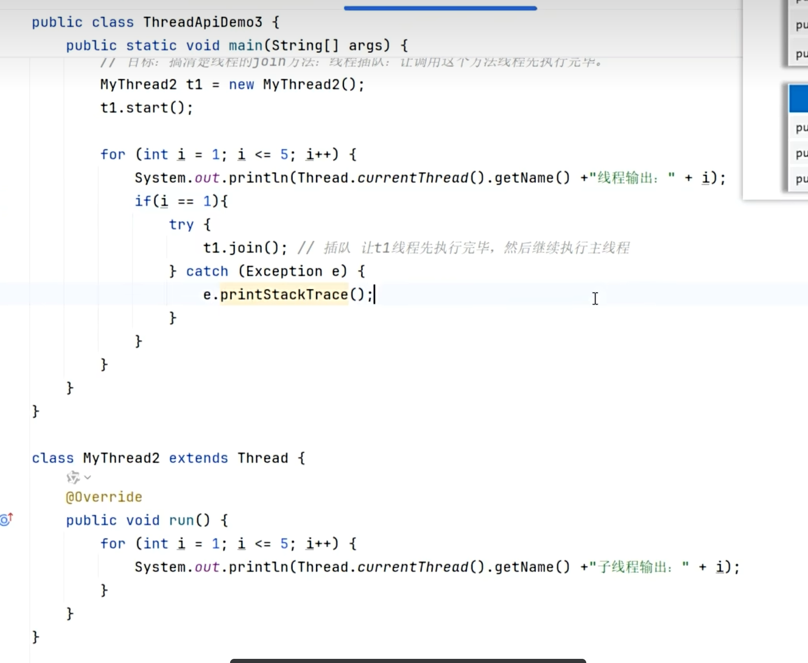

线程安全问题，指的是多个线程在同时操作同一个共享资源时，可能会出现业务安全问题。最经典的就是同账户银行取钱问题，如图所示。


线程安全问题的出现条件如图所示。


而线程同步就是解决线程安全问题的一个方案，核心思想是访问共享资源的时候要排队，（依旧是多线程，其余的就同时跑）

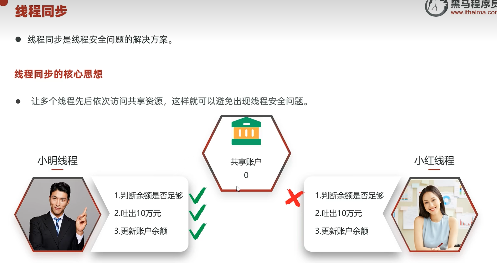

经典的线程同步方案就是加锁：每次只允许一个线程加锁，加锁后才能进入访问，访问完毕后自动解锁，然后其他线程才能再加锁进来。

线程同步的方式一就是同步代码块，其思想就是上锁，给核心代码上锁，具体思路如图所示。

同步代码块的示范代码如图所示，先选中要上锁的代码，使用ctrl + alt + t键，选择synchronized，注意，括号里是用一个对象去表示锁，这个表示锁的对象对于线程来说必须是唯一的，比如说直接放一个字符串对象进去，细节如下二图所示：


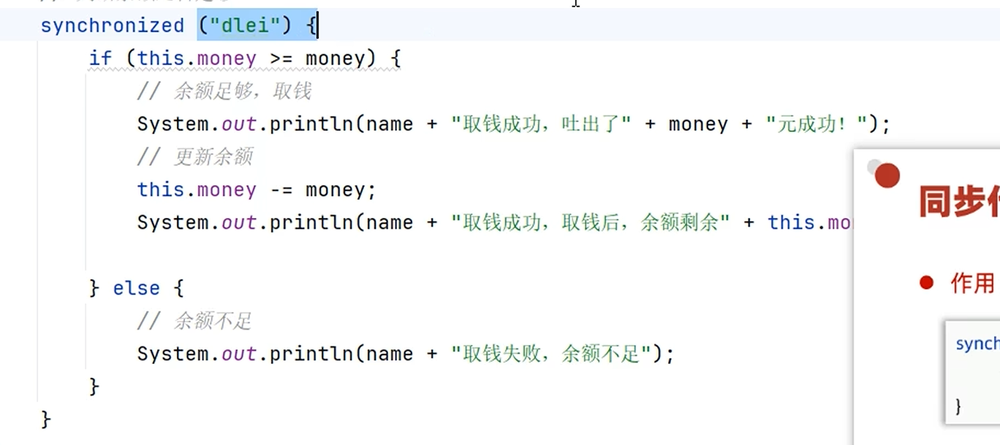

但是用像上图这种代码去锁，其实是不合理的，因为这个锁的范围太大，如果别的账户进来取钱，也会被阻挡，如下图所示，acc2账户进去取钱也会被限制。


这个时候，用this来当锁就很合适，因为this指向的是当前对象，也就是当前账户，不管有多个线程同时使用这个账户的取钱方法，这个账户（也就是对象）都是唯一的，也就是一把锁，刚好可以锁住。而如果其他账户再调用其他账户的取钱方法，和这个都不冲突，自然不影响其他账户取钱。总结来说，就是建议使用共享资源作为锁对象，而对于实例方法建议使用this作为锁对象。


如果是静态方法，就建议用字节码（类名.class）对象作为锁对象，用一个.class文件就能锁住所有调用该代码的线程。

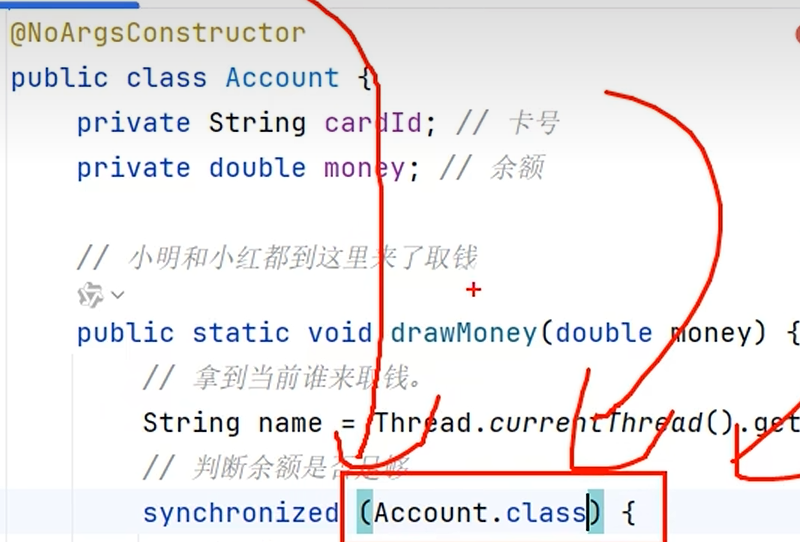

线程同步的方式二就是同步方法，其核心思想是把访问共享资源的核心方法给上锁，以此保证线程的安全，具体如图所示。其底层原理也是有锁对象，和同步代码块类似，只是隐藏了而已。

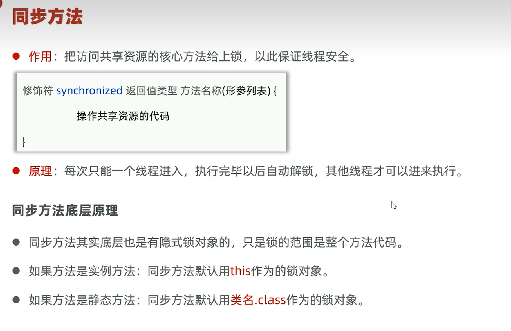

同步方法的的代码示例如图所示

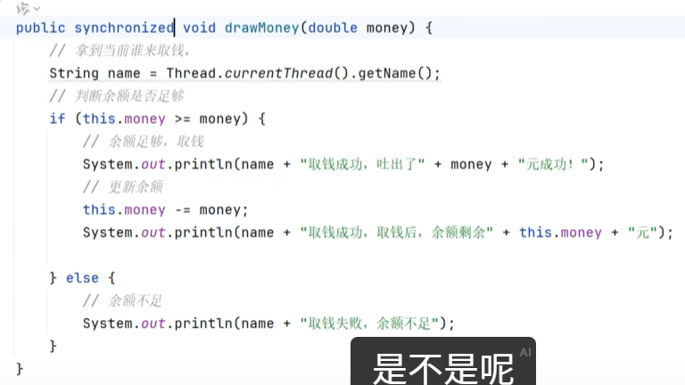

严格意义上去分析，同步代码块其实比同步方法性能更好，因为方法里还有别的不是访问核心资源的代码，这些可以多线程同步执行。但是同步方法可读性更好，别人一眼就可以看出来这个方法是有锁的。

线程同步的方式三就是Lock锁，其知识点如图所示。

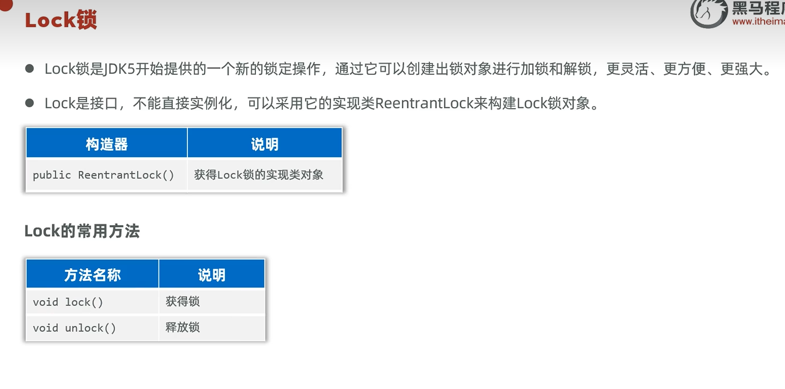

创建锁的示例代码如图所示，这是多态的写法，然后final是为了保护锁对象，不给别人把锁设置成null。然后一个账户对象有且只有一把锁，所以不能设置成static。

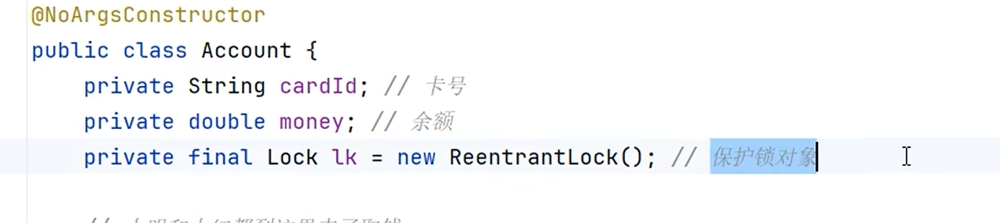

上锁和解锁的示例代码如图所示，上锁要在执行关键代码之前。然后解锁最好是放在finally里面，这样就可以避免因为程序出现异常而永久锁住对象。

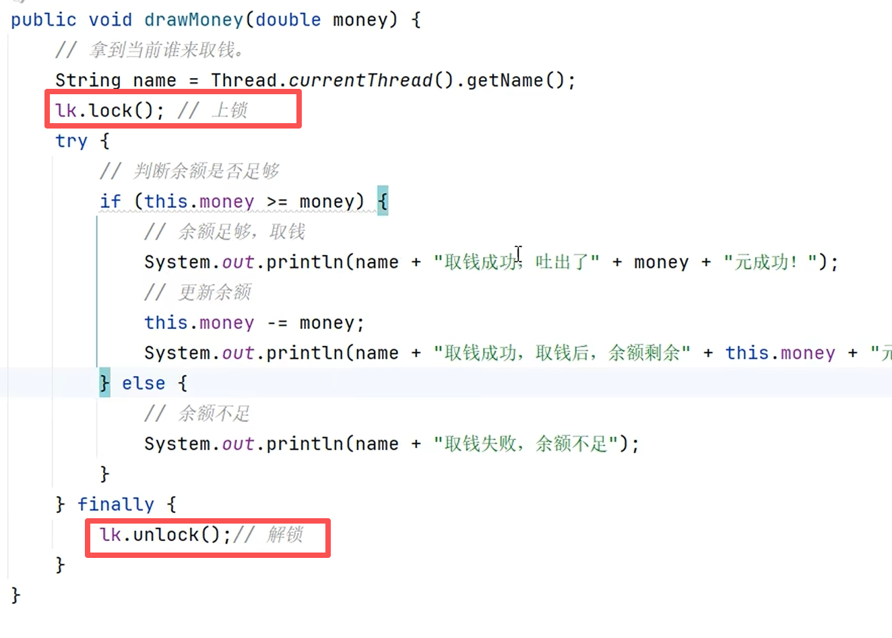

线程池就是一个可以复用的线程技术，简单来说，就是线程重复利用，举个例子，一个并发网站，如果一一亿个并发请求，如果线程无法重复利用，那就是一亿个线程，一亿个对象，非常容易炸刚，这个时候，线程重复利用就很重要。细节如图所示。


线程池的工作原理是把任务放到任务队列里排队，然后等线程空出来就处理对应的任务，注意，任务队列只能装Runnable和Callable任务。结合之前的线程创建的内容，在这里就可以补充出来一个认知：Thread才是线程，Runnable和Callable这些都是任务，是交给线程的任务。


创建线程池有两种方式，其详细内容如图所示。


通过ThreadPoolExecutor创建线程池的构造器和其参数说明如图所示。这里举的是KTV的例子，员工就是线程。正式员工加上临时工就是最大员工数量。参数4是参数3的单位。

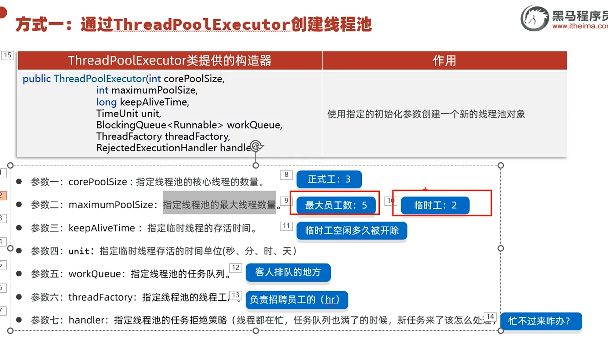

通过ThreadPoolExecutor创建线程池的示例代码如图所示。

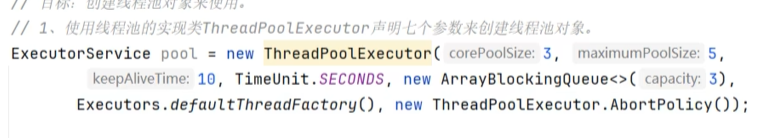

ExecutorService的常用方法如图所示（我们前面用的是多态的形式去创建线程池，这里自然要看ThreadPoolExecutor其父的常用方法，而不是看ThreadPoolExecutor的常用方法）。


execute的用法如图所示。

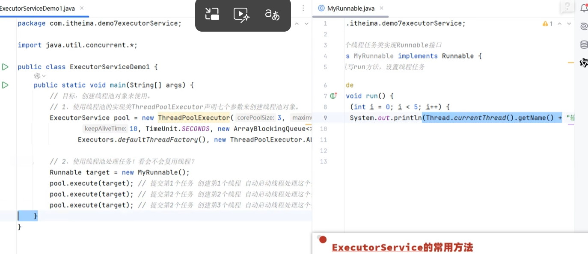

线程池的注意事项如图所示。只有正式员工都在忙，并且排队座位也满了，才会招临时工。只有正式员工和临时工都在忙，并且排队座位也满了，才会拒绝新任务。


当任务队列满了，核心线程都在忙，此时有新任务进来，会创建**非核心临时线程（救急线程），直接执行这个新来的任务**，不是拿队列里的旧任务。

# Runnable任务 vs Callable任务

## 核心区别

表格

| 特性  | Runnable                    | Callable<V>                     |
| --- | --------------------------- | ------------------------------- |
| 方法  | `void run()`                | `V call() throws Exception`     |
| 返回值 | **无返回值 void**               | **有返回值 V**                      |
| 异常  | run 不能抛出受检异常，只能内部 try‑catch | call**允许抛出 Exception 受检异常**     |
| 包   | `java.lang.Runnable`        | `java.util.concurrent.Callable` |

题外话：Runnable任务可以直接交给Thread线程执行，而Callable任务需要通过FutureTask包装一下才能交给Thread线程执行，FutureTask是Runnable的实现类。

线程池如果要执行Callable任务，需要用`submit(Callable)`，其底层，也是帮我们 new 了`FutureTask`

使用线程池处理Callable任务的示例代码如图所示，这里用f1去接，是多态的写法，我们说过，submit底层其实是帮我们new了FutureTask

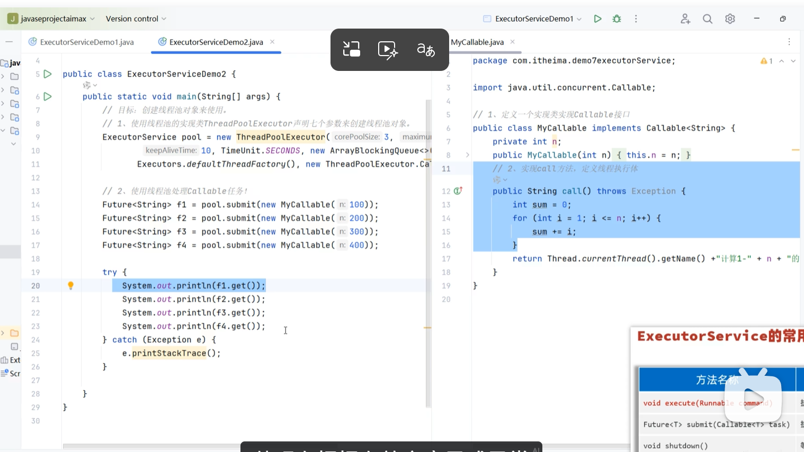

我们还可以通过Executors去创建线程池，其常用方法如图所示


通过Executor创建线程池并执行Callable任务的示例代码如图所示。其实这个静态方法的底层还是用前面的ThreadPoolExecutor七参数去创建线程池。

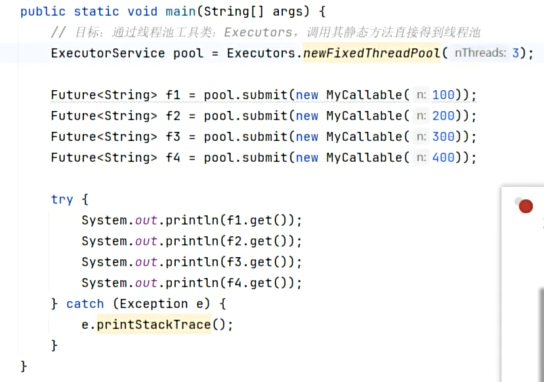

但Executor也是有风险的，如图所示

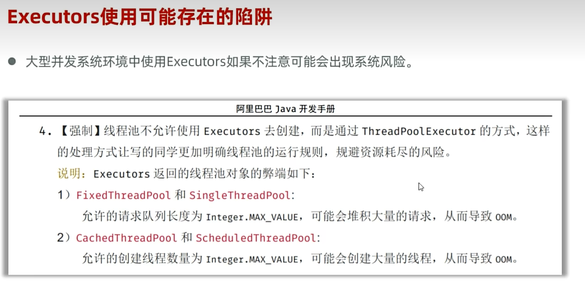

像加减乘除这种属于运算，是CPU负责的，如果加减乘除很多，就是CPU密集型任务，最大线程对象可以设置为CPU核心数+1。而IO 密集（数据库、网络请求、文件读写）可以设置为2*CPU 核心数

进程是正在运行的程序（软件），线程属于进程，一个进程可有很多线程。进程中的多线程是并发和并行执行的。如图所示。


并发在宏观上是同时执行多个线程，但在微观上，是分开执行的，只是因为轮询很快才看上去像是同时执行。

并行是真正意义上的同时执行。多核CPU才有并行。Java 线程能不能并行，看操作系统是否把不同线程调度到**不同 CPU 核心**；就算代码开多线程，单核机器上只能是并发。

网络编程的概念如图所示


基本的通信架构如图所示


CS架构如图所示

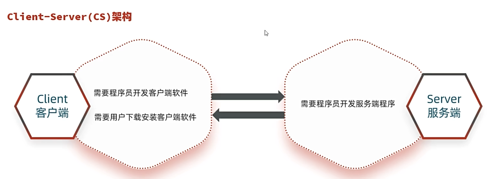

BS架构如图所示

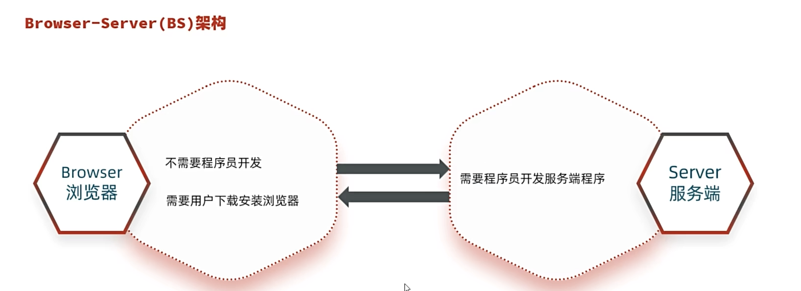

无论CS架构还是BS架构，都依赖网络编程技术（也就是上面的这些通信箭头是如何实现的），在Java.net.*这个包里就提供了很多网络编程的类及其方法。

网络通信三要素如图所示


如图所示，比方说要给对方发一条短信，先确定IP地址，然后确定程序的端口号，然后也需要传输协议，制定一些传输规则。

IP地址的详细内容如图所示，PIv4是4字节，32位，一个字节是八位。值得注意的是，IPv4地址是不够用的，才42亿个，全球不止42亿个设备。


IPv6的详细内容如图所示，IPv6是16个字节，128位。

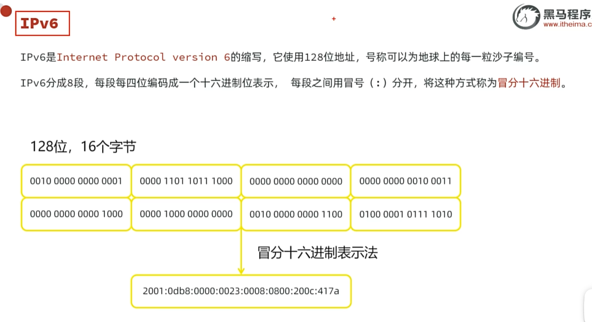

IP域名的相关内容如图所示。通过DNS域名解析，可以把IP域名解析成真实的IP地址。IP域名的最大特定就是易于人类记忆

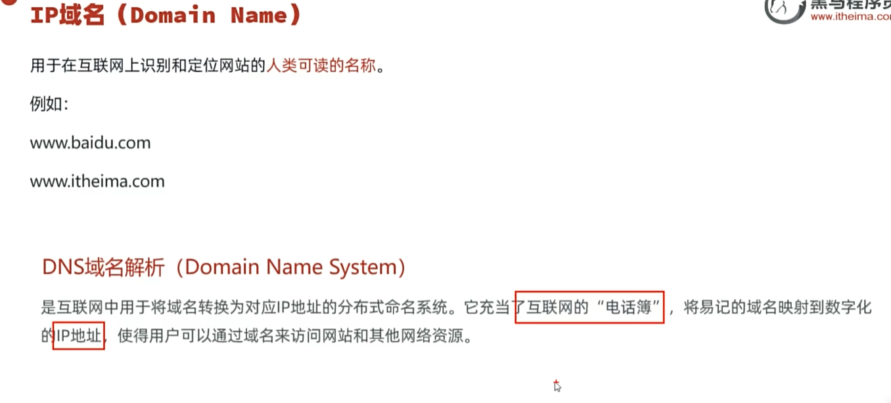

DNS域名解析的方式如图所示。是通过访问DNS服务器来获取真实域名的。如果DNS服务器里没有对应的IP映射，DNS服务器会去到运营商那里找，比如说电信或者


公网IP和内网IP的相关知识如图所示。不同的局域网的内网 IP 可能相同，所以引入内网IP还可以节省 IP，让公网获得更多 IP。


而我们Java里也是用对象去表示IP的，使用InetAddress类就可以代表我们的IP地址。其常用方法如图所示

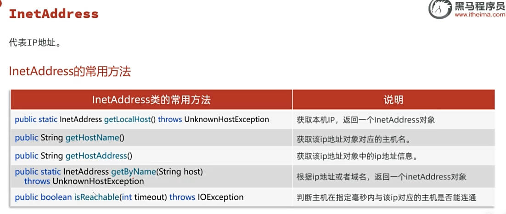

获取IP的示例代码如下二图所示，万物皆对象

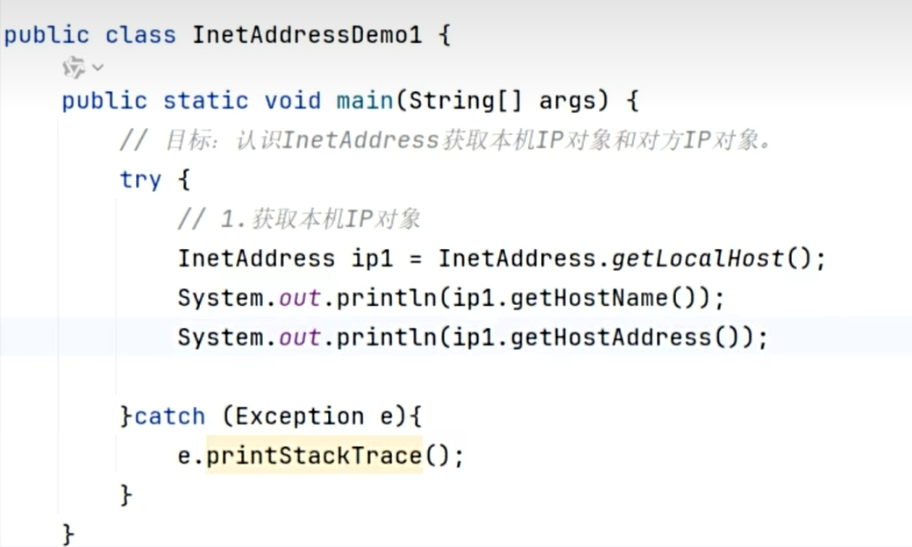

端口的相关知识如图所示。端口是正在运行的应用程序的唯一标识，分为周知端口、注册端口、动态端口

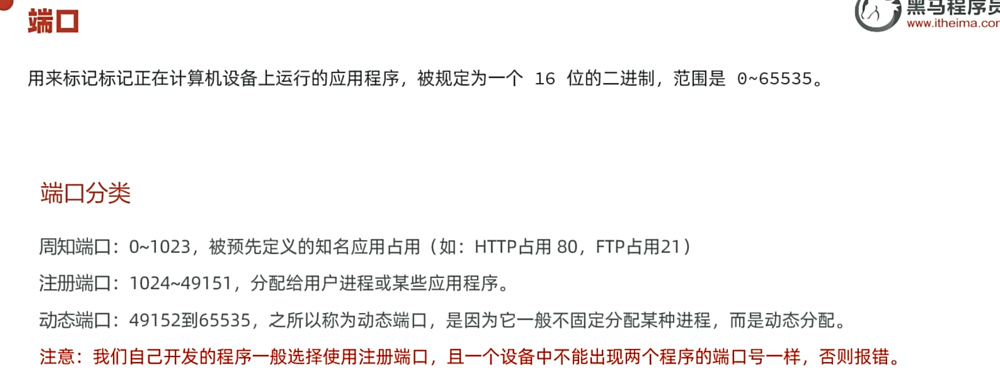

通信协议，指定是一套规则，默认大家都要去遵守。如图所示


网络互联的参考模型如图所示。传输层常见的是UDP和TCP


UDP协议的相关知识如图所示。UDP协议是无连接不可靠的，只管扔，不管到不到。UDP适用于需要通信效率高的，不用管可靠性的场景，比如说直播。


TCP协议的相关知识如图所示。

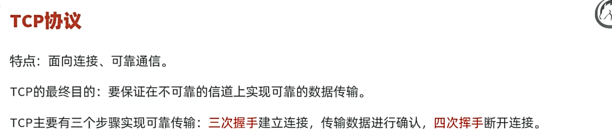

三次握手才能确立可靠连接。如图所示，客户端先向服务端发出连接请求，然后服务端返回一个响应，此时，从客户端的视角看过去，就知道服务端可以接受请求并且可以返回响应，但从服务端的视角看过去，只能确定客户端能发送请求，还不确定客户端是否收到了自己的信息，所以这个时候就需要客户端再次发出确认信息给服务端，服务端收到信息之后，就知道客户端既能发也能收。彼此都放心。


而断开连接需要四次挥手，如图所示，客户端先说自己不发了，服务端先确认收到，此时服务端可能还有没发完的数据，要等全部发完，服务端才会说自己也不发了；最后客户端回复确认后，还要等一小段时间再彻底关闭，防止最后一条确认丢了导致服务端关不掉，同时也避免旧连接的残留数据干扰新连接。TCP协议适用于通信效率相对不高的，需要高可靠的场景，比如说支付

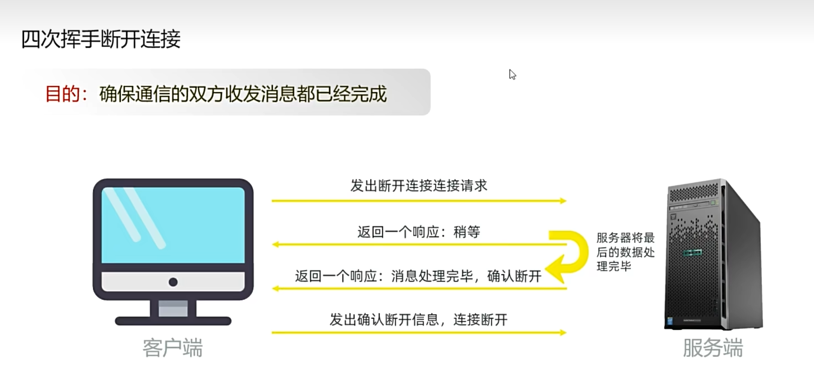

而在编码上怎么用UDP通信呢？Java提供了一个java.net.DatagramSocket类，只要使用这个类，默认就是UDP通信。

UDP通信的常用代码如图所示。


在正式学习编码之前，先认识一个抛韭菜的模型如图所示，只抛韭菜，韭菜是数据，盘子是不会抛的

通过DatagramSocket实现UDP协议发送数据的代码如图所示，图中的sockt相当于是发消息的人，bytes是数据（韭菜），packet是盘子，用于封装数据（韭菜），然后socket.send(packet)让socket这个人把packet盘子里的韭菜扔出去

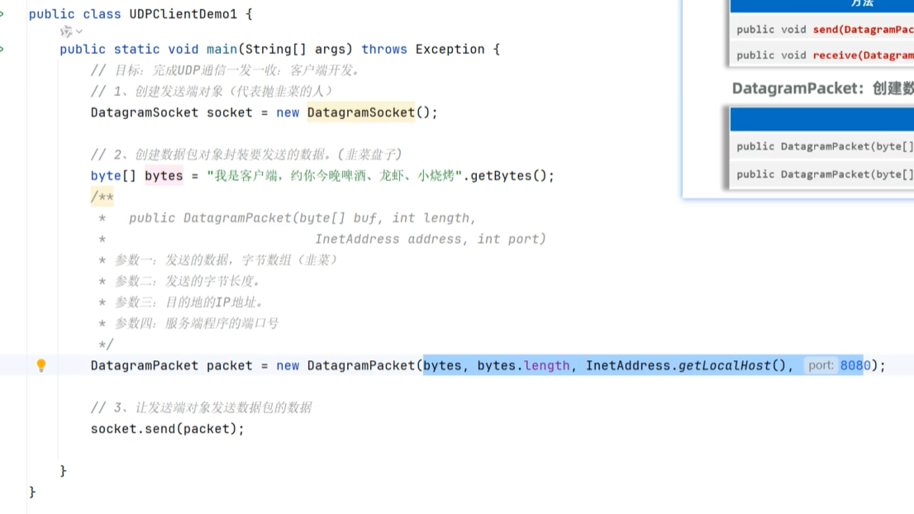

通过DatagramSocket实现UDP协议接收数据的代码如图所示


这个“盘子”，也就是数据包，也有一些特有方法，便于实现我们的目的，可以获取当前收到的数据长度、对方IP对象和程序端口，其用法如图所示。

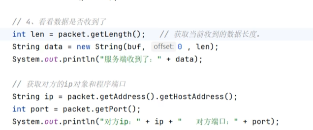

上面这是UDP一发一收的写法。需要注意的是，用完管道之后要用.close()关闭比如上面的就是在后面加上socket.close()。

需要注意的是，发送端不用指定端口，由系统自己分配就行了，因为他是负责发的，端口没什么用，而接收端就要指定端口，比方说上面就指定了8080端口，这是为了发送端能指定端口，指定发给谁。

接下来是UDP多发多收的写法。核心思想是用死循环包住核心代码。

发送端实现多发的示例代码如图所示

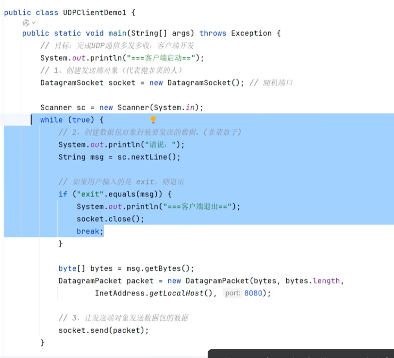

接收端实现多收的示例代码如图所示


TCP的模型如图所示，有socket管道，管道里有流。

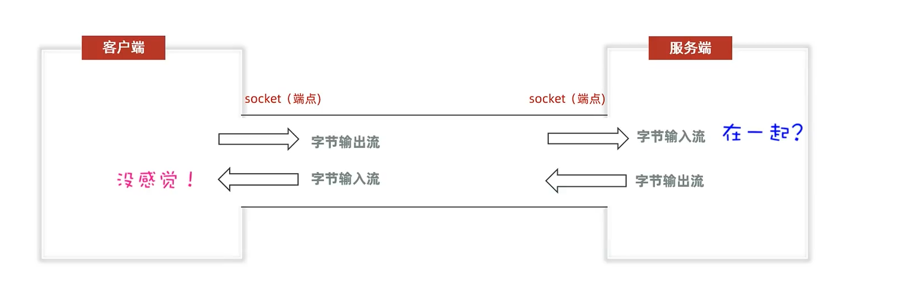

而在编码上怎么用TCP一发一收的通信呢？Java提供了一个java.net.Socket类，只要使用这个类，默认就是TCP通信。其常用方法如图所示

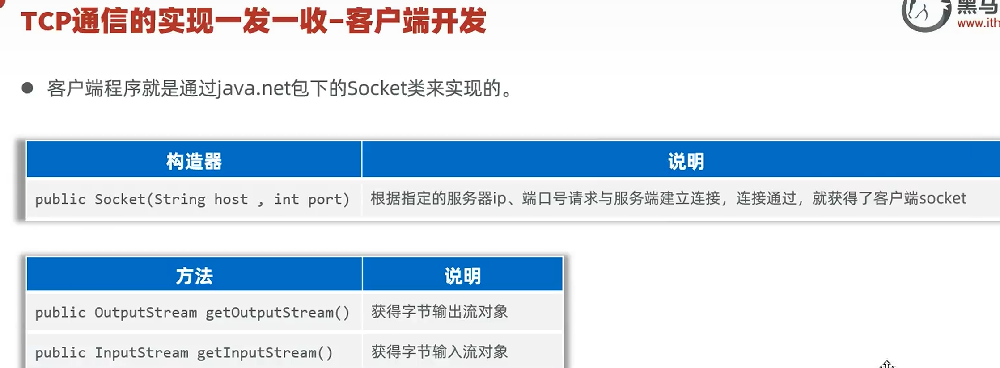

TCP的socket通信管道里有IO流。TCP通信，发的一段用什么流，收的一方就得用什么流（如字字节流），用什么形式发，就得用什么形式接，要不然就会导致解读数据时的混乱。然后这个流也可以包装一下，但是一般用特殊数据流，因为特殊数据流的数据可以分段发，比方说先发一个1，然后发一串字符串，然后发一个2，然后发一个视频，这样子就会有辨识度，接收端也用特殊数据流，也可以分段收，便于接收方对数据进行处理。

TCP的客户端代码写法如图所示。

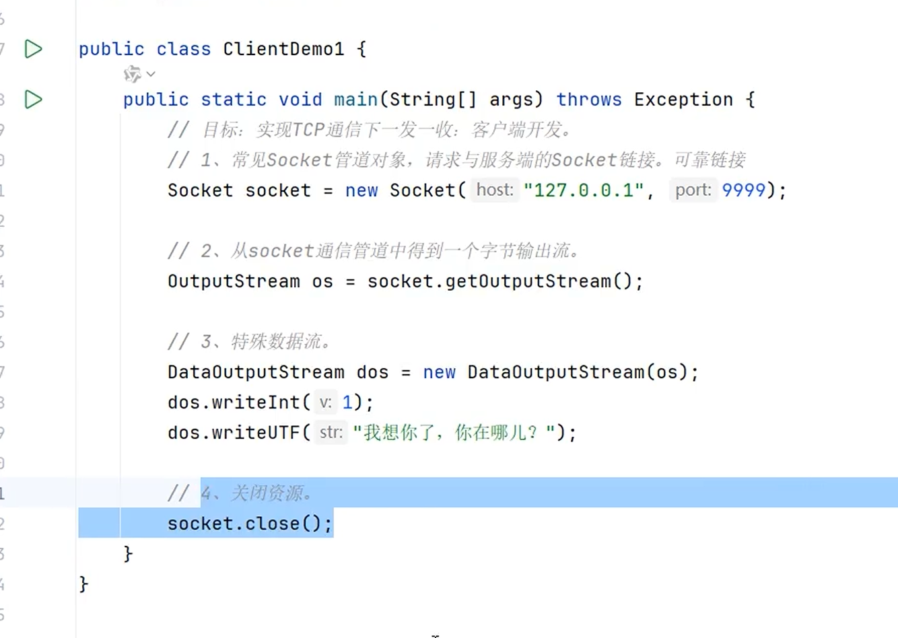

---

TCP服务端要用到的类及其常用方法如图所示

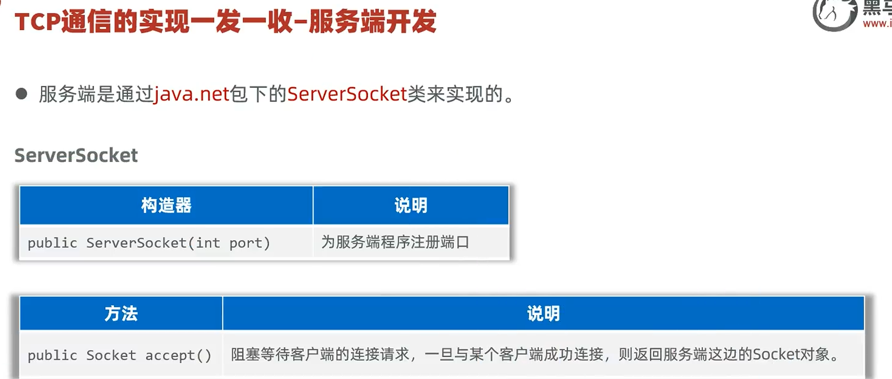

TCP服务端的示例代码如图所示，先通过ServerSocket阻塞式等待客户端，然后返回一个socket管道对象，然后从socket管道对象里获取流，然后把这个流包装成客户端的流，就可以按照客户端的标准去读取信息了。也就是说，TCP服务端的流程比客户端多了一个阻塞式等待的流程。

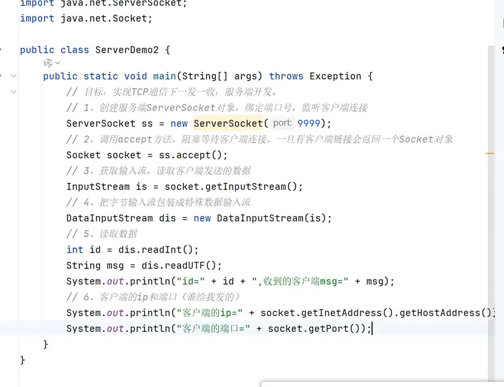

上面的示例代码，如果客户端跑得快，那消息会缓存到管道里，如果服务端跑得快，readInt那里会再次进行阻塞式等待。

---

那如何实现TCP的多发多收呢？核心思路如图所示，也是用死循环包裹核心代码

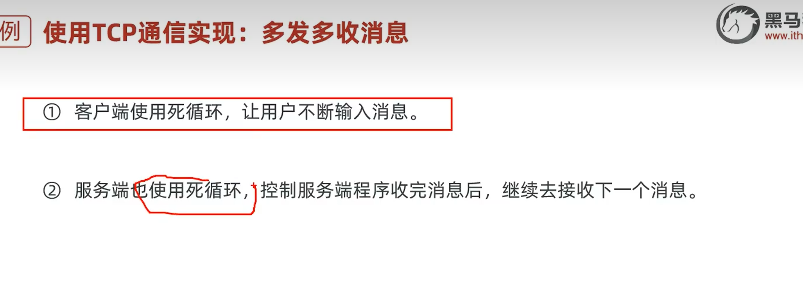

---

实现多发的客户端示例代码如图所示。Java IO 体系为了减少频繁的网络 IO 操作、提升传输性能，很多输出流自带**内存缓冲区**（JVM 内存中），调用 `flush()` 的本质目的是**强制将 Java IO 缓冲区中暂存的数据立即写入底层 Socket，保证消息能实时发送到对端**，避免数据滞留在内存缓冲区中，导致接收方迟迟收不到消息。

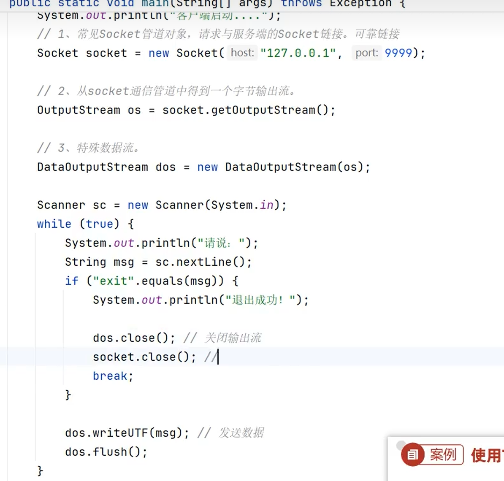

---

实现多发服务端的示例代码如图所示

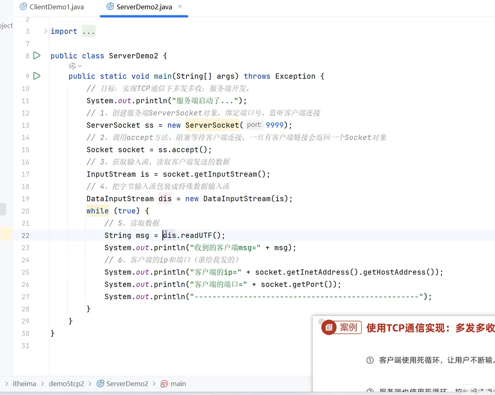

---

但是目前，我们这个TCP服务端只有一条线程，只能收一个客户端的信息，也就是说，我们的TCP服务端目前只能与一个客户端建立三次握手链接，那如果要接收多个客户端的消息该怎么办呢？答案是引入多线程，主线程负责接客，子线程负责待客，其模型如图所示

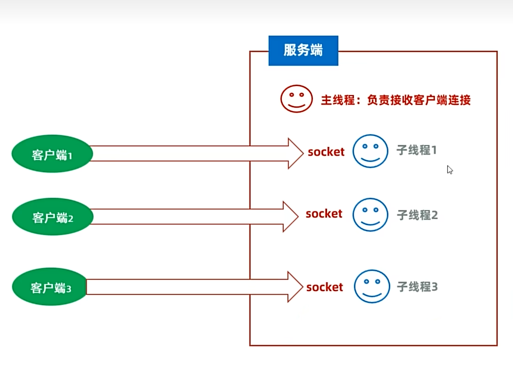

---

TCP实现服务端接收多客户端的示例代码如图所示，还要创建一个线程类

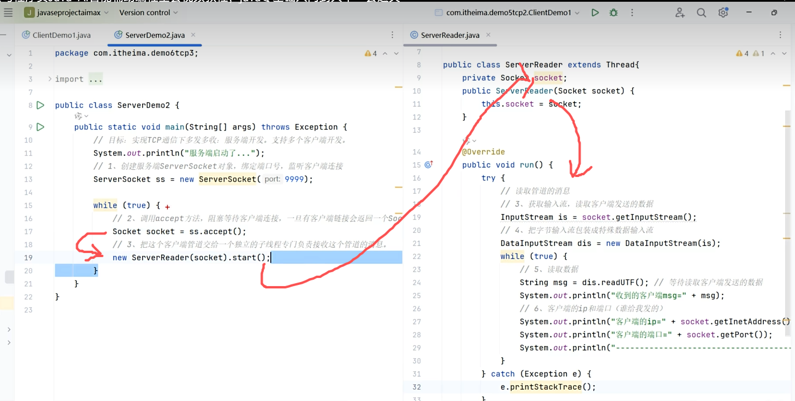

---

BS架构的底层原理如图所示，服务器作为客户端，给出服务器IP和服务器端口，然后链接到服务端，服务端的主线程再对请求进行分配。而且响应给浏览器的必须是特定的数据格式，否则浏览器不识别（HTTP）

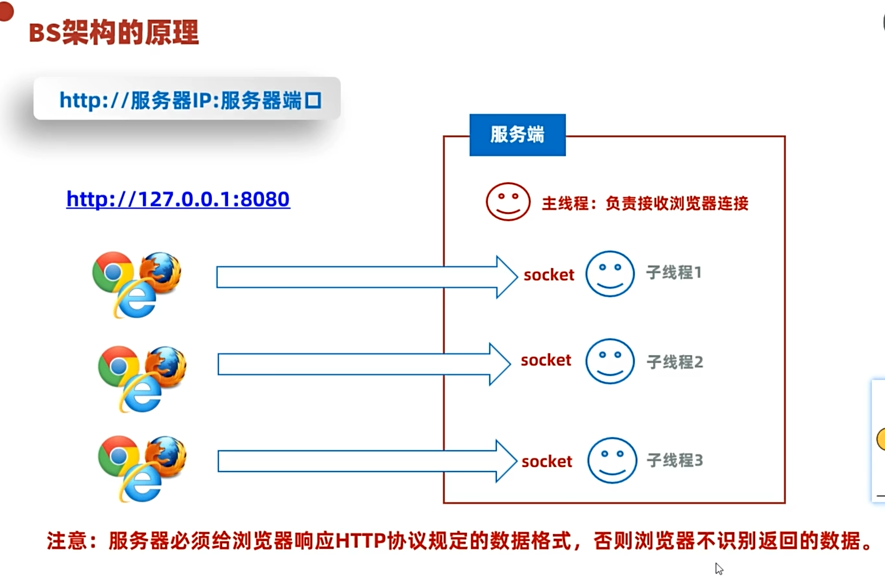

---

浏览器识别的http协议数据格式如图所示。注意到，这格式有很多换行，所以打印流就很适合，因为打印流会自动换行。

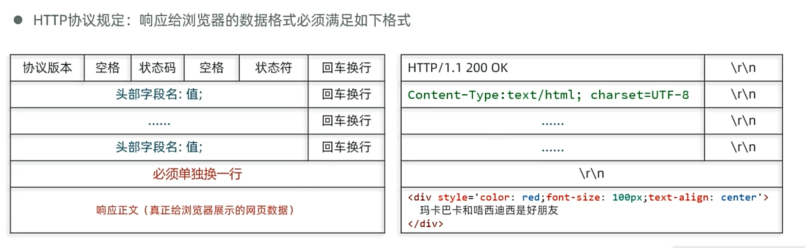

---

TCP通信下http的协议数据格式示意代码如图所示

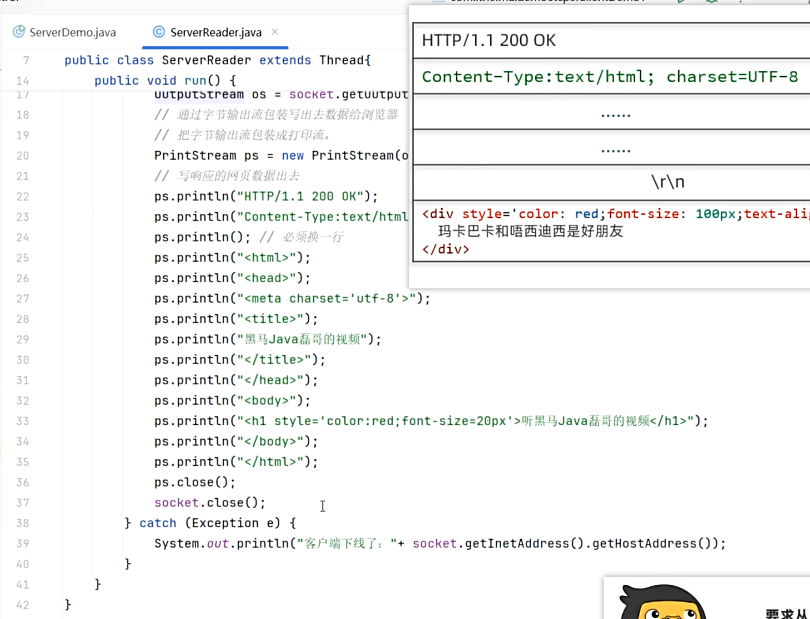

---

但我们前面所提到的TCP多发多收的方案，要创建太多线程了，很浪费，性能很差，可以用线程池进行优化，如图所示，把请求封装成任务，然后放到任务队列里。而runnable无返回值，callable有返回值，重点疑惑：浏览器请求明明要返回响应，为什么要用 Runnable？这是因为runnable和callable的返回是相当于主线程而言的，只有主线程等待子线程的执行结果，才需要callable，而对浏览器进行响应，其实是某种抽象意义上的业务逻辑，是直接写在run方法里的，不需要返回结果给主线程，故而使用runnable任务。

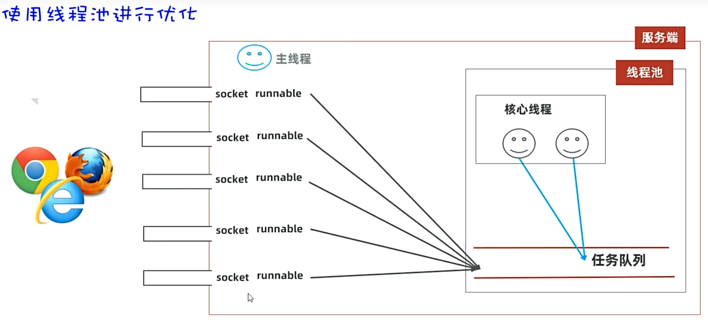

---

使用线程池对TCP多发多收的优化示例代码如图所示，先创建线程池，然后在死循环里把任务交给任务队列。值得注意的是，线程类其实可以直接当成任务类来用，因为线程类需要继承Thread，而Thread其实也实现了Runnable，但在开发上不建议这样写，还是直接写成Runnable任务类比较好，辨识度较高

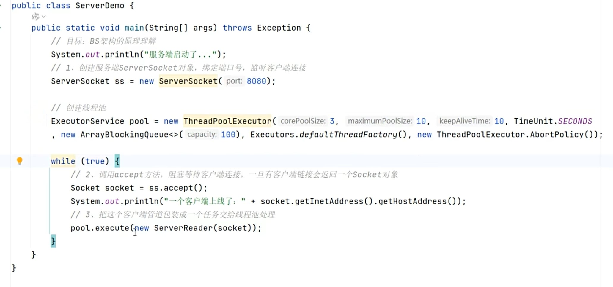

---

所谓单元测试，就是针对最小的功能单元：方法，编写测试代码对其进行正确性测试。如图所示。在以前，我们的单元测试是在main方法里做的，有诸多不便，如图所示。


---

我们可以用Junit单元测试框架，其相关内容如图所示

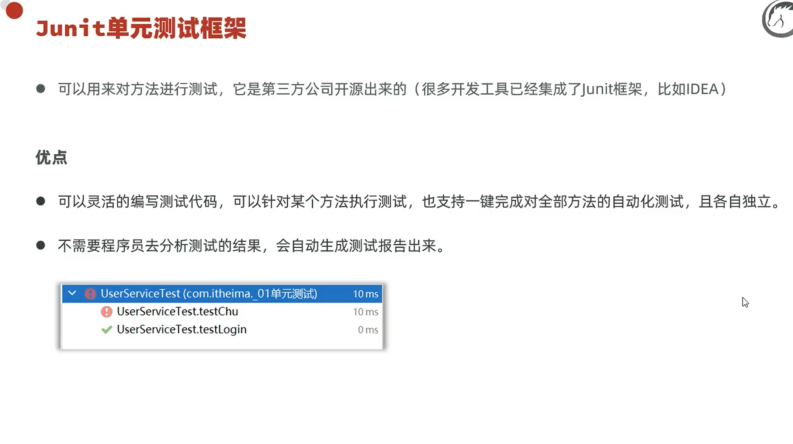

---

Junit的使用步骤如图所示


---

Junit的使用的示例代码如图所示

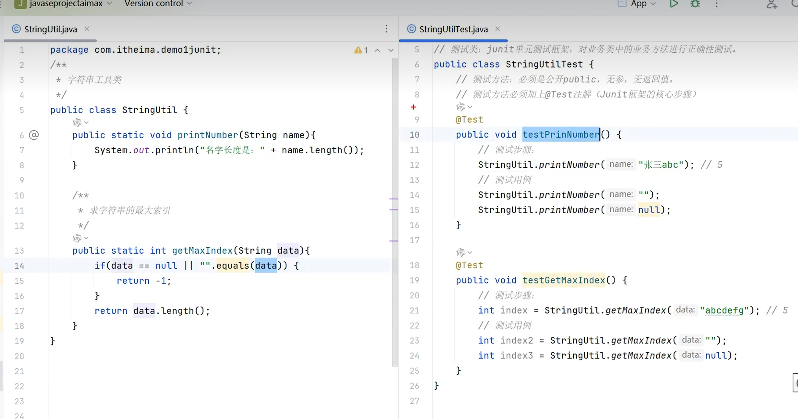

以上代码不够完整，还应该加断言，比方说提前断言某个测试结果应该是6。请注意，下面代码的println可以忽视

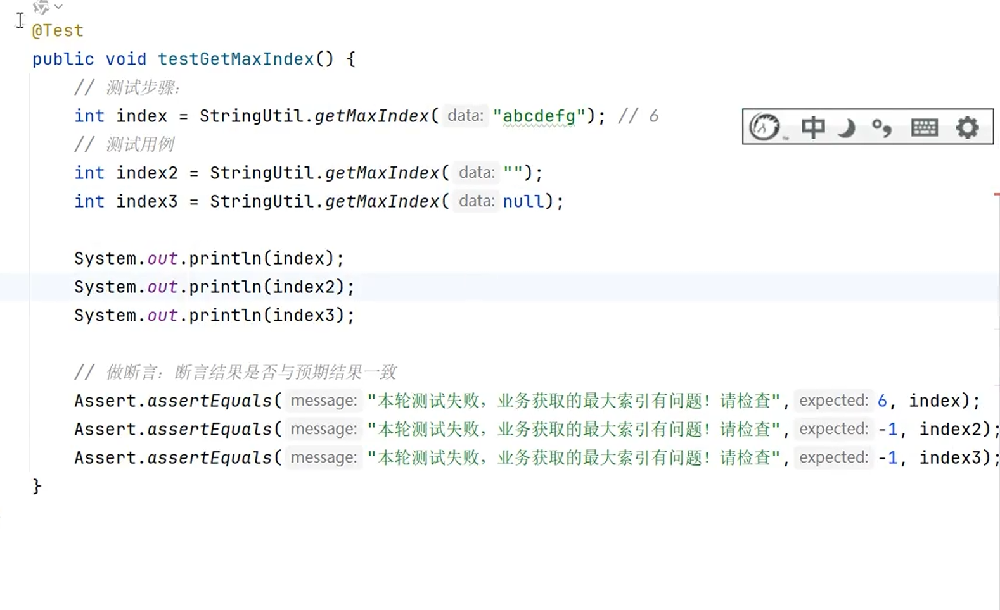

---

我们平常写代码的时候，调用别人写好的工具类，这些代码不用我们再次从头开始写，这就是框架的雏形，把常用的一些东西封装起来方便复用。而Spring就像是一个小瓶子，可以把你的对象放在这个Spring瓶子里进行管理。如图所示。SpringBoot可以通过注解的的方式在容器中创建类的对象。SpringBoot内嵌了Tomcat服务器，在运行启动类的时候，Tomcat服务器就启动成功了。


---

可以简单把SpringBoot理解成Spring和SpringMVC的整合。SpringBoot说白了就是一个map，它的key是String，value是object。SpringBoot在启动的时候会扫描所有的类到那个抽象的“map”里面，key就是类名，value就是这个类。Spring是单例模式，也就是说，这个value是单例，key是名字。

---

那问题来了，SpringBoot在启动的时候，它怎么知道要把哪些类存到这个map里面？这个时候就需要注解，比如说@component。简单来说，只需要在类上加这个注解，就可以把这个类扫描到这个map里面去。

---

entity层是对数据库的映射，比方说数据库里有几张表，然后在entity里映射出来。Dao专门写和数据库交互的操作，增删改查，只负责数据存取，不处理业务逻辑。Dao 只做数据库 CRUD，**不写业务判断、计算**，业务交给 Service。MyBatis 里叫 Mapper 接口，就是 Dao；Spring‑Data‑JPA 叫 Repository，本质也是 Dao 层。Service层放的是业务代码。Controller是给前端调的，接收请求返回响应。

---

调用逻辑是：前端→Controller → Service → Dao → Entity ↔ 数据库表。那问题来了，Controller怎么知道要调用的Service类在哪里呢？其实在SpringBoot启动的时候，就已经把这些类都扫描到容器里了，用的时候，只需要根据名字，也就是key去找对应的value（也就是类）就可以了。这也就是注入的概念，从容器里拿到类注入到Controller里面，怎么注入的呢？也是通过注解的形式。

---

Redis也可以理解成一个Map，也是key是string，value是object。Java是基于内存的，Redis也是基于内存的，内存速度快，读取很快。所以Redis的核心是快。Redis可以做公共变量，比方说有AB两个模块，这两个模块要进行通讯，要进行存储，A模块产生的数据需要B模块访问，这个时候就可以把数据存到公共变量上去，也就是Redis，然后B就可以读取了。A模块通过远程RPC调用，通过HTTP把数据存到Redis里，B模块通过HTTP去Redis里面拿。可以把Redis理解成一个Java服务，部署在服务器上。

---

Redis集群，其实就是为了防崩，把主节点的数据拷贝到子节点上，哪怕主节点崩了也不怕。怎么拷贝呢，也是通过HTTP请求。

---

MySQL的索引，可以理解为就是数据库的目录，类似书本目录，页码，通过目录，页码去快定位数据的位置。索引也是基于内存的，所以特别快，MySQL慢是因为它是基于硬盘的。索引页是存在内存里的。

---

索引失效的时候，其中一个例子就是索引顺序反了。全表扫描就是从头开始一个个找。

---

JDBC就是一种JavaAPI，允许Java程序与数据库进行连接和交互，它定义了标准。如图所示

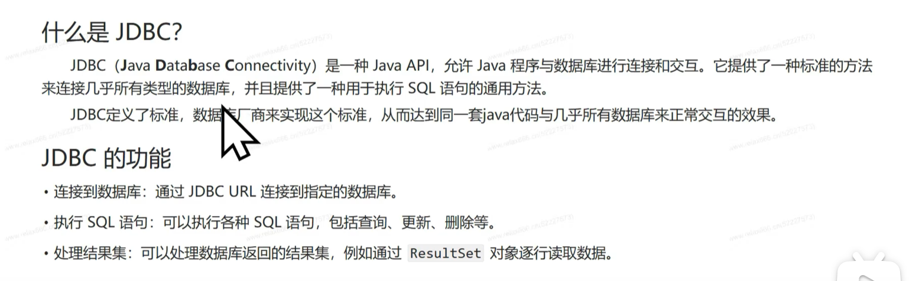

---

如果用原生的JDBC，会有大量的重复代码，而MyBatis就是把那些重复代码给封装掉，其底层还是基于JDBC。

---

- MyBatis：半 ORM，**SQL 自己写**，灵活，互联网后端主流
- JPA/Hibernate：全 ORM，**几乎不用写 SQL**，封装太重，SQL 不好调优

---

反射的专业概念就是加载类，并允许以编程的方式解剖类中的各种成分（如成员变量、方法、构造器等）。加载类指的就是把类加载到程序中去。如图所示，我们写s1.的时候，会显示这个类里的全部信息，其实这就是通过反射区解剖出来的

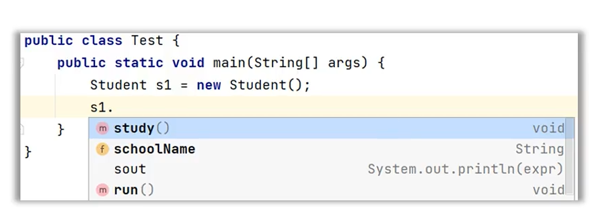

---

反射的操作步骤如图所示，先加载类对象，然后获取构造器对象，然后获取成员变量对象，然后获取方法对象。万物皆对象，其实类的字节码class本身就是对象。


---

第一步获取class对象的三种方式如图所示


---

获取class对象的三种示例代码如图所示

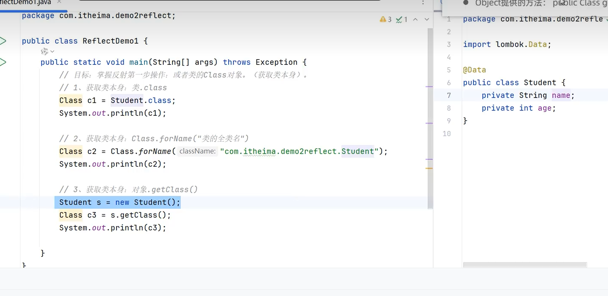

---

那获取了class类，接下来就是获取其中的内容，获取构造器对象的常用方法及其注意事项如图所示。


获取构造器对象的示例代码如图所示

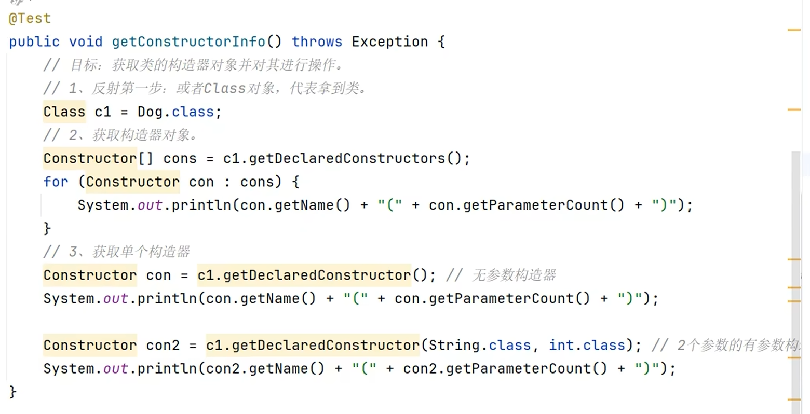

那获取了构造器，我们当然是要用啊，有什么用呢？如图所示，可以创建对象，而且可以暴力反射，强行突破private的限制。值得注意的是，图中直接println这个d1对象，能直接打出对象里面的信息而不是地址，这是因为在类本身里重写了toString方法，通过toString方法直接打印对象里的信息。如果不重写toString方法就不能直接打印出对象里面的信息。`System.out.println(d1)`，底层会自动调用 `d1.toString()`。

- 如果 Dog 类**重写了 toString ()**：执行我们自己写的方法，输出对象内部属性信息。
- 如果**没有重写 toString ()**：调用 Object 原生的`toString()`，输出格式：`类名@十六进制哈希地址`，看不到对象内部字段。

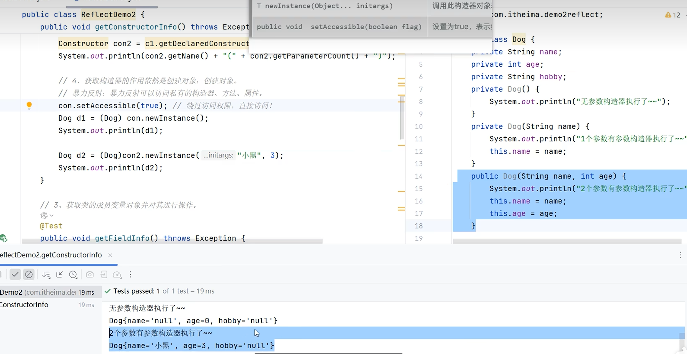

---

通过class获取成员变量对象的常用方法如图所示

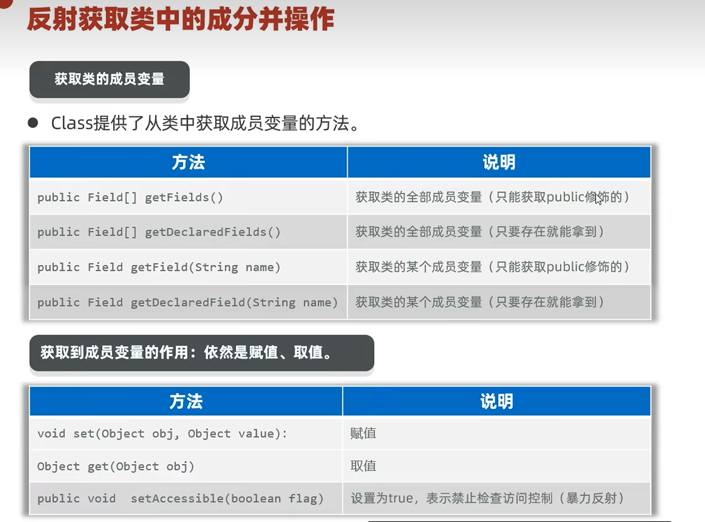

通过class获取成员变量对象的示例代码如图所示


而获取了成员变量，自然是用来取值或者赋值，而在取值或者赋值之前，还需要一个对象，因为成员变量最终都是存在于对象之中的。具体示例代码如图所示

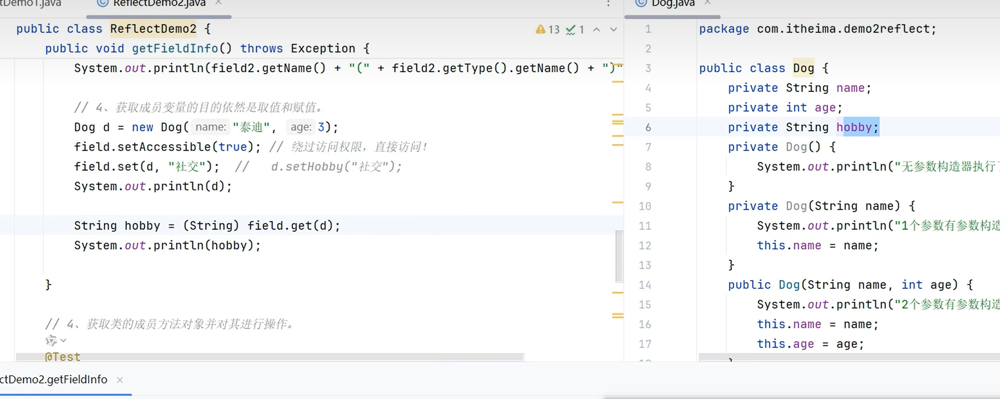

---

通过class获取成员方法对象的常用方法如图所示

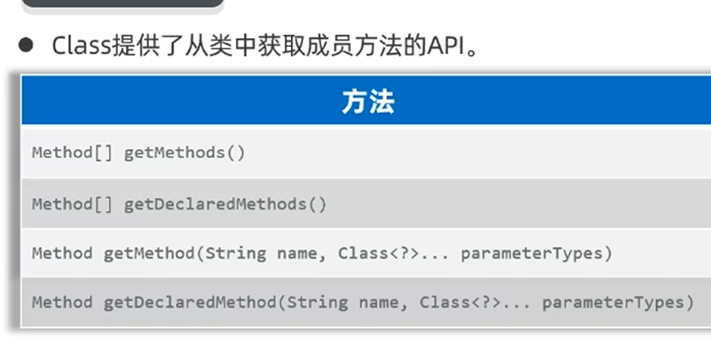

通过class获取成员方法对象的示例代码如图所示

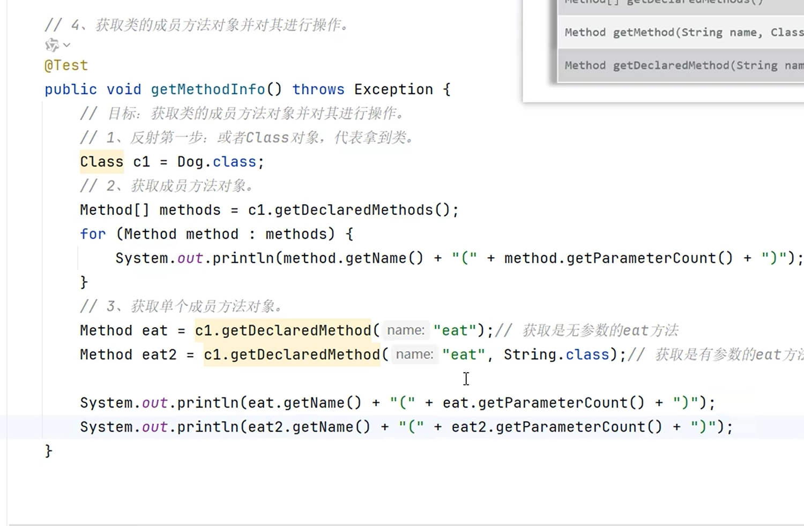

而获取成员方法对象的用处自然是调用，调用的示例代码如图所示。值得注意的是，在调用方法之前，也先需要一个类对象。

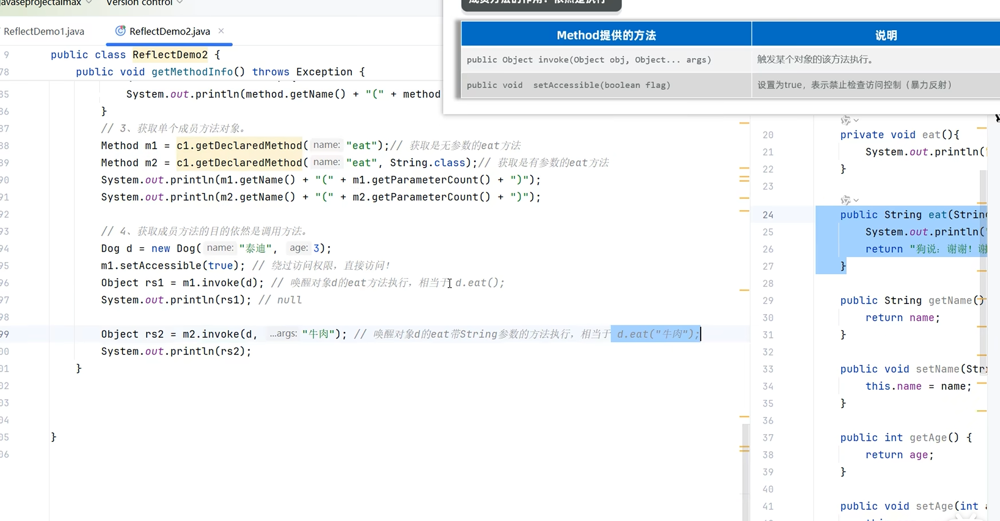

---

综上，可以看得出来，反射是先获取一个类里面的内容作为单独的内容对象，这些内容对象先于类对象而存在。如果要使用这些内容对象，再需要一个类对象去作为承接。突破了以前先有对象才能获取其内容的限制，可以绕过对象，直接获得一个类里面的内容，等需要用时，再整一个具体的类对象。

---

反射的基本作用如图所示，破坏封装性指的就是暴力突破private的限制，而绕过泛型的约束可以着重讲一下。

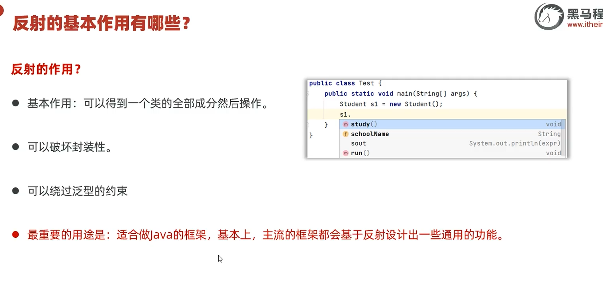

---

以下是通过泛型绕过泛型约束的示例代码，可以先获取class对象，然后获取方法对象，此时的方法的泛型是object类型，就可以突破前面约定的编译泛型约束，直接往list对象里添加非String的数据

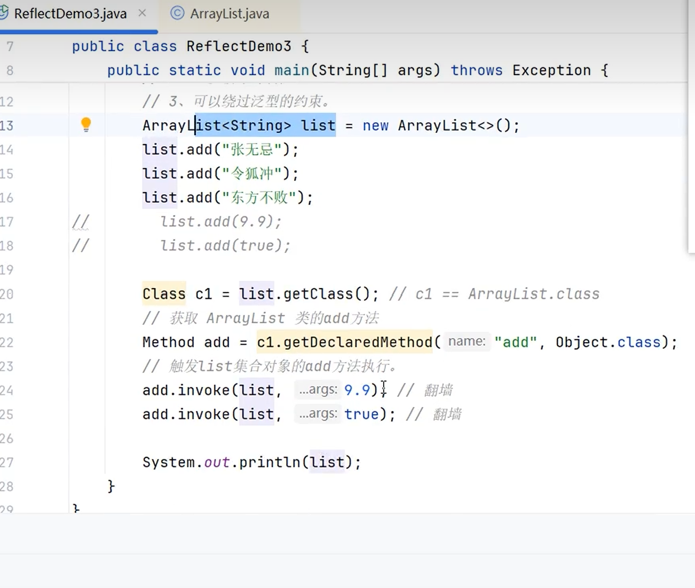

---

补充：在 Java 中，高级流如打印流，无法直接写 true 去实现追加写入的功能，需要通过包装写了 true 的低级流如字节流来实现，具体代码写法如图所示

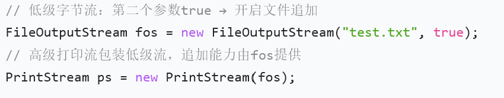

---

反射做框架的例子如图所示

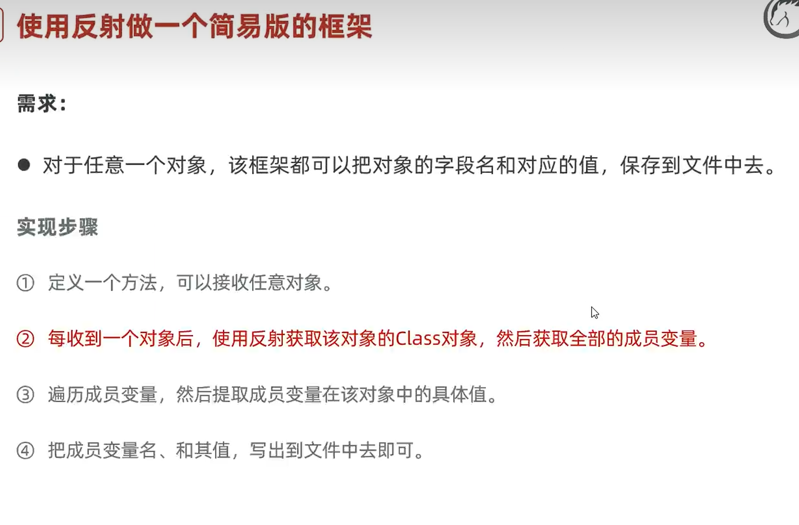

其示例代码如图所示，在线程中传入对象参数并调用saveObject方法即可

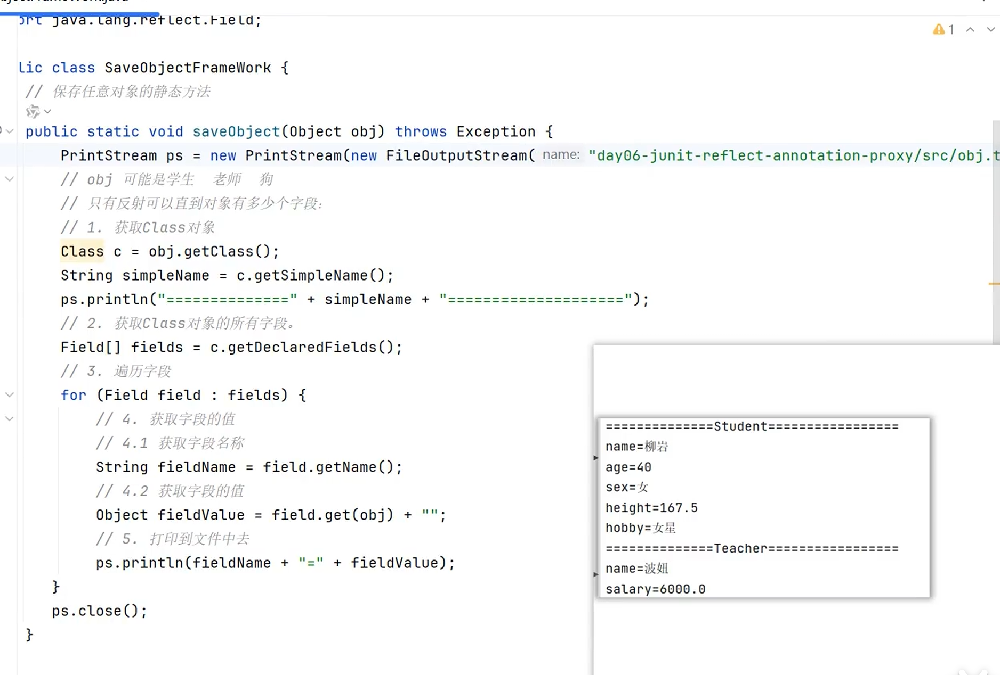

---

注解的定义如图所示

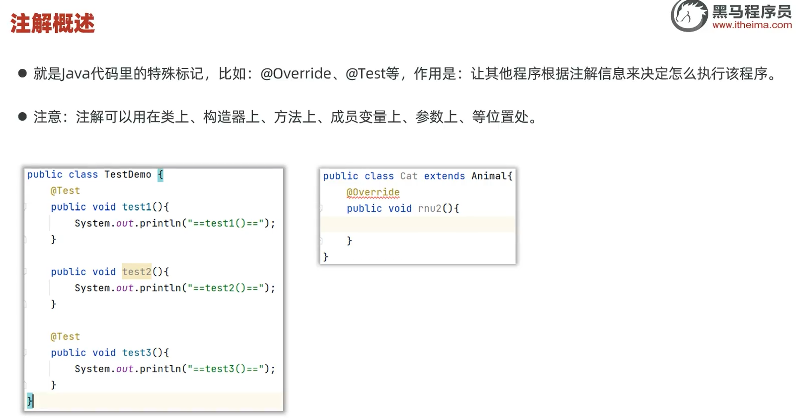

---

自定义注解的格式如图所示


---

自定义注解的示例代码如图所示，这里public可以省略，然后注解里面的属性默认是方法，所以要加括号


那怎么用呢？就直接用呗，就注上就可以用了，如图所示

---

而自定义注解中，有一个特殊的属性名是value，如果注解中只有value这一个属性，或者别的属性都有默认值时，使用该注解就不用写value名称。


示例代码如图所示

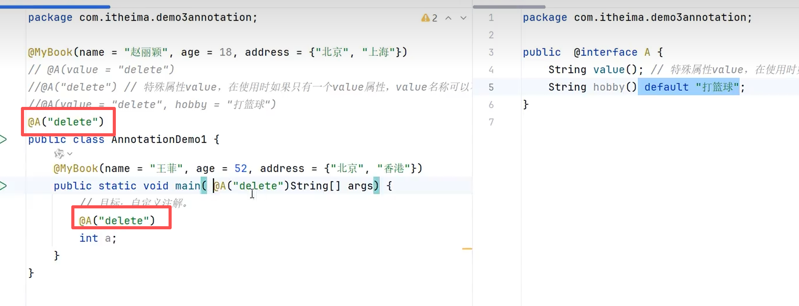

---

注解的原理如图所示，注解本质上是一个接口，继承了Annotation接口，使用注解本质上是整了一个实现类对象

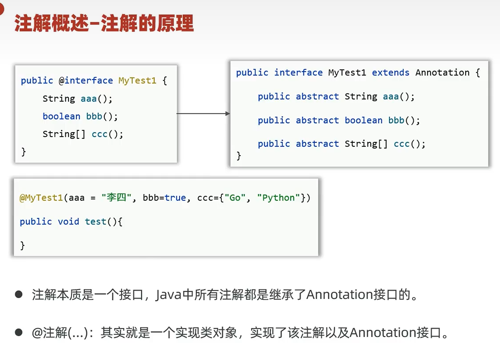

---

元注解的概念如图所示，可以理解为套娃，和元认知有点类似

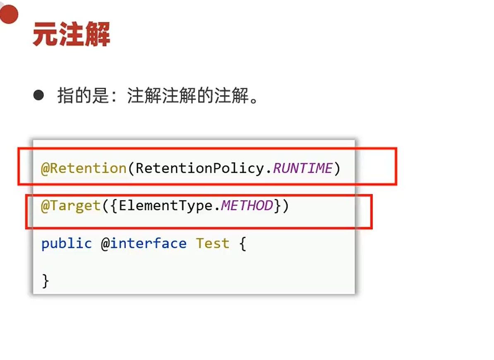

---

而经典的元注解Target的作用如下所示，如果是.TYPE，那就是被修饰的注解只能在类和接口的位置使用，如果是.FIELD，那就是被修饰的注解只能在成员变量处使用


---

如果元注解Target想让被注解的注解既注解方法，又注解类和接口，不注解别的位置，可采用以下写法，如图所示。


---

元注解Retention的作用如图所示，这个机制可以借助泛型来理解，泛型只存在于编译时，运行时是不存在的。如果自定义注解时不添加`@Retention`元注解，其默认的保留周期为 **`RetentionPolicy.CLASS`**。


---

注解的解析如图所示，所谓解析，就是判断这个类或者方法上是否有写注解，如果有，那就把注解里的内容解析出来。如果要解析类上的注解，就获取Class对象，然后调用Class对象的一些方法。如果要解析方法上的注解，就要获取方法对象，然后调用方法对象的一些方法。获取Class对象和方法对象这些都属于反射的内容


示例代码如图所示。获取到的注解本身就是一个对象，称为注解对象


---

注解最重要的作用就是对程序做特殊标记，以方便别人做针对性的处理。我们可以通过一个简单的模拟Junit框架来深入理解注解的作用，如图所示

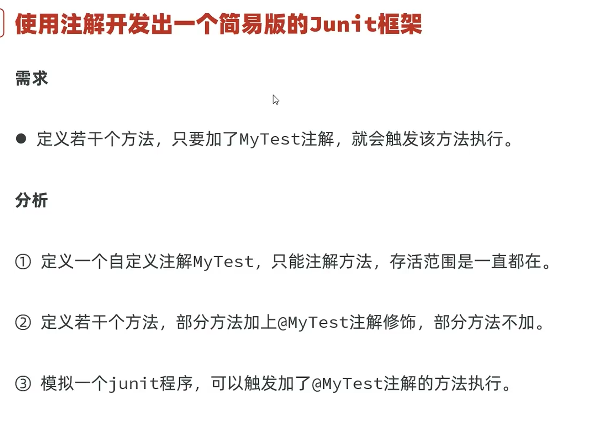

使用注解模拟一个简易版的Junit框架的示例代码如图所示

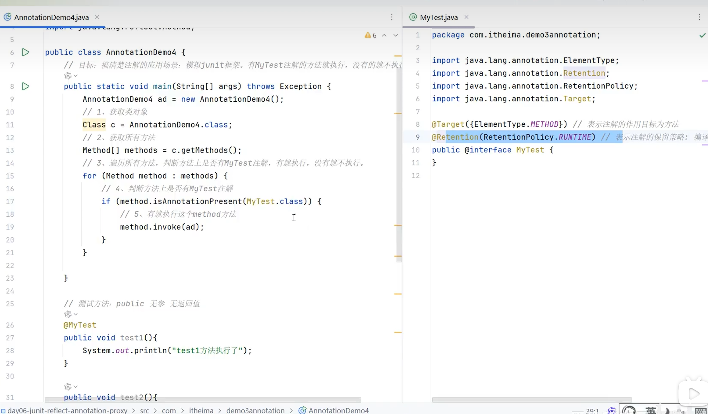

---

那问题来了，注解里的成员属性到底有啥用，这里有一个例子，如图所示，可以通过属性去控制执行次数，只需要在注解的解析里获取count，然后通过count控制方法调用次数就可以了


---

代理其实是一种设计思想，如图所示。这里举的是明星和经纪人的例子，找明星唱歌跳舞之前，要先找明星的唯一经纪人，先由经纪人，也就是我们的代理，去完成一些事前工作，然后再让明星去做唱歌和跳舞。值得注意的是，对象有什么方法想被代理，代理就一定要有对应的方法。那代理如何知道要有哪些方法呢？答案是通过接口去限制，可定义一个接口，代理和对象都实现这个接口。


---

那明星类好创建，正常创就可以了，可针对明星的唯一代理对象怎么创建呢，其实Java也提供了一个API，如图所示


而创建一个代理对象，因为代码比较多，而且容易高度重复，我们一般放到一个单独的工具类。示例代码如图所示。参数一可以用当前工具类的类加载器，参数二可以用指定对象所实现的接口，前两个参数可以直接背，参数三简单来说，可以理解为代理要做的事的业务逻辑

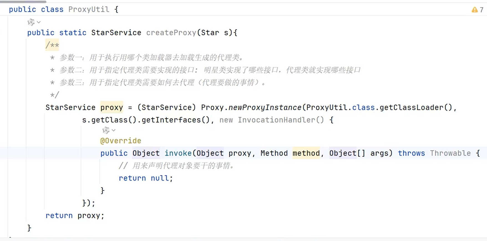

那怎么用呢？直接在main里创建代理对象，然后调用方法不就行了。如图所示，调用代理的方法，会去调用之前的invoke方法。

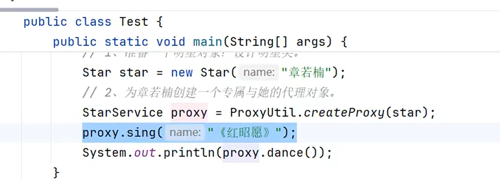

---

但是，上面创建代理对象的时候，invoke方法我们还没写出来啊，到底该怎么写呢？里面的参数又是什么意思呢？看下图。参数二获得的方法，其实是通过反射获得的，所以后面调用真对象的方法时，是通过反射的invoke去调

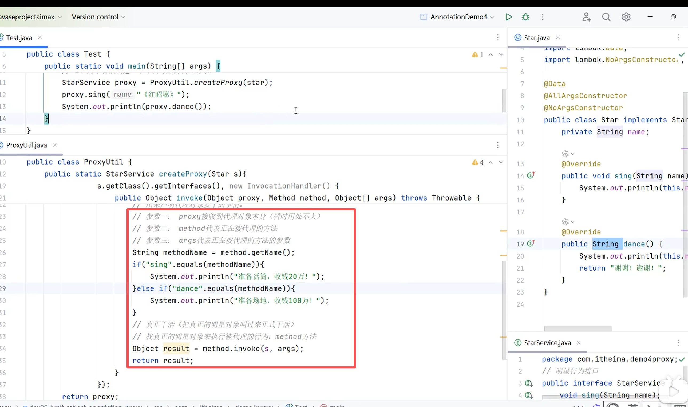

---

那说了这么多，我们的代理，应用场景是什么呢？有什么用呢？这里通过一个案例去接受，如图所示


可以看到，统计用时的代码存在大量重复内容，此时就可以通过代理去减少重复代码，示例写法如图所示


---

其实还可以引入泛型，使代理通用。

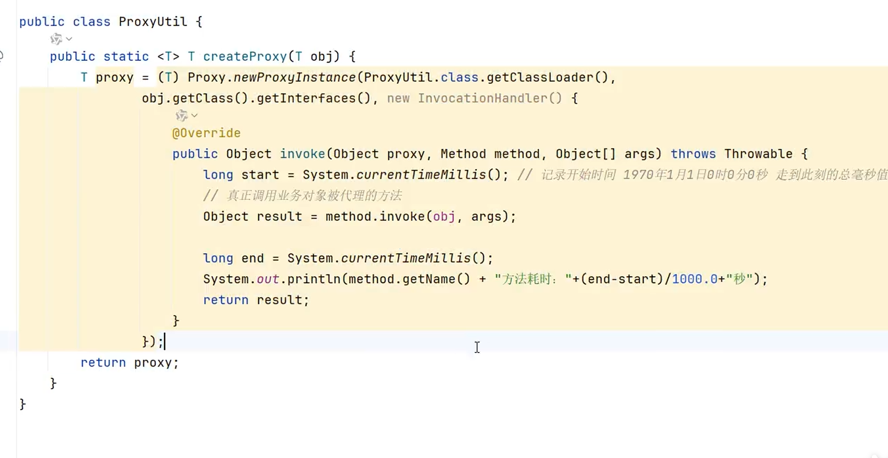

---

综上所述，代理可以减少重复代码，可以赋予对象更多强大的功能
